# `docs/data/` — Data Documentation (KFM) 📚🗺️  
    

This folder contains **governed documentation** for KFM datasets and domains: **runbooks, rules, templates, and checklists** for integrating sources and maintaining the **Raw → Work → Processed** lifecycle.

> [!IMPORTANT]
> **This is documentation, not the data plane.**  
> **Data artifacts** live under [`data/`](../../data/README.md) (raw/work/processed + catalogs + receipts).  
> If you need to publish, validate, or serve “truth,” you must do it via the data plane and its promotion gates.

> [!CAUTION]
> **Non‑negotiables apply here, too:**  
> - **Trust membrane:** external clients never access storage directly; all access goes through the governed API + policy boundary.  
> - **Fail‑closed:** missing proofs (receipts/catalogs/citations) → deny promotion/deny publish/abstain.  
> - **Processed serves truth:** raw/work are never user-facing sources of truth.

---

## Quick links 🔗

- Project root invariants: [`README.md`](../../README.md)
- Docs governance overview: [`docs/README.md`](../README.md)
- Data plane contract + directory layout: [`data/README.md`](../../data/README.md)
- CI/governance gatehouse: [`.github/README.md`](../../.github/README.md)

---

## Governance header 🧾

| Field | Value |
|---|---|
| Document | `docs/data/README.md` |
| Status | **Governed** (changes require review) |
| Purpose | Domain runbooks + dataset documentation rules for the data plane |
| Applies to | Dataset/domain documentation that impacts ingestion, validation, cataloging, promotion, Story Nodes, and Focus Mode |
| Effective date | 2026-02-16 |
| Owners | CODEOWNERS (repo-defined) |
| Review triggers | Changes touching dataset/domain obligations (license/sensitivity), promotion gates, catalog expectations, or anything that affects what can be served/cited |

---

## Table of contents

- [What belongs in `docs/data/`](#what-belongs-in-docsdata)
- [What does not belong in `docs/data/`](#what-does-not-belong-in-docsdata)
- [Directory map](#directory-map)
- [Domain index](#domain-index)
- [Domain runbooks](#domain-runbooks)
  - [Required sections](#required-sections)
  - [Runbook template](#runbook-template)
- [Add or update a dataset](#add-or-update-a-dataset)
- [Cross-linking and evidence references](#cross-linking-and-evidence-references)
- [Sensitivity and redaction](#sensitivity-and-redaction)
- [CI expectations for `docs/data/`](#ci-expectations-for-docsdata)
- [Definition of Done](#definition-of-done)
- [Appendix: Data-to-UI flow](#appendix-data-to-ui-flow)

---

## What belongs in `docs/data/`

`docs/data/` is the **human + maintainer-facing** documentation layer for:

- **Domain runbooks** (one folder per domain)  
  Examples: land, hydrology, transportation, census, archives, newspapers, imagery.
- **Dataset documentation** when a dataset needs special handling beyond the domain runbook  
  (rate limits, schema drift quirks, nonstandard licensing, unusual geometry/time semantics).
- **Obligations and governance notes**  
  License/attribution requirements, redistribution constraints, steward approvals, sensitivity defaults.
- **Mapping notes**  
  How upstream fields map into KFM entities/concepts (and what gets generalized/redacted).
- **Validation expectations**  
  What “good” means for this domain (geo validity rules, CRS, temporal normalization, thresholds, QA metrics).

> [!TIP]
> Rule of thumb: if it affects **system behavior**, **public narrative**, **dataset/catalog behavior**, or **what Focus Mode may answer**, it belongs in governed docs somewhere—and domain/dataset rules usually belong here.

---

## What does not belong in `docs/data/`

To protect boundaries (and prevent silent governance bypass):

- ❌ **Raw data, intermediates, processed outputs** → belong under [`data/`](../../data/README.md)
- ❌ **Secrets** (API keys, tokens), even “temporary” → use secret managers/runtime config
- ❌ **PII or sensitive-location coordinates** → document handling rules; do **not** embed risky payloads
- ❌ **Instructions that bypass the trust membrane** (e.g., “UI queries PostGIS directly”) → not allowed

---

## Directory map

> [!IMPORTANT]
> Keep this map accurate. When you add a new domain folder, update the index table below.

```text
docs/
└─ data/
   ├─ README.md                  # (this file) global rules + templates + checklists
   └─ <domain>/                  # one folder per domain (required once domain is active)
      ├─ README.md               # domain runbook (required)
      └─ datasets/               # optional: dataset-specific notes (only if needed)
         └─ <dataset_id>.md
```

---

## Domain index

> [!NOTE]
> Start empty. Add entries as domains become real (i.e., once a domain has registry entries and/or processed artifacts).

| Domain | Status | Primary dataset_ids | Sensitivity default | Runbook |
|---|---|---|---|---|
| _(add domain)_ | draft | _(list)_ | _(public/restricted/etc.)_ | `./<domain>/README.md` |

---

## Domain runbooks

### Required sections

Every domain runbook **MUST** cover (minimum):

1. **Domain overview** (what it is, why it exists in KFM)
2. **Upstream sources** (providers, access method, cadence, constraints)
3. **Licensing & attribution rules** (including redistribution constraints)
4. **Sensitivity defaults** (and what triggers restricted handling)
5. **Canonical mapping notes** (field mapping, CRS, time model, identifiers)
6. **Lifecycle** (Raw → Work → Processed)
7. **Validation gates** (schema/geo/time/rights/policy + thresholds)
8. **Catalog outputs** (DCAT always; STAC/PROV as applicable) + where they live in `data/`
9. **API/UI dependencies** (layers/endpoints/queries that rely on the domain)
10. **Backfills & refresh cadence** (idempotency rules, batching, SLOs)
11. **Operational notes** (rate limits, failure modes, rollback plan)

### Runbook template

<details>
<summary><strong>Click to expand: Domain runbook template</strong></summary>

```markdown
# <domain> — Data Runbook

> Governed runbook for the <domain> domain. Treat changes as production changes.

## Overview
What this domain covers and why it exists.

## Upstream sources
| Source | Access | Cadence | License | Notes |
|---|---|---:|---|---|
| | | | | |

## Licensing & attribution
- License summary:
- Attribution requirements:
- Redistribution constraints:
- Link to authoritative terms (if available):

## Default sensitivity
- Default classification: `public|restricted|sensitive-location|aggregate-only|...`
- Rationale:
- Redaction/generalization strategy (if applicable):

## Canonical mapping notes
- CRS requirements:
- Geometry types:
- Time model (event time vs interval vs validity ranges):
- Identifier strategy (dataset_id/version_id/run_id + key fields):

## Data lifecycle (Raw → Work → Processed)
- Raw:
  - Where the manifest lives:
  - What “immutable capture” means here:
- Work:
  - Transform steps:
  - QA artifacts produced:
- Processed:
  - Canonical publishable outputs:
  - Partitioning/indexing notes:

## Validation gates
- Schema validation:
- Geospatial validation:
- Temporal validation:
- Rights/license validation:
- Policy validation:
- Regression suite:

## Catalog outputs (boundary artifacts)
- DCAT:
- STAC (if spatial):
- PROV:
- Evidence references expected (prov:// / stac:// / dcat:// / doc:// / graph://):

## Backfills & refresh
- Historical coverage:
- Incremental update plan:
- Backfill batching:
- Idempotency rules:
- Freshness expectations / SLO:

## API/UI dependencies
- Map layers:
- API endpoints / queries:
- Story Node usage patterns:

## Operational notes
- Provider rate limits:
- Failure modes:
- Rollback plan:
- Contacts (roles, not personal emails):
```

</details>

---

## Add or update a dataset

This is the **thin-slice** workflow that keeps governance enforceable:

1) **Document first (this folder)**  
- Add/update a **domain runbook** at `docs/data/<domain>/README.md`  
- If needed, add dataset-specific notes at `docs/data/<domain>/datasets/<dataset_id>.md`

2) **Register the dataset (data plane)**  
- Add/update the dataset profile under the registry (see [`data/README.md`](../../data/README.md))  
- Ensure license, cadence, and sensitivity are **explicit** and **machine-checkable**

3) **Ingest to Raw → Work → Processed**  
- Raw manifest + checksums (immutable capture)  
- Work run artifacts (run record/receipt + validation report + QA)  
- Processed artifacts + checksums (publishable outputs)

4) **Generate required boundary artifacts**  
- DCAT (required)  
- STAC (required when spatial assets exist)  
- PROV (required)  
- Cross-links must be traversable end-to-end (catalogs ↔ receipts ↔ checksums)

5) **Pass promotion gates in CI**  
If any required proof is missing or invalid → fail closed.

> [!TIP]
> Docs are not “nice to have” here: domain runbooks prevent ad-hoc ingestion and make obligations reviewable **before** data becomes publishable.

---

## Cross-linking and evidence references

Docs must refer to datasets in a way that’s compatible with the evidence resolver and audit chain.

### Use stable identifiers

- `dataset_id` — stable dataset family identifier
- `version_id` — immutable promoted snapshot
- `run_id` — immutable pipeline execution identifier

### Prefer resolvable evidence references

When documenting “what proves this,” prefer references that can be resolved into evidence views:

- `dcat://...` — rights + distributions + dataset metadata
- `stac://...` — spatial/temporal assets (collections/items)
- `prov://...` — lineage (entities/activities/agents)
- `doc://...` — governed document spans (page/offsets)
- `graph://...` — graph facts tied back to evidence objects

> [!IMPORTANT]
> If a reference can’t be resolved to an evidence view, it **cannot** be used for publishable claims (Story Nodes / Focus Mode / user-visible layers).

---

## Sensitivity and redaction

KFM assumes some content is sensitive by nature.

### Recommended sensitivity classes

| Class | Meaning | Typical handling |
|---|---|---|
| **Public** | Safe to publish | Standard promotion gates |
| **Restricted** | Role-based access | Dataset- or field-level policy gates |
| **Sensitive-location** | Precise coordinates must not be published | Publish generalized derivatives; enforce precision limits |
| **Aggregate-only** | Small-count re-identification risk | Enforce minimum-count/aggregation thresholds |

### Redaction is a first-class transformation

- Never “silently” remove or blur data.
- Publish a redacted/generalized **derivative** with its own provenance chain.
- Ensure lineage makes it clear **what changed**, **why**, and **how**.

> [!CAUTION]
> If a runbook touches culturally restricted knowledge or sensitive site locations, do not include precise coordinates or directions.  
> Document the **handling policy** and ensure the data plane contains generalized products suitable for publishing.

---

## CI expectations for `docs/data/`

Docs in this subtree should be written to be **CI-checkable**:

- ✅ Markdown lint (headings, formatting)
- ✅ Link-check (avoid broken relative references)
- ✅ “No secrets in docs” scan
- ✅ Sensitivity leakage scan (when enabled)
- ✅ Governance review gates (CODEOWNERS / required approvals)

> [!IMPORTANT]
> If a documentation change effectively changes “what’s allowed to publish,” treat it like code: it must be reviewed and must not weaken fail-closed constraints.

---

## Definition of Done

### DoD — Add a new domain runbook

- [ ] Domain folder exists: `docs/data/<domain>/README.md`
- [ ] Required sections are present (sources, license, sensitivity, lifecycle, validation, catalogs, ops)
- [ ] Domain index table updated in this README
- [ ] Runbook references dataset_ids (or states “none yet”)
- [ ] No sensitive payloads embedded in docs
- [ ] Markdown + links pass repo validators

### DoD — Update dataset documentation

- [ ] Domain runbook updated (or dataset note added) describing the change
- [ ] License/attribution impacts stated
- [ ] Sensitivity impacts stated (and redaction/generalization strategy documented if needed)
- [ ] Validation gates updated (and thresholds stated)
- [ ] Catalog outputs expectations updated (DCAT/STAC/PROV)
- [ ] Any change that affects publishability includes a verification step (“how to prove it in CI”)

---

## Appendix: Data-to-UI flow

```mermaid
flowchart LR
  DOCS["docs/data (runbooks + obligations)"] --> REG["data/registry (machine-checkable profiles)"]
  REG --> RAW["data/raw (manifests + checksums)"]
  RAW --> WORK["data/work (receipts + validation + QA)"]
  WORK -->|Promotion Contract| PROC["data/processed (immutable publishable artifacts)"]
  PROC --> CATS["data/catalog (DCAT + STAC + PROV)"]
  CATS --> API["Governed API + Policy (trust membrane)"]
  API --> UI["UI + Story Nodes + Focus Mode (cite or abstain)"]
```



> [!NOTE]
> This README governs **how we document** datasets and domains.
> The authoritative contract for the data plane layout and promotion gates is [`data/README.md`](../../data/README.md).