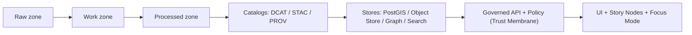

# docs/data — Data Documentation (KFM)


This folder contains **governed documentation** for KFM datasets and domains: runbooks, rules, and checklists for integrating sources and maintaining the data lifecycle.

> [!IMPORTANT]
> **This is documentation.** The data artifacts themselves live under `data/` (raw/work/processed + catalogs).
> The “truth path” and “promotion gates” described below are **non‑negotiable invariants** in the KFM blueprint and integration plan.  
> - All requests must cross the **trust membrane** (auth → policy → redaction/query shaping → audit/provenance logging).:contentReference[oaicite:2]{index=2}  
> - **Processed is the only publishable source of truth**; raw/work are never served directly to users.:contentReference[oaicite:3]{index=3}

---

## Table of contents

- [What belongs in `docs/data`](#what-belongs-in-docsdata)
- [How this relates to `data/`](#how-this-relates-to-data)
- [Data zones](#data-zones)
- [Catalog boundary artifacts](#catalog-boundary-artifacts)
- [Promotion gates](#promotion-gates)
- [Sensitivity and redaction](#sensitivity-and-redaction)
- [Domain runbooks](#domain-runbooks)
- [Add a new dataset](#add-a-new-dataset)
- [ID and path conventions](#id-and-path-conventions)
- [CI validation expectations](#ci-validation-expectations)
- [Glossary](#glossary)

---

## What belongs in `docs/data`

`docs/data/` is the **human + maintainer facing** layer for:

- **Domain runbooks**: one folder per domain (e.g., air quality, land, hydrology).
- **Operational checklists**: how to ingest, validate, redact, and promote datasets.
- **Governance notes**: sensitivity classes, required approvals, and what must never ship.
- **Evidence patterns**: how datasets are made citeable (catalog + provenance + locators).

### Expected `docs/data/` layout

```text
docs/data/
├── README.md                        # (this file) global rules + templates + checklists
└── <domain>/
    ├── README.md                    # domain runbook (required once a domain exists)
    └── (optional) datasets/
        ├── <dataset_id>.md          # dataset-specific notes (only if needed)
        └── ...
```

> [!NOTE]
> If a domain has *any* processed/published data, it must have a domain runbook: `docs/data/<domain>/README.md`.  
> The master guide recommends domain runbooks under `docs/data/<new-domain>/` to document ETL procedures and domain considerations.:contentReference[oaicite:4]{index=4}

---

## How this relates to `data/`

The `data/` folder is where KFM stores:
- **Raw**, **Work**, **Processed** datasets (the lifecycle zones),
- and the **catalog boundary artifacts** consumed by downstream services:
  - **DCAT** (dataset metadata),
  - **STAC** (geospatial assets),
  - **PROV** (lineage / run provenance).:contentReference[oaicite:5]{index=5}

This README documents how to keep that structure correct and governed.

---

## Data zones

KFM’s integration blueprint defines **three zones**, and explicitly ties **promotion** to machine-checkable validation plus catalog artifacts.:contentReference[oaicite:6]{index=6}

### Zone definitions

| Zone | Purpose | Allowed operations | Promotion requires |
|---|---|---|---|
| **Raw** | Immutable capture of source-of-truth data | Append-only writes; **no transforms** | Checksums + raw manifest; source license captured:contentReference[oaicite:7]{index=7} |
| **Work** | Repeatable transforms + QA staging | Normalize / enrich / derive | PROV activity + intermediate QA reports:contentReference[oaicite:8]{index=8} |
| **Processed** | Query-ready + publishable | Read-optimized outputs + indexes | DCAT (always); STAC (if spatial); PROV chain; policy labels:contentReference[oaicite:9]{index=9} |

> [!IMPORTANT]
> Processed is the only publishable source of truth. Raw/work are never served directly to users.:contentReference[oaicite:10]{index=10}

### Recommended `data/` layout (zone-first)

```text
data/
├── raw/
│   └── <domain>/<dataset_id>/<version_id>/...
├── work/
│   └── <domain>/<dataset_id>/<run_id>/...
├── processed/
│   └── <domain>/<dataset_id>/<version_id>/...
├── stac/
│   ├── collections/
│   └── items/
├── catalog/
│   └── dcat/
├── prov/
└── graph/
    ├── csv/
    └── cypher/
```

> [!NOTE]
> The repo documentation examples describe catalog outputs under `data/stac/...`, `data/catalog/dcat/...`, and PROV under `data/prov/...`.:contentReference[oaicite:11]{index=11}  
> Some earlier draft snippets show `data/catalog/prov/...` for `prov_ref` in run records; treat this as a legacy alias if it exists in your implementation, but keep **one canonical PROV root** to avoid drift.:contentReference[oaicite:12]{index=12}:contentReference[oaicite:13]{index=13}

---

## Catalog boundary artifacts

These artifacts are the **contract** between pipeline outputs and downstream systems (graph, API, UI, Story Nodes, Focus Mode). The integration blueprint explicitly calls out DCAT/STAC/PROV as the standard trio for publishability.:contentReference[oaicite:14]{index=14}

### What each catalog is for

| Artifact | Purpose | Produced when | Typical content |
|---|---|---|---|
| **DCAT** | Dataset-level discovery metadata | Always for promoted datasets | publisher, license, temporal/spatial coverage, update cadence, contacts:contentReference[oaicite:15]{index=15} |
| **STAC** | Geospatial assets for map/timeline rendering | When data is spatial/temporal asset-like | Collections (product) + Items (scene/time/area):contentReference[oaicite:16]{index=16} |
| **PROV** | Lineage: how outputs were generated from inputs | Always for promoted derivatives | entities, activities, agents, and derivation links:contentReference[oaicite:17]{index=17} |

### Why this matters for the UI and Focus Mode

KFM’s blueprint requires that provenance/citation references be resolvable via evidence endpoints (e.g., `prov://`, `stac://`, `dcat://`, `doc://`, `graph://`) so users can review evidence for layers and answers.:contentReference[oaicite:18]{index=18}

---

## Promotion gates

Promotion gates are **CI-enforced** checks plus (when sensitive) steward review. They exist to prevent ad-hoc “just ship it” data.

### Promotion checklist (minimum)

From the KFM blueprint and integration plan, promotion is blocked unless required evidence exists and validates, including license and sensitivity classification, checksums, catalogs, audit event, and (when needed) human approval.:contentReference[oaicite:19]{index=19}:contentReference[oaicite:20]{index=20}

**CI-enforced gate (required):**
- [ ] Raw assets are checksummed and content-addressable (hash recorded):contentReference[oaicite:21]{index=21}
- [ ] License captured (and compatible with intended publication scope):contentReference[oaicite:22]{index=22}
- [ ] Sensitivity classification present (public/restricted/etc.):contentReference[oaicite:23]{index=23}
- [ ] Schema + geospatial validation passes; QA report saved with stable ID:contentReference[oaicite:24]{index=24}
- [ ] Policy labels attached (public, restricted, sensitive-location, aggregate-only, …):contentReference[oaicite:25]{index=25}
- [ ] Catalog writers succeed: DCAT/STAC/PROV are well-formed and link-check clean:contentReference[oaicite:26]{index=26}
- [ ] Contract tests pass for at least one representative API query that depends on the dataset:contentReference[oaicite:27]{index=27}

**Steward review (required when sensitive):**
- [ ] A human approval step is recorded when sensitivity requires it:contentReference[oaicite:28]{index=28}
- [ ] Redaction is documented and captured in PROV (see below):contentReference[oaicite:29]{index=29}

---

## Sensitivity and redaction

KFM explicitly expects some datasets to be sensitive (e.g., parcel ownership/PII, precise archaeological site locations, certain public-safety indicators). Sensitivity is handled through policy labels, redaction derivatives with provenance, and fail-closed checks.:contentReference[oaicite:30]{index=30}

### Recommended sensitivity classes

From the integration blueprint’s governance section:​:contentReference[oaicite:31]{index=31}

| Class | Meaning | Typical handling |
|---|---|---|
| **Public** | Safe to publish without redaction | Standard promotion gates |
| **Restricted** | Requires role-based access | Field-level or dataset-level access control |
| **Sensitive-location** | Coordinates must be generalized or suppressed | Publish redacted derivatives + enforce precision limits |
| **Aggregate-only** | Only publish above thresholds (small-count risk) | Enforce aggregation + minimum-count rules |

### Redaction is a first-class transformation

Redaction must be recorded in **PROV**; the raw dataset remains immutable, and the redacted derivative is a separate DatasetVersion (often a separate dataset_id) with a documented policy label.:contentReference[oaicite:32]{index=32}

---

## Domain runbooks

Each domain runbook lives at:

- `docs/data/<domain>/README.md`

…and should be treated as **operational documentation**: the “how it works” and “how we keep it governed.”

### Required sections for every domain runbook

Use this as your minimum outline:

1. **Domain overview**
2. **Data sources in this domain** (upstream providers + access method)
3. **Licensing & attribution rules**
4. **Sensitivity classification defaults**
5. **Canonical mapping notes** (how upstream fields map to KFM concepts)
6. **Ingestion workflow** (raw → work → processed)
7. **Validation gates + regression tests**
8. **Catalog outputs** (DCAT/STAC/PROV + where stored)
9. **API surfaces** (which endpoints/layers/queries depend on it)
10. **Known caveats** (rate limits, provider quirks, schema drift)
11. **Backfill + refresh cadence**

### Domain runbook template (copy/paste)

<details>
<summary><strong>📄 Template: <code>docs/data/&lt;domain&gt;/README.md</code></strong></summary>

```markdown
# <Domain> — Data Runbook

## Overview
What this domain covers and why it exists.

## Upstream sources
| Source | Access | Cadence | License | Notes |
|---|---|---:|---|---|

## Default sensitivity
- Default: <Public|Restricted|Sensitive-location|Aggregate-only>
- Rationale:
- Redaction strategy (if applicable):

## Data lifecycle (raw → work → processed)
- Raw:
- Work:
- Processed:

## Validation gates
- Schema validation:
- Geospatial validation:
- Temporal validation:
- Policy validation:
- Regression suite:

## Catalog outputs
- DCAT:
- STAC:
- PROV:
- Evidence resolvers (prov:// / stac:// / dcat://):

## Backfills and refresh
- Historical coverage:
- Incremental strategy:
- SLO / freshness expectations:

## Operational notes
- Provider rate limits:
- Failure modes:
- Rollback plan:
```

</details>

---

## Add a new dataset

This is the **minimum thin-slice** process for adding a dataset in a governed way.

### 1) Document first (in `docs/data/`)

- Create/update `docs/data/<domain>/README.md`
- Add: license, sensitivity defaults, ingestion plan, validation gates, and catalog outputs

### 2) Implement ingestion and staged outputs (in `data/`)

- Land raw artifacts in `data/raw/<domain>/<dataset_id>/<version_id>/`
- Emit intermediate artifacts + validation report in `data/work/<domain>/<dataset_id>/<run_id>/`
- Emit publishable artifacts in `data/processed/<domain>/<dataset_id>/<version_id>/`

### 3) Generate required “boundary artifacts” (catalogs + provenance)

At promotion time, catalogs should be written to canonical locations (STAC + DCAT + PROV), and these artifacts are required before the dataset is considered fully published.:contentReference[oaicite:33]{index=33}

### 4) Pass promotion gates in CI

Use the checklist in [Promotion gates](#promotion-gates).

### 5) Ensure evidence is resolvable

Evidence/citation references must resolve via evidence endpoints (prov/stac/dcat/doc/graph), enabling “review evidence” UX for both map layers and Focus Mode answers.:contentReference[oaicite:34]{index=34}

---

## ID and path conventions

These conventions keep catalogs, provenance, and evidence resolvers stable across time.

### Identifiers (recommended)

| Identifier | What it identifies | Stability rule |
|---|---|---|
| `dataset_id` | A governed dataset concept | Stable name; does not change across versions |
| `version_id` | A specific ingested version | Derived from raw manifest content hash (preferred) |
| `run_id` | A specific pipeline execution | Unique per execution; timestamped IDs are acceptable |

> [!NOTE]
> The integration blueprint emphasizes deterministic versioning using content-hash of raw manifests for dataset versions (so you can always tie a version to the exact raw inputs).:contentReference[oaicite:35]{index=35}

### Run records and validation reports

KFM’s blueprint recommends that each pipeline job emit a run record (JSON) plus a validation report, and that promotion is blocked unless both exist and are complete.:contentReference[oaicite:36]{index=36}

---

## CI validation expectations

This README (and each domain runbook) should be written with CI in mind:

- ✅ Markdown lint (format + headings)
- ✅ Link-check (avoid stale/broken references)
- ✅ “No secrets in docs” scan
- ✅ Governance gate compatibility (checklists align with required promotion gates)

> [!IMPORTANT]
> Trust membrane enforcement is not optional: all reads/writes crossing the boundary must pass auth, policy evaluation, redaction/query shaping, and audit/provenance logging, and this is enforced by tests.:contentReference[oaicite:37]{index=37}

---

## Glossary

- **Trust membrane**: API/policy boundary where governance is enforced; UI never accesses databases directly.:contentReference[oaicite:38]{index=38}
- **Promotion gate**: Automated + stewarded checks required to publish a dataset to Processed.:contentReference[oaicite:39]{index=39}
- **DCAT**: Dataset-level metadata for discovery/interoperability.:contentReference[oaicite:40]{index=40}
- **STAC**: Geospatial asset catalogs for map/timeline rendering (Collections + Items).:contentReference[oaicite:41]{index=41}
- **PROV**: Lineage/provenance model; records how outputs were derived from inputs.:contentReference[oaicite:42]{index=42}
- **Sensitivity label**: Classification driving policy checks and redaction behavior (public/restricted/sensitive-location/aggregate-only).:contentReference[oaicite:43]{index=43}

---

### Appendix: Data-to-UI flow (conceptual)



This flow reflects KFM’s core “truth path” and reinforces the invariant that processed + catalogs are the publishable interface to downstream systems.:contentReference[oaicite:44]{index=44}

