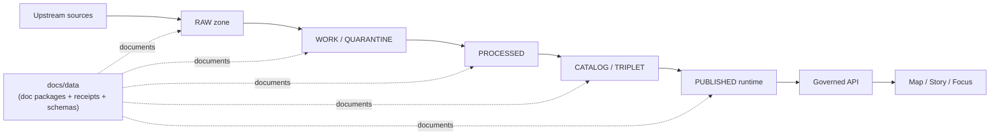
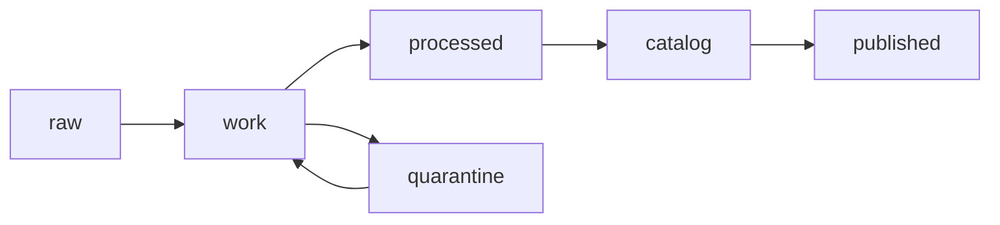

<!-- [KFM_META_BLOCK_V2]
doc_id: kfm://doc/8c0d7f7d-9cda-4a9a-9f40-6dd77b7f2e6b
title: docs/data
type: standard
version: v2
status: draft
owners: kfm-core (TODO: set real owners)
created: 2026-02-24
updated: 2026-03-05
policy_label: public
related:
  - kfm://doc/TODO
tags: [kfm, data, governance, catalog, provenance]
notes:
  - Directory-level contract for governed dataset documentation packages (NOT for storing production datasets).
[/KFM_META_BLOCK_V2] -->

# `docs/data`
Governed **dataset documentation packages** for the Kansas Frontier Matrix (KFM): metadata, schemas, QA results, provenance, catalog artifacts, and promotion/publish receipts — **not bulk data**.

> **Impact**
> - **Status:** draft
> - **Owners:** kfm-core (TODO)
> - **Policy:** `public` (this folder must remain safe to publish)
> - **Purpose:** define a fail-closed documentation contract that enables governance + reproducibility


---

## Quick navigation
- [Scope](#scope)
- [Where it fits](#where-it-fits)
- [Directory contract](#directory-contract)
- [Naming and identity](#naming-and-identity)
- [Lifecycle, zones, and promotion](#lifecycle-zones-and-promotion)
- [Dataset documentation package](#dataset-documentation-package)
- [Quickstart](#quickstart)
- [Templates](#templates)
- [CI expectations](#ci-expectations)
- [Safety and sensitivity rules](#safety-and-sensitivity-rules)
- [Definition of done](#definition-of-done)
- [FAQ](#faq)
- [Appendix: target layout](#appendix-target-layout)

---

## Scope

### What this folder is
This folder is the **governed documentation surface** for datasets used by KFM:
- identity + ownership
- licensing + rights notes
- sensitivity / policy label + handling rules
- schemas + dictionaries
- QA rules + QA reports
- provenance + lineage
- catalog artifacts (DCAT/STAC/PROV, when applicable)
- promotion/publish receipts (checksums + audit info)

### What this folder is not
- It is **not** a data lake and must **not** contain bulk or production datasets.
- It is **not** a secrets store (no API keys, tokens, connection strings, private URLs).
- It is **not** a “shadow registry” that bypasses the governed API.

> IMPORTANT  
> This README is a **directory contract** (normative). It does **not** claim the repo currently matches the target layout shown below.

[Back to top](#docsdata)

---

## Where it fits
KFM treats **catalogs + provenance + receipts** as contract surfaces between pipeline outputs and runtime behavior. In practice, `docs/data/` is the place to keep **human-readable** and **CI-validatable** documentation and evidence pointers that support that contract.


```mermaid
flowchart LR
  upstream["Upstream sources"] --> raw["RAW zone"]
  raw --> work["WORK / QUARANTINE"]
  work --> processed["PROCESSED"]
  processed --> catalog["CATALOG / TRIPLET"]
  catalog --> published["PUBLISHED runtime"]
  published --> api["Governed API"]
  api --> ui["Map / Story / Focus"]

  docs["docs/data<br/>(doc packages + receipts + schemas)"] -. "documents" .-> raw
  docs -. "documents" .-> work
  docs -. "documents" .-> processed
  docs -. "documents" .-> catalog
  docs -. "documents" .-> published
```

**Contract principle:** UI/clients must not access storage directly; all access crosses the governed API + policy boundary.

[Back to top](#docsdata)

---

## Directory contract

### ✅ Acceptable inputs
- **Dataset documentation packages** (one folder per dataset, see below)
- Manifests (`yaml`/`json`) describing identity, owners, license, policy label, extents, and provenance pointers
- Schemas: JSON Schema, SQL DDL, GeoParquet/Arrow schema JSON, CSV dictionaries, etc.
- QA configs + QA reports (machine-readable) + a short human summary
- Checksums / digests for published artifacts (or for referenced artifacts)
- Receipts / audit records (sanitized; no secrets; no restricted leakage)
- Tiny samples for docs/tests **only if policy allows**:
  - redacted, generalized, or synthetic
  - explicitly documented redactions
  - size-limited (keep small enough for code review)

### ❌ Exclusions
- Bulk / production datasets (Parquet/CSV dumps, rasters, raw OCR corpora, etc.)
- Secrets (keys, tokens, cookies, private endpoints)
- Unredacted PII/PHI or other restricted personal data
- Precise coordinates or geometries for sensitive locations unless policy explicitly allows
- “Mystery data” (missing license, owner, provenance, or policy label)

[Back to top](#docsdata)

---

## Naming and identity

### Filesystem folder vs dataset ID
To avoid invalid folder names:

- **`dataset_slug`**: filesystem-safe folder name (recommended: `kebab-case`)
- **`dataset_id`**: stable identifier stored in `manifest.yaml` (recommended: a URI-like string)

Example:
- folder: `docs/data/datasets/noaa_storm_events/`
- manifest: `dataset_id: kfm://dataset/noaa_storm_events`

### Controlled vocabulary: `policy_label`
`policy_label` is a controlled vocabulary. Keep values **consistent** and **versioned**.

Starter list (may evolve; do not invent new labels casually):
- `public`
- `public_generalized`
- `restricted`
- `restricted_sensitive_location`
- `internal`
- `embargoed`
- `quarantine`

> NOTE  
> If you need a new label, add it to the controlled vocabulary (with rationale) and add policy tests. Don’t “just use a new string”.

[Back to top](#docsdata)

---

## Lifecycle, zones, and promotion
KFM organizes data movement via zones. The zone names below are **logical contract labels**; the physical storage layout is implemented elsewhere.


```mermaid
flowchart LR
  raw[raw] --> work[work]
  work --> processed[processed]
  processed --> catalog[catalog]
  catalog --> published[published]

  work --> quarantine[quarantine]
  quarantine --> work
```

### Promotion gates
Promotion is **fail-closed**: if required evidence is missing, promotion stops.

Below is a compact “what must exist” view. Customize thresholds per dataset.

| Gate | From → To | Must have (docs/evidence) |
|---|---|---|
| A | RAW → WORK | identity, owners, license, policy label, source provenance pointer, checksums/digests (when applicable) |
| B | WORK → PROCESSED | schema + dictionary, QA checks + report, provenance/lineage updated, limitations documented |
| C | PROCESSED → CATALOG | DCAT record; STAC/PROV as applicable; cross-links validated; link-check clean |
| D | CATALOG → PUBLISHED | publish receipt (audit + digests + policy decision record); access posture confirmed |

[Back to top](#docsdata)

---

## Dataset documentation package
Each dataset should have a documentation package complete enough to support:
- governance review
- reproducible processing
- promotion/publishing
- evidence-backed UI/Story/Focus claims

### Minimum recommended files per dataset

| Artifact | Required by | Purpose |
|---|---:|---|
| `manifest.yaml` | Gate A | identity, owners, license, policy label, extents, provenance pointers |
| `schema/*` | Gate B | formal schema + human dictionary |
| `qa/checks.yaml` + `qa/reports/*` | Gate B | thresholds + validation proof |
| `provenance/*` | Gate B | sources + lineage graph |
| `catalog/*` | Gate C | DCAT + STAC + PROV (as applicable) |
| `receipts/*` | Gate D | audit record + checksums + policy decisions |

[Back to top](#docsdata)

---

## Quickstart
This is a minimal, reviewable workflow for adding a new dataset doc package.

1) Create a dataset folder:
```bash
mkdir -p docs/data/datasets/<dataset_slug>/{schema,qa/reports,provenance,receipts,catalog}
```

2) Copy templates (if present):
```bash
# EXAMPLE: adjust paths to match your repo layout
cp docs/data/_templates/manifest.yaml docs/data/datasets/<dataset_slug>/manifest.yaml
cp docs/data/_templates/checks.yaml   docs/data/datasets/<dataset_slug>/qa/checks.yaml
cp docs/data/_templates/lineage.mmd   docs/data/datasets/<dataset_slug>/provenance/lineage.mmd
```

3) Fill in the manifest (owners, license, policy label) and add schema + QA rules.

4) Add at least one QA report (even if it’s an initial baseline) and record known caveats.

5) Add a receipt when promoting/publishing (digests + policy decision + references to QA + catalogs).

[Back to top](#docsdata)

---

## Templates

### Template: `manifest.yaml`
```yaml
# docs/data/datasets/<dataset_slug>/manifest.yaml
# NOTE: This is a documentation manifest (not the dataset itself).

schema_version: "1.0"

dataset_slug: "TODO_dataset_slug"        # filesystem-safe name
dataset_id: "kfm://dataset/TODO"         # stable ID stored in docs, used across systems

name: "TODO human readable name"
description: >
  TODO: one paragraph describing what the dataset represents and why it exists.

owners:
  - name: "TODO owner/team"
    contact: "TODO email or handle"
    role: "data_owner"   # data_owner|steward|producer|reviewer

license:
  spdx: "TODO"           # prefer SPDX identifier
  url: null              # optional
  notes: "TODO constraints / attribution / redistribution rules"

policy:
  policy_label: "public" # controlled vocab: public|public_generalized|restricted|...
  handling: >
    TODO: redaction/generalization rules, access constraints, export rules.

provenance:
  sources:
    - name: "TODO source system / provider"
      acquired_at: "2026-03-05T00:00:00Z"
      method: "api"      # api|download|scrape|manual|partner_delivery
      uri: "TODO (no secrets)"
      checksum_sha256: "TODO if file-based"
      license_confirmed: false

spatial:
  has_geometry: false
  crs: null
  extent:
    # IMPORTANT: if sensitive, record coarse extents only.
    bbox: null

temporal:
  start: null
  end: null
  update_cadence: "TODO (e.g., daily|monthly|static)"

schema:
  primary: "./schema/schema.json"
  format: "TODO csv|parquet|geoparquet|geojson|sql|other"

qa:
  checks: "./qa/checks.yaml"
  latest_report: null   # e.g., "./qa/reports/2026-03-05/report.json"

promotion:
  current_zone: "work"  # raw|work|processed|catalog|published|quarantine
  last_promoted_at: null
```

### Template: `qa/checks.yaml`
```yaml
# docs/data/datasets/<dataset_slug>/qa/checks.yaml

schema_version: "1.0"
checks:
  - id: row_count_nonzero
    description: "Dataset must contain at least 1 row."
    severity: error
    rule: "row_count > 0"

  - id: null_rate_key_fields
    description: "Key fields must not exceed null threshold."
    severity: error
    fields:
      - "TODO_field_a"
      - "TODO_field_b"
    threshold: 0.01
```

### Template: `receipts/publish_YYYY-MM-DD.json`
```json
{
  "schema_version": "1.0",
  "receipt_id": "kfm://receipt/TODO",
  "run_id": "kfm://run/TODO",
  "dataset_id": "kfm://dataset/TODO",
  "dataset_version_id": "TODO",
  "published_at": "2026-03-05T00:00:00Z",
  "published_by": "TODO",

  "inputs": [
    { "uri": "TODO", "sha256": "TODO" }
  ],
  "outputs": [
    { "uri": "TODO", "sha256": "TODO", "zone": "published" }
  ],

  "catalog": {
    "dcat_ref": "catalog/dcat.json",
    "stac_ref": "catalog/stac.json",
    "prov_ref": "catalog/prov.json"
  },

  "qa": {
    "report_ref": "../qa/reports/2026-03-05/report.json",
    "result": "pass"
  },

  "policy": {
    "policy_label": "public",
    "decisions": [
      "TODO: summarize policy decisions (e.g., generalization applied, rights constraints enforced)"
    ]
  },

  "tooling": {
    "pipeline": "TODO",
    "git_sha": "TODO",
    "runtime": "TODO (container digest/version if available)"
  },

  "notes": "TODO"
}
```

[Back to top](#docsdata)

---

## CI expectations
`docs/data/` should be CI-validated to prevent “quiet drift” and to keep promotion fail-closed.

Recommended minimum CI checks:
- JSON/YAML schema validation for manifests, receipts, and catalog artifacts
- Link-check for cross-links (catalog ↔ provenance ↔ receipts ↔ schema ↔ QA)
- Policy tests that enforce default-deny and prevent restricted leakage
- Digest/checksum presence checks for promoted artifacts
- (Optional) “golden” tests for deterministic IDs/hashes

> NOTE  
> This section defines **expectations**, not the current state of CI in your repo.

[Back to top](#docsdata)

---

## Safety and sensitivity rules
When in doubt: **default-deny** and route through governance review.

- Do not publish exact locations for sensitive, vulnerable, or culturally restricted sites unless policy explicitly allows.
  - Use aggregation, rounding, bounding regions, or generalized geometry.
- Do not include secrets in manifests, receipts, or samples.
- If license or consent is unclear, move the dataset to `quarantine` and record why.
- Any dataset with personal data requires explicit handling rules and a redacted sample policy.
- Avoid “ghost metadata” that reveals restricted existence via errors or inconsistent fields.

[Back to top](#docsdata)

---

## Definition of done
A dataset documentation package is “Done” when:

- [ ] `manifest.yaml` complete (owners + license + policy label not unknown)
- [ ] schema present and matches processed outputs
- [ ] QA checks + latest report present and reproducible
- [ ] provenance sufficient to re-run the pipeline (or to justify why it can’t be)
- [ ] if published: publish receipt + digests + catalog refs exist
- [ ] no restricted data is exposed in docs or samples

[Back to top](#docsdata)

---

## FAQ

### Can this folder include restricted dataset documentation?
This folder’s policy label is `public`, so **only public-safe documentation** should live here.

Allowed:
- sanitized manifests (no secrets)
- policy labels and handling rules
- coarse extents
- redacted/generalized sample artifacts (if permitted)

Not allowed:
- restricted raw data
- unredacted PII/PHI
- precise sensitive-location geometry

If you need to store restricted documentation or detailed access notes, keep them in a restricted repo/location and link to them via a governance-safe pointer (do not leak existence through public docs).

### Do we need DCAT/STAC/PROV for every dataset?
DCAT is typically the “always” catalog surface; STAC/PROV are “as applicable” depending on asset types and pipeline complexity. The key requirement is that whatever you emit is **valid**, **cross-linked**, and **policy-safe**.

[Back to top](#docsdata)

---

## Appendix: target layout
<details>
<summary>Expand: recommended directory layout (target contract)</summary>

```text
docs/data/
├─ README.md
├─ CONTRIBUTING.md
├─ GLOSSARY.md
│
├─ _templates/
│  ├─ manifest.yaml
│  ├─ sources.yaml
│  ├─ checks.yaml
│  ├─ publish_receipt.json
│  ├─ data_dictionary.md
│  └─ lineage.mmd
│
├─ _schemas/
│  ├─ manifest.schema.json
│  ├─ sources.schema.json
│  ├─ checks.schema.json
│  ├─ receipt.schema.json
│  └─ naming.schema.md
│
├─ governance/
│  ├─ licenses.md
│  ├─ sensitivity.md
│  ├─ redaction.md
│  ├─ retention.md
│  └─ access.md
│
├─ promotion/
│  ├─ gates.md
│  ├─ checklists/
│  └─ examples/
│
├─ registries/
│  ├─ datasets.csv
│  ├─ sources.csv
│  ├─ owners.yaml
│  ├─ tags.yaml
│  └─ vocabulary/
│
├─ datasets/
│  └─ <dataset_slug>/
│     ├─ README.md
│     ├─ manifest.yaml
│     ├─ CHANGELOG.md
│     ├─ schema/
│     ├─ qa/
│     ├─ provenance/
│     ├─ catalog/
│     ├─ receipts/
│     └─ examples/
│
└─ samples/
   ├─ README.md
   └─ <dataset_slug>/
      ├─ sample.csv
      ├─ sample.geojson
      └─ sample.md
```

</details>

[Back to top](#docsdata)
