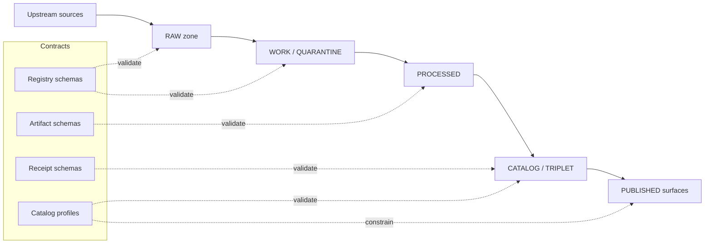

<!-- [KFM_META_BLOCK_V2]
doc_id: kfm://doc/2e5bb870-57c6-4e4d-a3df-e3cbf8748e39
title: KFM Data Schemas
type: standard
version: v1
status: draft
owners: Data Platform, Standards
created: 2026-03-01
updated: 2026-03-01
policy_label: public
related:
  - docs/data/README.md
  - docs/standards/
  - data/registry/
tags: [kfm, schemas, contracts, governance, promotion-contract]
notes:
  - This folder documents the “contract surfaces” for KFM data artifacts and registries.
  - Update the schema registry table to match the live repo contents.
[/KFM_META_BLOCK_V2] -->

# docs/data/_schemas — Data schema contracts (KFM)

**Purpose:** Document and govern the schema contracts that make KFM data artifacts *validatable, promotable, and citable*.


<!-- TODO: Replace placeholders with real workflow / coverage badges once paths are confirmed. -->

---

## Quick navigation

- [What lives here](#what-lives-here)
- [How this fits into the KFM truth path](#how-this-fits-into-the-kfm-truth-path)
- [Directory layout](#directory-layout)
- [Schema conventions](#schema-conventions)
- [Schema registry](#schema-registry)
- [Change workflow](#change-workflow)
- [Definition of done](#definition-of-done)
- [Common pitfalls](#common-pitfalls)

---

## What lives here

This directory is the **documentation hub** for KFM data schemas (the contracts), including:

- **Schema READMEs and guidance** (this file + per-schema notes).
- **Schema registry tables** (what schemas exist, what they validate, who owns them).
- **Examples and fixtures guidance** (how to write minimal examples that CI can validate).
- **Compatibility rules** (how to evolve schemas without breaking promotion, indexing, or UI).

> NOTE  
> Authoritative schema *files* may live elsewhere (for example in `data/**/schemas/` or `contracts/**`).  
> This directory’s job is to keep the schema surface **discoverable and governable**.

> WARNING  
> Do **not** place real dataset extracts, credentials, private locations, or sensitive coordinates here.  
> Keep examples synthetic or fully public, and prefer coarse geometry when demonstrating location fields.

---

## How this fits into the KFM truth path

KFM treats schemas and catalogs as **contract surfaces**. Promotion and publishing are blocked unless artifacts validate against their contracts.

In practice:

- **RAW / WORK / PROCESSED** artifacts must be *schema-valid* (where applicable).
- **CATALOG/TRIPLET** metadata (DCAT + STAC + PROV) must validate and cross-link.
- **PUBLISHED** surfaces (API + UI + Focus) must only serve **promoted** dataset versions.

### Conceptual flow



---

## Directory layout

> NOTE  
> The tree below is a **documentation standard**, not a claim about current repo contents.  
> Update it to match the live repository.

```text
docs/data/_schemas/
  README.md                         # you are here
  _template/
    SCHEMA_README_TEMPLATE.md       # optional: per-schema README template
    example.json                    # optional: example fixture style
  registries/
    schema-registry.md              # optional: richer registry than the table below
  notes/
    compatibility.md                # optional: breaking-change rules + migration notes
    naming.md                       # optional: naming + $id conventions
```

---

## Schema conventions

### Naming

Use explicit, stable names:

- **Schema files:** `*.schema.json` (preferred)  
  Example: `dataset_entry.schema.json`
- **Examples:** `*.example.json` / `*.example.yaml` (minimal but complete)
- **Notes:** `*.md` for rationale, known pitfalls, and evolution history

### Required schema hygiene

Every schema SHOULD include:

- `$id` (stable identifier; prefer a deterministic URL-like form)
- `title`, `description`
- `type`, `properties`, `required`
- `additionalProperties` policy (default to **false** unless you explicitly want extension points)
- `examples` (or a companion `*.example.*` file)

### Compatibility rules

- **Backward-compatible changes** (OK):
  - adding optional fields
  - widening enums *only if* downstream code tolerates it
  - adding new definitions that are not required
- **Breaking changes** (require versioning + migration plan):
  - renaming/removing fields
  - tightening constraints (min/max, patterns, required, additionalProperties)
  - changing semantics of existing fields

> TIP  
> If you need an extension point, prefer an explicit `extensions` object (or similar) over
> `additionalProperties: true` everywhere. Make extension points deliberate and reviewable.

---

## Schema registry

Maintain this table so engineers and stewards can quickly answer:

1) “What schema validates this artifact?”  
2) “What breaks if I change it?”

| Schema (path) | Governs | Primary owner | Used by | Notes |
|---|---|---|---|---|
| `data/**/schemas/<name>.schema.json` | Dataset registries / specs / manifests | Data Steward + Platform | CI validation, promotion gates | **TODO:** Replace with exact paths in repo |
| `contracts/**/<name>.schema.json` | API-adjacent payloads or shared DTOs | API Team | API contract tests | **TODO** |
| `docs/standards/*PROFILE*.md` | Catalog profiles (DCAT / STAC / PROV) | Standards | Catalog validators | **TODO** |

> NOTE  
> Keep this table *short and navigational*. If it grows, move details to `registries/schema-registry.md`
> and keep this table as the “top 10” entry points.

---

## Change workflow

When adding or changing a schema:

1. **Decide the contract surface**
   - What artifact does this validate?
   - Which promotion gate(s) depend on it?
2. **Write or update the schema**
   - Keep constraints minimal but sufficient to prevent ambiguous interpretation.
3. **Add/refresh examples**
   - Provide at least:
     - one minimal valid example
     - one invalid example (if your test harness supports it)
4. **Update the registry table**
   - Ensure owners and usage are recorded.
5. **Add compatibility notes**
   - If breaking: include migration guidance and versioning rationale.
6. **Run repo validators**
   - Use the repo’s `tools/` validators and CI checks (exact commands are repo-specific).

---

## Definition of done

A schema change is ready when:

- [ ] Schema is readable (title/description/examples present)
- [ ] Examples validate (and fail when intentionally invalid)
- [ ] Any dependent catalogs/receipts stay valid
- [ ] Promotion gates remain fail-closed
- [ ] Owners + usage recorded in [Schema registry](#schema-registry)
- [ ] If breaking: migration steps documented and tracked

---

## Common pitfalls

- **Over-permissive schemas** (`additionalProperties: true` everywhere)  
  → Leads to “valid but meaningless” artifacts that can’t be reliably interpreted.
- **Hidden semantics** (meaning encoded only in code, not in schema/description)  
  → Breaks the evidence-first contract and complicates stewardship reviews.
- **Schema drift** (examples out of date, tests missing)  
  → Causes promotion failures late in the pipeline when they are expensive to debug.

---

<a id="back-to-top"></a>
**Back to top:** [Quick navigation](#quick-navigation)
