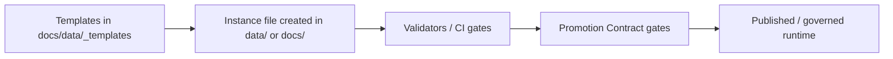

<!-- [KFM_META_BLOCK_V2]
doc_id: kfm://doc/2bbf1cf4-3c7e-4fc8-8fc0-2a2ee6c49e0a
title: docs/data/_templates
type: standard
version: v1
status: draft
owners: KFM Maintainers
created: 2026-03-01
updated: 2026-03-01
policy_label: public
related:
  - kfm://doc/<TBD>
tags: [kfm, templates, docs, data]
notes:
  - Directory-level README for governed templates used across KFM docs + data workflows.
  - Treat this file as a contract: keep it current with the templates that actually exist.
[/KFM_META_BLOCK_V2] -->

# `docs/data/_templates` — governed templates for KFM data & docs

**Purpose:** Store canonical, copy/paste-able templates for KFM data registry entries, specs, receipts, and story artifacts—so new datasets and docs start compliant by default.

> **Status:** draft • **Owners:** KFM Maintainers • **Policy label:** `public` (update if needed)


---

## Quick links

- [What belongs here](#what-belongs-here)
- [What must not go here](#what-must-not-go-here)
- [Template index](#template-index)
- [Conventions](#conventions)
- [How to use](#how-to-use)
- [Adding or changing a template](#adding-or-changing-a-template)
- [Governance and safety](#governance-and-safety)
- [Related docs](#related-docs)

---

## Where this fits

This directory is part of the KFM **data → pipeline → catalog/provenance → governed APIs → Map/Story UI** workflow.

Templates here are intended to be referenced by:
- dataset onboarding docs (registry entry + spec)
- pipeline run receipt / audit artifacts
- catalog artifacts (STAC/DCAT/PROV “triplet” templates)
- Story Node / narrative documentation scaffolds



---

## What belongs here

✅ **Acceptable inputs**
- Markdown templates (`.md`) for specs, Story Nodes, runbooks, checklists
- YAML templates (`.yml`/`.yaml`) for registry entries and configuration scaffolds
- JSON templates (`.json`) for receipts / bundles / example payloads
- JSON Schema templates (`.schema.json`) *only if this folder is explicitly used for schema templates* (otherwise keep schemas in the canonical `schemas/` location)

✅ **Characteristics**
- Small, human-readable
- Uses placeholders (e.g., `<DATASET_ID>`, `<OWNER_TEAM>`, `<LICENSE_ID>`)
- Safe defaults: includes **policy label**, **provenance hooks**, and **validation reminders**

---

## What must not go here

🚫 **Exclusions**
- Real datasets, extracts, or large binaries (GeoTIFFs, MBTiles, etc.)
- Secrets, credentials, tokens, private keys, `.env` files
- Personally identifying information (PII) or restricted location detail
- Generated/derived artifacts that should be reproducible (indexes, build outputs)
- Anything that bypasses governance (e.g., “direct-to-storage” client snippets)

> **WARNING:** If a “template” contains real coordinates for a sensitive/vulnerable site, treat it as **restricted** and move/redact accordingly.

---

## Template index

> **NOTE:** Fill this table with *only templates that actually exist in this directory tree*.  
> The entries below are **placeholders** until verified in-repo.

| Template (file) | Use for | Output/target location | Validation / gate hook |
|---|---|---|---|
| `dataset_entry.template.yaml` | New dataset registry entry | `data/registry/<dataset>.yaml` | Registry schema validation (TBD) |
| `source_entry.template.yaml` | New upstream source entry | `data/registry/sources/<source>.yaml` | Registry schema validation (TBD) |
| `dataset_spec.template.md` | Dataset spec sheet | `docs/data/specs/<dataset>.md` | Link check + required sections |
| `story_node.template.md` | Story Node skeleton | `docs/stories/<story>.md` | Story node schema/lint (TBD) |
| `run_receipt.template.json` | Pipeline run receipt | `data/*/receipts/<run>.json` | Receipt schema validation (TBD) |
| `evidence_bundle.template.json` | Evidence bundle example | `data/evidence/<bundle>.json` | Evidence resolver tests (TBD) |

<details>
<summary>Why keep an index table?</summary>

- Makes “template drift” obvious.
- Gives reviewers a checklist of required compliance fields.
- Prevents hidden, undocumented scaffolds from becoming de facto standards.

</details>

---

## Conventions

### Placeholder syntax

Use angle-bracket placeholders for values humans must replace:

- `<DATASET_ID>` (stable slug; kebab-case)
- `<DATASET_VERSION>` (semantic version or content hash reference)
- `<OWNER_TEAM>` / `<STEWARD>` (accountable group)
- `<LICENSE_ID>` and `<LICENSE_URL>`
- `<SENSITIVITY_LABEL>` (e.g., `public`, `restricted`)
- `<TEMPORAL_EXTENT>` / `<SPATIAL_EXTENT>`
- `<UPSTREAM_URL>` and `<UPSTREAM_CITATION>`

### Required fields for “KFM standard docs”

If a template produces a “standard doc,” include a **KFM MetaBlock v2** header:

```text
<!-- [KFM_META_BLOCK_V2]
doc_id: kfm://doc/<uuid>
title: <Title>
type: standard
version: v1
status: draft|review|published
owners: <team or names>
created: YYYY-MM-DD
updated: YYYY-MM-DD
policy_label: public|restricted|...
related:
  - <paths or kfm:// ids>
tags: [kfm]
notes:
  - <short notes>
[/KFM_META_BLOCK_V2] -->
```

### Writing rules

- Prefer **relative links** within the repo.
- Avoid hardcoding hostnames, tokens, or environment assumptions.
- Keep examples minimal and copy/paste-friendly.
- When in doubt about sensitivity: **fail closed** (redact, generalize, or mark `restricted`).

---

## How to use

### Create an instance from a template

```bash
# Example (adjust paths to match your repo)
cp docs/data/_templates/dataset_spec.template.md docs/data/specs/<DATASET_ID>.md
cp docs/data/_templates/dataset_entry.template.yaml data/registry/<DATASET_ID>.yaml
```

### Minimal dataset registry entry (example skeleton)

```yaml
# <DATASET_ID>.yaml (instance created from template)
dataset_id: <DATASET_ID>
title: "<Human Title>"
description: >
  <One-paragraph description of what this dataset is and why it exists.>

owners:
  steward: <OWNER_TEAM>
  contacts:
    - name: <NAME>
      email: <EMAIL>

license:
  id: <LICENSE_ID>
  url: <LICENSE_URL>

sensitivity:
  policy_label: <SENSITIVITY_LABEL>
  redaction_notes: "<If restricted, describe what must be redacted>"

extents:
  spatial: <SPATIAL_EXTENT>
  temporal: <TEMPORAL_EXTENT>

upstream:
  url: <UPSTREAM_URL>
  citation: "<UPSTREAM_CITATION>"
  cadence: "<daily|weekly|monthly|ad-hoc>"
```

---

## Adding or changing a template

### Definition of Done

- [ ] Template has clear name and purpose
- [ ] Includes **policy_label** and “safety default” language
- [ ] Includes placeholder list / required fields
- [ ] Added/updated in the [Template index](#template-index)
- [ ] Mentions the validator/gate that should apply (even if “TBD”)
- [ ] Reviewed for secrets + sensitive location leakage
- [ ] Keeps compatibility (or documents the breaking change + migration note)

### Change control

If you make a breaking change to a template:
1. Version the template file name (e.g., `*.v2.template.*`) **or** embed a `template_version:` field.
2. Add a short migration note in the template header.
3. Update downstream references (docs, scripts, onboarding guides).

---

## Governance and safety

This directory exists to keep KFM “evidence-first” and “policy-aware” **by default**:

- Templates must not encourage bypassing governed APIs.
- Templates that describe data promotion must reference the Promotion Contract gates (metadata, validation, provenance, checksums, audit record).
- If a template could expose sensitive locations, it must include redaction instructions and a `restricted` policy label option.

---

## Related docs

> Replace these with real relative paths once confirmed.

- `docs/README.md` (TBD)
- `docs/data/README.md` (TBD)
- `docs/policy/README.md` (TBD)
- `contracts/` and `data/registry/schemas/` (TBD)

---

<p align="right"><a href="#docsdata_templates--governed-templates-for-kfm-data--docs">Back to top ⬆️</a></p>
