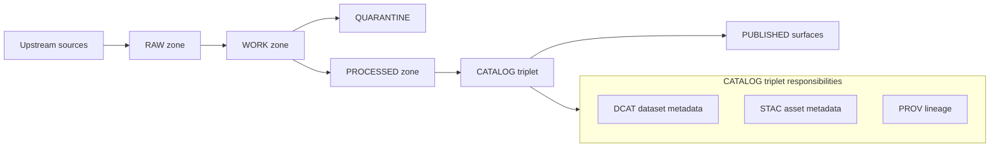

<!-- [KFM_META_BLOCK_V2]
doc_id: kfm://doc/5b5b7f0d-4b23-4c73-9b4b-6a0a9f1c8c6b
title: docs/data/datasets/README.md
type: standard
version: v1
status: draft
owners: KFM Data Stewardship (TODO: confirm)
created: 2026-03-01
updated: 2026-03-01
policy_label: public
related:
  - docs/data/README.md (TODO: confirm)
  - data/registry/README.md (TODO: confirm)
  - data/catalog/ (TODO: confirm)
tags: [kfm, data, datasets, documentation]
notes:
  - This README defines the *documentation contract* for dataset modules under docs/data/datasets/.
  - It does not define storage-zone layouts for actual artifacts; see the platform lifecycle docs.
[/KFM_META_BLOCK_V2] -->

# KFM Dataset Docs
Dataset modules: **human-readable** “datasheets” that tie together *registry → spec → artifacts → catalogs → policy → evidence*.


> **Rule of thumb:** If it’s needed to *understand / steward / audit* a dataset, it belongs here.  
> If it’s needed to *run / serve / validate* the dataset, it belongs in registry/spec/catalog/pipeline code.

---

## Quick navigation
- [Purpose](#purpose)
- [Where this fits](#where-this-fits)
- [Directory contract](#directory-contract)
- [Recommended module layout](#recommended-module-layout)
- [How to add a new dataset module](#how-to-add-a-new-dataset-module)
- [Promotion contract mapping](#promotion-contract-mapping)
- [Definition of Done](#definition-of-done)
- [Security, sensitivity, and rights](#security-sensitivity-and-rights)
- [Templates](#templates)
- [FAQ](#faq)

---

## Purpose
This directory is a **documentation catalog** for dataset onboarding and stewardship.

Each dataset module in `docs/data/datasets/<dataset_id>/` should make it easy to answer:

- **What is this dataset?** What does it represent, at what resolution/coverage?
- **Who is responsible?** Steward, contact, publisher, accountability chain.
- **What are we allowed to do with it?** License, rights holder, attribution, redistribution rules.
- **How is it acquired and processed?** High-level pipeline summary with links to specs/contracts.
- **How is it governed?** `policy_label`, access model, and any redaction/generalization obligations.
- **How do we audit it?** Links to run receipts, catalogs (DCAT/STAC/PROV), validation outputs.

---

## Where this fits
KFM treats “the lifecycle” as a set of zones + gates (not a metaphor). This docs folder is *supporting* the lifecycle, not replacing it.



### Relationship to other “homes” in the repo
| Need | Canonical home | What belongs in `docs/data/datasets/` |
|---|---|---|
| Dataset discovery + required metadata | `data/registry/` (schema-validated) | Human-readable rationale, steward notes, interpretation guides |
| Transformation definition | dataset onboarding spec / pipeline configs (location TBD) | Plain-language summary, links to spec(s), decision notes |
| Artifacts | RAW/WORK/PROCESSED storage zones | **Never** store raw/processed artifacts here (docs-only) |
| Catalogs | `data/catalog/` (DCAT/STAC/PROV) | “Pointers”: EvidenceRefs/IDs/paths and narrative about the triplet |
| Policy | `policy/` (OPA/Rego) | Explanation of obligations + user-facing meaning (not enforcement) |
| Evidence resolution | evidence resolver service | How citations should be formed + what “resolvable evidence” means |

---

## Directory contract

### ✅ Acceptable inputs
- Dataset “datasheets” / module READMEs
- Data dictionaries and field semantics (human-readable)
- Stewardship notes (contacts, escalation, review cadence)
- Rights & licensing notes (including “metadata-only” decisions)
- QA overview and thresholds **as documentation** (the machine checks live elsewhere)
- Links/pointers to: registry entry, spec, run receipts, DCAT/STAC/PROV, validations

### ❌ Exclusions
- Raw payloads, snapshots, imagery, GeoParquet, PMTiles, COGs, Zarr, etc.
- Generated catalogs (DCAT/STAC/PROV) — those belong in `data/catalog/`
- Policy code, rego rules, or enforcement logic
- Secrets, keys, tokens, or access credentials
- Any content that would bypass governance (e.g., “download links” to restricted artifacts)

### ⚠️ Sensitivity constraint
If a dataset is sensitive-location or otherwise restricted:
- **Do not** include precise coordinates, full-resolution screenshots, or “how to find” instructions in docs.
- Document the **obligations** and point to the **public_generalized** derivative (if policy allows one).

---

## Recommended module layout
**Proposed** default layout for each dataset module:

```
docs/data/datasets/                                      # Dataset documentation packs (datasheets; human-facing; policy-aware)
├─ README.md                                              # Directory contract: required files, naming rules, review gates, link expectations
│
├─ <dataset_id>/                                          # One folder per dataset_id (stable identifier)
│  ├─ README.md                                           # REQUIRED datasheet (purpose, sources, coverage, limitations, how to cite)
│  ├─ decisions/                                          # Dataset-specific ADR-like notes (why choices were made; non-global)
│  │  └─ 0001-initial-onboarding.md                       # Example: onboarding decisions (license, sensitivity, schema choices)
│  ├─ dictionaries/                                       # Human-readable dictionaries (fields, units, coded values)
│  │  └─ fields.md                                        # Data dictionary (field meanings, types, units, codebooks pointers)
│  ├─ examples/                                           # Safe usage examples (no direct storage access; policy-safe)
│  │  ├─ queries.md                                       # Example API queries + expected behaviors (redaction/obligations)
│  │  └─ screenshots/                                     # OPTIONAL screenshots (must be policy-safe/generalized; no sensitive details)
│  └─ links.md                                            # Pointers to canonical registries/specs/catalog triplet/receipts for this dataset_id
│
└─ ...                                                    # Additional dataset_id folders
```

> **NOTE:** Folder names, dataset IDs, and the existence of any referenced repo paths must be verified in the live repo before treating them as “Confirmed.”

---

## How to add a new dataset module

### 1) Create the doc folder
- `docs/data/datasets/<dataset_id>/README.md`
- Add `links.md` with pointers to registry/spec/catalog/receipts.

### 2) Fill the minimum “datasheet” sections
Your dataset README MUST include:

1. **Overview**
   - What it is, why KFM includes it, key caveats.
2. **Stewardship**
   - Steward/team, review cadence, escalation.
3. **Rights**
   - License, rights holder, attribution text, redistribution stance.
4. **Coverage**
   - Spatial coverage + temporal coverage (and any known gaps).
5. **Update cadence**
   - How often upstream changes and how we track it.
6. **Governance**
   - `policy_label`, obligations (if any), and what is publishable.
7. **Quality**
   - QA checks + thresholds (as docs; link to the actual validation outputs).
8. **Evidence pointers**
   - Where the DCAT/STAC/PROV triplet can be found and how to cite it.

### 3) Keep docs and promotion gates aligned
The promotion gates are enforced by CI/policy/catalog validators; **these docs explain how you satisfy them**. See [Promotion contract mapping](#promotion-contract-mapping).

---

## Promotion contract mapping
KFM promotion to PUBLISHED is blocked unless minimum gates are met (identity/versioning, licensing, sensitivity + redaction plan, catalog validation, QA thresholds, receipts/audit, etc.). This dataset docs directory should contain *the human-readable counterpart* for each gate.

| Promotion gate | What to document here | Where enforcement lives |
|---|---|---|
| A — Identity & versioning | dataset_id meaning; version semantics; spec hash rationale | schema validation, hashing tests |
| B — Licensing & rights | license, rights holder, attribution, redistribution stance | CI gate; policy checks |
| C — Sensitivity & redaction | `policy_label`; obligations; public_generalized strategy | policy pack + fixtures |
| D — Catalog triplet validation | pointers to DCAT/STAC/PROV; cross-link expectations | validators + link checker |
| E — Run receipts & checksums | where receipts live; what they prove | receipt schema validation |
| F — Policy + contract tests | how to run/interpret the policy fixtures (high-level) | CI policy tests |
| G — Release manifest (if used) | release notes summary + what changed for humans | release tooling |

---

## Definition of Done
A dataset module PR is considered “done” only when:

- [ ] Dataset module exists at `docs/data/datasets/<dataset_id>/README.md`
- [ ] Rights section is complete (license + rights holder + attribution)
- [ ] `policy_label` is explicitly stated and matches the registry entry
- [ ] “Evidence pointers” section links to resolvable catalog artifacts (DCAT/STAC/PROV) or clearly marks them as pending
- [ ] QA thresholds are documented (and reference where validation outputs will live)
- [ ] If sensitive: doc includes the redaction/generalization stance and avoids restricted details

> **Reminder:** The *platform* dataset-integration DoD is stricter (it includes registry updates, immutable RAW artifacts, processed digests, validated catalogs, receipts, policy tests, evidence resolution, UI smoke tests, and audit/ledger requirements). This docs DoD is necessary but not sufficient.

---

## Security, sensitivity, and rights

### Evidence-first citations (important)
In KFM, a “citation” should be an **EvidenceRef** that resolves into an **EvidenceBundle** (not a pasted URL). Dataset docs should:
- Prefer referencing catalogs/receipts by stable IDs or EvidenceRef schemes
- Avoid brittle external links when an internal evidence surface exists

### Sensitivity defaults (doc posture)
- Default-deny for sensitive-location and restricted datasets unless policy explicitly allows.
- If any public representation is allowed, document the **public_generalized** derivative.
- Never leak restricted metadata in error messages, screenshots, or “tips”.

### Rights enforcement posture
- Online availability ≠ permission to reuse.
- “Metadata-only” is allowed when mirroring is not permitted — document that decision here.
- Export/attribution requirements should be explicit and copy-pastable.

---

## Templates

### Dataset README skeleton
Create `docs/data/datasets/<dataset_id>/README.md` with:

```markdown
<!-- [KFM_META_BLOCK_V2]
doc_id: kfm://doc/<uuid>
title: <dataset_id> — Dataset Datasheet
type: standard
version: v1
status: draft
owners: <steward/team>
created: YYYY-MM-DD
updated: YYYY-MM-DD
policy_label: public|restricted|...
related:
  - ../../../../data/registry/<...> (TODO)
tags: [kfm, dataset]
[/KFM_META_BLOCK_V2] -->

# <dataset_id> — <Short name>
One-line purpose.

## Overview
## Stewardship
## Rights and licensing
## Coverage
## Upstream acquisition
## Processing summary
## QA checks and thresholds
## Governance and sensitivity
## Evidence pointers
## Known issues
```

### links.md skeleton
```markdown
# Evidence pointers (links)
- Registry entry: <relative path or dataset_id lookup>
- Spec (onboarding definition): <relative path>
- Latest run receipts: <relative path or EvidenceRef>
- Catalog triplet:
  - DCAT: <EvidenceRef or path>
  - STAC: <EvidenceRef or path>
  - PROV: <EvidenceRef or path>
```

---

## FAQ

### “Can I put sample data here?”
No. Use the appropriate data zone (RAW/WORK/PROCESSED) or small, policy-safe fixtures in `examples/` or `tests/`.

### “Where do I put diagrams and screenshots?”
Docs screenshots are allowed only if they are policy-safe and don’t reveal restricted locations. Prefer generalized or synthetic examples.

### “What if licensing is unclear?”
Fail closed: document the uncertainty and keep the dataset in QUARANTINE / metadata-only mode until resolved.

---

<a id="top"></a>
Back to top: [Quick navigation](#quick-navigation)
