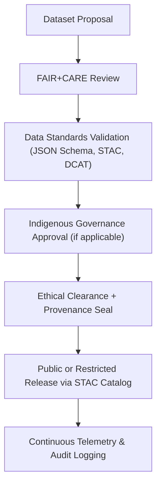

<div align="center">

# ⚖️ **Kansas Frontier Matrix — Data Governance & Ethical Stewardship**
`docs/data/governance/README.md`

**Purpose:**  
Establish the **data governance**, **ethics**, and **oversight framework** that ensures all datasets within the **Kansas Frontier Matrix (KFM)** comply with FAIR+CARE principles, cultural consent, provenance, and reproducibility mandates under the **Master Coder Protocol (MCP v6.3)**.

[](../../README.md)
[](../../standards/faircare.md)
[](../../../LICENSE)
[](../../../releases/v10.0.0/manifest.zip)

</div>

---

## 📘 Overview

Data governance in KFM extends beyond compliance — it’s a **living ethical practice** that integrates **technical standards**, **cultural responsibility**, and **community collaboration**.  
The framework ensures every dataset, from environmental records to Indigenous cultural archives, is handled transparently, respectfully, and reproducibly.

KFM’s governance unites:
- **FAIR+CARE Council** for ethical oversight  
- **Data Standards Committee** for schema management  
- **Indigenous Data Governance Board** for cultural consent  
- **Governance Ledger System** for audit trails and public transparency  

---

## 🗂️ Directory Layout

```
docs/data/governance/
├── README.md                           # This file
├── data-access-policy.md               # Open data & license framework
├── indigenous-data-protocol.md         # Indigenous data sovereignty & consent rules
├── review-council-minutes.md           # Quarterly FAIR+CARE governance records
└── council-charter.md                  # Governance body structure and bylaws
```

---

## 🧭 Governance Structure

| Council / Committee | Role | Meeting Frequency |
|---|---|---|
| **FAIR+CARE Council** | Oversees ethical, accessibility, and data consent audits. | Quarterly |
| **Data Standards Committee (DSC)** | Maintains schemas, contracts, and interoperability standards. | Biannual |
| **Indigenous Data Governance Board (IDGB)** | Approves and reviews cultural and community-linked datasets. | Quarterly |
| **Open Data Governance Board (ODGB)** | Manages public access policy, open licensing, and transparency. | Annual |
| **Scientific Reproducibility Panel (SRP)** | Ensures methodological integrity and MCP compliance. | Continuous |

---

## ⚙️ Data Stewardship Workflow



**Key Steps:**
1. **Submission:** Dataset proposed through KFM data portal.  
2. **Validation:** Automated schema & provenance verification via GitHub CI.  
3. **Ethical Review:** CARE compliance and consent validation.  
4. **Approval:** Governance boards sign off and record in `review-council-minutes.md`.  
5. **Publication:** Dataset included in STAC/DCAT catalogs with immutable checksum.  
6. **Telemetry:** All activity logged in audit ledger for transparency.

---

## ⚖️ FAIR+CARE Ethical Framework

KFM embeds the **CARE Principles for Indigenous Data Governance** within the **FAIR** structure:

| FAIR Principle | CARE Counterpart | Implementation |
|---|---|---|
| **Findable** | **Collective Benefit** | Metadata indexed for public awareness of shared benefit. |
| **Accessible** | **Authority to Control** | Access levels determined by source community permissions. |
| **Interoperable** | **Responsibility** | Validation pipelines ensure schema integrity and context retention. |
| **Reusable** | **Ethics** | Data reusability guided by provenance, consent, and moral obligations. |

All datasets are subject to a **CARE compliance flag** (`careStatus: approved | restricted | pending`) embedded in metadata.

---

## 🔍 Governance Policies

| Policy | Description | Maintained By |
|---|---|---|
| **Open Data Access Policy** | Defines conditions for data release, licensing, and transparency. | ODGB |
| **Indigenous Data Protocol** | Ensures tribal sovereignty and consent in data representation. | IDGB |
| **Data Use Ethics Policy** | Establishes acceptable research and application boundaries. | FAIR+CARE Council |
| **Data Quality Charter** | Sets standards for completeness, provenance, and accuracy. | DSC |
| **Data Lifecycle Policy** | Outlines archival, retention, and deprecation rules. | SRP |

---

## 🧾 Indigenous Data Governance Protocol

Core tenets derived from **GIDA Global** and **OCAP™** frameworks:

| Principle | Application in KFM |
|---|---|
| **Ownership** | Indigenous communities retain ownership of data about their heritage. |
| **Control** | KFM enables communities to set access permissions at the metadata level. |
| **Access** | Controlled sharing through consent-managed STAC catalogs. |
| **Possession** | Data stored on KFM servers retains tribal encryption and provenance seals. |

Consent metadata is encoded as JSON-LD:
```json
"careConsent": {
  "authority": "Kaw Nation",
  "status": "approved",
  "last_reviewed": "2025-09-01"
}
```

---

## 🧱 Audit & Review Cycle

| Review Type | Conducted By | Frequency | Output Artifact |
|---|---|---|---|
| **Ethical Audit** | FAIR+CARE Council | Quarterly | `faircare-validation.json` |
| **Cultural Consent Review** | Indigenous Data Governance Board | Biannual | `indigenous-data-protocol.md` |
| **Schema Compliance Audit** | Data Standards Committee | Continuous | `data-contract-validate.yml` logs |
| **Public Access Review** | Open Data Governance Board | Annual | `data-access-policy.md` |
| **Council Minutes** | Governance Secretariat | Quarterly | `review-council-minutes.md` |

---

## 📊 Data Governance Metrics

| Metric | Target | Validation Source |
|---|---|---|
| **FAIR+CARE Compliance Rate** | ≥ 95% | `faircare-audit.yml` |
| **Consent-Flag Coverage** | 100% for cultural datasets | Provenance specs |
| **Schema Conformance** | 100% | `data-contract-validate.yml` |
| **Governance Log Currency** | Updated within 30 days of review | `review-council-minutes.md` |
| **Transparency Index (public logs)** | ≥ 90% | Governance Dashboard Telemetry |

---

## 🧩 Governance Automation & Telemetry

Governance workflows are automated through GitHub Actions and stored in KFM’s **telemetry schema**.

| Workflow | Purpose | Output Artifact |
|---|---|---|
| `faircare-audit.yml` | Executes CARE validation on each dataset merge. | `reports/data/faircare-validation.json` |
| `governance-review.yml` | Logs meeting minutes and decisions to JSON-LD. | `docs/data/governance/review-council-minutes.md` |
| `consent-verification.yml` | Validates Indigenous and personal data consent metadata. | `reports/data/consent-summary.json` |
| `stac-update.yml` | Publishes approved datasets to STAC catalog. | `releases/v10.0.0/manifest.zip` |

---

## 🕰️ Version History

| Version | Date | Author | Summary |
|---|---|---|---|
| v10.0.0 | 2025-11-10 | FAIR+CARE Council & Data Governance Board | Created full ethical data governance documentation integrating Indigenous consent protocols, FAIR+CARE Council oversight, and telemetry-based validation. |

---

<div align="center">

**© 2025 Kansas Frontier Matrix — CC-BY 4.0**  
Governed under **Master Coder Protocol v6.3** · Verified by **FAIR+CARE Council** · Diamond⁹ Ω / Crown∞Ω Ultimate Certified  
[⬅ Back to Data Index](../README.md) · [Indigenous Data Protocol →](indigenous-data-protocol.md)

</div>