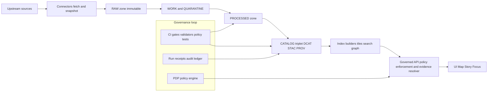

<!-- [KFM_META_BLOCK_V2]
doc_id: kfm://doc/bd478303-b1c0-4a41-92c1-1dd92cf2a10c
title: Data Governance
type: standard
version: v1
status: draft
owners: <stewards-or-team>
created: 2026-03-01
updated: 2026-03-01
policy_label: internal
related:
  - kfm://doc/promotion-contract-v1
  - kfm://doc/policy-labels
  - kfm://doc/run-receipts
tags: [kfm, data, governance]
notes:
  - This folder is the human-facing contract for KFM data governance: promotion gates, policy labels, receipts, and review expectations.
[/KFM_META_BLOCK_V2] -->

# Data Governance
Contracts + playbooks for promoting data into KFM’s governed runtime **without breaking the trust membrane**.


> [!NOTE]
> This directory is **documentation + templates**. Enforcement lives in CI gates, runtime policy checks, validators, and the evidence resolver.  
> If something in this folder conflicts with enforcement, **enforcement wins**—and this folder must be updated to match.

## Quick navigation
- [Purpose](#purpose)
- [Where this fits](#where-this-fits)
- [What belongs here](#what-belongs-here)
- [Data lifecycle zones](#data-lifecycle-zones)
- [Promotion Contract v1](#promotion-contract-v1)
- [Policy labels, obligations, and redaction](#policy-labels-obligations-and-redaction)
- [Licensing and rights](#licensing-and-rights)
- [Catalog triplet and evidence](#catalog-triplet-and-evidence)
- [Run receipts and audit](#run-receipts-and-audit)
- [Safety and sensitive-data patterns](#safety-and-sensitive-data-patterns)
- [Definition of Done](#definition-of-done)
- [Recommended folder structure](#recommended-folder-structure)
- [Appendix: templates](#appendix-templates)

---

## Purpose
This folder defines the **data governance contract** for KFM:

1. **Truth path** (zones + promotion) is explicit and auditable.
2. **Promotion is fail-closed**: nothing becomes public/runtime-visible unless it passes minimum gates.
3. **Policy is enforced consistently** in CI and runtime (policy-as-code posture).
4. **Evidence is first-class**: citations are resolvable EvidenceRefs, not pasted URLs.
5. **Every governed operation emits receipts** (pipelines, story publishing, Focus Mode queries).

---

## Where this fits
KFM governance is not a “docs-only” concern; it’s the system spine that ties **data → catalogs → policy → governed API → UI → Focus Mode**.



---

## What belongs here

### ✅ Acceptable inputs
- **Human-readable rules**: promotion gates, policy label meanings, sensitivity rules, licensing rules, review workflows.
- **Templates** (JSON/YAML/Markdown) used by teams to produce governed artifacts:
  - run receipts
  - promotion manifests
  - policy decisions (human review record)
- **Checklists** for stewards/reviewers (dataset onboarding, sensitive-layer release).
- **Rubrics** (how to classify license/sensitivity; how to generalize/redact safely).

### ❌ Exclusions
- Raw / processed datasets or large artifacts.
- Secrets, tokens, credentials, or “how to get around policy.”
- Runtime policy bundles (e.g., `.rego` files) and validator implementations (those belong in code).
- Dataset-specific specs (those belong next to the dataset family/runbook in the data area).

> [!WARNING]
> Never write governance docs that assume a data product is safe “because it is public.”  
> Public availability is not a license, and “public” data can still be harmful at fine granularity.

---

## Data lifecycle zones
KFM uses explicit lifecycle zones so governance is enforceable and auditable:

- **RAW**: immutable acquisition copy + checksums + acquisition manifest + license/terms snapshot.
- **WORK / QUARANTINE**:
  - WORK: intermediate transforms, normalization, QA reports, candidate redactions/generalizations.
  - QUARANTINE: failed validation, unclear licensing, sensitivity concerns, upstream instability.
- **PROCESSED**: publishable artifacts in approved formats, with stable IDs + checksums.
- **CATALOG triplet**: **DCAT + STAC + PROV** describing metadata, assets, and lineage.
- **PUBLISHED**: governed runtime surfaces (API + UI), serving only promoted dataset versions.

---

## Promotion Contract v1
Promotion is the act of moving a dataset version into **PROCESSED + CATALOG/lineage**, and thereby making it eligible for **PUBLISHED** runtime surfaces.

### Minimum gates (fail closed)
| Gate | What it protects | Minimum requirement (conceptual) | Typical enforcement |
|---|---|---|---|
| **A — Identity & versioning** | “What exactly is this version?” | dataset_id + dataset_version_id + deterministic spec_hash + content digests | schema + hash golden tests |
| **B — Licensing & rights metadata** | “Are we allowed to redistribute?” | license/rights fields + upstream terms snapshot | deny unknown/unclear license |
| **C — Sensitivity + redaction plan** | “Could this cause harm if too precise?” | policy_label + obligations (generalize/remove fields/etc.) | policy tests + redaction validators |
| **D — Catalog triplet validation** | “Can evidence resolve without guessing?” | DCAT/STAC/PROV validate + cross-link | validators + link checker |
| **E — QA & thresholds** | “Is the data fit-for-purpose?” | dataset-specific checks + thresholds documented and met | QA reports + threshold checks |
| **F — Run receipt & audit record** | “Can we reproduce and explain it?” | run receipt includes inputs/tools/hashes + append-only audit | receipt schema validation |
| **G — Release / promotion manifest** | “What was promoted, exactly?” | manifest references artifacts + digests + approvals | manifest validation + stewardship sign-off |

> [!TIP]
> Treat gates as **CI-enforced invariants**. If you can’t test it, you can’t rely on it.

---

## Policy labels, obligations, and redaction

### Controlled vocabulary (starter)
Policy labels must be **versioned** and treated as a controlled vocabulary (starter set):
- `public`
- `public_generalized`
- `restricted`
- `restricted_sensitive_location`
- `internal`
- `embargoed`
- `quarantine`

### Policy-as-code posture
- CI and runtime must share the same semantics (or at minimum the same fixtures and outcomes).
- UI can display badges/notices, but **UI never makes policy decisions**.

### Obligations (examples)
Obligations are *actions the system must take* when serving or rendering a resource, such as:
- “generalize geometry”
- “remove attribute fields”
- “show notice in UI”
- “enforce minimum aggregation threshold”
- “deny export”

> [!IMPORTANT]
> If a dataset can be represented publicly only in generalized form, publish a separate **`public_generalized`** dataset version rather than “sometimes redacting” at render time.

---

## Licensing and rights
Licensing is a promotion gate input, not paperwork.

Operational rules (minimum posture):
- Promotion requires license + rights holder metadata for every distribution.
- “Metadata-only reference” is allowed: catalog something without mirroring it if rights do not allow redistribution.
- Exports must include attribution + license text automatically.
- Story publishing must block if rights are unclear for included media.

---

## Catalog triplet and evidence

### Triplet responsibilities
- **DCAT** answers: dataset-level identity, publisher, license, distributions.
- **STAC** answers: asset-level spatiotemporal metadata, locations of files, extents.
- **PROV** answers: lineage (inputs, tools, parameters, activities, agents).

### Cross-linking rules
Cross-links are not optional: they are how evidence becomes navigable and testable.
- DCAT → distributions → artifact digests
- DCAT → prov:wasGeneratedBy → PROV bundle
- STAC collection → describedby → DCAT
- STAC item → PROV activity/run receipt
- EvidenceRefs resolve into these objects **without guessing**

### EvidenceRef and EvidenceBundle
In KFM, a “citation” is an **EvidenceRef** that resolves (via the evidence resolver) to an **EvidenceBundle** containing:
- policy decision (allow/deny + obligations)
- license/attribution
- dataset_version_id
- artifact links + digests (only if allowed)
- provenance/run references
- audit_ref for steward review

> [!WARNING]
> “URL citations” are discouraged because they are not stable, not policy-aware, and not reproducible.

---

## Run receipts and audit

### Run receipts
A run receipt is emitted for:
- every pipeline run
- every Focus Mode query (governed operation)

Receipts must capture, at minimum:
- dataset_slug, dataset_version_id, spec_hash
- input artifacts (raw/work refs + digests)
- output artifacts (processed/catalog refs + digests)
- validation status + report digests
- policy label + decision_id + obligations
- environment capture (git commit, container image digest, parameters)
- timestamps

### Audit posture
Audit logs and receipts may themselves be sensitive:
- append-only
- redacted for PII/restricted info
- access restricted (stewards/operators)
- retention/deletion policy defined and enforced

---

## Safety and sensitive-data patterns
Patterns to default to (especially for archaeology, species, critical infrastructure, PII-adjacent datasets):

- Store precise geometries only in restricted datasets.
- Publish public derivatives as generalized products (`public_generalized`).
- Prevent reverse engineering (no hidden precise points, no “leaky” joins).
- Enforce policy at tile serving; no bypass via static hosting.
- Require tests like:
  - “no restricted bbox leakage”
  - “no coordinate fields in public exports”
- For reidentification risk datasets:
  - avoid individual-level public releases
  - aggregate to safe geographies
  - apply minimum count thresholds
  - document thresholds as policy obligations

---

## Definition of Done
Use this when onboarding a source or preparing a dataset version for promotion.

### Dataset integration DoD (minimum)
- [ ] Source assessment complete (license, sensitivity, access).
- [ ] Acquisition design documented (connector, manifest, raw storage, terms snapshot).
- [ ] Normalization design documented (schemas, mapping, units).
- [ ] Validation design documented (checks + thresholds).
- [ ] Output design documented (processed formats, tiling strategy if relevant).
- [ ] Catalog design complete (DCAT/STAC/PROV mapping + cross-links).
- [ ] Policy design complete (policy_label + obligations + tests).
- [ ] UI integration defined (layer definition + evidence drawer mapping).
- [ ] Focus Mode integration tested (retrieval hooks + evidence resolution tests).

> [!NOTE]
> QUARANTINE is not failure — it’s governance working as designed. Don’t “force promote.”

---

## Recommended folder structure
This README is required. Everything else is recommended and can be added incrementally.

```text
docs/data/governance/
  README.md                         # you are here
  promotion-contract.md             # normative explanation of gates (recommended)
  policy-labels.md                  # definitions + examples (recommended)
  licensing.md                      # rights rubric + decision notes (recommended)
  sensitivity.md                    # generalization guidelines + thresholds (recommended)
  catalogs.md                       # DCAT/STAC/PROV requirements + cross-linking rules (recommended)
  checklists/
    dataset-integration-dod.md      # steward checklist (recommended)
    sensitive-layer-release.md      # extra gates for high-risk layers (recommended)
  templates/
    run_receipt.v1.json             # example + field notes (recommended)
    promotion_manifest.v1.json      # example + field notes (recommended)
    policy_decision.v1.json         # example + field notes (recommended)
```

---

## Appendix: templates

<details>
<summary><strong>Run receipt (v1) — minimal shape (example)</strong></summary>

```json
{
  "kfm_run_receipt_version": "v1",
  "run_id": "kfm://run/<timestamp>.<dataset_slug>.<sha8>",
  "run_type": "pipeline",
  "dataset_slug": "<dataset_slug>",
  "dataset_version_id": "<dataset_version_id>",
  "spec_hash": "sha256:<...>",
  "inputs": [{"artifact_id": "kfm://artifact/sha256:<...>", "zone": "raw", "uri": "<...>", "digest": "sha256:<...>"}],
  "outputs": [{"artifact_id": "kfm://artifact/sha256:<...>", "zone": "processed", "path": "<...>", "digest": "sha256:<...>", "media_type": "<...>"}],
  "validation": {"status": "pass", "reports": [{"name": "<check>", "status": "pass"}]},
  "policy": {"policy_label": "public", "decision_id": "kfm://policy_decision/<id>", "obligations": []},
  "environment": {"git_commit": "<commit>", "container_image": "sha256:<image>", "runtime": "kubernetes", "parameters": {}},
  "timestamps": {"started_at": "<iso8601>", "ended_at": "<iso8601>"}
}
```

</details>

<details>
<summary><strong>Promotion manifest (v1) — minimal shape (example)</strong></summary>

```json
{
  "kfm_promotion_manifest_version": "v1",
  "dataset_slug": "<dataset_slug>",
  "dataset_version_id": "<dataset_version_id>",
  "spec_hash": "sha256:<...>",
  "released_at": "<iso8601>",
  "artifacts": [{"path": "<processed artifact>", "digest": "sha256:<...>", "media_type": "<...>"}],
  "catalogs": [{"path": "<dcat>", "digest": "sha256:<...>"}, {"path": "<stac collection>", "digest": "sha256:<...>"}],
  "qa": {"status": "pass", "report_digest": "sha256:<...>"},
  "policy": {"policy_label": "public", "decision_id": "kfm://policy_decision/<id>"},
  "approvals": [{"role": "steward", "principal": "<id>", "approved_at": "<iso8601>"}]
}
```

</details>

---

<a id="back-to-top"></a>
**Back to top:** [Quick navigation](#quick-navigation)
