<div align="center">

# ⚖️ **Kansas Frontier Matrix — Data Governance & Ethical Stewardship (v11.2.2)**  
`docs/data/governance/README.md`

**Purpose**  
Establish the **data governance**, **ethics**, and **oversight framework** that ensures all datasets within the Kansas Frontier Matrix (KFM) comply with **FAIR+CARE**, cultural consent, provenance, and reproducibility mandates under **MCP-DL v6.3** and **KFM-MDP v11.2.2**.

  
<!-- Badge Row -->


</div>

---

## 📘 1. Overview

Data governance in KFM is a **living ethical practice**, not just a compliance checklist. It integrates:

- **Technical standards** (schemas, contracts, telemetry, provenance).  
- **Cultural responsibility** (Indigenous sovereignty, community priorities).  
- **Community collaboration** (councils, boards, and working groups).  

The framework ensures every dataset—from environmental records to Indigenous cultural archives—is handled:

- Transparently  
- Respectfully  
- Reproducibly  
- With clear, auditable consent and provenance

KFM’s governance unites:

- **FAIR+CARE Council** for ethical oversight.  
- **Data Standards Committee (DSC)** for schemas and data contracts.  
- **Indigenous Data Governance Board (IDGB)** for cultural consent and sovereignty.  
- **Open Data Governance Board (ODGB)** for access policy, licensing, and transparency.  
- **Scientific Reproducibility Panel (SRP)** for methodological integrity and MCP compliance.

---

## 🗂️ 2. Directory Layout

```text
📁 docs/
└── 📁 data/
    └── 📁 governance/
        📄 README.md                     — ← This file
        📄 data-access-policy.md         — Open data & license framework
        📄 indigenous-data-protocol.md   — Indigenous data sovereignty & consent rules
        📄 review-council-minutes.md     — Quarterly FAIR+CARE governance records
        📄 council-charter.md            — Governance body structure and bylaws
```

These documents together define the **normative rules** governing data in KFM.

---

## 🧭 3. Governance Structure

| Council / Committee                 | Role                                                        | Meeting Frequency |
|------------------------------------|-------------------------------------------------------------|-------------------|
| FAIR+CARE Council                  | Oversees ethical, sovereignty, and accessibility audits.    | Quarterly         |
| Data Standards Committee (DSC)     | Maintains schemas, data contracts, and interoperability.    | Biannual          |
| Indigenous Data Governance Board (IDGB) | Approves & reviews cultural and community-linked datasets.| Quarterly         |
| Open Data Governance Board (ODGB)  | Manages public access policy, open licensing, transparency. | Annual            |
| Scientific Reproducibility Panel (SRP) | Ensures methodological integrity and MCP compliance.     | Continuous        |

KFM’s model treats data stewardship as a **multi-body responsibility**, not a single team function.

---

## ⚙️ 4. Data Stewardship Workflow

```mermaid
flowchart TD
  A["Dataset Proposal"] --> B["FAIR+CARE Review"]
  B --> C["Data Standards Validation\n(JSON Schema · STAC · DCAT)"]
  C --> D["Indigenous Governance Approval\n(if applicable)"]
  D --> E["Ethical Clearance + Provenance Seal"]
  E --> F["Publication via STAC/DCAT\n(Public or Restricted)"]
  F --> G["Continuous Telemetry & Audit Logging"]
```



**Key Steps:**

1. **Submission**  
   Dataset proposed via KFM data portal or PR, with initial metadata and intent.

2. **Validation**  
   Automated schema and metadata checks match data contracts and STAC/DCAT profiles.

3. **Ethical Review**  
   FAIR+CARE + sovereignty evaluation; IDGB review for cultural datasets.

4. **Approval**  
   Decisions logged in `review-council-minutes.md` and/or governance ledgers.

5. **Publication**  
   Dataset registered in STAC/DCAT, with immutable checksums and release manifest entries.

6. **Telemetry**  
   Operational + governance telemetry recorded in `docs/data/telemetry/` and `focus-telemetry.json`.

---

## ⚖️ 5. FAIR+CARE Ethical Framework

KFM embeds the **CARE Principles for Indigenous Data Governance** within FAIR:

| FAIR Principle | CARE Counterpart        | Implementation in KFM                                              |
|----------------|-------------------------|---------------------------------------------------------------------|
| Findable       | Collective Benefit      | Metadata highlights shared community benefits & use-cases.          |
| Accessible     | Authority to Control    | Access levels set by source communities and governance bodies.      |
| Interoperable  | Responsibility          | Validation enforces schemas and context; misuse is actively policed.|
| Reusable       | Ethics                  | Reuse policies driven by consent, provenance, and moral obligations.|

Datasets that include sensitive or cultural data MUST carry a CARE status flag in metadata, e.g.:

```json
"careStatus": "approved"  // or "restricted", "pending"
```

---

## 📜 6. Key Governance Policies

| Policy                     | Description                                                     | Maintained By |
|---------------------------|-----------------------------------------------------------------|--------------|
| **Open Data Access Policy** | Defines conditions for public/restricted access & licensing.  | ODGB         |
| **Indigenous Data Protocol** | Ensures tribal sovereignty & consent in representation.     | IDGB         |
| **Data Use Ethics Policy**  | Outlines acceptable research and application boundaries.      | FAIR+CARE Council |
| **Data Quality Charter**    | Sets expectations for completeness, provenance, accuracy.     | DSC          |
| **Data Lifecycle Policy**   | Defines archival, retention, and deprecation rules.           | SRP          |

These documents are versioned, audited, and referenced from dataset metadata.

---

## 🧾 7. Indigenous Data Governance Protocol (High-Level)

Derived from **GIDA Global**, **OCAP®**, and allied frameworks:

| Principle      | Application in KFM                                                                   |
|----------------|--------------------------------------------------------------------------------------|
| Ownership      | Indigenous communities retain ownership of data about their heritage and knowledge. |
| Control        | Communities can define how, where, and when data is represented and used.           |
| Access         | Sharing controlled via metadata-driven consent and STAC/DCAT access tiers.          |
| Possession     | Data stored under KFM retains tribal seals, encryption, and explicit provenance.    |

Example consent metadata:

```json
"careConsent": {
  "authority": "Kaw Nation",
  "status": "approved",
  "last_reviewed": "2025-09-01"
}
```

All pipelines and publication workflows MUST respect these permissions.

---

## 🧱 8. Audit & Review Cycle

| Review Type              | Conducted By                      | Frequency | Output Artifact                         |
|--------------------------|-----------------------------------|-----------|-----------------------------------------|
| Ethical Audit            | FAIR+CARE Council                 | Quarterly | `faircare-validation.json` (under quality/ or telemetry) |
| Cultural Consent Review  | Indigenous Data Governance Board  | Biannual  | `indigenous-data-protocol.md` updates   |
| Schema Compliance Audit  | Data Standards Committee          | Continuous| CI logs and `data-contract-validate` reports |
| Public Access Review     | Open Data Governance Board        | Annual    | Revisions to `data-access-policy.md`    |
| Council Minutes          | Governance Secretariat            | Quarterly | `review-council-minutes.md`            |

Governance findings feed into the KFM governance ledger and Focus Mode metadata.

---

## 📊 9. Data Governance Metrics

| Metric                         | Target | Validation Source                     |
|--------------------------------|--------|---------------------------------------|
| FAIR+CARE Compliance Rate      | ≥ 95%  | `faircare-audit` workflows            |
| Consent-Flag Coverage          | 100%   | Provenance + consent metadata checks  |
| Schema Conformance             | 100%   | `data-contract-validate` workflows    |
| Governance Log Currency        | ≤ 30 days latency | `review-council-minutes.md` |
| Transparency Index (public logs)| ≥ 90% | Governance dashboards & telemetry     |

These metrics are included in data telemetry and governance reports.

---

## 🤖 10. Governance Automation & Telemetry

Governance automations are implemented as CI/CD workflows documented in `docs/workflows/`:

| Workflow Doc              | Purpose                                           | Output Artifact                                   |
|---------------------------|---------------------------------------------------|--------------------------------------------------|
| `faircare-audit.yml.md`   | Runs CARE validation on datasets & docs.         | `reports/data/faircare-validation.json`          |
| `governance-review.yml.md`| Processes council meeting minutes & decisions.    | `docs/data/governance/review-council-minutes.md` |
| `consent-verification.yml.md` | Validates Indigenous and sensitive-data consent. | `reports/data/consent-summary.json`           |
| `stac-update.yml.md`      | Publishes approved datasets to STAC catalog.     | `releases/*/manifest.zip` entries                |

Telemetry associated with these workflows is included in `focus-telemetry.json` per release.

---

## 🕰️ 11. Version History

| Version | Date       | Author                             | Summary                                                                                 |
|--------:|------------|------------------------------------|-----------------------------------------------------------------------------------------|
| v11.2.2 | 2025-11-27 | FAIR+CARE Council · Governance WG  | Upgraded to KFM-MDP v11.2.2; canonical layout; telemetry schema v11.2.2; governance metrics clarified. |
| v10.0.0 | 2025-11-10 | FAIR+CARE Council · Data Gov Board | Initial data governance documentation; Indigenous consent protocols; FAIR+CARE oversight; telemetry-based validation. |

---

<div align="center">

## ⚖️ **Kansas Frontier Matrix — Data Governance & Ethical Stewardship (v11.2.2)**  
*Data as shared responsibility: sovereign, governed, FAIR+CARE aligned.*

  


  
© 2025 Kansas Frontier Matrix — CC-BY 4.0  
MCP-DL v6.3 · KFM-MDP v11.2.2 · FAIR+CARE Certified · Diamond⁹ Ω / Crown∞Ω  

[⬅ Back to Data Index](../README.md) ·  
[📡 Data Telemetry & Lineage](../telemetry/README.md) ·  
[⚖ Root Governance Charter](../../standards/governance/ROOT-GOVERNANCE.md)

</div>
