<!-- [KFM_META_BLOCK_V2]
doc_id: kfm://doc/7f8c8a5a-9c90-4f4d-b5bf-0d5af66d3f2a
title: KFM Data Governance — Access Control & Data Exposure
type: standard
version: v1
status: draft
owners: KFM Governance (Stewards), Policy Engineering
created: 2026-03-01
updated: 2026-03-01
policy_label: public
related:
  - docs/data/governance/README.md
  - docs/data/governance/labels.md
  - docs/data/governance/redaction.md
  - docs/data/governance/promotion.md
  - policy/
  - data/
tags: [kfm, governance, access, policy, trust-membrane]
notes:
  - This document defines the baseline access model for KFM data zones and runtime surfaces.
  - It is written to be enforceable by policy-as-code + CI gates; treat “MUST” statements as test targets.
[/KFM_META_BLOCK_V2] -->

# KFM Access Control & Data Exposure Policy

**Purpose:** Define *who* can access *what* in KFM, *where policy is enforced*, and *how we prevent bypass* (trust membrane).  
**Status:** Draft (governed spec) • **Owners:** Stewards + Policy Engineering • **Last updated:** 2026-03-01


---

## Quick navigation

- [Principles](#principles)
- [Key terms](#key-terms)
- [Trust membrane & enforcement points](#trust-membrane--enforcement-points)
- [Policy labels & obligations](#policy-labels--obligations)
- [Access by lifecycle zone](#access-by-lifecycle-zone)
- [Access by runtime surface](#access-by-runtime-surface)
- [Workflows that require approval](#workflows-that-require-approval)
- [Audit logs & privacy](#audit-logs--privacy)
- [Security controls checklist](#security-controls-checklist)
- [Minimum verification steps](#minimum-verification-steps)
- [Appendix](#appendix)

---

## Principles

KFM access control is built to enforce the project’s non-negotiable invariants:

1. **Default-deny when uncertain.** If rights, sensitivity, or policy evaluation is unclear, access is denied and the dataset stays out of public runtime surfaces.
2. **Least privilege.** Roles grant only the minimum capability needed.
3. **Trust membrane.** UI/clients never access storage directly. All access is routed through governed interfaces where policy is evaluated.
4. **Policy-as-code parity.** The same policy semantics must be enforced in CI and runtime (or fixtures must prove equivalence).
5. **No restricted leakage.** Errors, tiles, catalogs, and exports must not leak restricted metadata.
6. **Evidence-first UX.** Public-facing outputs must expose provenance, license, and policy context (when allowed), not bury them.

---

## Key terms

| Term | Meaning in KFM |
|---|---|
| **Subject** | A caller (user/service) requesting an action (read/query/export/promote). |
| **Role** | Coarse permission level: public user, contributor, steward/reviewer, operator, etc. |
| **Attributes** | Optional ABAC inputs (partner org, project membership, clearance). Used only when required. |
| **Policy label** | Dataset/version classification that drives allow/deny and obligations (e.g., `public`, `restricted`). |
| **Obligation** | A required transformation or constraint (e.g., generalize geometry; remove fields; apply minimum counts). |
| **Lifecycle zone** | Where artifacts live on the truth path: RAW → WORK/QUARANTINE → PROCESSED → CATALOG → PUBLISHED. |
| **PDP** | Policy Decision Point: evaluates policy (e.g., OPA). |
| **PEP** | Policy Enforcement Point: enforces the decision (CI gates, runtime API, evidence resolver). |

---

## Trust membrane & enforcement points

### Architecture: request flow (conceptual)

```mermaid
flowchart TD
  U[User or Service] --> UI[Map/Story/Focus UI]
  UI -->|HTTP| API[Governed API - PEP]
  API --> PDP[Policy Engine - PDP]
  API --> EV[Evidence Resolver - PEP]
  API --> STO[Stores: PostGIS and Object Storage]
  EV --> CAT[Catalog Triplet: DCAT + STAC + PROV]
  EV --> PDP
  STO --> API
  CAT --> EV
  API --> UI
```



### Enforcement layers

| Layer | What it enforces | Hard rule |
|---|---|---|
| **CI / PR gates (PEP)** | Schema validation, policy tests, promotion gates, link checking | No merge/promotion if policy or required artifacts fail. |
| **Governed API (PEP)** | All runtime reads/queries/exports/tiles | No direct storage access from clients. |
| **Evidence resolver (PEP)** | Citation/evidence resolution (Story + Focus Mode) | Fail-closed if evidence can’t resolve or isn’t allowed. |
| **UI** | Displays policy badges/notices; never decides policy | UI must not contain allow/deny logic beyond cosmetic display. |

---

## Policy labels & obligations

> **NOTE:** Policy labels are *metadata inputs* that drive access decisions. Obligations are *required behaviors* that may narrow access while still allowing some use.

### Baseline policy labels

| Label | Intent | Examples | Typical posture |
|---|---|---|---|
| `public` | Safe for public viewing and export | Most open government layers | Allow public read/query/export |
| `public_generalized` | Public derivative of restricted data | Heatmaps, aggregated counts | Allow public read with obligations (aggregation/generalization) |
| `internal` | KFM team access only | Draft/working layers, diagnostics | Deny public; allow authenticated roles |
| `partner_restricted` | Partner data under contract | Data-sharing MoUs | Allow only approved users (ABAC/RBAC) |
| `restricted` | Sensitive locations / protected knowledge | Culturally sensitive sites | Default deny; allow only stewards/approved users |
| `confidential` | PII/reidentification risk | Individual-level health/crime/property | Default deny; only aggregated derivatives can become public |

### Standard obligations (non-exhaustive)

| Obligation | Meaning | Example enforcement |
|---|---|---|
| `generalize_geometry(level)` | Reduce precision of geometries | Replace points with grid cells, county-level polygons |
| `remove_fields([...])` | Strip sensitive columns | Remove owner name, exact address |
| `min_count_threshold(n)` | Prevent re-identification | Only publish if count ≥ n |
| `deny_export` | Allow viewing but disallow bulk export | Disable download endpoints for public |
| `tile_only` | Allow only tile delivery, not raw asset download | PMTiles/tiles with caching controls |
| `metadata_only` | Expose discovery stub only (no assets) | Catalog record visible; assets hidden |

---

## Access by lifecycle zone

KFM zones are storage+governance stages. Access is defined per role and must be enforced by credentials + policy.

### Roles (baseline)

- **Public user:** Reads public layers/stories; Focus Mode limited to public evidence.
- **Contributor:** Proposes datasets/stories; drafts content; cannot publish.
- **Reviewer/Steward:** Approves promotions and story publishing; owns policy labels and redaction rules.
- **Operator:** Runs pipelines and manages deployments; cannot override policy gates.
- **Governance council / community stewards:** Authority to control culturally sensitive materials; sets rules for restricted collections and public representations.

### Zone access matrix (baseline)

| Zone | Public user | Contributor | Steward/Reviewer | Operator | Governance council |
|---|---:|---:|---:|---:|---:|
| **RAW** | ✗ | ✗ | Read (rare) | Read/Write (append-only) | Read (case-by-case) |
| **WORK / QUARANTINE** | ✗ | Write (via PR artifacts) | Read/Write | Read/Write | Read (sensitive reviews) |
| **PROCESSED** | ✗ | Read | Read/Write | Read/Write | Read (sensitive reviews) |
| **CATALOG / TRIPLET** | Public subset only | Read | Read/Write | Read/Write | Read |
| **PUBLISHED** | Public subset only | Public subset + internal preview (if enabled) | Read/Publish | Operate (deploy) | Read + veto restricted publication |

> **WARNING:** Even stewards/operators must not bypass the trust membrane (no “direct DB peeking” from UI clients). If emergency access is needed, it must be logged and performed through approved admin tooling with audit trails.

---

## Access by runtime surface

### Runtime surfaces

| Surface | Primary users | What can be exposed | Key rules |
|---|---|---|---|
| **Catalog discovery** | Public, contributors | Dataset/version metadata filtered by policy | Hide restricted by default; allow metadata-only stubs when required. |
| **Map layers & tiles** | Public, contributors | Policy-safe visualizations | No restricted bbox leakage; caching must vary by auth/policy context. |
| **Query endpoints** | Public (public only), internal roles | Filtered feature slices by bbox/time/filters | Enforce policy + obligations; deny export if required. |
| **Story Nodes** | Public (published), contributors (draft) | Narrative + map state + citations | Publish requires resolvable, allowed citations + recorded review state. |
| **Focus Mode** | Public and internal | Evidence-led Q&A outputs | Must “cite or abstain”; treat as a governed run with a receipt. |
| **Exports/downloads** | Internal roles; public when allowed | Bulk artifact access | Always enforce license + policy; attach attribution; block when rights unclear. |

---

## Workflows that require approval

### Dataset onboarding (minimum)

1. **Source assessment:** license, sensitivity, access constraints.
2. **Policy design:** assign `policy_label` and obligations; define redaction/generalization requirements.
3. **Pipeline design:** acquisition manifest → RAW; normalization/QA → WORK; publishable artifacts → PROCESSED.
4. **Catalog design:** DCAT/STAC/PROV cross-linking and validation.
5. **Promotion request:** steward review + approval; record audit entry.

### Promotions

- Promotion is the act of moving a dataset version into **PROCESSED + CATALOG** and exposing it via **PUBLISHED** runtime surfaces.
- Promotion MUST be blocked unless the Promotion Contract gates pass (identity/versioning, licensing, sensitivity & obligations, triplet validation, QA thresholds, receipts, release manifest).

### Story publishing

- Publishing a Story Node is a governed event.
- MUST block publication if:
  - citations don’t resolve,
  - citations are unauthorized,
  - rights for included media are unclear,
  - review state is missing.

### Policy changes

- Any change to allow/deny logic is a governed change.
- Policy bundles MUST be versioned, reviewed, and tested with fixtures that encode expected decisions and obligations.

---

## Audit logs & privacy

### Audit log rules

- Audit logs are **append-only**.
- Audit logs are **redacted** for PII and restricted information.
- Audit log access is restricted to **stewards/operators**.
- Retention/deletion policies are defined and enforced (do not “ad hoc delete”).

### Privacy patterns

- **Sensitive locations:** store precise geometries only in restricted datasets; produce `public_generalized` derivatives when public representation is allowed.
- **PII/re-identification risk:** do not publish individual-level records publicly; aggregate to safe geographies; enforce minimum count thresholds as obligations.

---

## Security controls checklist

### Authentication & authorization

- Prefer **OIDC** for identity.
- Prefer **RBAC + policy labels**; add **ABAC** only when required (partner datasets, contractual restrictions).

### Secrets hygiene

- No secrets in the repo.
- Pipeline runners use scoped credentials per source.
- Rotate secrets and record rotation events in audit logs.

### Supply chain integrity (recommended before broad release)

- Generate SBOMs for images.
- Generate build provenance attestations.
- Verify attestations server-side.

---

## Minimum verification steps

These are the smallest checks required to convert this document from “draft spec” into enforceable reality:

- [ ] Policy bundle exists and contains fixture-driven tests (allow/deny + obligations).
- [ ] CI gates fail closed when policy tests or catalog/link validators fail.
- [ ] Governed API is the only network path from UI to data stores (trust membrane tests).
- [ ] Evidence resolver blocks unresolvable or unauthorized citations.
- [ ] “No restricted metadata leakage” tests exist for:
  - [ ] catalog discovery,
  - [ ] tile serving,
  - [ ] 403/404 errors,
  - [ ] exports/downloads.
- [ ] Audit log access controls + redaction are implemented and tested.

---

## Appendix

### A. Example access decision record (shape)

```json
{
  "request_id": "kfm://req/2026-03-01T12:34:56Z.abcd",
  "subject": {
    "id": "user:123",
    "roles": ["contributor"],
    "attributes": {"org": "ksu", "partner": false}
  },
  "resource": {
    "dataset_version_id": "kfm://dataset-version/...",
    "policy_label": "restricted"
  },
  "action": "read",
  "decision": "deny",
  "obligations": [],
  "reason_codes": ["restricted_default_deny"]
}
```

### B. Where this doc fits

- **Repo location:** `docs/data/governance/access.md`
- **Audience:** stewards, policy engineers, operators, contributors (everyone who touches data)
- **Acceptable inputs:** additions/changes that are testable (tie MUST statements to CI/policy fixtures)
- **Exclusions:** do not embed secrets, partner contract text, or restricted details (link to controlled systems instead)

---

*Back to top:* [↑](#kfm-access-control--data-exposure-policy)
