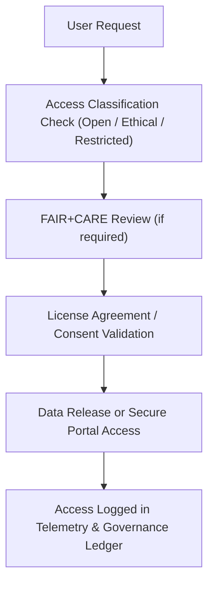

<div align="center">

# 🔓 **Kansas Frontier Matrix — Open Data Access & Licensing Policy**
`docs/data/governance/data-access-policy.md`

**Purpose:**  
Define the **data access, sharing, and licensing framework** for the **Kansas Frontier Matrix (KFM)** to guarantee **open, ethical, and equitable use** of public and community datasets, consistent with **FAIR+CARE**, **Open Knowledge Foundation**, and **Master Coder Protocol v6.3** standards.

[](../../README.md)
[](../../standards/faircare.md)
[](../../../LICENSE)
[](../../../releases/v10.0.0/manifest.zip)

</div>

---

## 📘 Overview

The **KFM Data Access Policy** ensures that all datasets, models, and outputs:
- Are **freely available** for research, education, and non-commercial innovation.  
- Respect **cultural consent** and **ethical provenance** in accordance with **FAIR+CARE**.  
- Include transparent licensing and attribution requirements.  
- Support reproducibility, interoperability, and responsible reuse.  

This policy applies to all **data repositories**, **ETL pipeline outputs**, and **AI-generated materials** managed by the Kansas Frontier Matrix.

---

## 🧭 Guiding Principles

| Principle | Description |
|---|---|
| **Open by Default** | All non-sensitive datasets are public, unless restricted for cultural, legal, or ethical reasons. |
| **Transparent Licensing** | Every dataset carries a clear SPDX or Creative Commons license. |
| **Ethical Stewardship** | Data containing personal or cultural information follows CARE-compliant consent and governance. |
| **Interoperability** | Formats must conform to open standards (GeoJSON, STAC, CSVW, DCAT). |
| **Attribution & Provenance** | Users must credit original data providers, including Indigenous and institutional sources. |
| **Accountability** | Misuse of data contrary to license or CARE principles may result in restricted access. |

---

## ⚙️ Access Tiers

KFM datasets are categorized into three access levels to balance openness and ethical responsibility.

| Tier | Access Level | Description | Example |
|---|---|---|---|
| 🟢 **Open Access** | Public | Freely available for any lawful purpose under open license. | NOAA climate, USGS topographic maps. |
| 🟠 **Ethical Access** | Controlled | Accessible upon request or agreement, respecting CARE protocols. | Tribal heritage datasets, oral histories. |
| 🔴 **Restricted Access** | Sensitive | Not publicly distributed; viewable only by authorized stewards. | Ceremonial or personal records. |

> ⚠️ **Indigenous and cultural datasets** are subject to additional governance by the **Indigenous Data Governance Board (IDGB)** and may require consent forms prior to access.

---

## 📜 Licensing Framework

| License Type | Scope | Use Case |
|---|---|---|
| **CC-BY 4.0** | Default license for open datasets and derived materials. | Historical maps, processed imagery, visualizations. |
| **CC0 1.0** | For public domain datasets where attribution is optional. | U.S. government open data. |
| **CC BY-NC 4.0** | Restricts commercial reuse. | Certain KHS archival materials. |
| **ODbL 1.0** | Applied to OpenStreetMap-derived vector data. | Geographic boundaries and trails. |
| **Proprietary / Cultural** | Reserved for tribal or restricted cultural data under CARE. | Indigenous archives, oral histories. |

Each dataset must include:
```json
"license": "CC-BY-4.0",
"provenance": {
  "source_url": "https://data.noaa.gov/",
  "creator": "NOAA",
  "consent": "Public Domain"
}
```

---

## 🧩 Ethical Access Control (FAIR+CARE)

The FAIR+CARE Council ensures responsible sharing aligned with CARE principles.

| CARE Principle | Implementation |
|---|---|
| **Collective Benefit** | Data serves community needs and public research priorities. |
| **Authority to Control** | Data subjects or custodians determine accessibility and usage terms. |
| **Responsibility** | FAIR+CARE Council monitors use and ensures appropriate attribution. |
| **Ethics** | Access governed by cultural respect and emotional safety review. |

Requests for restricted or Indigenous data must include:
1. Research purpose and expected benefit.  
2. Statement of adherence to CARE principles.  
3. Letter of support from associated tribal or cultural organization (if applicable).

---

## 🔍 Data Access Workflow



---

## 📊 Compliance & Monitoring

| Metric | Target | Verification |
|---|---|---|
| **License Coverage** | 100% of datasets include SPDX license. | `data-contract-validate.yml` |
| **Provenance Fields Present** | ≥ 95% | `data-provenance.yml` |
| **CARE Consent Metadata** | 100% for Indigenous datasets. | `faircare-audit.yml` |
| **Access Request Response Time** | ≤ 15 business days. | Governance Council Log |
| **Transparency Index** | ≥ 90% public access reporting. | Governance Dashboard |

---

## 🧠 Attribution Guidelines

Users must credit both **data originators** and **Kansas Frontier Matrix** using the following format:

> **Citation Template:**  
> Kansas Frontier Matrix (2025). *[Dataset Title]*. Version 10.0.0. FAIR+CARE Certified.  
> Source: [Original Organization Name] — Licensed under [License Type].  

Attribution must appear in all derived publications, applications, and datasets.

---

## 🧾 Violations & Enforcement

| Violation | Action | Resolution Body |
|---|---|---|
| Unauthorized redistribution of restricted data. | Access revoked; reported to Governance Board. | FAIR+CARE Council |
| Omission of required attribution. | Request for correction and republication. | Data Standards Committee |
| Breach of cultural consent. | Investigation and immediate data takedown. | Indigenous Data Governance Board |
| Noncompliance with MCP governance policies. | Re-audit and compliance remediation. | Governance Secretariat |

---

## 🧭 Transparency & Reporting

Public dashboards at `governance.kansasfrontiermatrix.org` provide:
- Dataset licensing summaries.  
- FAIR+CARE certification status.  
- Access request logs and approval rates.  
- Quarterly audit reports.  

Telemetry from `data/telemetry/dataset-stats.json` powers these dashboards automatically.

---

## 🕰️ Version History

| Version | Date | Author | Summary |
|---|---|---|---|
| v10.0.0 | 2025-11-10 | FAIR+CARE Governance Secretariat | Established comprehensive open data access and licensing policy with ethical consent tiers and CARE-aligned control mechanisms. |

---

<div align="center">

**© 2025 Kansas Frontier Matrix — CC-BY 4.0**  
Governed under **Master Coder Protocol v6.3** · Reviewed by **FAIR+CARE Council**  
[⬅ Back to Governance Index](README.md) · [Indigenous Data Protocol →](indigenous-data-protocol.md)

</div>