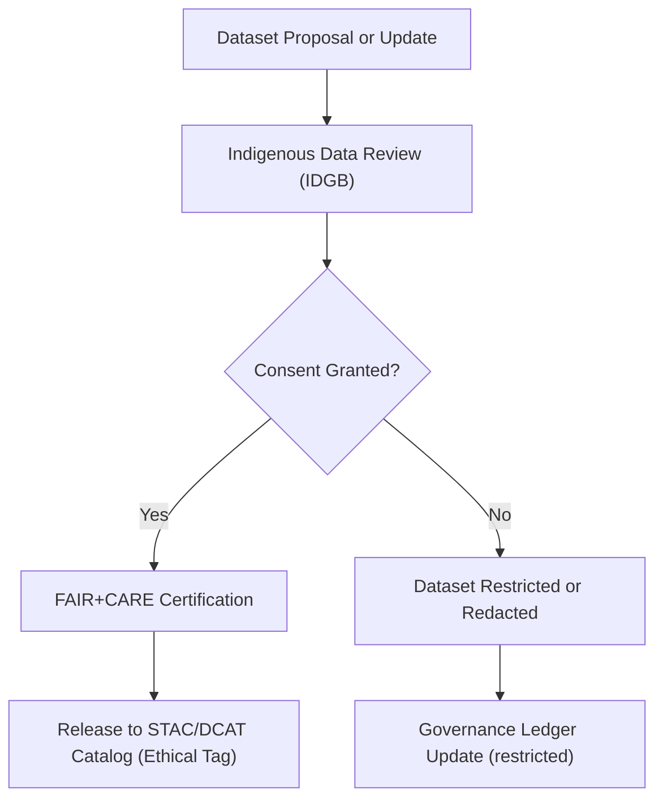

<div align="center">

# 🪶 **Kansas Frontier Matrix — Indigenous Data Governance & Consent Protocol**
`docs/data/governance/indigenous-data-protocol.md`

**Purpose:**  
Outline the **Indigenous Data Governance and Consent Protocol** of the **Kansas Frontier Matrix (KFM)** — ensuring cultural sovereignty, ethical collaboration, and stewardship of Indigenous knowledge and heritage data under the **FAIR+CARE** and **OCAP™ (Ownership, Control, Access, Possession)** principles.

[](../../README.md)
[](../../standards/faircare.md)
[](../../../LICENSE)
[](../../../releases/v10.0.0/manifest.zip)

</div>

---

## 📘 Overview

The **Indigenous Data Governance Protocol** ensures that all Indigenous-related datasets within KFM are managed according to **tribal sovereignty**, **cultural respect**, and **informed consent**.  
This protocol formalizes how Indigenous communities guide data use, access, and visibility, reinforcing their **rights of ownership, control, and benefit** over any data derived from their heritage, lands, or knowledge.

It is jointly maintained by:
- The **Indigenous Data Governance Board (IDGB)**  
- The **FAIR+CARE Council**  
- The **Kansas Frontier Matrix Governance Secretariat**

---

## 🧭 Guiding Principles

| Framework | Description |
|---|---|
| **OCAP™** | Indigenous communities have the right to Own, Control, Access, and Possess their data. |
| **CARE Principles** | Embeds Collective Benefit, Authority to Control, Responsibility, and Ethics into all Indigenous datasets. |
| **FAIR Principles** | Ensures findability, accessibility, and reusability while respecting cultural sensitivity. |
| **UNDRIP (Articles 18–31)** | Upholds Indigenous peoples’ rights to maintain and protect cultural and intellectual heritage. |

---

## ⚙️ Data Classification Levels

| Level | Description | Example | Access Policy |
|---|---|---|---|
| **Level 1 — Open Cultural Data** | Data cleared for public educational use with tribal approval. | Traditional ecological knowledge summaries, cultural geography layers. | Open Access (with attribution) |
| **Level 2 — Controlled Access Data** | Requires explicit tribal or board approval per request. | Heritage site polygons, oral history transcripts. | Ethical Access (Request Form + Review) |
| **Level 3 — Sensitive / Restricted Data** | Culturally sacred or ceremonial data. | Ceremonial objects, burial sites, spiritual practices. | Restricted — Not shared publicly |

All Indigenous data within KFM metadata includes a **CARE consent flag**:

```json
"careConsent": {
  "authority": "Kaw Nation",
  "status": "approved",
  "access_level": "controlled",
  "last_reviewed": "2025-09-01"
}
```

---

## ⚖️ Indigenous Governance Workflow



- **Consent Review:** IDGB reviews provenance, purpose, and representation.  
- **Approval:** Only datasets with formal approval progress to publication.  
- **Restriction:** Sensitive datasets remain in secure repositories, not publicly indexed.  
- **Transparency:** Every decision is recorded in the Governance Ledger.  

---

## 🧩 Consent & Attribution Requirements

All datasets referencing Indigenous communities must include:

| Field | Description | Example |
|---|---|---|
| `community_name` | Full tribal or nation name. | `"Osage Nation"` |
| `consent_status` | Approval or restriction flag. | `"approved"`, `"restricted"` |
| `consent_document` | Link or hash of signed consent agreement. | `"docs/data/governance/consent_forms/Osage_2025.pdf"` |
| `review_date` | Last review timestamp. | `"2025-10-15"` |
| `review_authority` | Governing body granting consent. | `"Indigenous Data Governance Board"` |
| `ethical_scope` | Scope of approved use. | `"Educational and non-commercial use only."` |

All consent metadata must be **machine-readable** and stored in JSON-LD to enable automated verification.

---

## 🧠 Indigenous Representation in Metadata

To prevent erasure or misrepresentation, all datasets linked to Indigenous peoples must:
1. **Acknowledge communities** explicitly in metadata (`community_name` field).  
2. **Avoid generic labels** (“Native American”, “Tribal group”) in favor of precise tribal identifiers.  
3. **Use tribally approved place names** when available.  
4. **Include community-sourced narratives** when describing historical or cultural events.  
5. **Provide Indigenous language equivalents** in metadata when supplied by the community.  

---

## 📜 Data Sharing Agreements

All collaborative projects involving Indigenous data must use a formal **Data Sharing Agreement (DSA)** template stored under `docs/data/governance/agreements/`.

Each DSA includes:
- Project scope and data use case.  
- Rights of attribution and withdrawal.  
- Cultural sensitivity and review requirements.  
- FAIR+CARE audit checkpoints.  
- Termination clause upon breach or non-compliance.  

A summary JSON-LD record of each DSA is appended to the Governance Ledger for transparency.

---

## 🧾 Cultural Sensitivity Checklist

Before publication, each dataset undergoes an Indigenous Data Review using this checklist:

| Criterion | Requirement | Status |
|---|---|---|
| **Cultural Consent Verified** | Formal consent recorded from appropriate authority. |  |
| **Community Attribution** | Community name, language, and review board listed. |  |
| **Sensitive Content Screening** | Removal or masking of sacred, ceremonial, or restricted elements. |  |
| **Ethical Use Statement** | Dataset description contains CARE-compliant intent statement. |  |
| **Indigenous Language Support** | Metadata includes translations or labels when provided. |  |

---

## 🌍 Integration with FAIR+CARE & Governance Systems

| Integration | Description | Artifact |
|---|---|---|
| **FAIR+CARE Council Review** | Independent verification of CARE flags and consent documents. | `faircare-audit.yml` |
| **Governance Ledger Update** | Immutable log entry of consent approvals and restrictions. | `review-council-minutes.md` |
| **STAC/DCAT Publication Filter** | Automatically excludes restricted datasets from public catalogs. | STAC API / manifest.zip |
| **Telemetry Tracking** | Consent status tracked in `data/telemetry/dataset-stats.json`. | Continuous Monitoring |

---

## ⚙️ Enforcement & Accountability

Violations of this protocol—such as unauthorized use, redistribution, or misattribution—trigger:
1. Immediate **revocation of dataset access**.  
2. Council-led **investigation and remediation**.  
3. Required public statement and update in `review-council-minutes.md`.  
4. Permanent notation in the Governance Ledger.  

Repeated non-compliance may result in suspension of contributor privileges under MCP governance.

---

## 🕊️ Collaborative Principles

The Indigenous Data Governance Board commits to:
- Continuous dialogue with tribal representatives and cultural stewards.  
- Shared authorship on datasets involving Indigenous knowledge.  
- Education and outreach promoting ethical data science practices.  
- Prioritization of community benefit over institutional gain.  

---

## 🕰️ Version History

| Version | Date | Author | Summary |
|---|---|---|---|
| v10.0.0 | 2025-11-10 | Indigenous Data Governance Board & FAIR+CARE Council | Established Indigenous Data Governance Protocol ensuring cultural sovereignty, CARE compliance, and machine-readable consent metadata for all Indigenous datasets. |

---

<div align="center">

**© 2025 Kansas Frontier Matrix — CC-BY 4.0**  
Governed under **Master Coder Protocol v6.3** · Verified by **Indigenous Data Governance Board** and **FAIR+CARE Council**  
[⬅ Back to Governance Index](README.md) · [Council Charter →](council-charter.md)

</div>