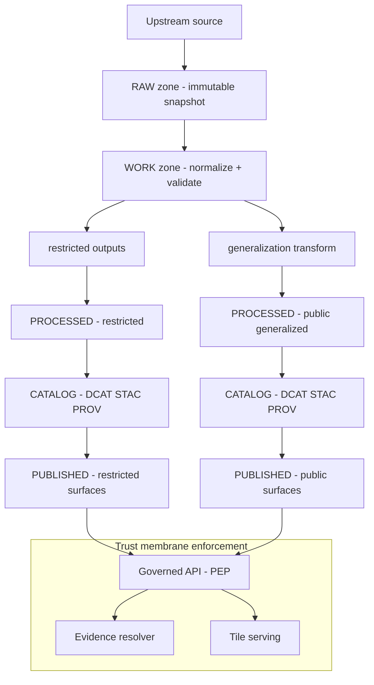

<!-- [KFM_META_BLOCK_V2]
doc_id: kfm://doc/0f5d7c2a-71a2-4b0a-8d5f-2e2c86d2a4f6
title: Redaction and Generalization Governance
type: standard
version: v1
status: draft
owners: kfm-governance-stewards
created: 2026-03-01
updated: 2026-03-01
policy_label: public
related:
  - kfm://doc/<TODO-policy-labels-doc-id>
  - kfm://doc/<TODO-evidence-resolver-contract-doc-id>
  - kfm://doc/<TODO-promotion-contract-doc-id>
tags: [kfm, governance, redaction, generalization, policy, sensitive-location, pii]
notes:
  - Encodes default-deny posture and redaction/generalization obligations for datasets, stories, and Focus Mode.
  - Path references are TODO until repo tree is verified.
[/KFM_META_BLOCK_V2] -->

# Redaction and Generalization Governance
**Purpose:** Define how KFM **suppresses, redacts, and generalizes** data to prevent sensitive leakage while preserving evidence-first usability.


---

## Quick navigation
- [Scope](#scope)
- [Definitions](#definitions)
- [Policy labels and obligations](#policy-labels-and-obligations)
- [Default rules](#default-rules)
- [Redaction workflow](#redaction-workflow)
- [Redaction patterns](#redaction-patterns)
- [Where enforcement happens](#where-enforcement-happens)
- [CI gates and tests](#ci-gates-and-tests)
- [Review triggers](#review-triggers)
- [Templates](#templates)
- [Appendix](#appendix)

---

> [!WARNING]
> **Fail closed.** If sensitivity is unclear, treat the asset as **restricted** and require stewardship review before any publishable output is produced.

> [!NOTE]
> KFM policy decisions must be enforced **server-side** (trust membrane). The UI may *display* policy labels and notices, but must not be the decision-maker.

---

## Scope

This document governs redaction/generalization for:
- **Datasets and dataset versions** (RAW → WORK → PROCESSED → CATALOG → PUBLISHED)
- **Artifacts** (tables, tiles, rasters, vectors, media)
- **Catalog surfaces** (DCAT/STAC/PROV)
- **Evidence bundles** (EvidenceRef → EvidenceBundle)
- **Story Nodes** (published narrative artifacts)
- **Focus Mode** outputs (answers must cite-or-abstain)

### Where this doc lives in the repo
- **Path:** `docs/data/governance/redaction.md`
- **Fits under:** `docs/` governance standards for the data lifecycle and trust membrane.

### Acceptable inputs
- Governance rules, rubrics, and checklists
- “How to classify” guidance for sensitive location / PII / rights risk
- Redaction/generalization “recipes” (parameterized transforms)
- CI test expectations and required invariants

### Exclusions
- **Do not** embed restricted coordinates or examples that could reveal sensitive sites.
- **Do not** document secrets, credentials, or privileged endpoints.
- **Do not** prescribe UI copy for a specific product release (keep UI text in UI-owned docs).

---

## Definitions

**Redaction**  
Removing or suppressing data elements so they are not exposed (e.g., dropping fields, nulling values, suppressing records).

**Generalization**  
Transforming data to a safer representation (e.g., aggregating, coarsening geometry/time, snapping to grid, dissolving boundaries).

**Obligation**  
A policy-required action that must be executed and/or communicated (e.g., *generalize geometry*, *suppress export*, *show notice*).

**Sensitive location**  
Any location whose precise disclosure could cause harm (e.g., heritage sites, vulnerable species, restricted partner inventories).

**PII / re-identification risk**  
Any attribute combination that can identify or strongly infer a living person (directly or via linkage).

**Ghost metadata**  
Policy-unsafe hints that reveal restricted existence (e.g., different error messages/timing for “exists but forbidden” vs “does not exist”).

---

## Policy labels and obligations

### Policy labels (starter vocabulary)
Policy labels apply to datasets, artifacts, Story Nodes, and responses. Starter list (expand via controlled vocab governance):

- `public`
- `public_generalized`
- `restricted`
- `restricted_sensitive_location`
- `internal`
- `embargoed`
- `quarantine`

> [!TIP]
> Treat `public_generalized` as a **separate dataset version** (or separate distribution) rather than “a view” on restricted data. This prevents accidental leakage via caching/exports.

### Obligation types (common)
Obligations must be **machine-readable** (policy engine output) and **auditable** (stored in receipts/PROV).

| Obligation type | Meaning | Typical use |
|---|---|---|
| `show_notice` | Display a user-visible notice | `public_generalized` layers/stories |
| `generalize_geometry` | Coarsen/snap/dissolve geometry | sensitive locations |
| `suppress_export` | Prevent downloads/exports | restricted assets |
| `suppress_fields` | Drop/blank specific fields | PII mitigation |
| `aggregate_with_threshold` | Aggregate with minimum count threshold | re-identification risk datasets |
| `coarsen_time` | Reduce timestamp precision | sensitive events |
| `metadata_only` | Allow catalog listing but no mirroring | rights constrained sources |

---

## Default rules

### 1) Default deny for sensitive/restricted
- If `policy_label` is `restricted` or `restricted_sensitive_location`, **deny public access** by default.
- If any public representation is allowed, create **`public_generalized`** outputs that are safe-by-construction.

### 2) Never leak restricted existence
- Errors and empty results must be shaped to avoid “ghost metadata.”
- Align 403/404 behavior with policy (policy-safe error model; avoid “exists but forbidden” side channels).

### 3) No precise coordinates in publishable narratives unless explicitly allowed
- Story Nodes and Focus Mode outputs must not reveal precise coordinates unless policy explicitly allows it.
- Prefer coarse geography descriptions (county/region) and generalized geometry.

### 4) Treat redaction/generalization as a first-class transform
- Redaction/generalization is **not** an ad-hoc UI filter.
- It is a pipeline transform recorded in provenance (PROV), with parameters and digests.

---

## Redaction workflow



### Minimum required artifacts per redaction decision
1. **Classification decision** (policy label)
2. **Redaction/generalization recipe** (parameters)
3. **Obligation list** (machine-readable)
4. **Provenance record** (PROV activity + inputs/outputs by digest)
5. **Tests** that fail closed (CI + runtime regression tests)

---

## Redaction patterns

### A) Geometry (sensitive location protection)
Use one or more of:
- **Remove** point geometries entirely from public surfaces.
- **Snap to grid** (coarser resolution), then **dissolve** (remove unique patterns).
- **Aggregate** to safe geographies (county/tract bins) where appropriate.
- **Limit detail by zoom** (serve generalized tiles below a safe zoom threshold).
- **Replace** with bounding region (coarse bbox/polygon) only when safe.

**Must-nots**
- Do not keep precise points “hidden” in attributes (e.g., `lat`, `lon`, `wkt`, `geom_wkb`).
- Do not allow public tiles to be reverse engineered into restricted geometry.
- Do not expose restricted bboxes in public tile metadata.

### B) Attributes (PII and sensitive fields)
- Maintain an explicit **denylist** of fields to suppress on public outputs.
- Prefer **aggregation** or **bucketing** over masking when linkage risk remains.
- If pseudonymization is required, ensure it is **non-reversible** and does not permit joins to public identifiers.

### C) Aggregation thresholds (re-identification mitigation)
For datasets with re-identification risk:
- Do not publish individual-level records publicly.
- Aggregate to safe geographies and apply minimum count thresholds.
- Record thresholds as obligations (auditable parameters).
- Keep raw data restricted even if aggregated outputs are public.

### D) Temporal coarsening
- Reduce timestamp precision (day/month/year bins) where event-level time would increase harm.
- Use “valid time windows” rather than instants when appropriate.

### E) Evidence and narrative surfaces
- Evidence bundles must be policy-filtered and may return *abstention* instead of unsafe detail.
- Story Nodes:
  - Must carry `policy_label` and `review_state`.
  - Must not embed restricted coordinates.
- Focus Mode:
  - Must cite-or-abstain.
  - Must produce policy-safe explanations and safe alternatives (broaden scope, use public datasets).

### F) Audit logs and run receipts
Audit records are critical—but can themselves leak sensitive info:
- Apply log redaction (PII + restricted info)
- Restrict log access to appropriate roles
- Define retention/deletion policy and enforce it

---

## Where enforcement happens

### CI enforcement (policy-as-code)
- Policy fixtures define allow/deny and obligations.
- CI must run policy tests and **block merges** on regressions.
- CI should include “no restricted leakage” tests for public artifacts (tiles, exports, docs).

### Runtime enforcement
- **Governed API** applies policy decisions and redactions consistently.
- **Evidence Resolver** resolves citations and returns policy-filtered evidence bundles.
- **Tile serving** must not bypass policy (no direct static hosting of restricted tiles unless gated).

### UI responsibilities
- Display policy badges, notices, and abstention explanations.
- Never act as the policy decision point.

---

## CI gates and tests

### Required test categories (minimum)
- [ ] Policy tests (fixtures): allow/deny + obligations
- [ ] Contract tests: API returns policy-safe error shape
- [ ] Integration tests: evidence resolution does not leak restricted metadata
- [ ] Static checks: public artifacts contain no restricted coordinate fields
- [ ] Tile tests: no restricted bbox leakage for public tiles; zoom-based generalization enforced

---

## Review triggers

Escalate to stewardship and/or governance council review when:
- Any dataset includes **sensitive locations** or partner-controlled inventories
- Any dataset includes **PII** or plausible re-identification via linkage
- Any story references **Indigenous histories** or culturally restricted materials
- Rights/licensing is unclear for any mirrored media or distributions
- A new redaction “recipe” is introduced (new transform class or new parameter surface)

---

## Templates

### 1) Redaction recipe (YAML sketch)
```yaml
redaction_recipe:
  recipe_id: "kfm://redaction/<uuid>"
  version: "v1"
  applies_to:
    dataset_id: "kfm://dataset/<uuid>"
    dataset_version_id: "kfm://dataset-version/<uuid>"
  outputs:
    - policy_label: "restricted_sensitive_location"
      distributions: ["pmtiles", "geoparquet"]
    - policy_label: "public_generalized"
      distributions: ["pmtiles", "geojson"]
  steps:
    - type: "suppress_fields"
      params:
        fields: ["lat", "lon", "wkt", "site_id_external"]
    - type: "generalize_geometry"
      params:
        method: "snap_to_grid_and_dissolve"
        grid_size_m: 1000
        min_zoom: 0
        max_zoom: 10
    - type: "aggregate_with_threshold"
      params:
        geography: "county"
        min_count: 10
  obligations:
    - type: "show_notice"
      message: "Geometry generalized due to policy."
    - type: "suppress_export"
      applies_to: ["restricted_sensitive_location"]
```

### 2) Policy obligation output (JSON sketch)
```json
{
  "decision": "allow",
  "policy_label": "public_generalized",
  "obligations": [
    { "type": "show_notice", "message": "Geometry generalized due to policy." }
  ]
}
```

---

## Appendix

<details>
<summary>Appendix A — Example policy test intent (illustrative)</summary>

```rego
# PSEUDO: illustrate intent, not a final policy pack.

package kfm.authz_test

test_public_can_read_public {
  allow with input as {
    "user": {"role": "public"},
    "action": "read",
    "resource": {"policy_label": "public"}
  }
}

test_public_cannot_read_restricted {
  not allow with input as {
    "user": {"role": "public"},
    "action": "read",
    "resource": {"policy_label": "restricted"}
  }
}
```
</details>

<details>
<summary>Appendix B — “No ghost metadata” UI behavior (policy-safe)</summary>

- Show: “Restricted evidence not available to your role.”
- Suggest: safe alternatives (broader time range; public datasets; coarse geography).
- Provide: `audit_ref` so a steward can review access decisions.

</details>

---

_This document is a governed artifact: changes should be reviewed by owners and accompanied by policy fixture/test updates._
