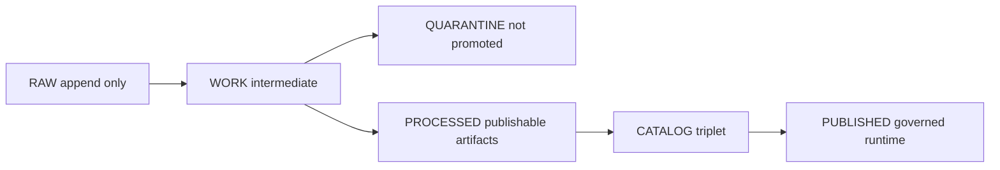

<!-- [KFM_META_BLOCK_V2]
doc_id: kfm://doc/9b7e4c2e-1f5a-4c9d-8a22-3d4f1d2d1b6a
title: Data Promotion
type: standard
version: v1
status: draft
owners: KFM Maintainers (TODO: set real owners)
created: 2026-03-01
updated: 2026-03-01
policy_label: public
related:
  - docs/data/README.md (TODO: confirm path)
  - docs/governance/safety_checks.md (TODO: confirm path)
  - docs/architecture/ (TODO: link to trust membrane / PEP)
tags: [kfm, data, promotion, governance, provenance, ci-gates]
notes:
  - Defines Promotion Contract v1 (minimum gates) and expected artifacts for RAW→PUBLISHED.
  - Treat changes here as governed (update tests, policy pack, fixtures).
[/KFM_META_BLOCK_V2] -->

# Data Promotion
Fail-closed, evidence-bound promotion of dataset versions from **RAW → PUBLISHED**.


**Who this is for:** data engineers, data stewards, reviewers, CI maintainers  
**Primary promise:** *no promoted dataset version without reproducible artifacts + validated catalogs + run receipts + policy decisions.*

---

## Quick navigation
- [What lives here](#what-lives-here)
- [Truth path and zones](#truth-path-and-zones)
- [Promotion Contract v1](#promotion-contract-v1)
- [Promotion workflow](#promotion-workflow)
- [Definition of Done](#definition-of-done)
- [PR checklist](#pr-checklist)
- [Templates](#templates)
- [Governance and safety](#governance-and-safety)
- [Change management](#change-management)
- [Glossary](#glossary)

---

## What lives here
This directory documents the **rules and artifacts** that control whether a dataset version can be served by governed runtime surfaces.

### Fits in the repo
- **docs/** = canonical governed documentation
- **data/** = lifecycle zones + catalogs + provenance artifacts
- **.github/**, **tools/**, **policy/** = enforcement mechanisms (CI gates)

### Acceptable inputs
- Promotion gate definitions (human-readable contract + machine-readable checklists)
- PR checklists and reviewer guidance
- Templates (promotion manifest, run receipt schema pointers, example PR bodies)
- Links to validator tooling and policy packs (OPA/Rego, schema validators)

### Exclusions (do not put here)
- Raw datasets or binary artifacts (those belong in **data/** / object storage)
- One-off run logs that are not part of a governed receipt/audit pattern
- “Soft guidance” that contradicts fail-closed policy (promotion must be enforceable)

### Directory layout (proposed minimal)
> TODO: Adjust to match your repo’s actual structure.
- `docs/data/promotion/README.md` — this contract and workflow
- `docs/data/promotion/checklists/` — PR + steward checklists
- `docs/data/promotion/templates/` — promotion manifest + receipt examples
- `docs/data/promotion/adr/` — decisions that change the contract (optional)

---

## Truth path and zones
Promotion is a **lifecycle** plus a **proof obligation**.



### Zone rules at a glance
| Zone | What it contains | Mutability | Promotion eligibility |
|---|---|---:|---:|
| RAW | source snapshots + manifests + checksums | append-only | ✅ (as lineage inputs) |
| WORK | normalized intermediates + QA reports + candidate redactions | mutable | ✅ (only as lineage inputs) |
| QUARANTINE | failed validation, unclear license, sensitivity concerns | mutable | ❌ never promoted |
| PROCESSED | publishable artifacts + checksums + runtime metadata | immutable by digest | ✅ required |
| CATALOG triplet | DCAT + STAC + PROV (cross-linked) | immutable per version | ✅ required |
| PUBLISHED | governed API/UI surfaces | governed | ✅ only after all gates |

**WARNING:** Anything in **QUARANTINE** is *not promotable*. Treat QUARANTINE as a safety valve, not a backlog.

---

## Promotion Contract v1
A dataset version promotion **MUST be blocked** unless all required artifacts exist and validate.

### Minimum gates
| Gate | Name | What CI must fail on | Evidence artifacts (minimum) |
|---|---|---|---|
| A | Identity and versioning | unstable dataset IDs; mutable version IDs | stable `dataset_slug`; immutable `dataset_version_id`; `spec_hash` |
| B | Licensing and rights metadata | missing/unclear license; missing rights holder | license field, rights holder, attribution text |
| C | Sensitivity + redaction plan | missing `policy_label`; no redaction obligations for sensitive layers | `policy_label`; redaction/generalization plan recorded in PROV |
| D | Catalog triplet validation | invalid schemas; missing cross-links | DCAT JSON-LD; STAC Collection/Items; PROV JSON-LD bundle; link-check pass |
| E | Run receipts + checksums | missing receipts; missing checksums; missing env capture | run receipt(s) per producing run; inputs/outputs w/ digests; container digest |
| F | Policy + contract tests | policy deny; schema/contract failures; evidence refs not resolvable | OPA/Rego conftest results; contract tests; evidence resolver fixture pass |
| G | Optional but recommended | supply-chain gaps; perf/ux regressions | SBOM; build provenance; perf smoke; a11y smoke |

---

## Promotion workflow
A practical promotion flow is **PR-based**: promotion intent, evidence, and governance review happen in a single, auditable place.

### 1) Acquire (RAW)
- Snapshot source bytes into RAW (append-only)
- Emit manifest + checksums
- Capture license at ingest (fail closed if unknown)

### 2) Normalize + QA (WORK)
- Transform deterministically (no mutation of inputs)
- Produce QA reports (schema, spatial checks, completeness, constraints)
- Draft redaction/generalization outputs if needed

### 3) Block unsafe/unclear (QUARANTINE)
- Route datasets with:
  - unclear licensing
  - failed validation
  - sensitivity concerns without a plan
  - unreproducible upstream instability

### 4) Publish artifacts (PROCESSED)
- Write publishable formats (GeoParquet, COG, PMTiles, etc.)
- Compute checksums for every processed artifact
- Emit runtime-derived metadata (bbox, temporal range, counts)

### 5) Generate catalogs (TRIPLET)
- DCAT for dataset-level metadata (license, publisher, distributions)
- STAC for asset-level metadata (collections, items, assets)
- PROV for lineage (entities, activities, agents; used/generated)
- Ensure cross-links are present and resolvable

### 6) Emit run receipts + attestations
- A run receipt is emitted for each ingestion/transform run
- Include digests + (optional) cosign signature/attestation refs

### 7) Open a promotion PR (governed)
- Attach evidence (gate reports, provenance, signatures)
- Include a rollback tag / rollback procedure reference
- Merge is blocked until all gates are green and approvals are recorded

---

## Definition of Done
A dataset integration ticket is **DONE** only when:

- [ ] Registry entry updated (owner, license, policy_label, cadence, contact)
- [ ] RAW acquisition artifacts are immutable w/ manifest + checksums
- [ ] Processed artifacts exist w/ digests + predictable paths
- [ ] DCAT + STAC + PROV validate and are cross-linked (link checks succeed)
- [ ] Policy decisions recorded; default-deny tests pass; generalized derivatives created if needed
- [ ] Evidence resolver resolves representative EvidenceRefs into EvidenceBundles
- [ ] UI smoke tests pass (evidence drawer resolves; restricted layers denied/generalized)
- [ ] Audit artifacts exist (run receipt emitted; audit ledger append; access controls verified)

---

## PR checklist
Copy/paste checklist for promotion PR reviewers:

- [ ] `dcat:identifier[]` includes DOI + provider keys
- [ ] `stac:collection.id` stable; `properties.ids.canonical[]` present
- [ ] License + rights holder mapped; `care.*` and sensitivity captured
- [ ] Bulk ingestion used (no ad-hoc scrapes where prohibited)
- [ ] `prov:run_receipt` written with digests + (optional) cosign refs
- [ ] CI passes: schema, receipts, rights gates
- [ ] Focus Mode citations show dataset DOI + provider keys

---

## Templates

### Promotion manifest template (v1)
> Store alongside the promoted dataset version (or in a releases/ manifest folder), and reference it from DCAT/PROV.

```json
{
  "kfm_promotion_manifest_version": "v1",
  "dataset_slug": "noaa_ncei_storm_events",
  "dataset_version_id": "2026-02.abcd1234",
  "spec_hash": "sha256:abcd1234.",
  "released_at": "2026-02-20T13:00:00Z",
  "artifacts": [
    { "path": "events.parquet", "digest": "sha256:2222.", "media_type": "application/x-parquet" },
    { "path": "events.pmtiles", "digest": "sha256:3333.", "media_type": "application/vnd.pmtiles" }
  ],
  "catalogs": [
    { "path": "dcat.jsonld", "digest": "sha256:4444." },
    { "path": "stac/collection.json", "digest": "sha256:5555." },
    { "path": "prov/bundle.jsonld", "digest": "sha256:6666." }
  ],
  "qa": { "status": "pass", "report_digest": "sha256:7777." },
  "policy": { "policy_label": "public", "decision_id": "kfm://policy_decision/xyz" },
  "approvals": [
    { "role": "steward", "principal": "<id>", "approved_at": "2026-02-20T12:59:00Z" }
  ]
}
```

<details>
<summary>Minimal run receipt schema (starter)</summary>

```json
{
  "$schema": "https://json-schema.org/draft/2020-12/schema",
  "title": "prov:run_receipt (KFM minimal)",
  "type": "object",
  "required": ["@type", "spec_hash", "fetched_at", "accessURL", "artifact_digest"],
  "properties": {
    "@type": { "const": "prov:run_receipt" },
    "spec_hash": { "type": "string", "pattern": "^sha256[:\\-][0-9a-fA-F]{8,}$" },
    "fetched_at": { "type": "string", "format": "date-time" },
    "accessURL": { "type": "string", "format": "uri" },
    "etag": { "type": "string" },
    "last_modified": { "type": "string" },
    "artifact_digest": { "type": "string", "pattern": "^sha256[:\\-][0-9a-fA-F]{8,}$" },
    "fallback_used": { "type": "boolean" },
    "cosign": {
      "type": "object",
      "properties": {
        "signature_ref": { "type": "string" },
        "attestation_ref": { "type": "string" }
      }
    }
  }
}
```

</details>

---

## Governance and safety
Promotion is a **trust membrane** concern, not just a data concern.

### Non-negotiable safety invariants
- Frontend must **not** fetch directly from storage/DB
- Backends must not bypass repository/policy interfaces
- Restricted datasets must not be inferable via errors or timing
- Exports must include license + attribution automatically
- Story publishing must block if rights/citations are unclear

**TIP:** Treat governance checks as *data transformations* that must also have receipts and tests.

---

## Change management
Treat changes to promotion rules as governed, reversible increments.

When you change this contract:
1) Update schemas/templates (manifest, receipts, catalogs profiles)  
2) Update policy pack rules (OPA/Rego) and add/adjust fixtures  
3) Update validators + link-checkers  
4) Add an ADR if the change is material (new gate, new required field, policy label taxonomy change)  
5) Ensure CI fails on invalid examples (prove fail-closed behavior)

Minimum verification steps (starter):
- confirm real repo layout + CI workflows
- extract the actual list of merge-blocking gates
- run one pilot dataset through all gates end-to-end

---

## Glossary
- **dataset_slug**: stable dataset identifier (human-friendly)
- **dataset_version_id**: immutable version identity for a specific release
- **spec_hash**: deterministic hash over canonicalized spec inputs that define a version
- **policy_label**: access + sensitivity classification (e.g., public, restricted)
- **run_receipt**: smallest evidence object binding artifacts to a run (digests + env + source hints)
- **triplet**: DCAT + STAC + PROV (metadata + assets + lineage) as the runtime contract surface

---

<sub><a href="#data-promotion">Back to top</a></sub>
