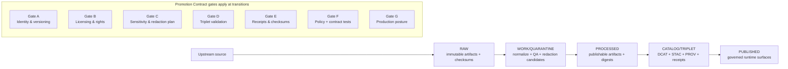

<!-- [KFM_META_BLOCK_V2]
doc_id: kfm://doc/7f0bb6b8-2f6e-4b2c-9a7b-2f3dd3a5a0a8
title: Promotion Checklists
type: standard
version: v1
status: draft
owners: Data Stewardship; Platform Engineering
created: 2026-03-01
updated: 2026-03-01
policy_label: public
related:
  - docs/data/promotion/README.md
  - docs/data/registry/README.md
  - docs/policy/README.md
  - docs/catalog/README.md
tags: [kfm, data, promotion, governance, checklists]
notes:
  - This directory is the human-facing companion to CI fail-closed promotion gates.
  - Update related links once repo paths are confirmed.
[/KFM_META_BLOCK_V2] -->

# Promotion Checklists
> Fail-closed, evidence-first checklists for moving **dataset versions** along the KFM Truth Path: **RAW → WORK/QUARANTINE → PROCESSED → CATALOG/TRIPLET → PUBLISHED**.


**Owners:** Data Stewardship + Platform Engineering  
**Design stance:** correctness-first • safety-first • testable gates • reversible releases

---

## Quick navigation
- [Purpose](#purpose)
- [Where this fits](#where-this-fits)
- [Directory contract](#directory-contract)
- [How to use these checklists](#how-to-use-these-checklists)
- [Promotion Contract gates](#promotion-contract-gates)
- [Checklist registry](#checklist-registry)
- [PR template](#pr-template)
- [Troubleshooting](#troubleshooting)
- [Appendix](#appendix)

---

## Purpose
This directory exists to make promotion **repeatable**, **auditable**, and **reviewable**:

- Provide **human-readable checklists** that mirror CI “fail closed” promotion gates.
- Ensure every published dataset version is traceable to:
  - versioned inputs,
  - validated catalogs (DCAT/STAC/PROV),
  - receipts + checksums,
  - policy decisions + redactions/generalizations.
- Standardize what reviewers look for during steward sign-off (after CI passes).

> [!WARNING]
> **If licensing is unclear or sensitivity handling is unresolved, promotion must stop.** Quarantine is the correct outcome.

---

## Where this fits
Promotion checklists sit on the boundary between **data production** (pipelines) and **data use** (APIs/UI).



> [!NOTE]
> Promotion is not a “copy” operation. It is a **governed event** that produces durable artifacts (digests, catalogs, receipts, manifests) and enables safe downstream serving.

---

## Directory contract

### What belongs here
| Type | Examples | Why |
|---|---|---|
| Gate checklists | `gate-a-identity.md`, `gate-d-triplet.md` | Make review repeatable; align human review with CI gates |
| Templates | PR checklist template, steward sign-off checklist | Reduce reviewer variance |
| Runbooks | “How to quarantine”, “How to fix broken EvidenceRefs” | Shorten time-to-recovery |
| Minimal standards | acceptance criteria, DoD alignment notes | Keep gates testable |

### What must **not** go here
- **No data artifacts** (raw/processed files, tiles, extracted tables)
- **No secrets** (tokens, credentials, private endpoints)
- **No one-off exceptions** without an ADR/policy decision reference elsewhere

---

## How to use these checklists

### In a PR that promotes or updates a dataset version
1. Pick the dataset version you intend to promote (the unit of review).
2. Generate or update required artifacts (registry entry/spec, processed outputs, catalogs, receipts).
3. Fill out the [PR template](#pr-template) (copy/paste).
4. Ensure CI gates pass (fail-closed).
5. Steward review: confirm checklist items + rationale for any risk decisions.
6. Merge → promotion is recorded (release manifest) and becomes eligible for serving.

### In recurring refreshes (watchers / scheduled ingest)
Use the same checklists. The difference is only *who triggers* the run.

> [!TIP]
> Treat “promotion checklists” as **contracts**: if something can’t be verified mechanically, add the missing artifact/schema/test so it can.

---

## Promotion Contract gates
The table below is the **index** of required gates. Detailed checklists live in the linked gate files.

| Gate | Outcome | Required evidence (minimum) | CI automation expectation |
|---|---|---|---|
| **A — Identity & versioning** | Stable IDs; no silent drift | `dataset_id`, `dataset_version_id`, deterministic `spec_hash`, content digests | Schema validation; golden `spec_hash`; digest verification |
| **B — Licensing & rights** | No rights violations | explicit license/rights + snapshot of upstream terms | Fail if missing/unknown; store terms snapshot |
| **C — Sensitivity & redaction plan** | No harmful leakage | `policy_label` + obligations (generalize/remove fields) when needed | OPA tests + obligation enforcement checks |
| **D — Catalog triplet validation** | Deterministic discovery + citations | DCAT + STAC + PROV validate + cross-link; EvidenceRefs resolve | Validators + link-checker; fail on broken/missing IDs |
| **E — Receipts & checksums** | Reproducible lineage | run receipts per producing run + checksums for inputs/outputs | Receipt schema validation; digest completeness checks |
| **F — Policy + contract tests** | Trust membrane holds | policy tests pass; evidence resolve works in CI; API contracts valid | OPA + contract tests; evidence resolver “smoke resolve” |
| **G — Production posture (recommended)** | Stronger supply chain & UX safety | SBOM/attestations; perf + a11y smoke checks | Optional gates that become required for prod |

---

## Checklist registry
> Update this list to match real filenames once the repo tree is confirmed.

| File | Scope | When to use |
|---|---|---|
| `gate-a-identity.md` | IDs, spec hashing, digests | Every dataset version |
| `gate-b-rights.md` | license, rights, attribution, terms snapshot | Every dataset version |
| `gate-c-sensitivity.md` | policy labels, obligations, redaction/generalization plan | When any harm risk exists (incl. “public but risky”) |
| `gate-d-triplet.md` | DCAT/STAC/PROV validation + cross-links | Every dataset version |
| `gate-e-receipts.md` | run receipts, checksums, environment capture | Every producing run |
| `gate-f-policy-contract.md` | OPA tests, evidence resolver + API/schema contract tests | Every dataset version |
| `gate-g-production.md` | SBOM, attestations, perf/a11y smoke checks | Prod posture / release hardening |
| `dod-dataset-integration.md` | Definition of Done alignment | Onboarding + major changes |
| `pr-template.md` | copy/paste PR checklist | Every promotion PR |

---

## PR template
Copy/paste into the PR description and check items off.

```markdown
## Promotion: <dataset_id> @ <dataset_version_id>

### Gate A — Identity & versioning
- [ ] dataset_id is stable and naming-conformant
- [ ] dataset_version_id is immutable and derived from spec_hash
- [ ] spec_hash is deterministic (recomputable in CI)
- [ ] artifact digests/checksums present for promoted artifacts

### Gate B — Licensing & rights metadata
- [ ] license/rights are explicit + compatible with intended use
- [ ] attribution requirements captured
- [ ] upstream terms snapshot attached (or referenced)
- [ ] if unclear → marked QUARANTINE (fail closed)

### Gate C — Sensitivity classification & redaction plan
- [ ] policy_label assigned
- [ ] obligations recorded (generalize geometry / remove attributes / etc.)
- [ ] redaction/generalization plan linked in PROV (when applicable)

### Gate D — Catalog triplet validation
- [ ] DCAT validates (required minimum fields present)
- [ ] STAC validates (collection/items/assets as applicable)
- [ ] PROV validates (run lineage, environment capture)
- [ ] cross-links are resolvable (DCAT↔STAC↔PROV); EvidenceRefs resolve

### Gate E — Run receipt & checksums
- [ ] run_receipt exists for each producing run
- [ ] inputs+outputs enumerated with checksums
- [ ] environment captured (image digest, params, commit)

### Gate F — Policy tests & contract tests
- [ ] OPA tests pass for this dataset version (fixtures-driven)
- [ ] evidence resolver can resolve at least one EvidenceRef in CI
- [ ] API/schema contract tests pass

### Gate G — Production posture (recommended)
- [ ] SBOM + build provenance attached (if enabled)
- [ ] performance smoke checks pass (tiles/evidence resolve)
- [ ] accessibility smoke checks pass (evidence drawer keyboard nav)

### Steward sign-off
- [ ] Reviewed: rights + sensitivity decisions
- [ ] Reviewed: QA thresholds + known limitations documented
```

---

## Troubleshooting

### “License unclear” / missing rights metadata
**Expected behavior:** fail closed → QUARANTINE.  
**Fix:** capture upstream terms snapshot; clarify allowed redistributions; record attribution text.

### “EvidenceRefs don’t resolve”
**Expected behavior:** fail gate D/F.  
**Fix:** ensure DCAT/STAC/PROV cross-links exist and are validator-clean; confirm at least one resolvable EvidenceRef path exists.

### “Policy says deny; we still need a public layer”
**Expected behavior:** deny raw precision; allow **generalized derivative** (if policy + rights allow).  
**Fix:** implement redaction/generalization transform and record obligations + rationale in PROV.

---

## Appendix

<details>
<summary><strong>Minimum verification steps (repo reality check)</strong></summary>

If you are wiring these checklists into CI for the first time, capture:
- repo commit hash + root tree (so paths referenced in these docs are real),
- CI workflow list + blocking jobs,
- one MVP dataset run promoted end-to-end with receipts + triplet validation.

</details>

<details>
<summary><strong>Glossary (local)</strong></summary>

- **dataset_id**: stable dataset identifier used across catalogs/UI/citations  
- **dataset_version_id**: immutable identifier for a specific version (derived from deterministic spec_hash)  
- **spec_hash**: deterministic hash of canonicalized dataset spec inputs (prevents silent drift)  
- **Triplet**: DCAT (dataset) + STAC (assets) + PROV (lineage), cross-linked so EvidenceRefs resolve deterministically  

</details>

---

<a id="back-to-top"></a>
**Back to top:** [Promotion Checklists](#promotion-checklists)
