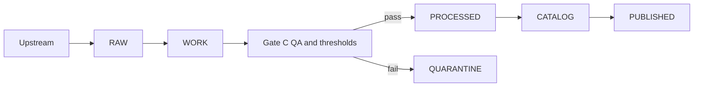

<!-- [KFM_META_BLOCK_V2]
doc_id: kfm://doc/5c7d3a2a-64f8-4f44-8a8f-2e3b7ad1c7d4
title: Gate C — QA & Thresholds Checklist
type: standard
version: v1
status: draft
owners: kfm-data-governance (TODO: confirm owners)
created: 2026-03-01
updated: 2026-03-01
policy_label: public
related:
  - docs/data/promotion/README.md (TODO: add if/when it exists)
  - docs/data/promotion/promotion-contract.md (TODO: add if/when it exists)
  - docs/data/promotion/checklists/ (this directory)
tags: [kfm, data, promotion, checklist, gate, qa]
notes:
  - Fail-closed checklist: promotion MUST block if QA plan/report is missing or thresholds fail.
  - Naming note: some KFM sources label “QA & thresholds” as Gate E; this repo path uses gate-c-qa.md.
[/KFM_META_BLOCK_V2] -->

# Gate C — QA & Thresholds Checklist
One-line purpose: **Block promotion unless dataset-specific QA checks were executed and all thresholds passed (or the dataset is quarantined).**


 <!-- TODO: replace with real workflow badge -->

---

## Quick navigation
- [Scope](#scope)
- [Gate contract](#gate-contract)
- [Inputs and outputs](#inputs-and-outputs)
- [Checklist](#checklist)
- [QA check matrix](#qa-check-matrix)
- [Failure handling and quarantine](#failure-handling-and-quarantine)
- [Definition of Done](#definition-of-done)
- [Appendices](#appendices)

---

## Scope

This checklist defines the **QA & Thresholds** gate for dataset promotion. The intent is to ensure:

- QA checks are **defined, repeatable, and documented** (in the dataset onboarding spec / pipeline spec).
- QA checks were **actually executed** for the current `dataset_version_id`.
- QA results meet **explicit thresholds** (otherwise the dataset remains in **WORK/QUARANTINE** and is not promoted).

### In scope
- Schema/type validation for processed artifacts
- Completeness, nulls, domain/range constraints
- Spatial checks (CRS/axis order sanity, geometry validity, extents)
- Temporal checks (ranges, ordering, cadence sanity)
- Key normalization (uniqueness, dedupe, referential integrity)
- Delivery artifact validation (GeoParquet / COG / PMTiles / etc.)
- Threshold evaluation + pass/fail outcome

### Out of scope (handled by other gates)
- Identity/versioning
- Licensing/rights
- Sensitivity classification & redaction obligations
- Catalog triplet validation (DCAT/STAC/PROV)
- Run receipt/audit record
- Policy tests & API contract tests

> NOTE (naming): Some KFM materials label “QA & thresholds” as **Gate E**, while **Gate C** is “Sensitivity classification & redaction plan.”  
> This file is named `gate-c-qa.md` because that is the repo path requested; treat it as the **QA gate regardless of letter**.

---

## Gate contract

### Hard rule
**Fail closed.** If the QA plan is missing, the QA report is missing, thresholds are missing, or any required threshold fails → **BLOCK promotion** and keep the dataset version in **WORK** or **QUARANTINE**.

### CI posture
This gate is intended to be:
- **automatable in CI** (as a blocking check), and
- **reviewable** (a steward can understand *what failed* and *how to remediate*).

### Where it sits in the truth path



---

## Inputs and outputs

### Inputs (minimum)
- `dataset_id`
- `dataset_version_id`
- `spec_ref` + `spec_hash` (or equivalent immutable pointer to the spec that defines checks + thresholds)
- The candidate artifacts to promote (usually in WORK/PROCESSED staging)
- A machine-readable **QA thresholds definition** referenced by the spec (YAML/JSON)

### Outputs (required)
- `qa_report.json` (machine-readable; includes thresholds + pass/fail + metrics)
- `qa_report.md` (human-readable summary; suitable for PR review)
- A **promotion decision**:
  - `pass` → promotable
  - `fail` → quarantined (or remain in WORK) + remediation notes

### Outputs (recommended)
- `qa_samples/` redacted examples (only if policy allows)
- `qa_metrics.parquet` (if you want time-series QA trend tracking)
- `qa_badges.json` (for UI surfacing; optional)

> WARNING: QA artifacts must respect `policy_label`.  
> For restricted datasets, QA outputs should default to **aggregates**, not raw sample rows.

---

## Checklist

### Required — must be ✅ to promote

#### A. QA plan and thresholds exist (pre-run)
- [ ] **QA checks are explicitly defined** in the dataset onboarding spec / pipeline spec (not tribal knowledge).
- [ ] **Thresholds are explicit** (numbers/limits/allowlists), not “looks good.”
- [ ] Thresholds are **machine-readable** (YAML/JSON) and referenced by `spec_ref/spec_hash`.
- [ ] Each check has a **clear failure message** and remediation hint (what to change).

#### B. QA execution produced artifacts (post-run)
- [ ] A `qa_report.json` exists for this exact `dataset_version_id`.
- [ ] A `qa_report.md` exists and summarizes:
  - what was checked
  - what passed/failed
  - key metrics (counts, nulls, extents, time range)
  - top anomalies (bounded list)
- [ ] The QA report includes **tooling/version info** sufficient to reproduce the QA run (or points to the run receipt).

#### C. Minimum QA domains (baseline)
- [ ] **Schema / type checks** pass (required fields present; types correct).
- [ ] **Geometry & CRS sanity** pass:
  - CRS is known/expected
  - axis order sanity checks are applied (where relevant)
  - geometry validity checks meet threshold
- [ ] **Key normalization** passes:
  - required keys present
  - uniqueness threshold met
  - referential integrity checks pass (when applicable)
- [ ] **Attribute QC** passes:
  - null thresholds met
  - value-domain constraints met
  - range checks met (when defined)
- [ ] **Delivery formats validate** (for each published artifact type):
  - GeoParquet schema ok
  - COG integrity ok
  - PMTiles has a valid sample tile (or equivalent smoke)

#### D. Promotion decision is enforced
- [ ] If any required check fails → dataset version is **not promoted** and is marked **WORK/QUARANTINE** with a remediation ticket/link.
- [ ] If all required checks pass → dataset version is **eligible** for later gates.

---

### Recommended — production posture

- [ ] **Drift checks**: compare summary stats against prior promoted versions (bounded by expected change).
- [ ] **Spatial coverage sanity**: extents/coverage are plausible vs. spec expectations.
- [ ] **Temporal cadence sanity**: expected cadence matches observed (for feeds/time-series).
- [ ] **Performance smoke** (bounded): can the artifact be opened/read; can one tile be rendered; can one query be served (as applicable).
- [ ] **Graph/provenance QA** (optional but strong): detect digest mismatches or collisions across assets (if your pipeline builds such a graph).

---

## QA check matrix

| QA domain | What to measure | Example checks (non-exhaustive) | Threshold defined in | Output evidence |
|---|---|---|---|---|
| Schema validity | fields/types | required columns present; type coercions logged | dataset spec | `qa_report.json` |
| Completeness | missingness | null rate per field; missing geometry percent | thresholds config | `qa_report.json` + summary |
| Geometry/CRS | validity & correctness | CRS known; axis sanity; geometry validity; bbox plausibility | dataset spec | `qa_report.json` |
| Keys & dedupe | uniqueness/RI | primary key uniqueness; FK integrity; duplicate rate | dataset spec | `qa_report.json` |
| Attribute QC | domain/range | allowlist membership; min/max bounds; regex patterns | thresholds config | `qa_report.json` |
| Temporal QC | time ranges | start/end present; ordering; no future-dated records (if disallowed) | dataset spec | `qa_report.json` |
| Delivery format | file integrity | GeoParquet readable; COG overviews/tiling; PMTiles sample tile | format profile | validator logs |
| Cross-asset consistency | metadata coherence | artifact extents match computed extents; row counts match | dataset spec | report + logs |

> TIP: Keep checks **small and explainable**. For any check that’s expensive, use a deterministic sample for CI and run the full check in the pipeline runner.

---

## Failure handling and quarantine

When QA fails:

1. **Do not promote.**
2. Write/retain the QA report artifacts (so failure is diagnosable).
3. Mark dataset version as **WORK** or **QUARANTINE** (depending on your repo conventions).
4. Create a remediation record (issue/ticket) that links to:
   - the failing check(s)
   - suggested next action(s)
   - any required steward review (if sensitive)

> WARNING: Never “force promote” through a QA failure. If an exception is necessary, it must be a governed policy decision and leave an auditable trail.

---

## Definition of Done

A dataset version satisfies **Gate C — QA** when:

- [ ] QA checks + thresholds are documented in the dataset spec (or referenced config)
- [ ] QA ran for the current `dataset_version_id`
- [ ] QA artifacts (`qa_report.json` + `qa_report.md`) are produced and attached to the promotion context (PR, run receipt, or both)
- [ ] All required thresholds pass **OR** the dataset version is quarantined (no promotion)
- [ ] Results are explainable (failure messages are actionable)

---

## Appendices

<details>
<summary><strong>Appendix A — Suggested <code>qa_report.json</code> shape (illustrative)</strong></summary>

```json
{
  "dataset_id": "example_dataset",
  "dataset_version_id": "dv_2026_03_01__abc123",
  "spec_hash": "sha256:...",
  "generated_at": "2026-03-01T00:00:00Z",
  "status": "pass",
  "summary": {
    "feature_count": 123456,
    "bbox": [-102.05, 36.99, -94.60, 40.00],
    "time_range": ["2025-01-01", "2025-12-31"]
  },
  "checks": [
    {
      "id": "geometry_validity",
      "status": "pass",
      "metric": { "invalid_geometries": 0 },
      "threshold": { "invalid_geometries_max": 0 },
      "message": "All geometries valid."
    }
  ]
}
```

</details>

<details>
<summary><strong>Appendix B — Threshold config sketch (YAML, illustrative)</strong></summary>

```yaml
checks:
  geometry_validity:
    invalid_geometries_max: 0
  null_rate:
    defaults:
      max_null_pct: 1.0
    fields:
      name: { max_null_pct: 0.0 }
  key_uniqueness:
    primary_key: feature_id
    duplicate_max: 0
```

</details>

---

_Back to top_: [Quick navigation](#quick-navigation)
