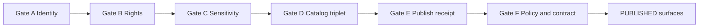

<!-- [KFM_META_BLOCK_V2]
doc_id: kfm://doc/5e9e050a-63dd-4bef-8373-50dc3dff8a86
title: Gate E — Publish Receipt (Run Receipt + Checksums)
type: standard
version: v1
status: draft
owners: kfm-data-governance
created: 2026-03-01
updated: 2026-03-01
policy_label: public
related:
  - kfm://policy/promotion_contract_v1
  - kfm://doc/data/promotion/README
tags: [kfm, data, promotion, gate-e, provenance, receipts, checksums]
notes:
  - Checklist for Promotion Contract v1, Gate E.
  - “Publish receipt” here means “emit + validate + link” the run receipt required for promotion.
[/KFM_META_BLOCK_V2] -->

# Gate E — Publish Receipt (Run Receipt + Checksums)

Fail-closed checklist to ensure **every promoted dataset version** is backed by a **verifiable run receipt** and **end-to-end checksums**.


---

## Quick navigation

- [What this gate is](#what-this-gate-is)
- [Where it fits](#where-it-fits)
- [Required inputs](#required-inputs)
- [Checklist](#checklist)
- [Required outputs](#required-outputs)
- [Common failure modes](#common-failure-modes)
- [Appendix](#appendix)

---

## What this gate is

**Gate E requires:**

1. A `run_receipt` exists **for each producing run** of the dataset version.
2. The receipt **enumerates all inputs and outputs with checksums** (digests).
3. The receipt records the **environment** (at minimum: container image digest and parameters digest).

> **Fail-closed rule:** if the receipt is missing, malformed, incomplete, or non-linkable, the dataset version is **not publishable**.

([↑ back to top](#gate-e--publish-receipt-run-receipt--checksums))

---

## Where it fits

Gate E is part of **Promotion Contract v1** and sits after catalog triplet validation and before policy/contract tests.



**Notes**
- This checklist does **not** define your receipt schema; it verifies the minimum required content for *promotion*.
- Your pipeline may emit additional provenance artifacts (OpenLineage events, Cosign bundles, SBOMs). Those can be attached as referrers, but they are **not required** to pass Gate E unless your org policy says so.

([↑ back to top](#gate-e--publish-receipt-run-receipt--checksums))

---

## Required inputs

### Minimal context objects

- `dataset_version_id` (immutable version identifier for the candidate promotion)
- List of **producing runs** (ingest, normalize, derive, tile, etc.) that generated artifacts for this dataset version

### Artifacts (must be available to the gate)

| Artifact | Required | Why Gate E needs it | Typical storage (examples — confirm in repo) |
|---|---:|---|---|
| Run receipt JSON for each producing run | ✅ | The “evidence object” that binds bytes → version → run | `data/prov/run_receipts/<date>/...json` |
| Raw and processed artifact URIs | ✅ | Must be enumerated in receipts | `data/raw/...` and `data/processed/...` |
| Checksums for each enumerated artifact | ✅ | Required to prove what bytes were used/generated | In receipt (`digest` fields) and/or sidecar `*.sha256` files |
| Parameters/config digest | ✅ | Required to bind outputs to config | `environment.params_digest` (or equivalent) |
| Container image digest | ✅ | Required to bind outputs to runtime | `environment.container_digest` (or equivalent) |

> **Governance note:** “Typical storage” paths above are examples from KFM reference patterns; treat them as **Proposed** until verified in the actual repo layout.

([↑ back to top](#gate-e--publish-receipt-run-receipt--checksums))

---

## Checklist

### E0. Preconditions

- [ ] Candidate dataset version has a stable `dataset_version_id` and is the version being promoted.
- [ ] Gate D has passed (DCAT + STAC + PROV exist and validate, including cross-links).

> If Gate D is not passing, stop. Gate E assumes there is already a catalog surface that can link to receipts.

---

### E1. Receipt existence and basic shape

For **each producing run**:

- [ ] A `run_receipt` artifact exists (one per run).
- [ ] Receipt is parseable JSON (no trailing commas, etc.).
- [ ] Receipt is typed (e.g., `@type: prov:run_receipt` or equivalent typed marker).
- [ ] Receipt includes a stable run identifier (e.g., `run_id` / `kfm_run_id`).
- [ ] Receipt includes `dataset_version_id` (or an equivalent link) matching the candidate dataset version.
- [ ] Receipt timestamps are present and machine-readable (`RFC3339`/ISO8601).

**Recommended (but not required for Gate E unless your org policy escalates it):**
- [ ] Receipt includes deterministic identity binding (e.g., `spec_hash`) so it can be checked against Gate A inputs.

---

### E2. Inputs are enumerated and checksummed

For **each producing run**:

- [ ] Receipt has a non-empty `inputs[]` list.
- [ ] Each input item has:
  - [ ] a `uri` (or equivalent location pointer)
  - [ ] a `digest` (sha256 strongly preferred)
- [ ] Every referenced input digest matches the bytes at the referenced location **or** a content-addressed blob in staging.

**Fail-closed requirements**
- If any input digest is missing → **fail gate**.
- If digest algorithm is unclear/unstated → **fail gate**.
- If any input URI is insecure or includes secrets → **fail gate**.

---

### E3. Outputs are enumerated and checksummed

For **each producing run**:

- [ ] Receipt has a non-empty `outputs[]` list.
- [ ] Each output item has:
  - [ ] a `uri`
  - [ ] a `digest` (sha256 strongly preferred)
- [ ] Output digests match the bytes of the produced artifacts.

**Fail-closed requirements**
- If any output digest is missing → **fail gate**.
- If any output digest mismatches → **fail gate**.

---

### E4. Environment is recorded

For **each producing run**:

- [ ] Receipt includes an `environment` object (or equivalent).
- [ ] `environment` includes:
  - [ ] `container_digest` (image digest, not a mutable tag)
  - [ ] `params_digest` (digest of canonicalized parameters/config)
- [ ] `environment` includes `git_commit` (recommended; required if your reproducibility policy requires it).

**Fail-closed requirements**
- If container digest is missing → **fail gate**.
- If params digest is missing → **fail gate**.

---

### E5. Validation and policy link pointers are present

> Gate E cares that validation/policy outcomes can be *found*. Passing/failing those checks is typically Gate F.

For **each producing run**:

- [ ] Receipt includes a validation status indicator (e.g., `validation.status`) and a pointer to the validation report (e.g., `validation.report_digest` or URI).
- [ ] Receipt includes a pointer to a policy decision artifact (e.g., `policy.decision_id`) when a policy decision was evaluated.

---

### E6. Receipt is linkable from catalogs

For the **candidate dataset version**:

- [ ] At least one catalog surface (DCAT and/or STAC) links to the correct run receipt(s) **or** to a bundle that contains them.
- [ ] Each run receipt is discoverable from DCAT and/or STAC (no “orphan receipts”).
- [ ] PROV bundle links the run `Activity` to:
  - [ ] each input `Entity`
  - [ ] each output `Entity`
  - [ ] the pipeline `Agent`
  - [ ] the environment capture

**Fail-closed requirements**
- If receipts exist but are not reachable from catalog surfaces → **fail gate**.

---

### E7. Publish-safe hygiene (no secrets, no unsafe URLs)

For **each producing run**:

- [ ] Receipt does **not** include credentials, tokens, headers, cookies, or signed URLs with secrets.
- [ ] Source pointers use secure schemes (prefer `https://`, `s3://`, `oci://`, etc.; reject `http://` unless explicitly allowlisted by policy).
- [ ] Any sensitive values are either:
  - [ ] redacted, or
  - [ ] moved to restricted artifacts with a policy label, or
  - [ ] removed entirely.

([↑ back to top](#gate-e--publish-receipt-run-receipt--checksums))

---

## Required outputs

Gate E passes only if the promotion candidate can produce (or already has) an **evidence bundle** with at least:

- [ ] `run_receipt` JSON for each producing run
- [ ] checksums (inside the receipt, or as sidecar files) covering all inputs/outputs
- [ ] environment capture (container digest + params digest)

**Recommended PR attachments**
- [ ] A short `gate_e_report.md` or CI log excerpt listing:
  - run IDs checked
  - count of inputs/outputs verified
  - any redactions applied to receipts
- [ ] Links to the receipts as they will be served in the governed “Evidence Drawer” UX.

([↑ back to top](#gate-e--publish-receipt-run-receipt--checksums))

---

## Common failure modes

| Symptom | Likely cause | Required fix |
|---|---|---|
| Receipt missing for one pipeline stage | Run step didn’t emit receipt or it was not persisted | Emit receipt for every producing run; store it in canonical provenance store |
| Digests exist but don’t match | Artifact mutated after receipt creation; non-idempotent pipeline | Make outputs immutable by version; re-run pipeline; regenerate receipt |
| Receipt references `http://` access URL | Insecure source pointer | Update connector to use secure scheme or add explicit allowlist policy + justification |
| Receipt exists but catalogs don’t link to it | Orphan provenance; missing cross-links | Add receipt link in STAC/DCAT/PROV, then re-run catalog validation |
| Params not captured | No canonical config hashing | Canonicalize config; compute `params_digest`; persist in receipt |

([↑ back to top](#gate-e--publish-receipt-run-receipt--checksums))

---

## Appendix

<details>
<summary><strong>A. Minimal run receipt fields (reference)</strong></summary>

The exact schema may vary, but Gate E expects fields equivalent to:

- Run identity: `run_id` (or `kfm_run_id`)
- Dataset binding: `dataset_version_id`
- Inputs: `inputs[]` with `(uri, digest)`
- Outputs: `outputs[]` with `(uri, digest)`
- Environment: `environment.container_digest`, `environment.params_digest`, and optionally `environment.git_commit`
- Validation pointer: `validation.status` plus `validation.report_digest` or `validation.report_uri`
- Policy pointer: `policy.decision_id`
- Timestamp: `created_at` (and optionally start/end)

</details>

<details>
<summary><strong>B. Example receipt snippet (illustrative)</strong></summary>

```json
{
  "@type": "prov:run_receipt",
  "run_id": "kfm://run/2026-02-20T12:00:00Z.abcd",
  "dataset_version_id": "2026-02.abcd1234",
  "inputs": [{"uri": "raw/source.csv", "digest": "sha256:..."}],
  "outputs": [{"uri": "processed/events.parquet", "digest": "sha256:..."}],
  "environment": {
    "container_digest": "sha256:...",
    "git_commit": "deadbeef",
    "params_digest": "sha256:..."
  },
  "validation": {"status": "pass", "report_digest": "sha256:..."},
  "policy": {"decision_id": "kfm://policy_decision/xyz"},
  "created_at": "2026-02-20T12:05:00Z"
}
```

</details>

<details>
<summary><strong>C. Minimum verification steps (convert Unknown → Confirmed)</strong></summary>

1. Confirm receipt storage location(s) in this repo (search for `run_receipts/` and `run_receipt_v1.json`).
2. Confirm which workflows/jobs enforce Gate E (search in `.github/workflows` for `receipt`, `prov`, `digest`, `promotion`).
3. Confirm the receipt schema URL and validator used in CI (jsonschema, ajv, conftest, etc.).
4. Confirm how digests are computed (raw bytes vs canonicalized transforms) and whether sidecar `*.sha256` files are required.

</details>
