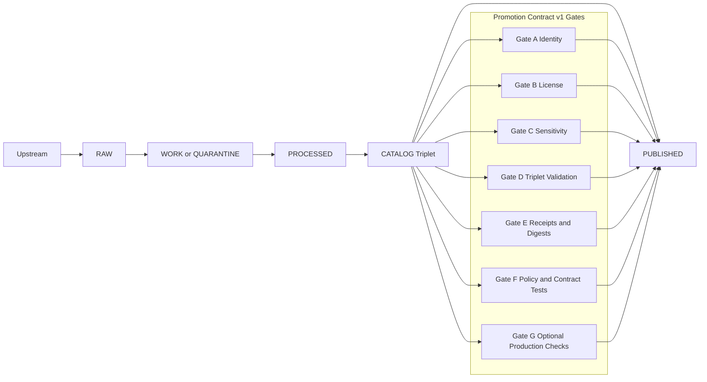

<!-- [KFM_META_BLOCK_V2]
doc_id: kfm://doc/0a2f195e-2ae4-4f46-a422-09a4c7e14c43
title: Promotion Examples
type: standard
version: v1
status: draft
owners: KFM Data Platform + Data Stewards
created: 2026-03-01
updated: 2026-03-01
policy_label: public
related:
  - TODO: link to the Promotion Contract doc/page in this repo
  - TODO: link to the run_receipt / promotion_manifest schemas
tags: [kfm, data, promotion, examples, fixtures, governance]
notes:
  - This directory is for *synthetic or sanitized* fixtures that exercise the Promotion Contract gates.
  - Do not store raw upstream payloads, large binaries, secrets, or sensitive coordinates here.
[/KFM_META_BLOCK_V2] -->

# Promotion Examples
**Purpose:** Small, reviewable example packs that demonstrate (and test) KFM’s **truth path** and **Promotion Contract** gates.

**Status:** draft • **Owners:** KFM Data Platform + Data Stewards • **Policy:** public • **Last updated:** 2026-03-01


## Navigation
- [Why this folder exists](#why-this-folder-exists)
- [Where this fits in the repo](#where-this-fits-in-the-repo)
- [What belongs here](#what-belongs-here)
- [Truth path and promotion gates](#truth-path-and-promotion-gates)
- [Example pack format](#example-pack-format)
- [How to add a new example](#how-to-add-a-new-example)
- [Appendix: minimal templates](#appendix-minimal-templates)

---

## Why this folder exists

KFM promotion is **fail-closed**: if required evidence/artifacts are missing or invalid, a dataset version **must not** be promoted into runtime surfaces.

These example packs exist to:
- Give contributors concrete, copy-pastable “what good looks like” fixtures.
- Power CI: schema validators, link checkers, policy tests, and evidence-resolver tests should be able to run against these packs.
- Support UI development: the Receipt/Evidence viewers can render these packs safely without depending on production data.

> [!NOTE]
> These are *fixtures*, not production datasets. Keep files small and self-contained.

[Back to top](#promotion-examples)

---

## Where this fits in the repo

This folder is intended to live at:

```
docs/data/promotion/examples/
```

It should be used alongside (but separate from) the actual data lifecycle zones (RAW/WORK/PROCESSED/CATALOG/PUBLISHED).

> [!TIP]
> If you want to publish “real” example data for demos, put it in the appropriate data zone and reference it by digest.
> Keep this directory primarily **text-based** (JSON/YAML/MD) so reviews and CI stay fast.

[Back to top](#promotion-examples)

---

## What belongs here

### Acceptable inputs

Include **synthetic or sanitized** artifacts that represent a dataset version moving through promotion:

- `run_receipt` examples (one per producing run) + checksums/digests
- A promotion-oriented *manifest* that summarizes required artifacts for the dataset version
- Catalog triplet examples:
  - **DCAT** record (dataset-level metadata)
  - **STAC** collection/items (asset-level spatiotemporal metadata, when applicable)
  - **PROV** bundle (lineage: entities, activities, agents)
- Policy artifacts:
  - `policy_label` assignment
  - redaction/generalization plan (when triggered)
- QA artifacts:
  - QA report(s) showing thresholds met (or an explicit quarantine case)
- Negative/edge-case fixtures:
  - Missing license → must quarantine
  - Broken cross-links → must fail gate
  - Unresolvable EvidenceRefs → must fail gate

### Exclusions

Do **not** include:
- Real upstream payloads unless they are explicitly licensed for redistribution (and still prefer minimal slices).
- Any secrets, tokens, credentials, or private URLs.
- PII or private addresses.
- Precise coordinates for sensitive locations (archaeology, endangered species, etc.) unless **generalized** and policy-labeled.
- Large binaries (COGs/PMTiles/Parquet bigger than a few MB). If needed, store small placeholder files or reference by digest.

> [!WARNING]
> If you are unsure whether something is sensitive or redistributable, **do not add it here**.
> Default to synthetic fixtures and flag the governance question in the PR.

[Back to top](#promotion-examples)

---

## Truth path and promotion gates

### Lifecycle zones (truth path)

The KFM truth path is the enforced lifecycle for data and metadata:



### Promotion Contract v1 (minimum gates)

A dataset version promotion should be blocked unless the **minimum gates** below are satisfied.

| Gate | What must be present | What the example pack should include |
|---|---|---|
| A — Identity & versioning | Stable `dataset_id`, immutable `dataset_version_id` derived from a stable `spec_hash` | `promotion_manifest.*` + IDs + `spec_hash` + digest rules |
| B — Licensing & rights | Explicit license + rights holder/attribution; unclear license → quarantine | `license.*` snippet or terms snapshot pointer + `dcat.*` fields |
| C — Sensitivity & redaction plan | `policy_label` assigned; redaction/generalization plan recorded in PROV when triggered | `policy_decision.*` + `prov.*` noting redaction activity |
| D — Catalog triplet validation | DCAT + STAC (if applicable) + PROV validate and cross-link | `dcat.*`, `stac/*`, `prov/*` + link integrity |
| E — Run receipts & checksums | `run_receipt` per producing run; inputs/outputs enumerated with checksums; environment recorded | `run_receipts/*.json` + `checksums.*` + environment fields |
| F — Policy tests & contract tests | OPA policy tests pass; at least one EvidenceRef resolves; API/schema contracts validate | `policy_tests.*` notes + at least one resolvable EvidenceRef in catalogs |
| G — Optional but recommended | SBOM/provenance; performance smoke checks; accessibility smoke checks | `sbom.*` (optional), perf/a11y notes, or placeholders |

> [!NOTE]
> This directory should contain fixtures that let CI prove the gates behave as intended: “green” packs pass; “red” packs fail.

[Back to top](#promotion-examples)

---

## Example pack format

Each example pack should be a **single folder** representing a single scenario.

### Recommended structure

```text
docs/data/promotion/examples/
  00_templates/
    README.md
    promotion_manifest.template.json
    run_receipt.template.json
    policy_decision.template.json
  01_minimal_public_vector/
    README.md
    promotion_manifest.json
    run_receipts/
      001_fetch.json
      002_transform.json
      003_catalog.json
    catalogs/
      dcat.dataset.jsonld
      stac.collection.json
      stac.items/
        item_0001.json
    prov/
      bundle.jsonld
    policy/
      decision.json
    qa/
      qa_report.json
    checksums/
      sha256sums.txt
  02_quarantine_unclear_license/
    README.md
    promotion_manifest.json
    catalogs/
      dcat.dataset.jsonld
    qa/
      qa_report.json
    expected_failure.md
  03_sensitive_location_generalized/
    README.md
    promotion_manifest.json
    policy/
      decision.json
    prov/
      bundle.jsonld
    catalogs/
      stac.collection.json
      stac.items/
        item_0001_generalized_geom.json
    expected_failure.md  # if this is a negative example
```

> [!TIP]
> Keep “processed artifacts” out of this directory unless they are tiny.
> Prefer catalog + receipt fixtures that reference artifacts by digest (or a small placeholder file).

### Naming

- Folder name format: `NN_<scenario_slug>/` where `NN` is two digits.
- Each pack README should clearly state:
  - What scenario it represents
  - Which gates it is intended to pass/fail
  - Whether the content is **synthetic**, **sanitized**, or **derived**

[Back to top](#promotion-examples)

---

## How to add a new example

1. Copy `00_templates/` into a new folder `NN_<scenario_slug>/`.
2. Decide whether the pack is:
   - a **green** pack (should pass all minimum gates), or
   - a **red** pack (should fail a specific gate, on purpose).
3. Fill in:
   - `promotion_manifest.json` (dataset identity + references to required artifacts)
   - `run_receipts/*.json` (one per run that produces artifacts)
   - `catalogs/*` (DCAT/STAC) and `prov/*` (lineage)
   - `policy/decision.json` (policy_label + obligations, if any)
   - `qa/qa_report.json` (thresholds + summary)
4. Add `expected_failure.md` for red packs:
   - gate that must fail (A–G)
   - why it should fail
   - the “fix” that would make it pass
5. Update this README (or an `INDEX.md`, if added later) with the new pack.

> [!WARNING]
> Avoid “magic” examples that only pass because a validator is lenient.
> Fixtures should be strict enough that a breaking change in schemas/policy is caught immediately.

[Back to top](#promotion-examples)

---

## Appendix: minimal templates

### Minimal `run_receipt` (template)

```json
{
  "$schema": "TODO: schema URI or repo path",
  "kfm_run_id": "run-0001",
  "dataset_id": "example.dataset",
  "dataset_version_id": "example.dataset@sha256:TODO",
  "spec_hash": "sha256:TODO",
  "pipeline": "raw->processed->catalog",
  "runner": "TODO: workflow or runner reference",
  "inputs": [
    { "uri": "upstream://example", "digest": "sha256:TODO" }
  ],
  "outputs": [
    { "uri": "processed://example", "digest": "sha256:TODO" }
  ],
  "checks": {
    "license": "ok",
    "qa": "ok",
    "stac": "ok",
    "prov": "ok",
    "policy": "ok"
  },
  "environment": {
    "container_image": "sha256:TODO",
    "parameters": { "example": true }
  },
  "timestamps": {
    "start": "2026-01-01T00:00:00Z",
    "end": "2026-01-01T00:01:00Z"
  }
}
```

### Minimal `promotion_manifest` (template)

```json
{
  "$schema": "TODO: schema URI or repo path",
  "dataset_id": "example.dataset",
  "dataset_version_id": "example.dataset@sha256:TODO",
  "spec_hash": "sha256:TODO",
  "policy_label": "public",
  "artifacts": {
    "dcat": "catalogs/dcat.dataset.jsonld",
    "stac_collection": "catalogs/stac.collection.json",
    "stac_items": "catalogs/stac.items/",
    "prov": "prov/bundle.jsonld",
    "run_receipts": "run_receipts/",
    "qa_report": "qa/qa_report.json",
    "checksums": "checksums/sha256sums.txt"
  },
  "gates_intended": {
    "A": "pass",
    "B": "pass",
    "C": "pass",
    "D": "pass",
    "E": "pass",
    "F": "pass",
    "G": "optional"
  }
}
```

---

**End of file.**
