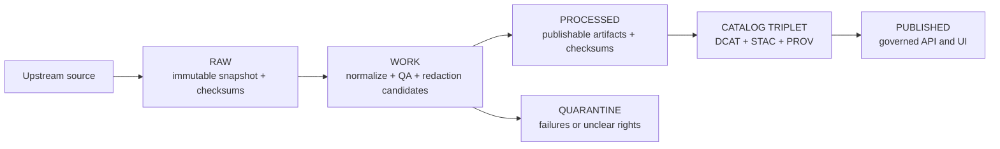

<!-- [KFM_META_BLOCK_V2]
doc_id: kfm://doc/863bd96f-4cec-49cf-b5a5-7e0dd39032b2
title: Example Dataset — Promotion Contract Walkthrough
type: standard
version: v1
status: draft
owners: TBD
created: 2026-03-01
updated: 2026-03-01
policy_label: public
related:
  - TODO: link to the promotion overview doc (e.g., docs/data/promotion/README.md)
  - TODO: link to the governance/policy overview (e.g., docs/governance/README.md)
tags: [kfm, data, promotion, example]
notes:
  - This is a documentation+fixtures example. Do not treat it as a real dataset.
  - Replace placeholder commands/paths with repo-specific tooling once verified.
[/KFM_META_BLOCK_V2] -->

# Example Dataset — Promotion Contract Walkthrough

**Purpose:** a minimal, safe example that demonstrates *what artifacts exist at each truth-path zone* and *what CI gates block promotion*.

> **WARNING**
> This directory is for **example documentation and fixtures**. Do **not** store secrets, private data, or large binaries here.

---

## Status + Owners

- **Status:** draft example (non-production)
- **Owners:** **TBD** (assign CODEOWNERS / steward)

---

## Badges (TODO wire to repo)


---

## Quick navigation

- [Why this exists](#why-this-exists)
- [Directory contract](#directory-contract)
- [Truth path diagram](#truth-path-diagram)
- [Promotion gates checklist](#promotion-gates-checklist)
- [PR-based workflow](#pr-based-workflow)
- [Troubleshooting](#troubleshooting)
- [References](#references)

---

## Why this exists

KFM promotion is **fail-closed**: a dataset version should not appear in runtime (API/UI) unless *all required artifacts exist* and *all contract/policy checks pass*.

This example provides:

1. A *recommended layout* for a “dataset family” and a single dataset version.
2. A *promotion-gate checklist* you can copy into PR descriptions.
3. Placeholders for the minimum artifacts that validators expect (checksums, catalogs, receipts).

---

## Directory contract

This README documents the intended structure under:

`docs/data/promotion/examples/example_dataset/`

> **NOTE**
> The *actual* storage zones for data (RAW/WORK/PROCESSED/CATALOG/PUBLISHED) often live under `data/…` (repo-dependent).
> This docs folder is meant to be a **teaching and fixture mirror**.

### Recommended layout (example)

```text
docs/data/promotion/examples/example_dataset/                 # Golden-path example dataset (docs + fixtures to teach/validate gates)
├─ README.md                                                  # Example overview: what it demonstrates, how to run checks, expected outcomes
│
├─ spec/                                                      # Example “dataset spec” inputs (intent + rules)
│  └─ dataset.spec.yaml                                       # Dataset intent + QA thresholds + license/sensitivity metadata (example)
│
└─ fixtures/                                                  # Tiny, synthetic fixtures for validators (NOT real data; policy-safe)
   ├─ raw/                                                    # Small “raw” fixtures (tiny CSV/GeoJSON) for validators
   ├─ work/                                                   # Normalized fixtures + QA reports (intermediate stage examples)
   ├─ processed/                                              # Publishable-format fixtures (GeoParquet/COG/PMTiles), kept tiny
   ├─ checksums/                                              # sha256 manifests for fixtures (raw + processed; determinism examples)
   ├─ catalog/                                                # Example catalog triplet artifacts (DCAT/STAC/PROV)
   │  ├─ dcat/                                                # Example DCAT dataset/distributions (policy-safe links)
   │  ├─ stac/                                                # Example STAC collection/items/assets (cross-linked)
   │  └─ prov/                                                # Example PROV bundle (run provenance; agent/activity/entity links)
   ├─ receipts/                                               # Example run_receipt(s) and optional release/promotion manifests
   └─ policy/                                                 # Example policy fixtures (allowed/denied cases) used for Gate F scenarios
```

### What belongs here

- ✅ **Tiny fixtures** for CI validators (think “unit test data”).
- ✅ Specs and checklists that explain how promotion works.
- ✅ Synthetic examples demonstrating redaction/generalization patterns.

### What must NOT go here

- ❌ Secrets, tokens, credentials.
- ❌ Large imagery or tilesets (use canonical data storage, not docs).
- ❌ Unlicensed content (even as examples).
- ❌ Anything that would violate a `restricted` policy label if leaked.

---

## Truth path diagram



---

## Promotion gates checklist

Copy/paste this into the PR that proposes a new dataset version.

> **Rule of thumb:** if any checkbox is unchecked, **promotion is blocked**.

### Gate A — Identity and versioning

- [ ] `dataset_id` is stable and matches naming conventions.
- [ ] `dataset_version_id` is immutable and derived from a deterministic `spec_hash`.
- [ ] `spec_hash` is reproducible from canonicalized inputs (no timestamps/randomness). *(recommended)*

### Gate B — Licensing and rights metadata

- [ ] License is explicit (SPDX identifier preferred).
- [ ] Rights holder + attribution requirements captured.
- [ ] Upstream terms snapshot is stored (or linked) for auditability.

### Gate C — Sensitivity classification and redaction plan

- [ ] `policy_label` assigned (`public`, `restricted`, …).
- [ ] If sensitive, a redaction/generalization plan is documented and recorded in provenance.

### Gate D — Catalog triplet validation

- [ ] **DCAT** dataset/distributions exist and validate against the KFM profile.
- [ ] **STAC** collection/items exist (if geospatial assets) and validate against the KFM profile.
- [ ] **PROV** bundle exists and validates against the KFM profile.
- [ ] Cross-links between DCAT/STAC/PROV are resolvable (no broken IDs/links).

### Gate E — Run receipt and checksums

- [ ] `run_receipt` exists for each producing run.
- [ ] Every input/output artifact is listed with checksums (sha256).
- [ ] Environment is recorded (e.g., container image digest, parameters).

### Gate F — Policy tests and contract tests

- [ ] OPA/Conftest policy tests pass for this dataset version (fixtures-driven).
- [ ] Evidence resolver can resolve at least one EvidenceRef for this dataset version (in CI).
- [ ] API/Schema contract tests pass (no breaking changes to consumers).

### Gate G — Optional but recommended (production posture)

- [ ] SBOM + build provenance for pipeline and runtime artifacts.
- [ ] Performance smoke checks (evidence resolution, tile rendering).
- [ ] Accessibility smoke checks for evidence drawer and key workflows.

---

## PR-based workflow

This is a **reference workflow**; adapt steps to the repo’s actual scripts/CLI once verified.

1. **Add/Update the dataset spec**
   - `docs/.../spec/dataset.spec.yaml`
   - Include: license, sensitivity, QA thresholds, declared extents, and delivery formats.

2. **Stage fixtures for each zone**
   - `fixtures/raw/` → `fixtures/work/` → `fixtures/processed/`
   - Add `fixtures/checksums/sha256sums.txt` (or equivalent).

3. **Generate catalogs and provenance**
   - `fixtures/catalog/stac/…`
   - `fixtures/catalog/dcat/…`
   - `fixtures/catalog/prov/…`

4. **Emit run receipts**
   - `fixtures/receipts/run_receipt.<run_id>.json`

5. **Run validators locally**
   - TODO: replace with repo command (examples):
     - `make validate-fixtures`
     - `pnpm kfm validate --path docs/data/promotion/examples/example_dataset`

6. **Open PR**
   - Attach the checklist from [Promotion gates checklist](#promotion-gates-checklist).
   - CI should fail-closed if any required artifact or policy check is missing.

---

## Troubleshooting

### “License missing / unknown” (Gate B)

- Expected behavior: the dataset version stays in **QUARANTINE** until licensing is explicit.
- Fix: add license + rights holder + an upstream terms snapshot link in the spec.

### “STAC/DCAT/PROV validate but cross-links fail” (Gate D)

- Expected behavior: CI blocks promotion.
- Fix: ensure identifiers match (`dataset_version_id`, STAC IDs, PROV entity IDs) and links are resolvable.

### “No run_receipt” or “checksums missing” (Gate E)

- Expected behavior: CI blocks promotion.
- Fix: generate run receipt and checksums for *every* referenced artifact (raw + processed + catalogs).

### “Policy tests deny this dataset” (Gate F)

- Expected behavior: CI blocks promotion (default-deny).
- Fix: update policy fixtures and/or the redaction plan; never weaken policy just to “make it pass.”

---

## References

- KFM truth-path zones and Promotion Contract (authoritative): see the KFM governance guide.
- Tooling/CI gates overview: see the KFM pipeline tooling brief.

Back to top: [↑](#example-dataset--promotion-contract-walkthrough)
