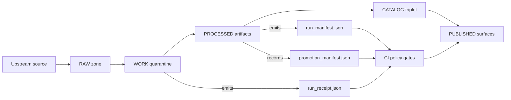

<!-- [KFM_META_BLOCK_V2]
doc_id: kfm://doc/38dddcf1-a8a0-4d97-980a-f3ef7c9442b3
title: Example Receipts for Promotion Evidence
type: standard
version: v1
status: draft
owners: TODO
created: 2026-03-01
updated: 2026-03-01
policy_label: public
related:
  - TODO: ../../README.md
  - TODO: ../README.md
tags: [kfm, promotion, provenance, receipts, examples]
notes:
  - This folder is documentation + fixtures only; never commit secrets or sensitive coordinates.
  - Paths referenced under “Schemas/Policy” follow the Integration Pack recommended layout; adjust if repo differs.
[/KFM_META_BLOCK_V2] -->

# Example Receipts
Small, safe **example “receipts”** used to document and test the **Promotion Contract** evidence chain (run receipts, run manifests, promotion manifests).


**Purpose:** make receipts *reviewable*, *testable*, and *fail-closed* before anything reaches `PUBLISHED`.

---

## Quick navigation
- [Where this fits](#where-this-fits)
- [What belongs here](#what-belongs-here)
- [What must not go here](#what-must-not-go-here)
- [Directory layout](#directory-layout)
- [Receipt types](#receipt-types)
- [Templates](#templates)
  - [Run receipt (contract-style)](#run-receipt-contract-style)
  - [Run receipt (blueprint-style)](#run-receipt-blueprint-style)
  - [Run manifest](#run-manifest)
  - [Promotion manifest](#promotion-manifest)
- [Validation](#validation)
- [Contribution checklist](#contribution-checklist)

---

## Where this fits
Receipts are **promotion evidence artifacts** produced by pipelines and enforced by CI gates.



> NOTE  
> This directory is under `docs/` and is meant for **examples + fixtures**. The *actual* runtime receipts live with pipeline outputs and/or catalog/provenance storage (repo-specific).

---

## What belongs here
Only **small JSON documents** that are safe to commit and useful for:
- Documentation (humans learning what “good evidence” looks like)
- CI fixtures (schema validation + OPA policy tests)
- UI evidence surfaces (ReceiptViewer / evidence drawer demos)

Typical contents:
- **Valid** examples that pass schema + policy.
- **Invalid** examples that intentionally fail (missing fields, wrong types, unapproved provider, bad timestamps).
- **Redacted** examples demonstrating how restricted data is generalized.

---

## What must not go here
- ❌ Real secrets (API keys, tokens, cookies, private URLs, internal hostnames)
- ❌ Personally identifying information (unless explicitly approved + redacted)
- ❌ Exact locations for sensitive sites/species/archaeology (use generalized geometry/bboxes)
- ❌ Large binaries (parquet/COG/Zarr/etc.). Receipts only reference digests/paths.

> WARNING  
> Receipts can leak sensitive info through “helpful” fields (source URLs, precise coordinates, file paths, query params). Treat fixtures as **public artifacts** unless clearly labeled and approved.

---

## Directory layout
We do **not** assume specific filenames exist yet (repo reality may vary). A recommended structure is:

```text
docs/data/promotion/examples/example_receipts/                 # Receipt examples (valid/invalid) for CI gates + reviewer training
├─ README.md                                                   # Index + how these examples map to schemas/tests + update rules
│
├─ run_receipt/                                                # Run receipt examples (pipeline/story/focus/index runs)
│  ├─ run_receipt.v1.valid.min.json                             # Minimal valid run_receipt v1 (golden pass case)
│  ├─ run_receipt.v1.invalid.missing_spec_hash.json             # Invalid: missing spec_hash (must fail gate)
│  ├─ run_receipt.v1.invalid.unapproved_provider.json           # Invalid: provider not approved/allowlisted (must fail gate)
│  └─ run_receipt.v1.redacted.public.json                       # Redacted public-safe receipt (no sensitive fields; policy-safe)
│
├─ run_manifest/                                               # Run manifest examples (batch run bundles, optional)
│  ├─ run_manifest.v1.valid.min.json                             # Minimal valid run_manifest v1 (pass case)
│  └─ run_manifest.v1.invalid.missing_rights.json                # Invalid: missing rights/licensing fields (must fail gate)
│
└─ promotion_manifest/                                         # Promotion manifest examples (release bundle + digests + approvals)
   ├─ promotion_manifest.v1.valid.min.json                       # Minimal valid promotion_manifest v1 (pass case)
   └─ promotion_manifest.v1.invalid.missing_artifact_digest.json  # Invalid: missing artifact digest/checksum (must fail gate)
```

---

## Receipt types
| Artifact | What it proves | Used by | Gate / surface |
|---|---|---|---|
| `run_receipt` | “This run happened, with these inputs/outputs, under this spec + checks.” | CI, provenance, auditing | Promotion Gate **F** |
| `run_manifest` | Promotion-focused rollup: digests, rights, attestations, publish-candidate decision. | CI PR gates, packaging/OCI | Promotion lanes / PR verify |
| `promotion_manifest` | Release record tying a dataset version to specific artifacts + catalogs + approvals. | Release/publish process | Promotion Gate **G** |
| `policy_decision` (optional) | Why something is allowed/denied + obligations applied. | Evidence resolver, UI | Policy traceability |

---

## Templates

### Run receipt (contract-style)
Minimal “contract” shape (good for CI policy packs and portable verification):

```json
{
  "$schema": "https://kfm.dev/schemas/run_receipt_v1.json",
  "kfm_run_id": "RUN-2026-02-20T12:00:00Z-abcd",
  "dataset": "example_dataset",
  "subject": "sha256:0000000000000000000000000000000000000000000000000000000000000000",
  "spec_hash": "sha256:1111111111111111111111111111111111111111111111111111111111111111",
  "pipeline": "raw→processed→catalog→prov",
  "runner": "gha://workflows/provenance-guard@v3",
  "inputs": [
    "uri://raw/source.csv"
  ],
  "outputs": [
    "stac items",
    "prov bundle"
  ],
  "checks": {
    "stac": "ok",
    "prov": "ok",
    "policy": "ok"
  },
  "timestamps": {
    "start": "2026-02-20T12:00:00Z",
    "end": "2026-02-20T12:05:00Z"
  }
}
```

**Fixture intent:** include examples that violate invariants (e.g., missing `spec_hash`, `subject` not a digest, checks contain `fail`, timestamps invalid).

---

### Run receipt (blueprint-style)
More “evidence bundle friendly” shape (captures actor + environment + input/output digests):

```json
{
  "run_id": "kfm://run/2026-02-20T12:00:00Z.abcd",
  "actor": { "principal": "svc:pipeline", "role": "pipeline" },
  "operation": "ingest+publish",
  "dataset_version_id": "2026-02.abcd1234",
  "inputs": [
    { "uri": "raw/source.csv", "digest": "sha256:1111" }
  ],
  "outputs": [
    { "uri": "processed/events.parquet", "digest": "sha256:2222" }
  ],
  "environment": {
    "container_digest": "sha256:img...",
    "git_commit": "deadbeef",
    "params_digest": "sha256:3333"
  },
  "validation": { "status": "pass", "report_digest": "sha256:7777" },
  "policy": { "decision_id": "kfm://policy_decision/xyz" },
  "created_at": "2026-02-20T12:05:00Z"
}
```

**Fixture intent:** this is the version that makes it easiest to demonstrate:
- “exactly what ran”
- “what bits went in/out”
- “what checks passed”
- “what policy decision applied”

---

### Run manifest
Promotion-oriented rollup example (helps PR verify gates):

```json
{
  "dataset": "soils.ssurgo",
  "run_id": "2026-02-02T12:00Z-abc123",
  "spec_hash": "sha256:...",
  "input_sha256": "sha256:...",
  "rekor_uuid": "c7f2...e1",
  "rights": {
    "license": "...",
    "attribution": "...",
    "redistribution": "..."
  },
  "produced_artifacts": [
    "oci://example.registry/kfm/datasets/soils.ssurgo@sha256:..."
  ],
  "materiality_delta": 0.03,
  "publish_candidate": true,
  "signatures": ["..."],
  "attestations": ["oci://..."]
}
```

---

### Promotion manifest
Promotion/release record tying together artifacts, catalogs, QA, policy, and approvals:

```json
{
  "kfm_promotion_manifest_version": "v1",
  "dataset_slug": "example_dataset",
  "dataset_version_id": "2026-02.abcd1234",
  "spec_hash": "sha256:abcd1234",
  "released_at": "2026-02-20T13:00:00Z",
  "artifacts": [
    {
      "path": "events.parquet",
      "digest": "sha256:2222",
      "media_type": "application/x-parquet"
    }
  ],
  "catalogs": [
    { "path": "dcat.jsonld", "digest": "sha256:4444" },
    { "path": "stac/collection.json", "digest": "sha256:5555" }
  ],
  "qa": { "status": "pass", "report_digest": "sha256:7777" },
  "policy": {
    "policy_label": "public",
    "decision_id": "kfm://policy_decision/xyz"
  },
  "approvals": [
    { "role": "steward", "principal": "<id>", "approved_at": "2026-02-20T12:59:00Z" }
  ]
}
```

---

## Validation
> NOTE  
> Commands below are *examples*. Adjust paths to match the repo’s actual locations.

### 1) Schema validation (JSON Schema)
If the repo includes versioned schemas (recommended), validate receipts against them:

```bash
# Example
ajv validate \
  -s schemas/run_receipt.v1.schema.json \
  -d docs/data/promotion/examples/example_receipts/run_receipt/run_receipt.v1.valid.min.json
```

### 2) Policy validation (OPA/Rego via Conftest)
Receipts should be checked with fail-closed policy packs:

```bash
# Example
conftest test docs/data/promotion/examples/example_receipts/run_receipt/run_receipt.v1.valid.min.json \
  -p policy/opa
```

### 3) “Fail on purpose” fixtures
Keep at least one fixture per major rule so CI can prove it blocks:
- missing `spec_hash`
- unapproved `provider` (if present in the schema version you’re testing)
- `checks.policy = "fail"`
- timestamps malformed or `start > end`

---

## Contribution checklist
When adding a new example receipt:

- [ ] **Small** (ideally <10KB) and standalone JSON.
- [ ] Uses **obviously fake** digests (`sha256:1111…`) and placeholder principals (`svc:pipeline`).
- [ ] No secrets, no private endpoints, no sensitive coordinates.
- [ ] Name indicates intent: `valid`, `invalid`, `redacted`, plus short reason.
- [ ] If it’s `invalid`, include a comment in PR description: *which rule should fail and why*.
- [ ] Update this README if a new receipt type/version is introduced.

---

### Back to top
[↑ Back to top](#example-receipts)
