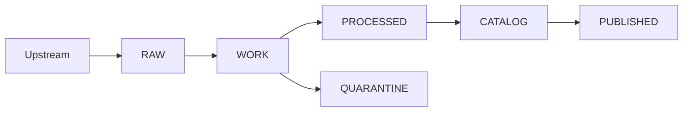

<!-- [KFM_META_BLOCK_V2]
doc_id: kfm://doc/2f4e98a6-8d7c-4c5f-9e0b-4d6bdc8b6a73
title: Promotion Gates
type: standard
version: v1
status: draft
owners: TBD (Data Stewardship + Platform)
created: 2026-03-01
updated: 2026-03-01
policy_label: public
related: []
tags: [kfm, data, governance, promotion, gates, ci]
notes:
  - This doc consolidates the “Promotion Contract” gate definitions and turns them into CI-/review-friendly checklists.
  - Source basis includes KFM vNext governance snapshots (Generated 2026-02-20) and the Architecture/Governance delivery plan briefing (Date: 2026-02-27).
[/KFM_META_BLOCK_V2] -->

# Promotion Gates
**Fail-closed gates that control when a dataset version is eligible for KFM runtime surfaces (API/UI).**


> **Contract stance:** Promotion is not “copying files.” Promotion is a governed decision that a specific *dataset version* has the required artifacts, validations, lineage, and policy labeling to be served from **PUBLISHED** surfaces.

---

## Quick navigation
- [Purpose and scope](#purpose-and-scope)
- [Truth path recap](#truth-path-recap)
- [Gate registry](#gate-registry)
- [Gate details](#gate-details)
- [PR-based promotion workflow](#pr-based-promotion-workflow)
- [Templates](#templates)
- [Verification checklist](#verification-checklist)
- [Appendix](#appendix)

---

## Purpose and scope

### Purpose
Define the minimum **Promotion Contract** gates that must pass before any dataset version can be:
1) **published** to runtime surfaces (API/UI), and  
2) treated as citeable and reproducible evidence.

### In scope
- Gates for dataset version promotion across the truth path.
- Required artifacts and validation expectations.
- Review responsibilities (Contributor vs Steward vs Operator).
- CI enforcement patterns and failure semantics.

### Out of scope
- How to write each validator (schema, geometry, raster, etc.).
- Domain-specific QA thresholds (these live in each dataset spec).
- UI publishing gates for narratives (Story Nodes) except where they depend on dataset promotion artifacts.

[Back to top](#promotion-gates)

---

## Truth path recap

KFM organizes data into storage + governance zones:



### Zone intent (summary)
- **RAW**: immutable acquisition artifacts + checksums (append-only).
- **WORK**: normalization + QA + candidate redactions/generalizations; *can be rewritten*.
- **QUARANTINE**: failed validation / unclear licensing / sensitivity concerns / unreproducible upstream; **not promotable**.
- **PROCESSED**: publishable artifacts in KFM-approved formats + checksums.
- **CATALOG (Triplet)**: cross-linked **DCAT + STAC + PROV** describing metadata, assets, and lineage.
- **PUBLISHED**: governed runtime surfaces; only promoted dataset versions are eligible.

> **Non-negotiable:** If a dataset version fails any required gate, it does **not** cross into **PUBLISHED**. It stays put (or is quarantined). Fail closed.

[Back to top](#promotion-gates)

---

## Gate registry

### Gate legend
- **REQUIRED**: must pass to promote a dataset version.
- **OPTIONAL (Recommended)**: not required for initial promotion in some flows, but recommended for production posture.
- **PROPOSED**: included as a consolidation/implementation detail; confirm with repo owners before treating as hard gate.

### Gate crosswalk (why you may see different labels)
Some source materials enumerate gates slightly differently (e.g., one list calls “QA thresholds” and “release manifest” explicit gates, while another folds them into broader categories). This doc treats them as **required behaviors**, regardless of exact naming, and records them as explicit checks.

---

## Gate matrix

| Gate | Name | Required | Primary objective | Typical enforcement point |
|---:|---|:---:|---|---|
| A | Identity and versioning | ✅ | Stable dataset identity; immutable dataset version derived from deterministic `spec_hash` | CI + review |
| B | Licensing and rights | ✅ | No unclear/unknown rights promoted; preserve terms snapshot | CI + steward |
| C | Sensitivity classification and redaction plan | ✅ | Assign `policy_label`; record obligations/redactions in lineage | CI + steward |
| D | Catalog triplet validation | ✅ | DCAT/STAC/PROV validate and cross-link; EvidenceRefs resolve deterministically | CI |
| E | QA thresholds | ✅ | Dataset-specific QA documented + passes, else quarantine | CI |
| F | Run receipt and checksums + audit record | ✅ | Inputs/outputs + digests + environment captured for every producing run | CI |
| G | Policy tests and contract tests | ✅ | OPA tests pass; evidence resolver + API/contracts validate | CI |
| H | Promotion / release manifest | 🧪 (see note) | Record promotion as a manifest referencing artifacts + digests + approvals | CI + release tooling |
| X | Production posture hardening | ⚪ Optional | SBOM/build provenance, perf + accessibility smoke checks | CI (optional gates) |

> **Note on Gate H:** A promotion/release manifest template exists and a release-manifest gate appears in some operational plans. Treat this as **required for a fully-governed promotion** unless the repo has an explicit exception process.

[Back to top](#promotion-gates)

---

## Gate details

### Gate A — Identity and versioning (REQUIRED)
**Intent:** Everything must be citeable and reproducible. Without stable identity, you cannot cache, diff, attribute, or roll back.

**Required evidence**
- Stable `dataset_id` (slug) used across catalogs + UI surfaces.
- Immutable `dataset_version_id` derived from a deterministic `spec_hash`.
- Content digests for promoted artifacts.

**Fail closed**
- If identity is missing or `spec_hash` is non-deterministic → block promotion.

**Implementation notes (typical)**
- Canonicalize spec content before hashing (no whitespace drift).
- Prevent “silent drift”: spec changes must change `spec_hash` and therefore `dataset_version_id`.

---

### Gate B — Licensing and rights metadata (REQUIRED)
**Intent:** Licensing is not paperwork; it is a policy input.

**Required evidence**
- Explicit license (or rights statement) compatible with intended use.
- Rights holder and attribution requirements captured.
- Snapshot of upstream terms stored alongside acquisition (RAW).

**Fail closed**
- If license is unclear/unknown → **QUARANTINE** (no promotion).

**Implementation notes (typical)**
- License allowlist/denylist policy gate in CI.
- Automated checks that required attribution is present in export surfaces.

---

### Gate C — Sensitivity classification and redaction plan (REQUIRED)
**Intent:** Assign a `policy_label` and prove you can honor obligations.

**Required evidence**
- `policy_label` assigned (e.g., `public`, `restricted`, etc.).
- If sensitive-location or restricted data: a redaction/generalization plan exists and is recorded in **PROV**.

**Fail closed**
- If policy label missing → block.
- If obligations required but not implemented → block.

**Implementation notes (typical)**
- OPA/Rego is deny-by-default; allow promotion only when required policy fields exist and obligations are satisfied.

---

### Gate D — Catalog triplet validation (REQUIRED)
**Intent:** Catalogs are contract surfaces between pipelines and runtime.

**Required evidence**
- **DCAT** record exists and validates against KFM profile.
- **STAC** collection/items exist (if applicable) and validate against KFM profile.
- **PROV** bundle exists and validates against KFM profile.
- Cross-links between DCAT, STAC, PROV are present and resolvable (no guessing).

**Fail closed**
- If any catalog invalid or cross-links broken → block promotion.

**Implementation notes (typical)**
- Add a link-checker that verifies cross-links for every promoted dataset version.
- Ensure EvidenceRefs are resolvable deterministically (e.g., `dcat://`, `stac://`, `prov://`, `doc://`).

---

### Gate E — QA thresholds (REQUIRED)
**Intent:** The dataset’s quality and completeness constraints must be explicit and satisfied.

**Required evidence**
- Dataset-specific QA checks + thresholds are documented in the dataset spec.
- QA report exists and thresholds pass.

**Fail closed**
- QA failure → quarantine or block.
- Missing QA definition → block (no “implicit QA”).

**Implementation notes (typical)**
- QA checks can include schema conformity, geometry validity, raster ranges/stats, null/uniqueness constraints, and field domain rules.
- Treat QA artifacts as first-class: store report digests and link into the promotion manifest.

---

### Gate F — Run receipt and checksums + audit record (REQUIRED)
**Intent:** Every producing run must emit a receipt that makes the run reviewable and reproducible.

**Required evidence**
- `run_receipt` exists for each producing run.
- Inputs and outputs enumerated with checksums/digests.
- Environment recorded (container image digest, parameters).

**Fail closed**
- Missing receipts/digests → block promotion.

**Implementation notes (typical)**
- Receipts should be schema-validated.
- Consider signatures/attestations for receipts and pipeline images (especially for production posture).

---

### Gate G — Policy tests and contract tests (REQUIRED)
**Intent:** “Governance intent” becomes enforceable behavior only if tests prove it.

**Required evidence**
- OPA policy tests pass for the dataset version (fixtures-driven).
- Evidence resolver can resolve at least one EvidenceRef for the dataset version in CI.
- API contracts and schemas validate.

**Fail closed**
- Any policy test failure → block promotion.
- EvidenceRefs that do not resolve in CI → block (no “runtime only” surprises).

---

### Gate H — Promotion / release manifest (PROPOSED baseline)
**Intent:** Promotion must be recorded as a reproducible release event.

**Required evidence**
- A promotion manifest (release manifest) exists that references artifacts and digests, plus QA + policy + approvals.

**Fail closed (recommended)**
- No manifest → do not treat as promoted (avoid “ghost promotions”).

> If your repo already has a different mechanism (e.g., tags + release notes + catalog pointers), document that mechanism here and ensure it is digest-addressed and reviewable.

---

### Gate X — Production posture hardening (OPTIONAL but recommended)
**Recommended evidence**
- SBOM and build provenance for pipeline images and API/UI artifacts.
- Performance smoke checks (e.g., tile rendering, evidence-resolve latency).
- Accessibility smoke checks for UI (e.g., keyboard navigation for evidence drawer).

[Back to top](#promotion-gates)

---

## PR-based promotion workflow

A practical PR-based workflow makes promotion both *social* (review) and *technical* (CI-enforced):

```mermaid
sequenceDiagram
  participant Dev as Contributor
  participant CI as CI Gates
  participant Steward as Data Steward
  participant Ops as Operator
  Dev->>CI: Open PR (registry + spec + fixtures + expected outputs)
  CI-->>Dev: Validate schemas, policy tests, spec_hash stability, link checks
  Dev->>Steward: Request review (license + sensitivity + policy_label)
  Steward-->>Dev: Approve / request changes
  Ops->>Ops: Merge + run pipeline in controlled env
  Ops-->>CI: Write processed + catalogs + receipts
  CI-->>Ops: Validate triplet + receipts; generate promotion manifest
  Ops-->>Dev: Tag/release (promotion recorded)
```

[Back to top](#promotion-gates)

---

## Templates

### Promotion manifest (v1) — example JSON
> This is the promotion record: artifacts + catalogs + QA + policy + approvals.

```json
{
  "kfm_promotion_manifest_version": "v1",
  "dataset_slug": "example_dataset",
  "dataset_version_id": "YYYY-MM.abcd1234",
  "spec_hash": "sha256:abcd1234...",
  "released_at": "RFC3339",
  "artifacts": [
    { "path": "outputs/example.parquet", "digest": "sha256:...", "media_type": "application/x-parquet" }
  ],
  "catalogs": [
    { "path": "catalog/dcat.jsonld", "digest": "sha256:..." },
    { "path": "stac/collection.json", "digest": "sha256:..." },
    { "path": "prov/bundle.jsonld", "digest": "sha256:..." }
  ],
  "qa": { "status": "pass", "report_digest": "sha256:..." },
  "policy": { "policy_label": "public", "decision_id": "kfm://policy_decision/..." },
  "approvals": [
    { "role": "steward", "principal": "<id>", "approved_at": "RFC3339" }
  ]
}
```

### PR checklist (drop-in)
- [ ] Gate A: `dataset_id`, `dataset_version_id`, `spec_hash` deterministic
- [ ] Gate B: license/rights + upstream terms snapshot present
- [ ] Gate C: `policy_label` assigned; obligations documented; PROV references added
- [ ] Gate D: DCAT/STAC/PROV validate + cross-link
- [ ] Gate E: QA checks defined + report passes (or quarantine with reasons)
- [ ] Gate F: run receipts exist; digests verified; env captured
- [ ] Gate G: OPA/policy tests pass; EvidenceRef resolves in CI; contracts validate
- [ ] Gate H: promotion manifest generated + reviewed (or documented alternative)
- [ ] (Optional) Gate X: SBOM/provenance + perf + accessibility smoke checks

[Back to top](#promotion-gates)

---

## Verification checklist

> Use this section when wiring CI and reviewing whether the repo truly enforces “fail closed.”

### Required invariants (must be testable)
- [ ] Promotion blocks when any required artifact is missing.
- [ ] QUARANTINE cannot be bypassed (unclear license/sensitivity → no publish).
- [ ] Catalog triplet cross-links are validated automatically.
- [ ] EvidenceRefs resolve deterministically (no guessing, no implicit mapping).
- [ ] Run receipts enumerate inputs/outputs + digests + environment.
- [ ] Policy tests are deny-by-default and fixture-driven.

### Minimum “green pipeline” definition
A dataset version is promotable only when:
- processed artifacts exist in approved formats and are digest-addressed,
- catalog triplet validates and cross-links,
- receipts exist and validate,
- policy label is assigned,
- QA thresholds pass,
- promotion manifest exists (or approved alternative is documented).

---

## Appendix

<details>
<summary><strong>Recommended doc maintenance rules</strong></summary>

- Update gate descriptions only via PR with explicit rationale (avoid silent governance drift).
- If a gate is waived, record the waiver in the promotion manifest (or equivalent) with:
  - who approved,
  - why,
  - expiration date or remediation plan.
- Prefer adding new gates as “OPTIONAL” first, then promote to “REQUIRED” after tooling exists.

</details>
