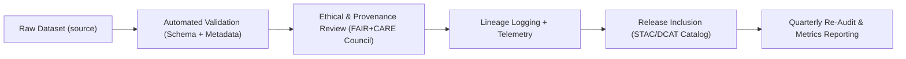

<div align="center">

# 🧮 **Kansas Frontier Matrix — Data Quality & Validation Framework**
`docs/data/quality/README.md`

**Purpose:**  
Define how **data quality, completeness, and provenance integrity** are evaluated within the **Kansas Frontier Matrix (KFM)** ecosystem.  
This framework ensures all datasets conform to **FAIR+CARE**, **ISO 19157**, and **Master Coder Protocol (MCP v6.3)** reproducibility requirements.

[](../../README.md)
[](../../standards/faircare.md)
[](../../../LICENSE)
[](../../../releases/v10.0.0/manifest.zip)

</div>

---

## 📘 Overview

Data quality in the Kansas Frontier Matrix (KFM) is a measurable, transparent, and ethical process that balances **scientific accuracy** with **cultural sensitivity**.  
This document outlines how datasets undergo **automated validation**, **manual inspection**, and **FAIR+CARE ethical review** prior to ingestion into the KFM knowledge graph.

The validation pipeline assesses:
- Schema and metadata completeness  
- Provenance accuracy and lineage traceability  
- FAIR+CARE ethical data handling  
- Statistical and spatial integrity  
- Version reproducibility  

---

## 🗂️ Directory Layout

```
docs/data/quality/
├── README.md                      # This file
├── completeness-audit.json        # Data completeness & field coverage metrics
├── metadata-lint.json             # Metadata and schema validation report
├── spatial-accuracy.json          # GIS precision and CRS conformity
└── faircare-audit-summary.md      # Ethical data quality summary (CARE compliance)
```

---

## ⚙️ Data Validation Workflows

| Workflow | Function | Frequency | Output |
|---|---|---|---|
| `data-quality.yml` | Validates completeness, accuracy, and precision for each dataset. | Quarterly | `reports/data/completeness.json` |
| `metadata-lint.yml` | Checks metadata fields for required FAIR descriptors. | Continuous | `docs/data/quality/metadata-lint.json` |
| `data-provenance.yml` | Verifies data lineage, licensing, and consent metadata. | Quarterly | `reports/data/provenance-summary.json` |
| `faircare-audit.yml` | Conducts ethical quality validation against CARE standards. | Quarterly | `reports/data/faircare-validation.json` |

All quality reports are automatically versioned and linked to the corresponding release manifest.

---

## 🧩 Validation Dimensions

### 1️⃣ Structural Integrity (Schema Compliance)
- All datasets must align with **data-contract-v3.json**.  
- JSON Schema validation ensures correct field types, null handling, and required keys.  
- Cross-field consistency checks prevent orphaned metadata (e.g., missing spatial bounding box).  

**Example Failure:**
```json
{
  "field": "temporal.end",
  "error": "Invalid date format; expected ISO 8601.",
  "dataset_id": "ks_soils_1967"
}
```

---

### 2️⃣ Metadata Completeness
KFM uses **ISO 19115-1** and **DCAT 3.0** fields to ensure metadata is descriptive and machine-readable.

| Field | Required | Description |
|---|---|---|
| `title` | ✅ | Dataset title for identification. |
| `description` | ✅ | Abstract summarizing dataset context. |
| `spatial` | ✅ | Bounding box or CRS for spatial assets. |
| `temporal` | ✅ | Time range covered by data. |
| `provenance` | ✅ | Source, author, and consent metadata. |
| `license` | ✅ | SPDX or CC identifier for reuse. |
| `keywords` | — | Searchable descriptors for STAC/DCAT catalogs. |

> Target completeness threshold: **≥ 98% metadata field coverage per dataset.**

---

### 3️⃣ Spatial Accuracy & CRS Validation
- Validates coordinate reference systems (EPSG:4326 or aligned CRS).  
- Ensures GIS geometries (points, polygons) are valid and topologically correct.  
- Measures horizontal positional accuracy within ±5 meters.  
- Reprojects inconsistent coordinate systems automatically.

**Tools:** GDAL, pyproj, QGIS CLI, GeoPandas validation utilities.

---

### 4️⃣ Provenance & Consent Verification
Every dataset must include **consent provenance metadata**:
```json
"provenance": {
  "creator": "Kansas Geological Survey",
  "source_url": "https://archivehub.kansasgis.org/1894_topo",
  "consent": "Approved under FAIR+CARE Council, 2025-Q2"
}
```

- Verified using `data-provenance.yml`.  
- Consent, authorship, and checksum hashes stored in **telemetry lineage logs**.  
- Datasets failing provenance validation cannot be promoted to production.

---

### 5️⃣ FAIR+CARE Ethical Quality Checks
CARE integration ensures that ethical obligations are treated as quality parameters.

| CARE Principle | Quality Criteria | Pass Threshold |
|---|---|---|
| **Collective Benefit** | Dataset provides documented public or cultural value. | Required |
| **Authority to Control** | Consent metadata verified. | 100% |
| **Responsibility** | Review council and data stewards documented. | Required |
| **Ethics** | Dataset language and imagery reviewed for cultural sensitivity. | 100% |

> Any dataset failing **CARE validation** enters “restricted” status and is excluded from open release until compliance is achieved.

---

## 📊 Key Quality Metrics

| Metric | Definition | Target |
|---|---|---|
| **Schema Conformance** | % of datasets passing JSON Schema validation. | 100% |
| **Metadata Completeness** | % of mandatory metadata fields populated. | ≥ 98% |
| **Spatial Accuracy** | Deviation from verified coordinate benchmarks. | ≤ 5m |
| **Checksum Integrity** | % of verified SHA256 hashes. | 100% |
| **FAIR+CARE Ethical Compliance** | Cultural and consent validation rate. | ≥ 90% |

---

## 🧮 Data Quality Scoring System

KFM computes a **composite Data Quality Index (DQI)** per dataset:

```math
DQI = (S * 0.25) + (M * 0.25) + (P * 0.20) + (E * 0.30)
```

Where:  
- **S** = Schema Conformance (%)  
- **M** = Metadata Completeness (%)  
- **P** = Provenance Integrity (%)  
- **E** = Ethical Compliance (%)  

**Passing Threshold:** DQI ≥ 90 → Eligible for public catalog release.  
Scores < 80 trigger remediation workflows.

---

## 🧠 Continuous Validation Lifecycle



All validation steps are fully auditable via logs in `reports/data/` and telemetry JSON files.

---

## 🧾 Example Quality Report (Excerpt)

```json
{
  "dataset_id": "usgs_historic_topo_1894",
  "schema_compliance": 100,
  "metadata_completeness": 98.5,
  "spatial_accuracy_m": 4.7,
  "faircare_score": 95,
  "dqi_score": 96.2,
  "status": "approved"
}
```

---

## ⚖️ Governance & Reporting

| Report | Maintainer | Frequency | Output |
|---|---|---|---|
| **Data Completeness Audit** | Data QA Team | Quarterly | `completeness-audit.json` |
| **Metadata Lint Summary** | FAIR+CARE Council | Continuous | `metadata-lint.json` |
| **Ethical Audit Report** | FAIR+CARE Council | Biannual | `faircare-audit-summary.md` |
| **Spatial QA Validation** | GIS Engineers | Continuous | `spatial-accuracy.json` |

---

## 🕰️ Version History

| Version | Date | Author | Summary |
|---|---|---|---|
| v10.0.0 | 2025-11-10 | FAIR+CARE Data Quality Council | Created full data quality and validation framework, including DQI scoring, provenance checks, spatial accuracy, and CARE compliance integration. |

---

<div align="center">

**© 2025 Kansas Frontier Matrix — MIT / CC-BY 4.0**  
Maintained under **Master Coder Protocol v6.3** · Audited by **FAIR+CARE Data Quality Council**  
[⬅ Back to Data Index](../README.md) · [Data Contracts →](../contracts/README.md)

</div>