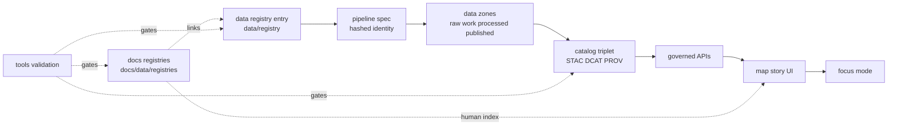

<!-- [KFM_META_BLOCK_V2]
doc_id: kfm://doc/6c4a7f5d-0c98-4bb0-9f40-98e3ab2a1f41
title: docs/data/registries
type: standard
version: v1
status: draft
owners: TODO:kfm-governance
created: 2026-03-01
updated: 2026-03-01
policy_label: public
related:
  - ../README.md
  - ../../datasets/README.md
  - ../../../data/registry/README.md
  - ./vocabulary/README.md
tags: [kfm, docs, data, registries, governance]
notes:
  - Human-readable indices for discovery + review routing.
  - Must not drift from canonical machine registries and catalog/provenance outputs.
[/KFM_META_BLOCK_V2] -->

<a id="top"></a>

# docs/data/registries
Optional, **human-readable indices** for datasets, sources, owners, tags, and controlled vocabularies—kept aligned with governed registry + catalog surfaces.


 <!-- TODO: replace with real CI badge/check name -->

## Quick navigation
- [What this folder is](#what-this-folder-is)
- [Where it fits in KFM](#where-it-fits-in-kfm)
- [Directory contract](#directory-contract)
- [Current registries](#current-registries)
- [How to update](#how-to-update)
- [Validation and CI gates](#validation-and-ci-gates)
- [Sync policy and drift prevention](#sync-policy-and-drift-prevention)
- [Directory layout](#directory-layout)
- [Definition of done](#definition-of-done)
- [References](#references)

---

## What this folder is
This directory holds **small, reviewable “index” registries** that help humans answer questions like:

- “What datasets do we have, and what is their current status?”
- “Who owns this dataset, and who should review changes?”
- “What upstream sources feed KFM?”
- “What tags/facets do we want to expose consistently in docs and UI?”

**This folder is intentionally not the canonical machine onboarding registry.** Think of it as the “docs-friendly” layer that points to the governed sources of truth.

> **NOTE (truth discipline)**  
> Use these tags mentally (and explicitly when needed):
> - **CONFIRMED** — backed by repo artifacts that exist on the active branch.
> - **PROPOSED** — a recommended pattern / future wiring.
> - **UNKNOWN** — needs verification; treat as fail-closed until confirmed.

[↑ Back to top](#top)

---

## Where it fits in KFM
These registries are part of the end-to-end governed system:

- **Machine onboarding registry (canonical):** `data/registry/` (reviewable contract surface that drives dataset onboarding)  
- **Dataset documentation packages:** `docs/data/datasets/` (per-dataset manifests, schema, QA, provenance, receipts)  
- **Validation:** `tools/validation/` (validators + governance gates)

This folder (`docs/data/registries/`) is a **human discovery and routing aid** that should link to, or be derived from, the canonical sources above.



> **IMPORTANT**  
> If a registry field starts behaving like a contract surface (validators depend on it, policy depends on it, UI facets depend on it), it must be treated as governed: **version it, validate it, and fail closed**.

[↑ Back to top](#top)

---

## Directory contract

### ✅ Acceptable inputs
- Small **CSV/YAML registries** that summarize or route to canonical artifacts
- Controlled vocabulary documentation (see [`vocabulary/`](./vocabulary/README.md))
- Short notes that explain how to keep registries in sync (no secrets)

### ❌ Exclusions
- Bulk data extracts (CSV/Parquet/raster dumps)
- Secrets (tokens, keys, connection strings), even in examples
- Unredacted PII/PHI or restricted personal data
- Exact coordinates for vulnerable/private/culturally restricted locations
- Anything that should live in the canonical machine registry (`data/registry/`) instead of docs

[↑ Back to top](#top)

---

## Current registries

| Artifact | Format | Status | Purpose |
|---|---|---|---|
| `README.md` | Markdown | **CONFIRMED** | Folder contract + how to use/update registries |
| `datasets.csv` | CSV | **CONFIRMED** | Minimal dataset index (`dataset_id`, `title`, `status`) |
| `sources.csv` | CSV | **CONFIRMED** | Minimal upstream source index (`source_id`, `name`, `type`) |
| `owners.yaml` | YAML | **CONFIRMED** | Directory of owners/stewards used for routing review |
| `tags.yaml` | YAML | **CONFIRMED** | Tags/facets list (keep controlled and documented) |
| `vocabulary/` | dir | **CONFIRMED** | Controlled vocabulary guidance for policy/catalog/UI facets |

> **PROPOSED (future)**  
> If these registries become heavily used, consider:
> - adding schemas + validation for these files (JSON Schema or custom validator),
> - generating the CSVs from the canonical machine registry (`data/registry/`) to prevent drift,
> - exposing controlled vocabularies via governed APIs for UI facets.

[↑ Back to top](#top)

---

## How to update

### 1) Update `datasets.csv`
Current header (do not change lightly):
```csv
dataset_id,title,status
```

**Recommended conventions**
- `dataset_id`: stable identifier (prefer a `kfm://dataset/...` style, aligned with `data/registry/`)
- `title`: human-readable name
- `status`: keep a small set, e.g. `draft`, `active`, `deprecated`, `quarantine`

Example row:
```csv
kfm://dataset/example_counties,Kansas Counties,draft
```

> **NOTE**  
> If you need more columns, treat it as a breaking change:
> - add a versioned file (e.g., `datasets.v2.csv`) **or**
> - migrate to YAML with a defined schema.

### 2) Update `sources.csv`
Current header:
```csv
source_id,name,type
```

Recommended conventions
- `source_id`: stable id (prefer `kfm://source/...` or another stable namespace)
- `type`: keep controlled values (e.g., `api`, `download`, `partner_delivery`, `manual`, `archive`)

Example row:
```csv
kfm://source/example_agency,Example Agency,api
```

### 3) Update `owners.yaml`
Current structure is a top-level list: `owners: []`.

**Recommended owner entry shape (PROPOSED)**
```yaml
owners:
  - owner_id: kfm://owner/example_team
    name: Example Team
    contact: example@example.org
    roles: [data_owner, steward]
    notes: "Optional routing notes"
```

### 4) Update `tags.yaml`
Current structure is a top-level list: `tags: []`.

**Recommended tag entry shape (PROPOSED)**
```yaml
tags:
  - id: land_use
    label: Land Use
    description: "Land cover and land use classification"
    introduced_in: 2026-03-01
```

### 5) Controlled vocabulary changes
If a field becomes a hard contract surface (policy labels, artifact zones, citation kinds), document and govern it under:
- [`vocabulary/`](./vocabulary/README.md)

> **WARNING**  
> Changing/removing a controlled term can be a breaking change for catalogs, policy, and UI facets. Prefer **add + deprecate** over rename/remove.

[↑ Back to top](#top)

---

## Validation and CI gates
This folder is part of the governed documentation surface. At minimum:

- Run doc validation (preferred via the repo’s validation toolkit):
  ```bash
  make validate-docs
  # or
  python -m tools.validation docs ./docs
  ```

- Enforce “no secrets in docs” and “no sensitive coordinates” expectations.

> **PROPOSED gate (recommended)**  
> Add a validator that checks:
> - CSV headers match expected schemas,
> - `dataset_id` values are unique and resolvable (link to `data/registry` entry and/or `docs/data/datasets` package),
> - tags are controlled (no free-text drift),
> - vocabulary docs stay in sync with allowed enum values where used.

[↑ Back to top](#top)

---

## Sync policy and drift prevention
To keep the trust membrane intact:

1. **Pick canonical sources of truth**
   - Canonical onboarding registry: `data/registry/`
   - Canonical “what shipped”: catalogs + provenance (STAC/DCAT/PROV) + receipts
   - Canonical dataset narrative docs: `docs/data/datasets/`

2. **Treat this folder as an index**
   - Prefer linking or generation over duplication.
   - If you duplicate, you must define a sync rule (what updates what, and when).

3. **Fail closed on ambiguity**
   - If license/sensitivity/ownership is unclear, do not “paper over” with a friendly row—route to quarantine / governance review in the canonical registry.

[↑ Back to top](#top)

---

## Directory layout

### Current (CONFIRMED)
```text
docs/data/registries/
├─ README.md
├─ datasets.csv
├─ sources.csv
├─ owners.yaml
├─ tags.yaml
└─ vocabulary/
   └─ README.md
```

### Recommended expansion (PROPOSED)
```text
docs/data/registries/
├─ schemas/                 # optional: schema/contracts for these doc registries
├─ fixtures/                # optional: golden examples + negative cases
└─ CHANGELOG.md             # optional: record registry-breaking changes
```

[↑ Back to top](#top)

---

## Definition of done
A registry change is ready to merge when:

- [ ] Registry change is **small and reviewable**
- [ ] No secrets or restricted details are introduced
- [ ] If adding new `status`, `type`, `tag`, etc., you also:
  - [ ] document it (and/or add to controlled vocabulary),
  - [ ] update any examples/fixtures that rely on it
- [ ] Validation runs cleanly (`tools/validation` lane for docs, if wired)
- [ ] Drift risk is addressed (link to canonical artifacts or define sync rule)

[↑ Back to top](#top)

---

## References
- `docs/data/` overview: [`../README.md`](../README.md)
- Dataset documentation packages: [`../datasets/README.md`](../datasets/README.md)
- Machine onboarding registry: [`../../../data/registry/README.md`](../../../data/registry/README.md)
- Controlled vocabularies: [`./vocabulary/README.md`](./vocabulary/README.md)
- Validation toolkit: [`../../../tools/validation/README.md`](../../../tools/validation/README.md)
