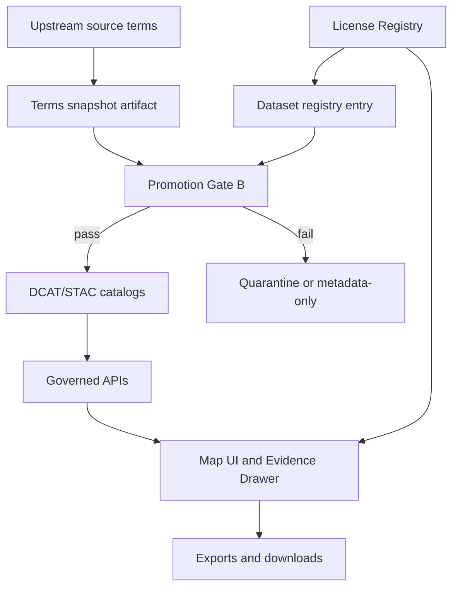

<!-- [KFM_META_BLOCK_V2]
doc_id: kfm://doc/55c55308-eb3e-40bc-9748-37be388c4011
title: License Registry
type: standard
version: v1
status: draft
owners: kfm-governance (TBD)
created: 2026-03-01
updated: 2026-03-01
policy_label: public
related:
  - docs/data/registries/README.md
  - data/registry/** (dataset registry entries)
  - policy/** (license allowlist + enforcement rules)
tags: [kfm, registry, licensing, compliance]
notes:
  - This is a human-readable registry. If a machine-readable allowlist exists, it must be kept in sync.
  - Paths under related are placeholders unless confirmed in repo.
[/KFM_META_BLOCK_V2] -->

# License Registry


Controlled vocabulary + governance rules for license/rights values used in KFM **dataset registry**, **DCAT/STAC catalogs**, **exports**, and the **Evidence Drawer**.

- **Cite-or-abstain posture:** licenses are **policy inputs**, not “metadata garnish”.
- **Fail closed:** a dataset **cannot be promoted** if licensing/rights are missing or unclear.

---

## Navigation

- [Purpose](#purpose)
- [Where this fits](#where-this-fits)
- [System behavior](#system-behavior)
- [Registry schema](#registry-schema)
- [Starter license table](#starter-license-table)
- [How to add or update a license](#how-to-add-or-update-a-license)
- [CI and promotion gates](#ci-and-promotion-gates)
- [FAQ](#faq)
- [Appendix](#appendix)

---

## Purpose

**CONFIRMED (design intent):**
- KFM must **encode rights metadata** and **enforce it** in **downloads/exports** and **UI display**.
- Promotion requires **license + rights holder** for every distribution.
- If rights do not allow mirroring, KFM may still catalog the dataset in **metadata-only reference** mode.
- Story publishing must **block** if rights are unclear for included media.

This registry exists to keep licensing consistent across:
1) dataset registry entries, 2) DCAT/STAC catalogs, 3) governed APIs, 4) UI export flows.

> “Online availability does not equal permission to reuse.”

---

## Where this fits

This file is a **human-readable** registry under:

- `docs/data/registries/licenses.md` (this file)

It is expected to be consumed by:
- dataset stewards authoring entries in the dataset registry
- pipeline authors generating DCAT/STAC/PROV
- policy authors implementing gates (CI + runtime)
- UI authors rendering license + attribution in Evidence Drawer and exports

**Not confirmed in repo:** where the canonical *machine-readable* license allowlist lives (e.g., `policy/rego/common/license_allowlist.rego`). If it exists, it MUST be kept in sync with this document.

---

## System behavior



**CONFIRMED (minimum behavior expected):**
- **Exports** must include **attribution and license text automatically**.
- **Evidence Drawer** must show **license and rights holder**, including **attribution text**.

---

## Registry schema

Each license in this registry is an *entry* that defines:
- a stable `license_id` used by dataset registry and catalogs
- the “shape” of obligations (attribution, share-alike, no-derivatives, etc.)
- whether KFM can mirror artifacts, or must remain metadata-only

### License entry fields

| Field | Type | Required | Meaning |
|---|---:|:---:|---|
| `license_id` | string | ✅ | KFM-controlled identifier (used in dataset registry + catalogs). |
| `label` | string | ✅ | Human readable name shown in UI. |
| `spdx_id` | string | ⛔️ | SPDX identifier when applicable (recommended). |
| `category` | enum | ✅ | `public_domain`, `open`, `reciprocal`, `restricted`, `unknown`. |
| `allow_mirror` | boolean | ✅ | May KFM store and serve full artifacts (PROCESSED/PUBLISHED), subject to policy? |
| `default_obligations` | list | ✅ | Obligations UI/API MUST enforce (attribution text, link, share-alike notice, etc.). |
| `notes` | string | ⛔️ | Steward guidance and edge cases. |

### Dataset registry requirements (ties to this registry)

**CONFIRMED (promotion gate intent):**
A dataset registry entry MUST carry:
- a license/rights field (mapped to a `license_id` from this registry)
- a **snapshot of upstream terms** (“terms snapshot artifact”)

In addition, KFM policy requires a **rights holder** for each distribution (dataset-level or distribution-level depending on your DCAT model).

---

## Starter license table

This is a **starter** allowlist to support early KFM onboarding. Expand over time, but keep it strict: allowlist > free-text.

| license_id | category | allow_mirror | default obligations | Notes |
|---|---|:---:|---|---|
| `public_domain` | public_domain | ✅ | `include_license_notice` | Still snapshot upstream terms; “public domain” can have jurisdictional nuance. |
| `CC0-1.0` | open | ✅ | `include_license_notice` | Use when upstream explicitly states CC0 (or equivalent). |
| `CC-BY-4.0` | open | ✅ | `attribution_required`, `include_license_notice` | Exports MUST attach attribution text. |
| `CC-BY-SA-4.0` | reciprocal | ✅ | `attribution_required`, `share_alike_notice`, `include_license_notice` | Reciprocal obligations must be surfaced in exports. |
| `ODC-By-1.0` | open | ✅ | `attribution_required`, `include_license_notice` | Common for data catalogs. |
| `ODbL-1.0` | reciprocal | ✅ | `attribution_required`, `share_alike_notice`, `include_license_notice` | Carefully handle derivative databases and tiles. |
| `proprietary` | restricted | ⛔️ | `no_export`, `metadata_only_ok`, `include_rights_holder` | Use when upstream terms prohibit redistribution. |
| `custom_terms` | restricted | ⛔️ | `no_export_until_review`, `metadata_only_ok` | Requires steward review + stored terms snapshot. |
| `unknown` | unknown | ⛔️ | `block_promotion`, `metadata_only_ok` | Default fail-closed classification. |

### Obligation types

Obligations are enforced at multiple layers (policy, API, UI). The list below is a starter vocabulary:

- `attribution_required`: UI/API MUST attach attribution text and rights holder to exports.
- `include_license_notice`: UI/API MUST display license label + identifier in Evidence Drawer and attach to exports.
- `share_alike_notice`: UI/API MUST warn that derivatives may need to preserve license (and enforce where applicable).
- `no_export`: API MUST not provide downloadable artifacts; UI must disable export.
- `no_export_until_review`: same as above, but indicates the steward must resolve license ambiguity.
- `metadata_only_ok`: cataloging without mirroring is allowed when rights prohibit copying.
- `block_promotion`: Promotion Gate B MUST fail (remain in quarantine) until resolved.
- `include_rights_holder`: ensure DCAT distributions carry rights holder.

---

## How to add or update a license

1. **Add a new row** to the [Starter license table](#starter-license-table) with:
   - stable `license_id`
   - category and `allow_mirror`
   - default obligations

2. **Add steward guidance**:
   - what upstream evidence qualifies (terms page, PDF, written permission, etc.)
   - what to do if terms conflict with an assumed license label

3. **Update CI gates** (if present):
   - ensure this new `license_id` is included in the machine-readable allowlist
   - add tests for: “missing license”, “unknown license”, and “license requires attribution”

4. **Update export rendering**:
   - Evidence Drawer: show license label + rights holder + attribution text
   - Export footer: include attribution + license notice consistently

---

## CI and promotion gates

### Promotion Gate B — Licensing & rights metadata

**CONFIRMED (promotion contract intent):**
Promotion to `PUBLISHED` is blocked unless:
- license/rights fields exist
- a terms snapshot artifact exists
- the license is not `unknown` (or otherwise disallowed)

### SPDX License Guard

**PROPOSED (drop-in gate pattern):**
A CI job can fail PRs when licensing signals are missing/invalid across:
- repo code
- STAC/DCAT license fields
- dataset registry license fields

If implemented, this should be a merge-blocking check and should output actionable remediation hints.

---

## FAQ

### Is “the data is online” enough?

No. “Online availability does not equal permission to reuse.” Always capture a **terms snapshot** and store it as an immutable artifact linked to the dataset version.

### What if I can’t determine the license?

Use `unknown` and keep the dataset in **quarantine** (or catalog it as **metadata-only** until resolved). Do not promote.

### Where do rights holder and attribution text live?

**Recommended:** dataset registry entries carry `rights_holder` and `attribution_text` so that:
- DCAT distributions can include rights holder metadata
- Evidence Drawer can render attribution consistently
- exports can append attribution automatically

(Exact field names depend on the dataset registry schema in the repo.)

---

## Appendix

### A. Dataset registry snippet (illustrative)

```yaml
dataset_id: noaa_storm_events
title: NOAA Storm Events
publisher: NOAA NCEI
license:
  id: public_domain
  terms_snapshot_ref: evidence://upstream/noaa/terms/2026-02-01
rights:
  rights_holder: "NOAA"
  attribution_text: "Source: NOAA NCEI Storm Events Database"
policy_label: public
upstream:
  access_method: bulk_csv
  cadence: monthly
```

> This YAML is illustrative; align field names with the repo’s dataset registry schema.

### B. Terms snapshot checklist (minimum)

- [ ] Capture the upstream license/terms page as PDF or screenshot
- [ ] Record retrieval date + URL
- [ ] Store in RAW (immutable) with checksum
- [ ] Link it from dataset registry and/or DCAT distribution as an evidence reference
