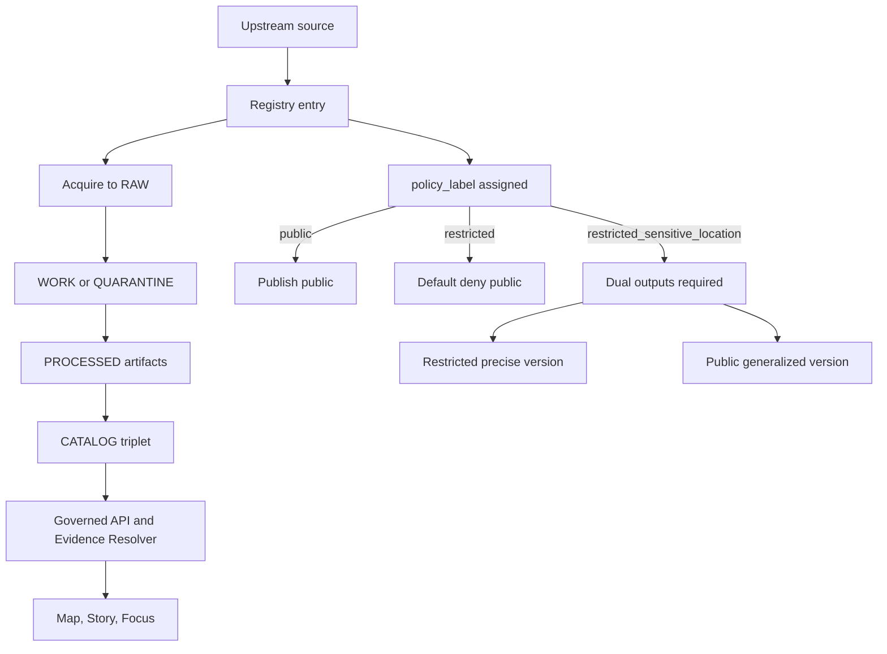

<!-- [KFM_META_BLOCK_V2]
doc_id: kfm://doc/9f5d0a0e-25de-4d9b-9d65-31c77a0f3b78
title: Sensitivity Registry
type: standard
version: v1
status: draft
owners: <TBD: Steward + Governance Council>
created: 2026-03-01
updated: 2026-03-01
policy_label: public
related:
  - kfm://doc/policy/labels
  - kfm://doc/promotion/contract
  - kfm://doc/policy/obligations
tags: [kfm, data, registry, sensitivity, policy, governance]
notes:
  - Defines the sensitivity rubric + controlled vocabulary used by registry entries and promotion gates.
  - This is a governed artifact: changes MUST be reviewed by the steward role.
[/KFM_META_BLOCK_V2] -->

<a id="top"></a>

# Sensitivity registry
**One-line purpose:** Define the sensitivity rubric + `policy_label` vocabulary used by KFM registries, promotion gates, governed APIs, and UI surfaces.


**Applies to:** Source registry entries, dataset specs, dataset versions, catalogs (DCAT/STAC), evidence bundles, story publishing, Focus Mode.

---

## Quick navigation
- [What this document is](#what-this-document-is)
- [Where it fits in the repo](#where-it-fits-in-the-repo)
- [Controlled vocabulary](#controlled-vocabulary)
- [Sensitivity rubric](#sensitivity-rubric)
- [Obligations and required transforms](#obligations-and-required-transforms)
- [Sensitive location release playbook](#sensitive-location-release-playbook)
- [Registry examples](#registry-examples)
- [Promotion and CI gates](#promotion-and-ci-gates)
- [FAQ](#faq)

---

## What this document is

KFM treats **sensitivity classification** as an enforceable input to:
- policy-as-code (CI + runtime)
- promotion gates
- evidence resolution
- UI/UX disclosure rules

In practice, sensitivity is expressed through a **controlled `policy_label`** plus (when needed) **obligations** (e.g., “generalize geometry” + “show notice”).

### Normative tags used here
- **CONFIRMED**: backed by KFM vNext guidance and/or contract fragments in the KFM source snapshots bundle.
- **PROPOSED**: a recommended default posture that must be reviewed and can change.
- **UNKNOWN**: requires confirmation from the live repo schemas/policies before being treated as enforced behavior.

> **Default-deny posture:** When uncertain, classify more restrictively and/or quarantine. Do not “guess public.”

---

## Where it fits in the repo

### Location
This file belongs at: `docs/data/registries/sensitivity.md`.

### Relationship to registry files
**Intended** to be the human-readable companion to (names are illustrative until confirmed in the repo):
- `data/registry/**` source registry entries (per-source onboarding)
- `data/registry/**` dataset entries / dataset specs
- schema(s) that validate registry entries and enforce vocabulary

### Acceptable inputs
- Controlled vocabulary definitions for `policy_label`
- Rubrics and decision trees for classification
- Required obligations/generalization patterns
- CI/promotion expectations related to sensitivity

### Exclusions
- Legal advice or contractual interpretation
- Storing/printing sensitive coordinates, PII, or partner-restricted fields
- Defining authentication providers (OIDC) or identity architecture beyond what’s required for policy labels
- UI implementation details beyond “what must be shown” obligations

---

## Controlled vocabulary

### `policy_label` starter set (PROPOSED starter list)
KFM maintains `policy_label` as a **controlled vocabulary** (versioned + validated). Start with:

| policy_label | Meaning | Default access posture | Typical usage |
|---|---|---|---|
| `public` | Safe for public consumption | allow (public read) | Most open data layers |
| `public_generalized` | Public derivative of sensitive data | allow (public read) + **UI notice obligation** | Generalized sensitive locations |
| `restricted` | Requires authorization | deny for public | Partner data; internal-only layers |
| `restricted_sensitive_location` | Precise locations protected | **default deny** | Archaeology sites, sensitive species, vulnerable sites |
| `internal` | Visible only to operators/stewards | deny for public | Ops metadata, internal QA layers |
| `embargoed` | Time-limited restriction pending release | deny for public | Pre-release datasets |
| `quarantine` | Not promotable; unresolved concerns | deny for public | Unclear rights, sensitivity concerns, failed QA |

> NOTE: Treat the above as the **single source of truth** for allowed policy labels (no ad hoc labels). Any addition requires steward-reviewed vocabulary update + policy fixture updates.

---

## Sensitivity rubric

This section explains how to choose a `policy_label` and what extra work it implies.

### Step 0 — Fail-closed trigger conditions (CONFIRMED intent)
If **any** of the following are true, do **not** publish public outputs until resolved:
- rights/license unclear
- partner agreement not encoded
- sensitivity concerns unresolved
- validation failures that affect safety (e.g., geometry contains restricted fields/points)

**Result:** `policy_label = quarantine` (until resolved)

---

### Step 1 — Sensitive location check (CONFIRMED pattern; details PROPOSED)
Classify as `restricted_sensitive_location` if the dataset contains **precise** locations that would increase risk if exposed, including (examples):
- restricted archaeology site inventories
- sensitive species locations
- vulnerable cultural sites

**Default rule:** `restricted_sensitive_location` datasets are **default deny** for public access.

If the project allows any public representation:
- produce a **dual-output** approach:
  - **restricted precise** dataset version (restricted)
  - **public generalized** dataset version (`public_generalized`)

---

### Step 2 — PII and personal risk check (PROPOSED)
If the dataset includes PII or near-PII (names + addresses, contact info, unique IDs that can re-identify):
- Prefer `restricted` or `internal`
- If a public version is allowed, it MUST be a derived dataset with:
  - field removal/masking obligations
  - re-identification risk reviewed

> WARNING: “Public domain” licensing does not automatically mean “safe to publish without review.” Sensitivity is separate from rights.

---

### Step 3 — Operational sensitivity (PROPOSED)
If the dataset could expose system internals:
- `internal` for operational logs, infrastructure topology, credentials-adjacent metadata
- ensure receipts/logs are classified and redacted where needed

---

### Step 4 — Default to `public` (CONFIRMED posture)
If no constraints apply, classify as `public`.

---

## Obligations and required transforms

In KFM, **policy decisions can carry obligations**. Obligations are enforced at:
- **runtime** (governed API + evidence resolver)
- **publishing** (promotion gates)
- **UX** (notices + badges)

### Baseline obligation types (CONFIRMED minimal example + PROPOSED extensions)

**CONFIRMED example obligation**
- `show_notice`: display a user-facing notice when serving generalized data.

**PROPOSED additional obligation types (to be implemented as policy fixtures + enforcement)**
- `generalize_geometry`: apply an approved generalization transform
- `remove_fields`: drop restricted/PII fields from public outputs
- `suppress_download`: allow map visualization but block raw export for certain roles
- `rate_limit`: additional throttling for risk-managed datasets
- `require_attribution`: force attribution text in UI/export (ties to rights)

> NOTE: The UI may *display* obligations, but MUST NOT *decide* them. Policy is decided by the PDP and enforced by PEPs.

---

## Sensitive location release playbook

When a dataset is `restricted_sensitive_location`, use this playbook:

1. **Classification**
   - label as `restricted_sensitive_location`
2. **Dual outputs**
   - restricted precise dataset version
   - `public_generalized` dataset version (only if public representation is allowed)
3. **Generalization method**
   - choose and document the method (grid aggregation, dissolve, etc.)
4. **Testing**
   - confirm no precise coordinates leak (including in derived artifacts, receipts, logs, and story sidecars)
5. **UX notice**
   - UI indicates generalization + reason
6. **Governance review**
   - council/designated authority approves release criteria

---

## Geometry generalization methods

KFM maintains a starter controlled vocabulary for `geometry.generalization_method` (PROPOSED starter list):

- `centroid_only`
- `grid_aggregation_<cellsize>`
- `random_offset_<meters>`
- `dissolve_to_admin_unit`
- `bounding_box_only`
- `none`

> TIP: Prefer methods that reduce the risk of reverse-engineering precise points from artifacts (e.g., avoid “hidden precision” in attributes, tiles, or stable IDs).

---

## Registry examples

> These are **illustrative** examples aligned to KFM guidance. Verify exact schema field names in the live repo before enforcing.

### Example: public heritage register (safe)
```yaml
source_id: nps_nrhp
authority: National Park Service
domain: heritage
access_method: bulk/api
cadence: occasional
license/rights: public_domain
sensitivity: public
notes: register listings; do not confuse with sensitive site inventories
```

### Example: restricted sensitive archaeology sites (precise coordinates protected)
```yaml
source_id: state_archaeology_sites
authority: state partner
domain: heritage
access_method: partner
cadence: varies
license/rights: partner agreement
sensitivity: restricted_sensitive_location
notes: precise coordinates protected; publish generalized derivatives only if approved
```

---

## Promotion and CI gates

### Sensitivity is a promotion gate (CONFIRMED intent)
A dataset version MUST NOT be promoted to governed runtime surfaces unless:
- a `policy_label` is assigned
- obligations are defined where required (generalize geometry, remove fields, etc.)
- for sensitive/restricted datasets, a redaction/generalization plan exists and is recorded as lineage
- policy tests cover public vs restricted behavior and block merges on regressions

### Minimum CI checks for sensitivity (PROPOSED “must-have” list)
- [ ] Vocabulary validation: `policy_label` values are from the controlled list
- [ ] Policy fixture tests: public cannot read restricted
- [ ] Evidence resolver test: public role cannot resolve restricted evidence refs
- [ ] Leak checks: public artifacts do not contain precise geometry/fields
- [ ] Story/Focus checks: golden queries ensure no restricted policy labels appear in public answers

---

## Diagram: sensitivity as part of the truth path



---

## FAQ

### Why is “online availability” not enough to publish?
Sensitivity and rights are separate inputs. Even if data is publicly reachable, KFM treats **license/rights** and **sensitivity** as enforced promotion gates.

### Can we ever publish precise coordinates for sensitive locations?
Only if policy explicitly allows and governance review approves. Otherwise, publish generalized derivatives and keep precise datasets restricted.

### What if we’re unsure?
Fail closed:
- classify as `quarantine` or `restricted_sensitive_location` as appropriate
- require steward review
- do not publish public outputs

---

<a href="#top">Back to top</a>
