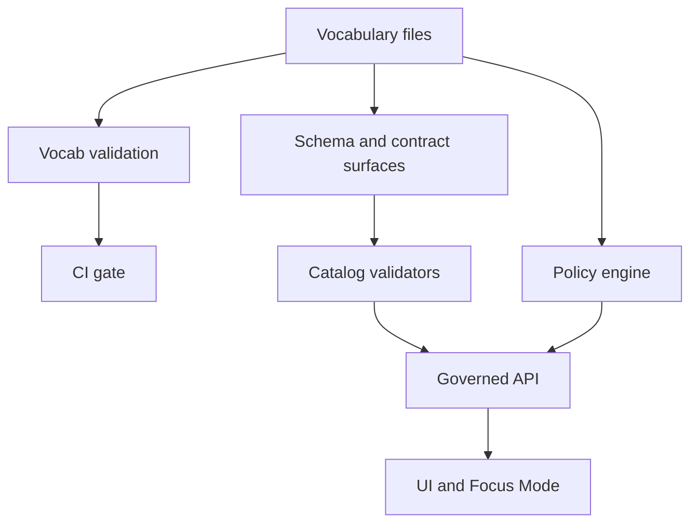

<!-- [KFM_META_BLOCK_V2]
doc_id: kfm://doc/7ec644d6-994e-49c8-ad82-31df709e0091
title: Vocabulary Registry
type: standard
version: v1
status: draft
owners: TODO:kfm-governance
created: 2026-03-01
updated: 2026-03-01
policy_label: public
related:
  - TODO:link-to-governance-guide
tags:
  - kfm
  - registry
  - vocabulary
  - governance
notes:
  - Controlled vocabularies used across catalogs, policy, and evidence.
  - Treat changes as contract changes (review + tests).
[/KFM_META_BLOCK_V2] -->

# KFM Vocabulary Registry
Canonical, versioned controlled vocabularies for **policy**, **catalogs (DCAT/STAC/PROV)**, **evidence/citations**, and **UI facets**.

> Status: **draft** • Owners: **TODO:kfm-governance** • Policy label: **public**


---

## Quick navigation
- [What this directory is](#what-this-directory-is)
- [Where it fits in KFM](#where-it-fits-in-kfm)
- [Current vocabularies](#current-vocabularies)
- [Conventions](#conventions)
- [Validation and CI gates](#validation-and-ci-gates)
- [How to add or change a term](#how-to-add-or-change-a-term)
- [Deprecation policy](#deprecation-policy)
- [Directory layout](#directory-layout)
- [Minimum verification steps](#minimum-verification-steps)

---

## What this directory is
This directory is the **registry of controlled vocabularies** that KFM uses anywhere a “string value” is actually a **contract surface**.

**Goals**
- Prevent “free-text drift” in critical fields (e.g., policy labels, artifact zones, citation kinds).
- Make validation **fail-closed**: if a value is not in the vocabulary, it is rejected.
- Keep semantics consistent across:
  - pipeline outputs,
  - catalogs (DCAT/STAC/PROV),
  - policy evaluation,
  - evidence resolution,
  - UI filters/facets.

**Non-goals**
- This is **not** a general tagging system.
- This is **not** a dataset-specific codebook directory (dataset-specific domains belong with that dataset’s spec/schema).

---

## Where it fits in KFM
Vocabularies are part of the **governed “truth path”**: they’re referenced by validators and policy, and must be stable enough to support reproducible catalogs and evidence resolution.



> NOTE: If the current repo wiring differs from this diagram, treat that as a defect: either update the wiring or update this README so they converge.

---

## Current vocabularies

### Registry table (authoritative “starter” vocabs)
These are the **baseline** KFM vocabularies that should exist and be maintained.

| Vocabulary | Purpose | Primary consumers | Term style |
|---|---|---|---|
| `policy_label` | Data classification input to policy evaluation; governs allow/deny + obligations | Policy engine, catalogs, evidence resolver, UI trust surface | `snake_case` |
| `artifact.zone` | Lifecycle zone for artifacts | Promotion manifests, catalogs, pipeline receipts | `lowercase` |
| `citation.kind` | What a “citation” points to (contract surface, not a raw URL) | Evidence resolution, Story Nodes, Focus Mode | `lowercase` |

### `policy_label` (starter list)
- `public`
- `public_generalized`
- `restricted`
- `restricted_sensitive_location`
- `internal`
- `embargoed`
- `quarantine`

### `artifact.zone` (starter list)
- `raw`
- `work`
- `processed`
- `catalog`
- `published`

### `citation.kind` (starter list)
- `dcat`
- `stac`
- `prov`
- `doc`
- `graph`
- `url` *(discouraged)*

---

## Conventions

### 1) Vocabulary identity
Each vocabulary MUST have:
- a stable name (e.g., `policy_label`, `artifact.zone`),
- a stable ID (recommended): `kfm://vocab/<name>`,
- a version (recommended): `v1`, `v2`, etc. (or semver).

### 2) Term rules
Unless a specific vocabulary says otherwise:
- Use **lowercase**.
- Prefer **snake_case** for multiword tokens.
- Avoid punctuation except `.` in vocabulary names (e.g., `artifact.zone`).

### 3) Term metadata (recommended)
For each term, allow optional metadata:
- `label` (human display string)
- `description`
- `introduced_in`
- `deprecated_in` (if applicable)
- `replaced_by` (if applicable)
- `aliases` (if you must support old spellings)

> PROPOSED: Store vocabularies as YAML for readability, but ensure a canonicalized JSON representation exists for hashing/diffing in CI.

---

## Validation and CI gates
Vocabularies are only useful if they are enforced.

**Minimum gates (expected)**
- A vocabulary validator runs in CI.
- Schemas/policies that reference vocab terms MUST fail if the vocabulary is missing or inconsistent.
- Any PR that changes a vocabulary MUST update:
  - fixtures/examples,
  - any JSON Schemas that use `enum` lists (or regeneration outputs),
  - any policy tests that depend on vocabulary values.

> PROPOSED gate: “No unknown `policy_label` values” across DCAT/STAC/PROV outputs for promoted dataset versions.

---

## How to add or change a term

### Add a term (preferred)
1. Add the term with metadata (`description`, `introduced_in`).
2. Update any:
   - schema enums / generators,
   - policy fixtures/tests,
   - catalog examples,
   - documentation examples.
3. Ensure CI passes.

### Change or remove a term (high risk)
Changing/removing a term is a **breaking change** unless handled as a deprecation.

If you *must* change semantics:
- Add a **new term**.
- Deprecate the old term (keep it accepted for a defined window).
- Add a mapping (`replaced_by`) and update runtime/pipeline translation.

---

## Deprecation policy
**Default**: don’t break downstream.

Recommended policy:
- Deprecate in `vN` (still accepted).
- Remove in `vN+2` after:
  - migration guidance exists,
  - all promoted artifacts/catalogs have been updated,
  - policy tests confirm nothing depends on the removed term.

---

## Directory layout
This is an **expected** layout. If the repo differs, update either the layout or this doc.

```text
docs/data/registries/vocabulary/
  README.md
  policy_label.vocab.yaml                  # recommended
  artifact.zone.vocab.yaml                 # recommended
  citation.kind.vocab.yaml                 # recommended
  schemas/
    vocab.schema.json                      # optional: schema for vocab files
  fixtures/
    valid/                                 # optional: “golden” vocab examples
    invalid/                               # optional: negative tests for CI
```

<details>
<summary>Example vocabulary file format (PROPOSED)</summary>

```yaml
# policy_label.vocab.yaml
vocab: policy_label
version: v1
terms:
  - id: public
    label: Public
    description: Public release allowed without redaction.
    introduced_in: 2026-02-20
  - id: public_generalized
    label: Public (generalized)
    description: Public release allowed only with geometry/attribute generalization obligations.
    introduced_in: 2026-02-20
```

</details>

---

## Minimum verification steps
Use this checklist to convert “intended contract” into “confirmed repo reality”:

- [ ] Confirm what vocabulary file format is used today (YAML/JSON/etc.).
- [ ] Confirm where vocabulary validation runs in CI (workflow + command).
- [ ] Confirm how schemas/policies import or reference vocabularies (direct `enum`, generator, or runtime lookup).
- [ ] Confirm whether these vocabularies are also surfaced via governed APIs for UI facet rendering.

---

### Back to top
[↑ Back to top](#kfm-vocabulary-registry)
