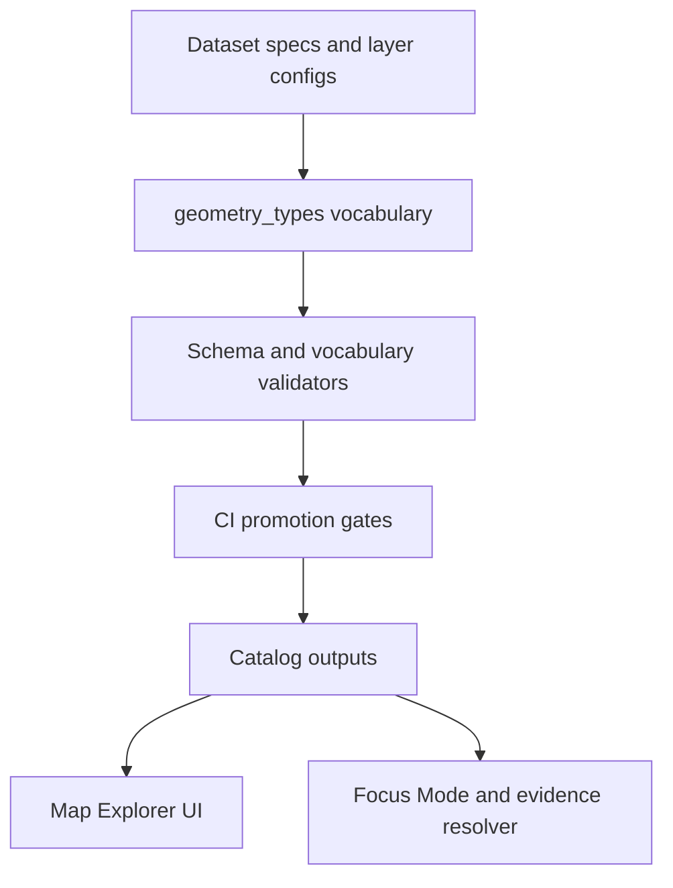

<!-- [KFM_META_BLOCK_V2]
doc_id: kfm://doc/732eb476-af4e-4666-bc01-af3990ecec89
title: Geometry Types Vocabulary
type: standard
version: v1
status: draft
owners: TBD
created: 2026-03-01
updated: 2026-03-01
policy_label: public
related:
  - docs/data/registries/vocabulary/
tags: [kfm, data, registry, vocabulary, geospatial]
notes:
  - Starter controlled vocabulary aligned to GeoJSON / OGC Simple Features and STAC constraints.
[/KFM_META_BLOCK_V2] -->

# Geometry Types Vocabulary

> **One-line purpose:** Canonical, case-sensitive geometry type strings for KFM registries and contracts.


## Quick links

- [Scope](#scope)
- [Where this fits](#where-this-fits)
- [Canonical values](#canonical-values)
- [Value definitions](#value-definitions)
- [Normalization rules](#normalization-rules)
- [Validation rules](#validation-rules)
- [Policy interactions](#policy-interactions)
- [Change control](#change-control)
- [Examples](#examples)
- [Appendix: Crosswalks](#appendix-crosswalks)

---

## Scope

This vocabulary covers **vector geometry types** represented as:

- **GeoJSON Geometry Objects** (e.g., as used by STAC Item `geometry`, API responses, and map feature payloads)
- **OGC Simple Features** geometry type names (for interoperability with common GIS tooling and spatial databases)

**Non-goals:**

- Enumerating coordinate reference systems (CRS) / EPSG codes (handled elsewhere)
- Enumerating raster “geometry” concepts (pixel grids, geotransforms, etc.)
- Enumerating PostGIS extended/curved/surface subtypes (unless explicitly added in a future version)

---

## Where this fits

This file lives under `docs/data/registries/vocabulary/` and is intended to be referenced by:

- dataset specs / layer configs that declare the geometry class of a vector layer
- catalog emitters (e.g., STAC/DCAT) that need consistent typing
- validation tooling (controlled-vocabulary checks) and CI gates



---

## Canonical values

**Allowed canonical strings (case-sensitive):**

- `Point`
- `MultiPoint`
- `LineString`
- `MultiLineString`
- `Polygon`
- `MultiPolygon`
- `GeometryCollection`

### Registry encoding

- **Canonical form MUST be stored exactly as listed above** (case-sensitive, no aliases).
- Source-system variants (e.g., `POINT`, `MULTIPOLYGON`) should be normalized during ingestion.

```yaml
# Example (YAML registry field)
geometry_type: Polygon
```

### STAC Item constraint

> [!IMPORTANT]
> STAC Item `geometry` allows GeoJSON geometry objects **except** `GeometryCollection`.
> If you are declaring the geometry type for a STAC Item footprint, do **not** use `GeometryCollection`.

---

## Value definitions

| Canonical value | Dimension | GeoJSON meaning (short) | Typical use |
|---|---:|---|---|
| `Point` | 0 | Single position | Stations, events, sample sites |
| `MultiPoint` | 0 | Array of positions | Multiple sites per feature |
| `LineString` | 1 | Line made of 2+ positions | Roads, rivers, paths |
| `MultiLineString` | 1 | Array of LineStrings | Discontinuous networks |
| `Polygon` | 2 | One exterior ring + optional holes | Parcels, admin areas, zones |
| `MultiPolygon` | 2 | Array of Polygons | Multi-part areas (islands) |
| `GeometryCollection` | mixed | Heterogeneous set of geometries | Rare; avoid unless necessary |

> [!NOTE]
> In GeoJSON, a “geometry type” is one of the case-sensitive strings above; **`Feature`** and
> **`FeatureCollection`** are *GeoJSON object types* but **not** geometry types.

---

## Normalization rules

When ingesting from external systems, normalize to the canonical strings:

- Trim whitespace.
- Normalize case:
  - `POINT` → `Point`
  - `MULTILINESTRING` → `MultiLineString`
- Reject unknown or ambiguous values (fail closed).

**Recommended mapping set (non-exhaustive):**

| Incoming | Canonical |
|---|---|
| `POINT` / `Point` | `Point` |
| `LINESTRING` / `LineString` | `LineString` |
| `POLYGON` / `Polygon` | `Polygon` |
| `MULTIPOINT` / `MultiPoint` | `MultiPoint` |
| `MULTILINESTRING` / `MultiLineString` | `MultiLineString` |
| `MULTIPOLYGON` / `MultiPolygon` | `MultiPolygon` |
| `GEOMETRYCOLLECTION` / `GeometryCollection` | `GeometryCollection` |

---

## Validation rules

### Minimal checks (MUST)

- Value is one of the **canonical strings** in [Canonical values](#canonical-values).
- If the value is used for **STAC Item footprints**, it MUST NOT be `GeometryCollection`.

### Recommended structural checks (SHOULD)

When a geometry payload is available (e.g., GeoJSON feature), validate consistency:

- `geometry.type` matches the declared `geometry_type`
- Coordinate structure matches the GeoJSON requirements for that geometry type:
  - `Point.coordinates` is a single position
  - `LineString.coordinates` is an array of 2+ positions
  - `Polygon.coordinates` is an array of linear rings; rings should be closed

> [!TIP]
> Keep “vocabulary validation” separate from “geometry validity” checks so CI output can tell you
> whether you failed because of *typing* vs. *bad coordinates*.

---

## Policy interactions

Some datasets may be published in **generalized** form for policy reasons (e.g., sensitive locations).

- **Generalization SHOULD NOT change the declared `geometry_type`** (it changes coordinate precision/shape, not the class).
- If generalization does require changing the geometry class (rare), treat it as a **material change** that must be documented in the dataset/version diff.

---

## Change control

This vocabulary is a governed artifact:

- Changes MUST be made via PR with review.
- Add/modify values only alongside:
  - schema updates (if any)
  - validator updates
  - at least one valid + one invalid fixture example

**Versioning rule of thumb:**

- **Patch**: clarifying text / examples (no semantic change)
- **Minor**: add new geometry type(s) in a backward-compatible way
- **Major**: remove/rename types or change canonical casing rules

---

## Examples

### GeoJSON Geometry example: Polygon

```json
{
  "type": "Polygon",
  "coordinates": [
    [
      [-101.0, 39.0],
      [-100.0, 39.0],
      [-100.0, 40.0],
      [-101.0, 40.0],
      [-101.0, 39.0]
    ]
  ]
}
```

### Registry record fragment

```yaml
dataset_id: example_county_boundaries
geometry_type: MultiPolygon
```

---

## Appendix: Crosswalks

### Crosswalk to OGC / spatial databases (typical)

| Canonical | Common database name |
|---|---|
| `Point` | `POINT` |
| `MultiPoint` | `MULTIPOINT` |
| `LineString` | `LINESTRING` |
| `MultiLineString` | `MULTILINESTRING` |
| `Polygon` | `POLYGON` |
| `MultiPolygon` | `MULTIPOLYGON` |
| `GeometryCollection` | `GEOMETRYCOLLECTION` |

### STAC Item footprint subset

STAC Items use GeoJSON geometry for `geometry`, with an explicit constraint that `GeometryCollection` is not allowed.

---

<details>
<summary>Appendix: Suggested machine-readable mirror (optional)</summary>

If you maintain machine-readable vocabularies (for CI validation), mirror the canonical strings in a small JSON file
(e.g., `.../geometry_types.json`) and treat that file as the validator source of truth, with this `.md` as the human doc.

</details>

---

_Back to top: [Quick links](#quick-links)_
