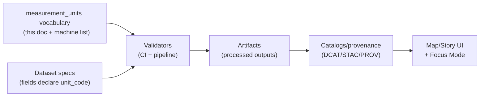

<!-- [KFM_META_BLOCK_V2]
doc_id: kfm://doc/e9b2d5e4-8f8a-4e3c-8db7-44d4dbe37b0f
title: Measurement units vocabulary
type: standard
version: v1
status: draft
owners: TBD
created: 2026-03-01
updated: 2026-03-01
policy_label: public
related:
  - ../../../..//data/registry/README.md
tags: [kfm, data, registry, vocabulary, units]
notes:
  - Starter vocabulary + rules; expand as datasets require.
  - Treat as governed: changes should be reviewed and tested.
[/KFM_META_BLOCK_V2] -->

# Measurement units vocabulary
**Purpose:** Controlled vocabulary + normalization rules for measurement units referenced by KFM dataset specs, catalogs/provenance, UI rendering, and Focus Mode explanations.


-lightgrey)

---

## Quick navigation
- [What lives here](#what-lives-here)
- [Where it fits in the KFM truth path](#where-it-fits-in-the-kfm-truth-path)
- [Vocabulary contract](#vocabulary-contract)
- [Normalization rules](#normalization-rules)
- [Starter allow-list](#starter-allow-list)
- [How to reference units in specs and records](#how-to-reference-units-in-specs-and-records)
- [Validation rules and CI gates](#validation-rules-and-ci-gates)
- [Change process](#change-process)
- [Rationale and alternatives](#rationale-and-alternatives)

---

## What lives here
This document defines the **measurement unit value standard** used across KFM.

It is **not**:
- a place to store numeric measurements
- a general “unit conversion library” (though it supports conversion metadata)
- an unbounded list of every unit humans have ever used

It **is**:
- a **controlled vocabulary** of allowed unit codes (starter set)
- a **contract** for how unit codes are represented in KFM artifacts
- a **reviewable governance surface**: changes are intentional, versioned, and testable

> [!IMPORTANT]
> **Fail-closed posture:** if a dataset uses a unit not in this vocabulary, treat it as **UNKNOWN** until a PR adds the unit and validators are updated.

---

## Where it fits in the KFM truth path
Units show up in:
- dataset specs (field definitions, schema docs, raster band metadata)
- catalogs/provenance (metadata that drives “what does this value mean?”)
- UI (legends, tooltips, charts)
- Focus Mode outputs (unit-aware explanations)



---

## Vocabulary contract

### Canonical code system
**PROPOSED default:** Use **UCUM** (Unified Code for Units of Measure) strings as the canonical `unit_code`.

Why:
- widely used in machine exchange
- supports derived units via a defined expression grammar
- supports consistent conversion and equivalence checking *if/when* implemented

> [!NOTE]
> KFM may start with **limited conformance** (exact match against the allow-list) and later evolve to full semantic equivalence if needed.

### Source-of-truth representation (recommended)
This Markdown file is human-readable guidance. The **source-of-truth** SHOULD be a machine-readable registry (YAML/JSON) checked by CI.

**PROPOSED paths (align to repo patterns):**
- `contracts/vocab/measurement_units.(yml|json)` *(preferred if contracts/ exists)*
- or `data/registry/vocab/measurement_units.(yml|json)` *(if vocab is treated as data registry surface)*
- `contracts/schemas/measurement_units.schema.json` *(to validate the registry file)*

### Registry entry shape (recommended)
Each unit entry SHOULD include:

| Field | Required | Meaning |
|---|---:|---|
| `unit_code` | ✅ | Canonical unit code (PROPOSED: UCUM) |
| `display_name` | ✅ | Human-friendly name (“meter”, “degree Fahrenheit”) |
| `display_symbol` | ⛳ | UI symbol (“m”, “°F”, “ft”) |
| `quantity_kind` | ⛳ | What it measures (length, area, temperature, …) |
| `system` | ⛳ | `si`, `imperial`, `us_customary`, `dimensionless`, etc. |
| `scale_to_si` | ⛳ | Linear multiplier to convert `value * scale_to_si` into SI base/derived |
| `offset_to_si` | ⛳ | Linear offset for affine conversions (e.g., °F → K) |
| `notes` | ⛳ | Any constraints or gotchas |
| `deprecated` | ⛳ | `true/false` |
| `replaced_by` | ⛳ | Unit code to use instead |

⛳ = recommended

Example (YAML):
```yaml
- unit_code: m
  display_name: meter
  display_symbol: m
  quantity_kind: length
  system: si
  scale_to_si: 1
  offset_to_si: 0
```

---

## Normalization rules

### 1) Use `unit_code` everywhere a unit is required
- Specs: field/band metadata includes `unit_code`
- Records: feature properties MAY carry `unit_code` for self-description when helpful
- UI: show `display_symbol`/`display_name`, but keep `unit_code` as the stable reference

### 2) Exact-match by default (limited conformance)
Until KFM implements semantic equivalence:
- treat unit expressions as **case-sensitive literals**
- do **not** auto-normalize equivalent expressions (e.g., do not rewrite `m/s` into other forms)
- if you need both `m/s` and `m.s-1`, pick one and enforce it

### 3) Prefer unambiguous codes; avoid “human shorthand”
Disallow “pretty” but ambiguous strings as canonical codes:
- ❌ `meters`, `metres`, `degC`, `F`, `feet`, `sqft`
- ✅ `m`, `Cel`, `[degF]`, `[ft_i]`, `[sft_i]`

### 4) No UCUM annotations in braces for KFM dataset units (starter rule)
UCUM allows annotations like `{something}` in some contexts. For KFM dataset schemas, treat annotations as **not allowed** unless explicitly approved, because they complicate equivalence and validation.

> [!WARNING]
> If you ingest upstream data that includes UCUM annotations, strip or map them during normalization and record the original string in provenance/run receipts.

### 5) Conversions are optional metadata, not required for every unit
- If `scale_to_si`/`offset_to_si` are present, they MUST be correct and tested.
- If absent, the unit can still be allowed, but conversions are not guaranteed.

---

## Starter allow-list
This is a pragmatic starter set for common geospatial + environmental + administrative datasets.

> [!NOTE]
> Add to this list as real sources demand. Keep the list small and reviewable.

### Length
| unit_code | display_name | display_symbol | Notes |
|---|---|---|---|
| `mm` | millimeter | mm | SI |
| `cm` | centimeter | cm | SI |
| `m` | meter | m | SI (preferred for geometry/elevation) |
| `km` | kilometer | km | SI |
| `[in_i]` | inch (international) | in | US customary |
| `[ft_i]` | foot (international) | ft | US customary |
| `[yd_i]` | yard (international) | yd | US customary |
| `[mi_i]` | mile (statute / international) | mi | US customary |

### Area
| unit_code | display_name | display_symbol | Notes |
|---|---|---|---|
| `m2` | square meter | m² | SI |
| `km2` | square kilometer | km² | SI |
| `ha` | hectare | ha | common land area |
| `[sft_i]` | square foot (international) | ft² | US customary |
| `[acr_us]` | acre (US) | ac | common land records |

### Volume / flow
| unit_code | display_name | display_symbol | Notes |
|---|---|---|---|
| `m3` | cubic meter | m³ | SI |
| `L` | liter | L | choose `L` as canonical |
| `[gal_us]` | US gallon | gal | US customary |
| `m3/s` | cubic meter per second | m³/s | common hydrology |
| `[cft_i]/s` | cubic foot per second | ft³/s | common US hydrology |

### Mass
| unit_code | display_name | display_symbol | Notes |
|---|---|---|---|
| `g` | gram | g | SI |
| `kg` | kilogram | kg | SI |
| `[lb_av]` | pound (avoirdupois) | lb | US customary |

### Time
| unit_code | display_name | display_symbol | Notes |
|---|---|---|---|
| `s` | second | s | |
| `min` | minute | min | |
| `h` | hour | h | |
| `d` | day | d | |

### Temperature
| unit_code | display_name | display_symbol | Notes |
|---|---|---|---|
| `K` | kelvin | K | thermodynamic temperature |
| `Cel` | degree Celsius | °C | common environmental |
| `[degF]` | degree Fahrenheit | °F | common US sources |

### Angle
| unit_code | display_name | display_symbol | Notes |
|---|---|---|---|
| `deg` | degree (plane angle) | ° | common for lon/lat, bearings |

### Dimensionless
| unit_code | display_name | display_symbol | Notes |
|---|---|---|---|
| `1` | unitless |  | ratios, indices |
| `%` | percent | % | 0–100 representation MUST be documented |

---

## How to reference units in specs and records

### Dataset spec field example (pattern)
```yaml
fields:
  - name: elevation
    type: number
    unit_code: m
    description: Elevation above mean sea level.
```

### Feature property example (when self-description is needed)
```json
{
  "properties": {
    "streamflow": 12.4,
    "streamflow_unit_code": "[cft_i]/s"
  }
}
```

> [!TIP]
> Prefer declaring units in the **spec/schema**, not duplicating per-row. Duplicate per-row only when data is mixed-unit or comes from heterogeneous sources.

### Raster band example (pattern)
```yaml
bands:
  - name: precip_annual
    unit_code: mm
    description: Annual precipitation depth.
```

---

## Validation rules and CI gates (recommended)

### Vocabulary integrity
- `unit_code` MUST be unique.
- `unit_code` MUST be treated as case-sensitive.
- `display_name` MUST be present.
- If `deprecated: true`, `replaced_by` SHOULD be present.

### Upstream conformance checks (if implemented)
- Validate `unit_code` strings against a UCUM parser/service **or** validate they exist in this allow-list (fail closed).
- If conversion metadata is present (`scale_to_si`, `offset_to_si`):
  - values MUST be numeric
  - conversions MUST be covered by unit tests (golden examples)

### Dataset spec checks
- Any field/band with `unit_code` MUST reference a code in this vocabulary.
- Any field/band missing `unit_code` MUST be explicitly justified (e.g., “unitless index”).

---

## Change process
1. Open a PR that:
   - adds the new unit(s) to the machine-readable vocabulary (if present)
   - updates this doc’s allow-list (or points to the updated machine list)
   - adds/updates tests (validator + optional conversion checks)
2. Steward review:
   - confirm the unit code is correct
   - confirm no ambiguity (avoid synonyms)
   - confirm whether conversions are required
3. Merge only after CI passes.

> [!IMPORTANT]
> Treat vocabulary edits like contract edits: they affect validation, UI meaning, and downstream interpretation.

---

## Rationale and alternatives

<details>
<summary><strong>Why UCUM (PROPOSED)</strong></summary>

UCUM is designed for unambiguous electronic communication of quantities and units, and supports both atomic units and composed expressions. KFM can adopt it in “limited conformance” mode first (exact string allow-list), then later move toward semantic equivalence if needed.

</details>

<details>
<summary><strong>Alternatives</strong></summary>

- **QUDT (RDF/OWL)**: rich semantics, great for linked-data contexts; heavier to implement, more graph tooling overhead.
- **UDUNITS**: common in scientific computing; great library ecosystem but less consistent as a “code system” contract across APIs.
- **“Just use symbols”** (m, ft, °F): human-friendly but ambiguous and hard to validate at scale.

</details>

---

## Changelog
- **v1 (2026-03-01):** initial starter list + normalization/validation rules.

---

[↑ Back to top](#measurement-units-vocabulary)
