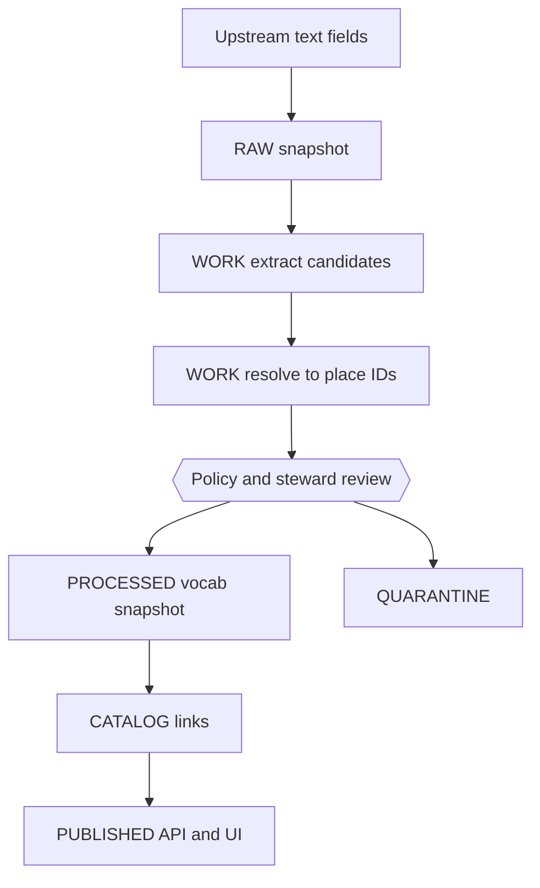

<!-- [KFM_META_BLOCK_V2]
doc_id: kfm://doc/fb47deeb-77a4-4694-aa2e-557d587e6cdf
title: Place Names Vocabulary
type: standard
version: v1
status: draft
owners: TBD
created: 2026-03-01
updated: 2026-03-01
policy_label: public
related:
  - docs/data/registries/README.md  # TODO: link once it exists
  - data/registries/vocabulary/     # TODO: confirm actual data location
tags: [kfm, registry, vocabulary, place-names]
notes:
  - Defines how KFM assigns stable identifiers to places referenced in datasets, stories, and UI search.
  - This file is documentation; the actual vocabulary entries live in versioned data files (path TBD).
[/KFM_META_BLOCK_V2] -->

# Place Names Vocabulary
_Map-first, time-aware, governed: canonical IDs for place references across KFM._


## Quick navigation
- [Purpose](#purpose)
- [What counts as a “place name”](#what-counts-as-a-place-name)
- [Vocabulary model](#vocabulary-model)
- [Identifier format](#identifier-format)
- [Normalization and matching rules](#normalization-and-matching-rules)
- [Sensitivity and redaction](#sensitivity-and-redaction)
- [Where this runs in the truth path](#where-this-runs-in-the-truth-path)
- [Starter examples](#starter-examples)
- [Validation and change management](#validation-and-change-management)
- [Appendix: suggested file layout](#appendix-suggested-file-layout)

---

## Purpose
KFM uses a strict “truth path” (Upstream → RAW → WORK/QUARANTINE → PROCESSED → CATALOG → PUBLISHED) and enforces access policy at the governed API boundary (“trust membrane”). Place names appear in many upstream sources (text fields, metadata, narrative claims), and they must be:

1. **Resolvable**: the same place string (e.g., “Ft. Riley”) maps to a stable ID.
2. **Citable**: places referenced in stories and answers can be traced to evidence.
3. **Governable**: sensitive locations can be generalized or access-controlled via policy labels and obligations.
4. **Time-aware**: names and jurisdictions change; the system must represent those changes without rewriting history.

This document defines the controlled vocabulary model and maintenance rules for **place-name identity**.

> **NOTE**
> This is not a full gazetteer. It’s the KFM **identity layer** for places the system must recognize consistently.
> Large, authoritative geometry datasets (boundaries, GNIS points, etc.) belong in the data zones and catalogs, not in this doc.

---

## What counts as a place name
A **place name** in KFM is any human-facing label that refers to a geographic entity we expect to reference across:

- dataset metadata and registry entries (coverage, jurisdiction, service areas),
- map layers (administrative areas, physical features, sites),
- stories and Focus Mode answers (narrative claims that mention locations).

Examples:
- Administrative areas: state, county, city, township, reservation (where applicable), voting district (if used as a geometry layer).
- Physical features: river, lake, creek, ridge.
- Human features: neighborhood, park, bridge, cemetery, building (use sparingly; see sensitivity rules).

Non-examples (do **not** model here):
- street addresses, parcel IDs, GPS coordinates (those are features/records in datasets, often sensitive),
- ephemeral POIs from commercial sources unless promoted as a dataset with explicit licensing and policy.

---

## Vocabulary model

### Core entity: `PlaceNameRecord`
Each record is a **stable identifier** with one preferred label and zero or more aliases, plus enough context to disambiguate.

| Field | Type | Required | Meaning |
|---|---:|:---:|---|
| `place_id` | string | ✅ | Canonical, stable identifier (URI-like). |
| `preferred_name` | string | ✅ | Primary display label for UI and citations. |
| `place_kind` | string | ✅ | Controlled value describing what it is (admin area, locality, water feature, etc.). |
| `parent_place_id` | string | ⛔ | Parent in containment hierarchy (county → state → country). |
| `aliases` | string[] | ⛔ | Alternative spellings/abbreviations/historic labels. |
| `language` | string | ⛔ | BCP47 language tag for the label set (e.g., `en`). |
| `valid_time` | object | ⛔ | When the name/jurisdiction is valid (see [Time](#time-awareness)). |
| `policy_label` | string | ✅ | Access/sensitivity classification driving obligations. |
| `evidence_refs` | string[] | ⛔ | EvidenceRefs that justify spelling, existence, hierarchy, etc. |
| `notes` | string | ⛔ | Human comment (avoid “business logic” here). |

### Time awareness
Where relevant, represent **valid time** for naming changes (rename, annexation, boundary change). A minimal shape:

```yaml
valid_time:
  start: "1854-01-30"  # ISO 8601 date
  end: null           # null means “open-ended / still valid”
```

> **TIP**
> If you don’t know dates with confidence, omit `valid_time` and record the uncertainty in `notes` with evidence references.
> Don’t invent dates.

### Place kinds (starter)
Start small and expand only when needed.

- `admin0_country`
- `admin1_state`
- `admin2_county`
- `locality_city`
- `locality_town`
- `physical_river`
- `physical_lake`
- `site_facility`
- `site_sensitive` (use only with strict policy labels)

---

## Identifier format
KFM encourages explicit, URI-like identifiers with stable prefixes (avoiding environment-specific hostnames).

### Proposed `place_id` families
Until the repo defines a canonical place ID standard, use one of these patterns:

1. **Authority-backed IDs** (preferred when available):
   - `kfm://place/gnis:<id>`
   - `kfm://place/geonames:<id>`
2. **KFM-native hierarchical slugs** (good for admin units and curated places):
   - `kfm://place/us/ks`
   - `kfm://place/us/ks/county/douglas`
3. **Digest-backed IDs** (last resort for non-authoritative items):
   - `kfm://place/sha256:<digest>` where `<digest>` is computed from canonical JSON of the record.

> **WARNING**
> Do not encode coordinates in the ID. Coordinates change with improved measurement and can be sensitive.

---

## Normalization and matching rules

### Canonical string normalization
When turning raw text into match candidates, apply these **deterministic** steps:

1. Unicode normalize (NFKC).
2. Trim and collapse whitespace.
3. Case-fold.
4. Remove or standardize punctuation (keep apostrophes and hyphens as-is, but also store an alias without them).
5. Expand common abbreviations into aliases (e.g., `Ft` ↔ `Fort`, `St` ↔ `Saint`, `Co` ↔ `County`).

### Matching precedence
Resolver should try, in order:

1. **Exact match** on `preferred_name` (normalized).
2. **Exact match** on any `aliases` (normalized).
3. **Context-qualified match** using parent hints (e.g., “Wichita, KS”).
4. **Fuzzy match** (edit distance / token set) only as a *candidate generator*.
5. **Human review**: unresolved or ambiguous names are quarantined for steward resolution.

> **NOTE**
> Fuzzy match must never silently “decide” a place ID in PUBLISHED surfaces. Store candidates in WORK/QUARANTINE.

---

## Sensitivity and redaction
Some place references are sensitive: archaeological sites, culturally restricted locations, endangered species locations, private residences, etc.

KFM uses `policy_label` values and explicit obligations to drive what is shown publicly.

### Recommended policy labels for place records
Use the KFM `policy_label` vocabulary (starter set) and do not invent new labels without governance review.

- `public`
- `public_generalized`
- `restricted`
- `restricted_sensitive_location`
- `internal`
- `embargoed`
- `quarantine`

### Geometry handling for sensitive places
A place-name record should **not** carry precise geometry. If a place must be represented spatially:

- prefer referencing a governed dataset version that contains the geometry,
- or serve a generalized representation (centroid, coarse admin unit, bounding box).

If you must record how a geometry was generalized, use a controlled `geometry.generalization_method`, for example:

- `centroid_only`
- `dissolve_to_admin_unit`
- `bounding_box_only`
- `grid_aggregation_<size>`
- `random_offset_<meters>`
- `none`

> **WARNING**
> Default-deny when sensitivity is unclear. Use `quarantine` until a steward assigns the label and obligations.

---

## Where this runs in the truth path
Place name extraction and resolution is an **entity-resolution** problem. In KFM terms:

- Raw upstream payloads are stored in **RAW** (immutable acquisition).
- Candidate extraction and resolution outputs belong in **WORK/QUARANTINE** (iterated, may be revised).
- Promoted, approved vocab snapshots are published as versioned artifacts in **PROCESSED**, cross-linked in **CATALOG** (DCAT+STAC+PROV), and served through the governed API in **PUBLISHED**.



---

## Starter examples
These examples illustrate shape and conventions. They are not authoritative.

```yaml
# place_names.v1.yaml (illustrative)

- place_id: "kfm://place/us"
  preferred_name: "United States"
  place_kind: "admin0_country"
  aliases: ["USA", "US", "U.S."]
  language: "en"
  policy_label: "public"

- place_id: "kfm://place/us/ks"
  preferred_name: "Kansas"
  place_kind: "admin1_state"
  parent_place_id: "kfm://place/us"
  aliases: ["State of Kansas", "KS"]
  language: "en"
  policy_label: "public"

- place_id: "kfm://place/us/ks/county/douglas"
  preferred_name: "Douglas County"
  place_kind: "admin2_county"
  parent_place_id: "kfm://place/us/ks"
  aliases: ["Douglas Co."]
  language: "en"
  policy_label: "public"
  notes: "Boundary geometry should be referenced via an admin-boundaries dataset version."

- place_id: "kfm://place/us/ks/site/example_sensitive"
  preferred_name: "Example Sensitive Site"
  place_kind: "site_sensitive"
  parent_place_id: "kfm://place/us/ks"
  aliases: []
  language: "en"
  policy_label: "restricted_sensitive_location"
  notes: "Do not store precise geometry here. Serve only generalized representation (e.g., admin unit)."
```

---

## Validation and change management

### Minimum CI checks (recommended)
When a place vocabulary snapshot changes, CI should:

- validate against a schema (required fields, enums, unique `place_id`),
- ensure deterministic ordering/canonicalization (stable hashes for unchanged records),
- run link-checks for referenced EvidenceRefs and catalog links,
- run policy tests (default-deny) for new labels/obligations.

### Change rules
- **Never rewrite history**: if a name changes, append a new record state (or add `valid_time`) rather than editing away the past.
- **Prefer authority-backed IDs** when possible; document mapping choices.
- **Quarantine** ambiguous items until a steward resolves them.
- **No silent alias changes**: aliases impact search and entity resolution; treat as a breaking change for downstream models.

---

## Appendix: suggested file layout
_Not confirmed in repo; proposed for consistency with KFM registry patterns._

```text
data/
  registries/
    vocabulary/
      place_names/
        place_names.schema.json
        place_names.v1.yaml
        place_names.v1.sha256
docs/
  data/
    registries/
      vocabulary/
        place_names.md  # this file
```

---

## References
- Kansas Frontier Matrix (KFM) — Definitive Design & Governance Guide (vNext, 2026-02-20)
- Kansas Frontier Matrix (KFM) — Architecture, Governance, and Delivery Plan (2026-02-27)

Back to top: [↑](#place-names-vocabulary)
