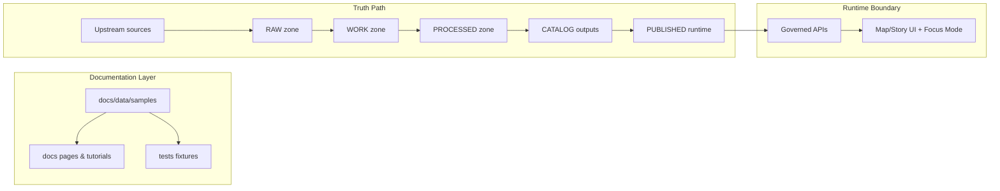

<!-- [KFM_META_BLOCK_V2]
doc_id: kfm://doc/7a2a9ce6-6d6f-4d2e-b7aa-3b3563d3e7a6
title: docs/data/samples — Sample Data & Fixtures
type: standard
version: v1
status: draft
owners: TBD (Docs/Data stewards)
created: 2026-03-01
updated: 2026-03-01
policy_label: public
related:
  - ../../../README.md
  - ../../README.md
  - ../README.md
tags: [kfm, docs, data, samples, fixtures, governance]
notes:
  - This directory is for SMALL, SANITIZED samples used by docs/tests—NOT for production datasets.
  - Do not place sensitive or restricted material here.
[/KFM_META_BLOCK_V2] -->

# docs/data/samples — Sample Data & Fixtures
Small, sanitized sample datasets + fixtures for documentation, tutorials, and tests (evidence-first, policy-aware).


**Owners:** TBD (Docs/Data stewards)  
**Location in repo:** `docs/data/samples/`  
**Non-goal:** This is *not* a data “zone” (RAW/WORK/PROCESSED/PUBLISHED). It’s documentation/test support material.

---

## Quick navigation
- [Purpose](#purpose)
- [Where this fits in KFM](#where-this-fits-in-kfm)
- [What belongs here](#what-belongs-here)
- [What must not go here](#what-must-not-go-here)
- [Directory layout](#directory-layout)
- [Sample registry](#sample-registry)
- [Adding or updating a sample](#adding-or-updating-a-sample)
- [Validation and governance gates](#validation-and-governance-gates)
- [Using samples](#using-samples)
- [FAQ](#faq)

---

## Purpose
This folder contains **tiny** sample inputs and outputs that make KFM documentation reproducible:
- “Hello world” datasets for docs screenshots and walkthroughs
- Stable test fixtures (e.g., small GeoJSON, tiny rasters, minimal STAC Items/Collections)
- Example manifests showing how to describe data, licenses, policy labels, and provenance

> NOTE  
> Samples here should be safe to publish in the repo: **no secrets, no private/sensitive locations, no restricted data**.

---

## Where this fits in KFM
KFM is built around a strict “truth path” and a policy enforcement boundary (“trust membrane”):
- Data flows through governed stages **before** any UI narrative is built.
- Clients should access data via governed APIs, not by direct storage access.

This `docs/data/samples/` directory exists to support docs/testing **without bypassing** those principles.

### Conceptual flow


Plain-language interpretation: samples help us **explain and test** the system; production data still must move through the truth path.

---

## What belongs here
Acceptable inputs (keep it small + reproducible):
- **Tiny** vector files: GeoJSON, GeoPackage, CSV (with lat/long only if non-sensitive)
- **Tiny** raster files: small GeoTIFF or Cloud-Optimized GeoTIFF snippets (only when needed)
- Minimal metadata examples:
  - STAC `Collection`/`Item` examples
  - DCAT dataset snippets
  - PROV snippets illustrating lineage concepts
- Golden outputs for docs/tests:
  - expected JSON responses (redacted)
  - example catalog fragments
  - example tiles/MBTiles *only if small*

Recommended constraints (default expectations):
- Keep each sample **as small as practical** (prefer KBs over MBs).
- Use **open licenses** or include explicit permission/terms.
- Include enough metadata for someone else to understand *what the sample is* and *why it exists*.

---

## What must not go here
Do **not** commit:
- Full datasets, large binaries, or “real” production exports (use the governed `data/` zones + catalogs instead)
- Any secrets (API keys, tokens, credentials) or `.env` files
- Sensitive, private, or culturally restricted locations
- Anything with unclear licensing/terms
- Anything that requires “special handling” but doesn’t include a documented policy label and redaction notes

> WARNING  
> If a sample contains *any* sensitive element, fail closed: do not include it here. Use coarse aggregation, synthetic data, or a redacted derivative.

---

## Directory layout
This repo’s docs layer is typically organized into domain modules under `docs/data/...`. This folder is for **cross-domain** reusable samples.

### Proposed standard layout (use this for new samples)
```text
docs/data/samples/
  README.md                      # this file
  <sample_id>/
    README.md                    # explains what the sample is + how it is used
    manifest.yml                 # minimal identity + license + policy label + provenance
    checksums.sha256             # content integrity for the sample payload(s)
    data/                        # the actual sample payload(s)
      ...                        # tiny files only
```

> TIP  
> If you’re adding a one-off fixture for a specific docs page, consider placing it closer to that page (or domain module) and linking back here.

---

## Sample registry
Add each sample here so people can find and reuse it.

| sample_id | Purpose | Formats | Used by | License | Policy label | Notes |
|---|---|---|---|---|---|---|
| `TODO_example_vector` | Minimal vector example for docs | GeoJSON | docs/tutorial X | TODO | public | Replace with real entry |
| `TODO_example_stac_item` | STAC Item example | JSON | tests/catalog | TODO | public | Replace with real entry |

---

## Adding or updating a sample
### 1) Create a folder
- `docs/data/samples/<sample_id>/`

Naming rules:
- `lower_snake_case`
- stable over time (avoid dates in folder name unless the date is intrinsic)

### 2) Add the minimum metadata
In `manifest.yml`, include at least:
- `sample_id`
- `title`
- `source` (where it came from, or “synthetic”)
- `license` (SPDX if possible)
- `policy_label` (`public` preferred)
- `redaction_notes` (if anything was generalized)
- `intended_use` (docs, tests, tutorial link)

### 3) Add checksums
- Add `checksums.sha256` for each file in `data/`
- If file changes, checksum must change in the same PR

### 4) Add/Update the Sample registry table
- Keep it current so samples are discoverable.

---

## Validation and governance gates
Before merging a new/updated sample:

### Required gates (repo-safe)
- [ ] **License is explicit** and compatible with repo distribution
- [ ] **Policy label** is set, and content matches it
- [ ] **No sensitive locations** (or they are clearly generalized + documented)
- [ ] **Size is minimal** (if it feels “big”, it is too big)
- [ ] **Checksums** exist and match contents
- [ ] Sample is referenced by at least one doc page or test (avoid orphan payloads)

### Recommended gates (nice to have)
- [ ] Sample has a “golden output” if used for tests
- [ ] Sample includes a minimal STAC/DCAT/PROV fragment when relevant
- [ ] Sample README includes a “how to reproduce/derive” note

---

## Using samples
Common patterns:

1) **Docs walkthroughs**
- Link directly to the sample folder and explain what it demonstrates.

2) **Tests**
- Treat samples as immutable fixtures unless the test intentionally evolves.
- Prefer deterministic inputs/outputs.

3) **Local dev seeding**
- If the repo contains a dev pipeline that loads samples, keep those samples *separate* from production datasets.
- If you need a “seed dataset”, it should be small and clearly labeled as a seed fixture.

> NOTE  
> If you find yourself wanting to add “just one more file” and it’s not tiny anymore: stop and use the real `data/` truth path zones instead.

---

## FAQ
**Is this the same as `data/<domain>/raw/`?**  
No. `docs/data/samples/` is for documentation/test fixtures. Real ingestion belongs under `data/` zones and must follow the promotion contract.

**Can samples include real coordinates?**  
Only if the locations are not sensitive and the license/terms allow it. When in doubt, generalize or synthesize.

**Where do domain-specific docs live?**  
Typically under `docs/data/<domain>/...` (this folder is for cross-domain shared samples).

---

<details>
<summary>Appendix: Template manifest.yml (copy/paste)</summary>

```yaml
sample_id: example_sample_id
title: "Example sample"
source:
  kind: synthetic  # synthetic|derived|upstream_excerpt
  upstream_ref: "TBD"
license:
  spdx: "CC-BY-4.0"
policy_label: public
intended_use:
  - docs
  - tests
redaction_notes:
  - "If derived from real data, explain what was generalized/removed."
files:
  - path: data/example.geojson
    description: "Tiny vector sample"
    sha256: "SEE checksums.sha256"
```

</details>

---

<a id="back-to-top"></a>
**Back to top:** [Quick navigation](#quick-navigation)
