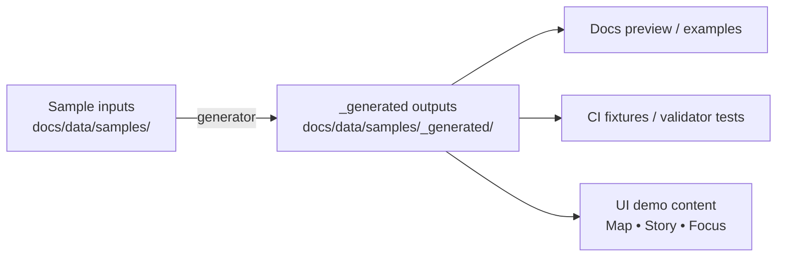

<!-- [KFM_META_BLOCK_V2]
doc_id: kfm://doc/d0f17352-24f2-47e0-ab99-64e09b2bfd9d
title: "docs/data/samples/_generated — Generated sample artifacts"
type: standard
version: v1
status: draft
owners: TODO(kfm-owners)
created: 2026-03-01
updated: 2026-03-01
policy_label: public
related:
  - docs/data/samples/README.md
  - docs/MASTER_GUIDE_v13.md
tags: [kfm, samples, generated, fixtures]
notes:
  - This directory is regenerated; do not hand-edit its contents.
  - Replace TODOs after confirming generator commands + upstream sources in the live repo.
[/KFM_META_BLOCK_V2] -->

<a id="top"></a>

# `docs/data/samples/_generated`
One-line purpose: **machine-generated sample artifacts** used for docs, demos, and tests—kept reproducible and safe to overwrite.


> [!WARNING]
> **Do not hand-edit files in this directory.** Anything here may be overwritten by the sample generator.

## Quick links
- [What belongs here](#what-belongs-here)
- [What must NOT go here](#what-must-not-go-here)
- [How this fits in KFM](#how-this-fits-in-kfm)
- [How to (re)generate](#how-to-regenerate)
- [Using the samples](#using-the-samples)
- [Conventions](#conventions)
- [Troubleshooting](#troubleshooting)
- [Appendix: illustrative tree](#appendix-illustrative-tree-not-confirmed-in-repo)

---

## What belongs here
**Generated outputs only**, produced from the canonical sample inputs under `docs/data/samples/` (or an equivalent sample source location).

Typical examples (pick what applies to your generator):
- Catalog fragments (e.g., **DCAT/STAC/PROV** JSON, link maps)
- “Receipt-like” artifacts (e.g., run receipts / audit stubs) for UI + validator demos
- Sanitized sample datasets (tiny files) meant strictly as fixtures
- Pre-rendered docs assets derived from sample specs

> [!NOTE]
> Even though these are “only samples”, treat them as governed artifacts: include stable IDs, digests/hashes, and policy labels when the format supports it.

## What must NOT go here
- **Source-of-truth** docs (put those in the appropriate `docs/` location)
- Any **RAW/WORK/PROCESSED/PUBLISHED** production artifacts or real upstream data
- Secrets, credentials, or private keys
- Sensitive locations / exact coordinates for vulnerable sites (use generalized geometry instead)
- Large binaries (unless explicitly approved for fixtures, with size caps)

---

## How this fits in KFM
KFM’s core posture is an auditable “truth path” with lifecycle zones and promotion gates. This repo-local `_generated` folder is **not** a production zone, but it should still mirror the same ideas:

**reproducible inputs → deterministic outputs → validators + link checks → safe consumption by docs/UI/tests**.

### Conceptual flow


---

## How to regenerate
Because generator commands vary by repo, the only safe rule is:

1) **Change inputs** (in `docs/data/samples/`)  
2) **Run the generator**  
3) **Commit the regenerated outputs** (if project policy is to version them)

> [!TIP]
> Minimum verification steps (run locally):
> - `git grep -n "docs/data/samples/_generated"` to find the generator entrypoint
> - `ls -la docs/data/samples/` to find the canonical sample specs
> - `git status` should show only `_generated/` diffs after regeneration

**TODO (wire to real commands once confirmed):**
```bash
# Example patterns (replace with the real one found in repo scripts/ or package.json)
# ./scripts/generate-samples.sh
# make samples
# npm run gen:samples
# pnpm gen:samples
```

---

## Using the samples
Common uses:
- **Doc snippets** that need stable, small, locally-available artifacts
- **Golden fixtures** for validators / link-checkers
- **UI dev** when you want Map/Story/Focus surfaces to load content without hitting real stores

Recommended workflow:
1. Add/modify a sample input spec.
2. Regenerate `_generated/`.
3. Run validators / tests that read these fixtures.
4. Verify that any “evidence-like” references resolve (or intentionally fail closed).

---

## Conventions
- **Deterministic output**: stable file ordering, stable IDs, stable digests (so diffs are meaningful).
- **Small + legible**: samples should be tiny enough to review in PRs.
- **Policy-aware defaults**: if a sample implies a policy label, choose the least permissive label that still demonstrates the feature.

---

## Troubleshooting
- **Files keep changing on every run**  
  Generator likely isn’t deterministic (timestamps, random seeds, unordered maps). Fix output ordering and stabilize or omit `generated_at` fields.

- **Broken cross-links**  
  Run link checks and validators against the generated catalogs; samples should fail closed if links don’t resolve.

- **Accidental sensitive data**  
  Delete and regenerate from sanitized inputs; add a redaction/generalization rule to the generator; add a test that blocks reintroduction.

---

## Appendix: illustrative tree (not confirmed in repo)
> [!NOTE]
> The exact filenames/folders below are *illustrative*. Replace after confirming the actual generator output layout.

```text
docs/data/samples/_generated/
  README.md
  manifest.json                 # optional: list of generated artifacts + digests
  stac/                         # optional: STAC collections/items
  dcat/                         # optional: DCAT JSON-LD
  prov/                         # optional: PROV bundles
  receipts/                     # optional: run receipts/audit stubs
  fixtures/                     # optional: tiny GeoJSON/CSV/Parquet samples
```

Back to top: [↑](#top)
