<div align="center">

# 🌱 Kansas Frontier Matrix — Soil & Landscape Data Domain  
## gNATSGO · gSSURGO · STATSGO2

`docs/data/soils/README.md`

**Purpose:**  
Provide a **KFM-aligned reference** for USDA NRCS soil datasets (gNATSGO, gSSURGO, STATSGO2) and define how they integrate into **geospatial, archaeological, hydrological, and environmental** workflows — including **STAC catalogs**, raster registries, and **Story Node** context layers.

[](../../../README.md)
[](../../standards/README.md)
[](#-overview)
[](../../standards/faircare/FAIRCARE-GUIDE.md)
[](#-faircare--governance)

[📘 Data Index](../README.md) · [🧭 Annual NRCS Soils Refresh](./annual-refresh/README.md) · [🧮 Data Quality Framework](../quality/README.md) · [⚖ Governance](../../standards/governance/ROOT-GOVERNANCE.md)

</div>

---

## 📘 Overview

### ✅ What this domain covers
This domain standardizes how KFM ingests, validates, publishes, and uses:

- **Gridded soil products:** `gNATSGO`, `gSSURGO` (rasters + derived tiles)
- **Coarser national baseline:** `STATSGO2`
- **Soil polygons + tables (SSURGO family):** mapunit → component → horizon joins
- **Derived layers** (KFM-produced):
  - Root-zone water storage (AWS/AWC summaries) 🌾💧  
  - Texture-class summaries 🧱  
  - Hydrology/erosion inference layers 🏞️  
  - Story Node “context layers” for narrative + analysis 🧠

> 🧭 **Contract rule:** If a soils artifact can’t be traced to **STAC + DCAT + PROV**, it does **not** ship.

### 🧬 Data model spine (must be supported)
The canonical join chain used throughout KFM soils:
- `mukey` (Map Unit) → `cokey` (Component) → `chkey` (Horizon)

This chain is used to compute component-weighted or representative-horizon summaries (e.g., AWC, texture %, ksat, depth metrics).

### 🕰 Refresh cadence (operational expectation)
- Align annual refresh processing with NRCS **Annual Soils Refresh** timing (≈ **Oct 1**).  
- Treat the domain as **append-only + versioned**: no silent rewrites; publish new versioned releases and link lineage.

### 🧭 Quick navigation
- **Annual governed refresh pipeline:** `docs/data/soils/annual-refresh/README.md`
- **Quality gates:** `docs/data/quality/README.md`
- **H3 indexing standard (derived tiles):** `docs/architecture/spatial-indexing/h3/README.md`

---

## 🗂️ Directory Layout

KFM uses a *conceptual* soils root (`data/soils/`) while maintaining a *physical* staging layout that supports auditability and re-runs:

- **Raw:** verbatim provider artifacts (no edits)
- **Work/Processing:** intermediate joins, diffs, logs, reports
- **Processed:** publishable, cataloged artifacts (the “truth” you serve)
- **Catalog + Provenance:** STAC/DCAT/PROV as first-class release outputs

### 📁 Canonical layout (recommended)
```text
🗂️ docs/
└── 🗂️ data/
    └── 🗂️ soils/
        ├── 📄 README.md                       # (this) domain contract + runbook
        ├── 🧭 annual-refresh/
        │   └── 📄 README.md                   # governed ASR pipeline contract
        └── 📁 metadata/                       # optional curated links + citation anchors

🗂️ data/
├── 🧱 raw/
│   └── 🗂️ soils/
│       └── 🗂️ usda-nrcs/<yyyymmdd>/           # SSURGO bundles, gSSURGO/gNATSGO zips, dictionaries
├── 🧪 work/
│   └── 🗂️ soils/
│       ├── 🧩 joins/                          # extracted tables, parquet staging
│       ├── 🧾 validation/                     # reports (geometry/tabular/raster)
│       └── 🧬 diffs/                          # parquet change sets (year-to-year)
├── ✅ processed/
│   └── 🗂️ soils/
│       ├── 🌐 gnatsgo/                        # gridded national composite outputs
│       ├── 🌐 gssurgo/                        # gridded soil survey outputs
│       ├── 🗺️ ssurgo/                         # polygon + joined outputs (if used)
│       ├── 🧱 statsgo2/                       # coarse baseline
│       └── 🧠 derived/                        # KFM computed layers (AWS, texture, indices)
├── 🗺️ stac/
│   ├── 🧩 collections/soils/                  # authoritative collections
│   └── 🧩 items/soils/                        # authoritative items (tiles/regions)
├── 📊 dcat/soils/                             # dataset cards + distributions
└── 🧾 prov/soils/                             # prov.jsonld, OpenLineage, attestations, citations
```

### 🧾 Naming conventions (minimum)
Use deterministic, searchable names. Examples:

- `processed/soils/derived/aws_rootzone_100cm_ks_asr2025_h3r6.parquet`
- `processed/soils/gnatsgo/gnatsgo_ks_asr2025_tile_z12_037_152.tif`
- `stac/items/soils/gnatsgo_asr2025_ks_z12_037_152.json`

> ✅ **Tip:** keep *provider vintage* (refresh date / tag) in metadata even if the filename stays stable.

---

## 🧭 Context

### 🌾 Why soils matter in KFM
Soils are the “quiet infrastructure” behind:

- **Hydrology:** infiltration capacity, drainage class, runoff potential, root-zone storage
- **Archaeology:** burial potential, depositional environments, stratigraphy proxies, landform evolution
- **Agriculture & land systems:** texture, organic matter, productivity constraints
- **Environmental change:** drought risk context, land-use suitability, erosion sensitivity

### 🧠 Derived layers are allowed — but must be explainable
KFM encourages derived layers, but requires:

- a **method description** (math + parameters),
- **inputs pinned by digest** (raw + intermediate),
- and **PROV** that links outputs to inputs and activity.

Example: **Root-zone Available Water Storage (AWS)**  
AWS can be computed as a clipped sum over horizons:

> `AWS = Σ_h (awc_r * min(hz_thickness, remaining_root_depth))`

Use horizon bottom depths to clip at the chosen depth (e.g., 100 cm or crop-specific).

### 🪶 CARE note (soils are public; derived context may not be)
This domain is classified **Public** and “non-sensitive” *by default*.  
However, some **derived context layers** (especially archaeology-adjacent) may trigger **auto-mask** rules and sovereignty review.

---

## 🗺️ Diagrams

### 🧬 Soils pipeline at a glance (contract view)


### 🧠 Conceptual join spine (analysis + graph alignment)

```mermaid
flowchart TB
  MU["🧱 MapUnit - mukey"] --> CO["🧩 Component - cokey"];
  CO --> HZ["🪨 Horizon - chkey"];
  MU --> OUT["📊 Derived mapunit summaries"];
  HZ --> OUT;
```


> 🧩 Mermaid note: keep node labels simple and avoid emoji inside node text to prevent parser issues in CI.

---

## 🧠 Story Node & Focus Mode Integration

### 🧾 Story Nodes
Soils show up in Story Nodes as **context layers** and **evidence anchors**:

- `soil.landscape` → landform + soils background for an AOI
- `soil.hydrology` → infiltration/runoff/root-zone storage context
- `soil.archaeology` → depositional/burial potential context (may be masked)

Story Nodes that cite soils data must reference:
- at least one **STAC Item** (tile/region),
- at least one **DCAT dataset card**,
- and a **PROV activity** (pipeline run) when derived layers are involved.

### 🤖 Focus Mode (AI) restrictions
Allowed:
- ✅ summary
- ✅ timeline generation
- ✅ semantic highlighting
- ✅ diagram extraction
- ✅ metadata extraction

Prohibited:
- 🚫 altering governed values or semantics
- 🚫 speculative additions
- 🚫 governance override

> 🧠 **Focus Mode must cite artifacts** (STAC/DCAT) and **must log provenance** when it issues live queries through the API.

---

## 🧪 Validation & CI/CD

Soils is a “mixed-mode” domain (vector + raster + tabular). Validation must cover **all three**, plus metadata + provenance.

### ✅ Minimum validation requirements
**Vector (SSURGO polygons / joins):**
- Geometry validity (self-intersections, empties, rings)
- CRS + bounds consistent with AOI
- Required keys present (`mukey`, `areasymbol` when applicable)
- Join integrity: no orphan `cokey/chkey` references in derived outputs

**Raster (gNATSGO / gSSURGO / derived rasters):**
- Cloud-Optimized GeoTIFF (COG) compliance (overviews, tiling)
- NoData defined + consistent
- Value range sanity checks per variable (domain-configured)
- Tile boundaries align with the tiling strategy used in STAC Items

**Tabular:**
- Type enforcement (numeric fields numeric, code lists respected)
- Component/horizon weighting rules reproducible
- Deterministic aggregation output (stable sort keys, pinned parameters)

**Metadata + governance:**
- SPDX license present
- Providers + roles present (producer/processor/licensor)
- No whitespace or unsafe characters in asset hrefs
- Checksums present for primary assets
- PROV links resolve (activity → entity → agent)

### 🛡️ CI gates (fail-closed)
Use contract tests from `docs/data/quality/README.md`, plus policy checks (e.g., Conftest/Rego) for catalog promotion.

<details>
<summary><strong>🔎 Example Conftest policy (tiny)</strong></summary>

```rego
package kfm.artifacts

deny[msg] {
  input.kind == "stac_item"
  not input.assets["data"].checksum
  msg := "Missing checksum on primary asset"
}

deny[msg] {
  input.kind == "stac_item"
  some k
  asset := input.assets[k]
  regex.match(`\s`, asset.href)
  msg := sprintf("Whitespace in asset href: %s", [k])
}
```

</details>

---

## 📦 Data & Metadata

### 🧱 Canonical output formats (KFM preference)
- **GeoParquet** for analytics & joins (columnar, partitionable, indexable)
- **COG GeoTIFF** for rasters served to the map
- **PMTiles (optional)** for lightweight web vector delivery and offline packs
- **Parquet/CSV** for tabular extracts and fixtures (only with pinned schema + checksums)

> ✅ If you write GeoParquet, store geometry column name + CRS in metadata and in STAC `proj:*`.

### 🧪 Minimal pipeline (headless / CI-runnable)
A safe, repeatable pattern for turning SSURGO/gNATSGO into publishable tiles:

1) **Input ingest**
- Pull gNATSGO raster tiles for AOI; record exact source version & refresh date  
- Pull SSURGO tabulars via SDA or the single-file SQLite SSURGO bundle (when available)

2) **Join chain**
- `mukey → cokey → chkey`
- Retrieve AWC, horizon depths, texture % values (per horizon)

3) **Calculations**
- Root-zone AWS (clip at target depth like 100 cm)
- Texture class derivation (horizon-level or component-weighted)

4) **Vectorization & tiling**
- If starting with polygons, compute per-polygon stats
- If starting with raster, aggregate to tiles; optionally polygonize select classes

5) **Write outputs**
- GeoParquet per tile (EPSG:4326 recommended for interchange)
- STAC Item per tile + a Collection per product family

### 🧾 Example “mapunit summary” fixture schema
This is a common derived output pattern (one row per mapunit, with provenance attached):

| Field | Example | Notes |
|---|---:|---|
| `mukey` | `662369` | primary key |
| `areasymbol` | `KS175` | optional but recommended for SSURGO |
| `muname` | `Harney loess` | mapunit name |
| `aws_rootzone_cm` | `12.0` | derived metric |
| `sand_pct` / `silt_pct` / `clay_pct` | `24 / 52 / 24` | aggregated |
| `drainage_class` | `Somewhat poorly drained` | interpretive |
| `geom` | `{...}` | geometry |
| `source_url` | `https://sdmdataaccess.nrcs.usda.gov/ssurgo` | provenance hint |
| `license` | `CC0-1.0` / `CC-BY-4.0` / `US-PD` | depends on source |
| `prov` | `{commit, run_id, timestamp}` | minimal provenance anchor |

> 🧩 Use fixtures for unit tests, not as authoritative records.

### 📚 External resources (link targets for `metadata/`)
Maintain curated links (plus citation anchors) under `docs/data/soils/metadata/`:
- USDA NRCS data portals
- Soil Data Access (SDA)
- Annual Soils Refresh documentation
- SSURGO / STATSGO2 dictionaries (tables/columns)

---

## 🌐 STAC, DCAT & PROV Alignment

### 🗺️ STAC (tiles + collections)
- **Collection** per product family (`gnatsgo`, `gssurgo`, `derived/aws`, etc.)
- **Item** per tile / AOI slice / publication unit
- Use `proj`, `raster`, and `table` extensions when applicable

Minimal STAC Item expectations:
- `id` is deterministic
- `assets.data.checksum` present
- `license` is SPDX string (or KFM-approved token)
- `providers` include at least USDA NRCS (producer/licensor) and KFM (processor/host)

### 📊 DCAT (dataset cards + distributions)
DCAT is the “human discoverability + policy envelope”:
- title, description, keywords, publisher, license
- distributions referencing the same artifacts as STAC assets

### 🧾 PROV (lineage)
For each derived soils artifact, PROV must capture:
- the **Activity** (pipeline run)
- the **Entities** (raw bundles, intermediate joins, outputs)
- the **Agent** (pipeline identity; optionally reviewer identity)
- references to run IDs, timestamps, commit SHA, and checksums

> ✅ For “live answers” (Focus Mode querying the API), log the query input entities and timestamps into PROV.

---

## 🧱 Architecture

### 🧭 Storage + query pattern (KFM standard)
- **PostGIS**: fast spatial queries (AOI intersections, join lookups)
- **Object storage**: large rasters/GeoParquet with immutable digests
- **Neo4j knowledge graph**: semantic joins (dataset ↔ story node ↔ place ↔ method ↔ governance)

UI does not talk to databases directly; it talks to the **API**, which:
- enforces sensitivity rules,
- attaches source labels from DCAT,
- and enables Focus Mode to cite + log usage.

### 🧠 Explainable analytics (required for derived layers)
If a model or algorithm is used (e.g., drought risk from soil metrics), ship:
- a small model card (what it does, limitations),
- accuracy or validation notes when applicable,
- and the full provenance chain to inputs.

---

## ⚖ FAIR+CARE & Governance

### ✅ FAIR commitments (soils domain)
- **Findable:** searchable DCAT dataset + STAC collections
- **Accessible:** API + object storage paths, with role-aware access
- **Interoperable:** standard formats + GeoSPARQL alignment where appropriate
- **Reusable:** clear licensing + provenance + version pinning

### 🪶 CARE commitments (soils domain)
Soils data is public by default, but KFM still enforces:
- **Authority & consent** for any layer that becomes sovereignty-sensitive through derivation
- **Auto-mask** pathways for archaeology-adjacent outputs when configured by governance

### 🧑‍⚖️ Governance checklist for changes (PRs)
Any change to:
- coverage window,
- source inclusion/exclusion,
- validation logic,
- export schema,
- or masking rules,

must be reviewed by governance and reflected in:
- version history,
- STAC/DCAT updates,
- and PROV.

---

## 🕰️ Version History

| Version | Date       | Author                      | Summary |
|:--|:--|:--|:--|
| v11.2.3 | 2025-12-02 | Soils & Landscape Council | Initial soils domain overview for gNATSGO / gSSURGO / STATSGO2. |

---

<div align="center">

🌱 **Kansas Frontier Matrix — Soil & Landscape Data Domain**  
Soil Intelligence · Hydrology & Archaeology Aware · FAIR+CARE-Aligned

[📘 Data Index](../README.md) · [🧭 Annual NRCS Soils Refresh](./annual-refresh/README.md) · [⚖ Governance](../../standards/governance/ROOT-GOVERNANCE.md)

</div>

---

<sub>© Kansas Frontier Matrix · CC‑BY 4.0 · Diamond⁹ Ω / Crown∞Ω · Aligned with MCP‑DL v6.3 and KFM‑MDP v11.2.2</sub>

