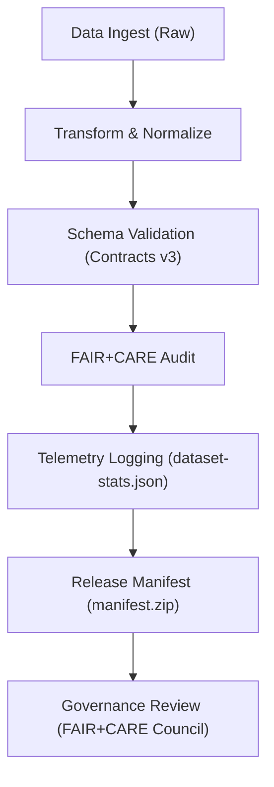
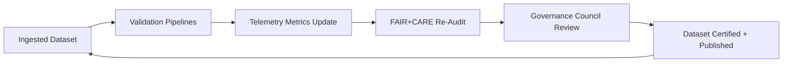

<div align="center">

# 📡 **Kansas Frontier Matrix — Data Telemetry & Lineage Tracking**
`docs/data/telemetry/README.md`

**Purpose:**  
Define the **data telemetry**, **lineage**, and **traceability framework** for all datasets in the **Kansas Frontier Matrix (KFM)** ecosystem.  
Telemetry enables continuous monitoring of dataset integrity, FAIR+CARE compliance, and ETL pipeline reproducibility under the **Master Coder Protocol (MCP v6.3)**.

[](../../README.md)
[](../../standards/faircare.md)
[](../../../LICENSE)
[](../../../releases/v10.0.0/manifest.zip)

</div>

---

## 📘 Overview

Telemetry serves as the **data governance nervous system** of KFM, recording all ingestion, transformation, validation, and ethical review events in machine-readable form.  
This ensures **data lineage transparency**, **audit reproducibility**, and **ethical accountability** across the entire platform.

Telemetry data is generated by pipelines, workflows, and validation scripts, capturing:
- Dataset identifiers and versioning  
- Schema and contract conformance  
- Provenance and consent validation  
- FAIR+CARE scoring metrics  
- Change tracking across releases  

All telemetry is immutable, versioned per dataset, and publicly visible in the repository’s `docs/data/telemetry/` directory.

---

## 🗂️ Directory Layout

```
docs/data/telemetry/
├── README.md                        # This file
├── dataset-stats.json                # Aggregated dataset-level telemetry metrics
├── validation-metrics.json           # QA, FAIR+CARE, and DQI summary metrics
├── lineage-log.json                  # Historical data lineage events
├── provenance-events.json            # Source provenance and consent validation logs
└── faircare-scorecard.json           # Council-certified ethical compliance metrics
```

---

## ⚙️ Telemetry Data Model

| Field | Type | Description | Example |
|---|---|---|---|
| `dataset_id` | string | Unique dataset identifier | `"usgs_historic_topo_1894"` |
| `version` | string | Dataset or release version | `"v10.0.0"` |
| `ingested_at` | string | ISO timestamp of ingestion | `"2025-11-08T14:20:00Z"` |
| `pipeline` | string | Name of ETL or validation process | `"etl/topography_ingest.py"` |
| `status` | string | Overall ingestion or validation result | `"success"` |
| `schema_compliance` | number | Schema conformity percentage | `100` |
| `metadata_completeness` | number | % of metadata fields populated | `98.5` |
| `provenance_verified` | boolean | Whether provenance and consent validated | `true` |
| `faircare_score` | number | Combined FAIR+CARE compliance score (0–100) | `96.5` |
| `dqi_score` | number | Data Quality Index (calculated from quality metrics) | `94.2` |
| `checksum` | string | SHA256 hash of final artifact | `"3b3c1f9e..."` |
| `artifact_url` | string | Path or URL to dataset in STAC catalog | `"data/processed/topo_1894.tif"` |

---

## 🧩 Lineage Tracking Workflow



**Lifecycle Summary:**
1. **ETL pipeline** ingests and transforms raw data.  
2. Schema and metadata are validated automatically.  
3. Ethical FAIR+CARE audit results appended to telemetry.  
4. Telemetry written to `dataset-stats.json` and rolled up into release manifests.  
5. Governance Council reviews and certifies results.

---

## 🧾 Telemetry Validation Workflows

| Workflow | Description | Output |
|---|---|---|
| `data-quality.yml` | Aggregates data completeness, schema, and spatial accuracy metrics. | `validation-metrics.json` |
| `telemetry-export.yml` | Merges individual dataset telemetry into quarterly reports. | `dataset-stats.json` |
| `faircare-audit.yml` | Validates and records FAIR+CARE scoring results. | `faircare-scorecard.json` |
| `data-provenance.yml` | Tracks lineage events and consent validation. | `provenance-events.json` |

Each telemetry entry links to the dataset’s **manifest**, ensuring complete traceability.

---

## 📊 Key Telemetry Metrics

| Metric | Description | Target | Verified By |
|---|---|---|---|
| **Schema Compliance (%)** | Adherence to JSON Schema structure. | 100% | `data-contract-validate.yml` |
| **Metadata Completeness (%)** | Field population completeness. | ≥ 98% | `metadata-lint.yml` |
| **FAIR+CARE Score** | Ethical and quality compliance metric. | ≥ 90% | `faircare-audit.yml` |
| **DQI (Data Quality Index)** | Weighted overall quality score. | ≥ 90 | `data-quality.yml` |
| **Consent Verification (%)** | Share of datasets with explicit consent metadata. | 100% | `data-provenance.yml` |

---

## 🧠 FAIR+CARE Telemetry Extensions

KFM telemetry embeds **ethical accountability** via FAIR+CARE scoring:

| Field | Description | Example |
|---|---|---|
| `faircare.collective_benefit` | Notes the societal or community value derived from data use. | `"Supports heritage mapping and education"` |
| `faircare.authority_to_control` | Records whether consent is documented. | `"approved"` |
| `faircare.responsibility` | Identifies stewardship team or data custodian. | `"FAIR+CARE Council"` |
| `faircare.ethics` | Notes ethical validation status. | `"passed"` |

---

## 📈 Example Telemetry Record

```json
{
  "dataset_id": "noaa_ks_climate_1880_2025",
  "version": "v10.0.0",
  "ingested_at": "2025-11-05T12:30:00Z",
  "pipeline": "etl/noaa_ingest.py",
  "status": "success",
  "schema_compliance": 100,
  "metadata_completeness": 99,
  "provenance_verified": true,
  "faircare_score": 96,
  "dqi_score": 94,
  "checksum": "4e75a7b7d5...",
  "artifact_url": "data/processed/noaa_ks_climate_1880_2025.csv"
}
```

---

## ⚖️ Governance Integration

Telemetry feeds directly into KFM’s governance and reporting pipelines:

| Integration | Description | Consumer |
|---|---|---|
| **Release Manifest** | Collates telemetry for each dataset in the version manifest. | KFM Governance Dashboard |
| **FAIR+CARE Council Review** | Evaluates ethical metrics and consent data. | FAIR+CARE Council |
| **Public Data API** | Exposes telemetry metrics to external researchers. | Web Frontend / API Layer |
| **Governance Ledger** | Immutable record of data lineage and quality metrics. | `releases/v10.0.0/manifest.zip` |

---

## 🧮 Continuous Monitoring Loop



Telemetry ensures perpetual feedback and transparency throughout the dataset lifecycle.

---

## 🕰️ Version History

| Version | Date | Author | Summary |
|---|---|---|---|
| v10.0.0 | 2025-11-10 | FAIR+CARE Council & Data Engineering Team | Established data telemetry and lineage framework integrating FAIR+CARE scoring, provenance verification, and continuous governance tracking. |

---

<div align="center">

**© 2025 Kansas Frontier Matrix — MIT / CC-BY 4.0**  
Governed under **Master Coder Protocol v6.3** · Audited by **FAIR+CARE Council**  
[⬅ Back to Data Index](../README.md) · [Data Quality →](../quality/README.md)

</div>