<div align="center">

# 📡 **Kansas Frontier Matrix — Data Telemetry & Lineage Tracking (v11.2.2)**  
`docs/data/telemetry/README.md`

**Purpose**  
Define the **data telemetry**, **lineage**, and **traceability framework** for all datasets in the Kansas Frontier Matrix (KFM) ecosystem.  
Telemetry serves as the **governance nervous system**, recording ingestion, transformation, validation, and ethical review events under **MCP-DL v6.3** and **FAIR+CARE**.

  
<!-- Badge Row -->


</div>

---

## 📘 1. Overview

Telemetry in KFM:

- Captures **dataset- and pipeline-level events** in machine-readable form.  
- Drives **lineage transparency**, **auditable reproducibility**, and **ethical accountability**.  
- Connects data operations to:
  - FAIR+CARE governance  
  - Release manifests  
  - Focus Mode narratives  
  - Sustainability dashboards (energy & carbon)

This document indexes and describes telemetry/lineage documents stored under `docs/data/telemetry/`.

---

## 🗂️ 2. Directory Layout

```text
📁 docs/
└── 📁 data/
    └── 📁 telemetry/
        📄 README.md                 — ← This file
        📄 dataset-stats.json        — Aggregated dataset-level metrics
        📄 validation-metrics.json   — QA, FAIR+CARE, DQI summaries
        📄 lineage-log.json          — Historical lineage events (simplified)
        📄 provenance-events.json    — Source provenance & consent validation logs
        📄 faircare-scorecard.json   — FAIR+CARE compliance metrics
```

Telemetry here is **documentation-facing**; raw operational telemetry may also exist in `data/reports/telemetry/` and release bundles.

---

## ⚙️ 3. Telemetry Data Model (Logical)

A minimal logical record (for dataset-focused telemetry) includes:

| Field                    | Type    | Description                                   | Example                                      |
|--------------------------|---------|-----------------------------------------------|----------------------------------------------|
| `dataset_id`            | string  | Unique dataset identifier                    | `"usgs_historic_topo_1894"`                  |
| `version`               | string  | Dataset or release version                   | `"v11.2.2"`                                  |
| `ingested_at`           | string  | ISO-8601 UTC timestamp                       | `"2025-11-08T14:20:00Z"`                     |
| `pipeline`              | string  | ETL/validation pipeline name or ID           | `"pipelines/topography/ingest_v3"`           |
| `status`                | string  | Overall result (`success`, `failed`, `noop`) | `"success"`                                  |
| `schema_compliance`     | number  | Schema conformity percentage                 | `100`                                        |
| `metadata_completeness` | number  | % of metadata fields populated               | `98.5`                                       |
| `provenance_verified`   | boolean | Whether provenance/consent was validated     | `true`                                       |
| `faircare_score`        | number  | Combined FAIR+CARE compliance score (0–100)  | `96.5`                                       |
| `dqi_score`             | number  | Data Quality Index (aggregated quality score)| `94.2`                                       |
| `checksum`              | string  | SHA-256 hash of canonical artifact           | `"3b3c1f9e..."`                              |
| `artifact_url`          | string  | Path/URL to dataset in STAC/DCAT or repo     | `"data/processed/topo_1894.tif"`             |

Additional fields may include:

- `energy_wh`, `carbon_gco2e` (sustainability metrics)  
- `lineage_ref` — path to PROV-O/JSON-LD provenance documents  
- `governance_decision_id` — link to FAIR+CARE review

---

## 🧩 4. Lineage Tracking Workflow (Conceptual)

```mermaid
flowchart TD
  A["Data Ingest (raw/)"] --> B["Transform & Normalize (work/)"]
  B --> C["Schema & Contract Validation"]
  C --> D["FAIR+CARE Audit"]
  D --> E["Telemetry Logging\n(dataset-stats.json · lineage-log.json)"]
  E --> F["Release Manifest\n(manifest.zip)"]
  F --> G["Governance Review\n(FAIR+CARE Council)"]
```



Lifecycle summary:

1. ETL pipelines ingest and transform raw data.  
2. Schemas and metadata are validated against contracts and standards.  
3. FAIR+CARE audits run to validate ethical and sovereignty constraints.  
4. Telemetry + lineage are written.  
5. Release manifes​ts incorporate telemetry references.  
6. Governance Council uses telemetry for decisions and certification.

---

## 🧪 5. Telemetry-Related Workflows (Documented Elsewhere)

Workflow docs under `docs/workflows/` (examples):

| Workflow Doc               | Description                                           | Output                                 |
|----------------------------|-------------------------------------------------------|----------------------------------------|
| `data-quality.yml.md`      | Aggregates completeness, schema, spatial accuracy    | `validation-metrics.json`             |
| `telemetry-export.yml.md`  | Merges telemetry into release-time bundles           | `dataset-stats.json`, `focus-telemetry.json` |
| `faircare-audit.yml.md`    | Runs FAIR+CARE scoring on data & docs                | `faircare-scorecard.json`             |
| `data-provenance.yml.md`   | Tracks lineage events and consent validation         | `provenance-events.json`              |

This README describes **what** must exist; those docs describe **how** each workflow operates.

---

## 📊 6. Key Telemetry Metrics & Targets

| Metric                     | Description                                      | Target  | Verified By                    |
|----------------------------|--------------------------------------------------|---------|--------------------------------|
| Schema Compliance (%)      | Adherence to JSON/CSVW/NetCDF schema definitions| 100%    | `data-contract-validate`       |
| Metadata Completeness (%)  | Proportion of mandatory fields populated        | ≥ 98%   | `metadata-lint`                |
| FAIR+CARE Score            | Ethical/sovereignty compliance (0–100)          | ≥ 90    | `faircare-audit`               |
| Data Quality Index (DQI)   | Weighted quality score across metrics           | ≥ 90    | `data-quality` workflows       |
| Consent Verification (%)   | Datasets with explicit consent metadata         | 100%    | `data-provenance` workflows    |

Failing targets triggers **governance review** and may block publication.

---

## 🧠 7. FAIR+CARE Telemetry Extensions

To embed ethics into telemetry:

| Field                         | Description                                          | Example                                     |
|-------------------------------|------------------------------------------------------|---------------------------------------------|
| `faircare.collective_benefit` | Describes community-facing benefits                 | `"Supports flood-risk education"`           |
| `faircare.authority_to_control` | Records consent/permission status                 | `"tribal-approved"`                         |
| `faircare.responsibility`     | Indicates steward or custodian for dataset          | `"FAIR+CARE Council"`                       |
| `faircare.ethics`             | Result of ethics validation                         | `"passed"`                                  |

These fields help ensure data operations align with community and ethical expectations.

---

## 📈 8. Example Telemetry Record (v11.2.2)

```json
{
  "dataset_id": "noaa_ks_climate_1880_2025",
  "version": "v11.2.2",
  "ingested_at": "2025-11-05T12:30:00Z",
  "pipeline": "pipelines/meteorology/noaa_ingest_v4",
  "status": "success",
  "schema_compliance": 100,
  "metadata_completeness": 99,
  "provenance_verified": true,
  "faircare_score": 96,
  "dqi_score": 94,
  "energy_wh": 4.1,
  "carbon_gco2e": 0.0016,
  "checksum": "4e75a7b7d5...",
  "artifact_url": "data/processed/noaa_ks_climate_1880_2025.csv",
  "faircare": {
    "collective_benefit": "Supports climate resilience planning",
    "authority_to_control": "approved",
    "responsibility": "FAIR+CARE Council",
    "ethics": "passed"
  }
}
```

---

## ⚖️ 9. Governance Integration

Telemetry is not just metrics; it’s part of the governance record:

- **Release manifests** reference telemetry (e.g., in `manifest.zip`).  
- **Governance ledger** uses telemetry to:
  - Track changes between releases.  
  - Document ethical compliance decisions.  
  - Provide transparency to public and stakeholders.

Consumers of telemetry:

- FAIR+CARE Council  
- Data governance boards  
- External reviewers and researchers (where appropriate)  
- Focus Mode to signal confidence and quality in narratives.

---

## 🔁 10. Continuous Monitoring Loop


Telemetry closes the loop: every dataset change leads to enriched metadata, governance checks, and updated confidence indicators.

---

## 🕰️ 11. Version History

| Version | Date       | Author                                | Summary                                                                                  |
|--------:|------------|---------------------------------------|------------------------------------------------------------------------------------------|
| v11.2.2 | 2025-11-27 | FAIR+CARE Council · Data Engineering  | Upgraded to KFM-MDP v11.2.2; canonical layout; telemetry schema v11.2.2; FAIR+CARE extensions and sustainability fields added. |
| v10.0.0 | 2025-11-10 | FAIR+CARE Council · Data Engineering  | Initial telemetry & lineage framework integrating FAIR+CARE scoring and provenance verification. |

---

<div align="center">

## 📡 **Kansas Frontier Matrix — Data Telemetry & Lineage Tracking (v11.2.2)**  
*The nervous system of KFM data: observable, governed, FAIR+CARE aligned.*

  


  
© 2025 Kansas Frontier Matrix — MIT / CC-BY 4.0  
MCP-DL v6.3 · KFM-MDP v11.2.2 · FAIR+CARE Certified · Diamond⁹ Ω / Crown∞Ω  

[⬅ Back to Data Governance](../README.md) ·  
[📐 Data System Architecture](../../data/ARCHITECTURE.md) ·  
[⚖ Governance Charter](../../standards/governance/ROOT-GOVERNANCE.md)

</div>
