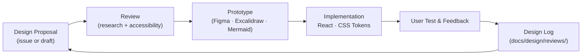

<div align="center">

# 🎨 Kansas Frontier Matrix — Design Documentation  
`/docs/design/`

**Mission:** Capture, structure, and evolve all **design-driven artifacts** —  
from UI/UX patterns and accessibility standards to visualization mockups and  
narrative storytelling flows — that define the experience of the  
**Kansas Frontier Matrix (KFM)**.

[](../../.github/workflows/site.yml)
[](../)
[](README.md)
[](README.md)

</div>

---

## 🎯 Purpose

The `/docs/design/` directory is the **creative and functional hub** of the Kansas Frontier Matrix.  
Where `/docs/architecture/` explains *how* the system works, `/docs/design/` documents *how it feels* —  
how complex Kansas history becomes an **interactive, accessible, and emotionally coherent experience**.

Core goals:

- 📐 **UI/UX Flows** — timeline, map, search, legend, and AI assistant.  
- 🖼️ **Visual Design** — color tokens, typography, layout, iconography.  
- 🗺️ **Interactive Patterns** — timeline-slider logic, hover states, map overlays.  
- 📖 **Narrative Design** — transforming treaties, oral histories, and climate data into cohesive stories.  
- 🤝 **Design Governance** — how to propose, review, and merge design improvements.

All design work aligns with the **Master Coder Protocol (MCP)** for clarity and reproducibility:

| MCP Principle | Design Application |
|:--|:--|
| Document First | Every UI or UX proposal must include a visual or textual prototype before coding. |
| Accessibility | Interfaces follow WCAG 2.1 AA and keyboard-first navigation. |
| Provenance | Each design decision links to a review issue or ADR-style note. |
| Reproducibility | Diagrams, mockups, and CSS tokens are versioned and regenerable. |
| Storytelling | Every interaction conveys historical or ecological meaning. |

---

## 🧭 Design System Overview

```mermaid
flowchart TD
    A["User Research\n(Accessibility · Ethnography · Narrative Input)"] --> B["Design Docs\n(Wireframes · UI Flows · Mockups)"]
    B --> C["Review & Validation\nDesign Reviews · Accessibility Tests"]
    C --> D["Implementation\nReact Components · CSS Tokens"]
    D --> E["Feedback Loop\nUser Testing · Community Input"]
    E --> B
````

<!-- END OF MERMAID -->

This loop reflects **human-centered iteration**: design informs code, code informs new design, and every step feeds documentation.

---

## 📚 Directory Structure

```text
docs/design/
├── README.md                # Index (this file)
├── ui-guidelines.md         # UX principles, accessibility, responsive layouts
├── style-guide.md           # Visual tokens (colors, typography, light/dark themes)
├── interaction-patterns.md  # Map, timeline, and AI assistant behavior
├── storytelling.md          # Narrative and oral-history UX patterns
├── mockups/                 # Wireframes & images (Figma, Excalidraw exports)
├── diagrams/                # Mermaid & SVG diagrams (component/state flows)
└── reviews/                 # Design review logs & ADR-style decisions
```

---

## 🧩 Key Documents

| File                      | Focus                                            | Primary Audience         |
| :------------------------ | :----------------------------------------------- | :----------------------- |
| `ui-guidelines.md`        | UX principles, accessibility, responsive layouts | Designers, Developers    |
| `style-guide.md`          | Typography, color palette, theming               | Frontend Engineers       |
| `interaction-patterns.md` | Timeline/map behaviors, filters, legend logic    | React Developers         |
| `storytelling.md`         | Narrative visualization and guided story design  | Historians, Writers      |
| `mockups/`                | Exported visual artifacts                        | Contributors & Reviewers |
| `reviews/`                | Historical record of design changes              | Governance Team          |

---

## 🧮 Contribution & Review Workflow



<!-- END OF MERMAID -->

**Design Review Steps**

1. 🧠 **Propose:** Submit a new idea via GitHub issue using the `Design Proposal` template.
2. 🎨 **Prototype:** Attach a wireframe or Mermaid diagram.
3. 👥 **Review:** Conduct accessibility and visual contrast checks.
4. 💻 **Implement:** Merge approved design tokens or components.
5. 🧾 **Document:** Record in `/docs/design/reviews/` with rationale, date, and screenshots.

---

## 🧰 Usage

| Role             | How to Use This Directory                                   |
| :--------------- | :---------------------------------------------------------- |
| **Contributors** | Review existing design docs before proposing UI changes.    |
| **Developers**   | Follow style and interaction guides for consistent code.    |
| **Researchers**  | Understand how design communicates data and narrative.      |
| **Reviewers**    | Log decisions in `reviews/` and include rationale diagrams. |

---

## 🔗 Related Documentation

* [`/docs/architecture/`](../architecture/) — System & component structure
* [`/docs/web-ui/`](../web-ui/) — React + MapLibre implementation details
* [`/docs/standards/`](../standards/) — Data, metadata, and code standards
* [`/docs/glossary.md`](../glossary.md) — Common design & data terminology

---

## ♿ Accessibility & Visual Standards

| Standard              | Description                                             | Target             |
| :-------------------- | :------------------------------------------------------ | :----------------- |
| **WCAG 2.1 AA**       | Minimum contrast ≥ 4.5 : 1; keyboard-first navigation.  | All interfaces     |
| **Color Tokens**      | Stored in `style-guide.md` and used via CSS variables.  | Consistent theming |
| **Typography**        | Variable fonts; 16 px base size; responsive scaling.    | Readability        |
| **Motion Guidelines** | Respect `prefers-reduced-motion`; no flashing elements. | Inclusivity        |

---

<div align="center">

### 🎨 “Design is how history becomes experience.”

Every element must serve **clarity, accessibility, and storytelling**.

</div>
