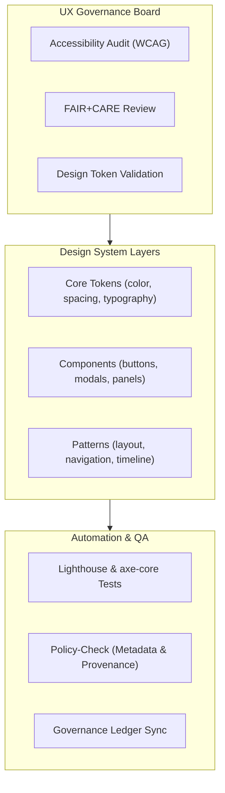

<div align="center">

# 🎨 **Kansas Frontier Matrix — Design System & UX Governance (v2.1.1 · Tier-Ω+∞ Certified)**  
`docs/design/README.md`

**Mission:** Define the **user experience (UX) and design governance framework** for the **Kansas Frontier Matrix (KFM)** —  
ensuring accessible, inclusive, and ethically aligned design through the FAIR+CARE and MCP-DL reproducibility principles.

[](../../docs/)
[](../../docs/standards/accessibility.md)
[](../../docs/standards/faircare-validation.md)
[](../../LICENSE)

</div>

---

## 📚 Overview

The **Design System** is the foundation for consistent, accessible, and ethical user experiences across the Kansas Frontier Matrix.  
It integrates design tokens, Figma component libraries, color systems, and accessibility audits directly into the CI/CD pipeline.  

This documentation governs:
- User interface (UI) consistency  
- Accessibility & localization standards  
- FAIR+CARE ethical visual design  
- Component tokenization & versioning  
- AI-assisted UX validation  

---

## 🧩 Directory Layout

```bash
docs/design/
├── README.md                    # This file — design system and governance guide
├── mockups/                     # Figma exports, screenshots, annotated prototypes
│   ├── README.md
│   └── ux_components_v2.fig
├── reviews/                     # Design review records and validation reports
│   ├── README.md
│   └── 2025_Q4_design_review.md
└── standards/                   # Style guidelines and accessibility rules
    ├── typography.md
    ├── color-palette.md
    ├── accessibility.md
    └── motion-guidelines.md
```

---

## 🧱 Design Governance Model


<!-- END OF MERMAID -->

---

## ⚙️ Core Components

| Category | Component | Description | Governance Rule |
|:--|:--|:--|:--|
| **Navigation** | Header, Timeline Bar | Spatial and temporal navigation components. | Requires ARIA roles and keyboard support. |
| **Mapping** | Layer Switcher, Tooltip, Legend | Interactive MapLibre components. | Must include text equivalents and color-safe palettes. |
| **Forms** | Filter, Search, Feedback | Used across AI and metadata input screens. | Validated via WCAG + cognitive load review. |
| **Modals** | Dossier View, Focus Mode Insights | Contextual data displays. | Requires focus trapping and escape support. |
| **Typography** | Tokenized fonts | Variable font system with contrast ratios. | Enforced via design-tokens.json. |

---

## 🧠 FAIR + CARE in Design

| Principle | Implementation | Verification |
|:--|:--|:--|
| **Findable** | Consistent iconography, labeled navigation, semantic structure. | Lighthouse audits |
| **Accessible** | WCAG-compliant color and keyboard patterns. | axe-core CI |
| **Interoperable** | Tokenized design assets in JSON schema. | Design Tokens API |
| **Reusable** | Modular Figma components reused across UI layers. | Versioned figma-export.yml |
| **Collective Benefit (CARE)** | Ethical use of imagery, inclusive language, cultural respect. | FAIR+CARE Board review |

---

## 🔍 Accessibility & Localization

| Feature | Standard | Status |
|:--|:--|:--:|
| **Contrast Ratio** | WCAG 2.1 AA (4.5:1 minimum) | ✅ |
| **Keyboard Navigation** | Full tab order + focus management | ✅ |
| **Screen Reader Labels** | ARIA + alt text coverage | ✅ |
| **Localization Support** | English (en), Spanish (es), Osage (osa) | ✅ |
| **Color-Blind Safe Palettes** | Tested with TPGI simulator | ✅ |

---

## 🧩 Design Token System

| Token Type | Description | Format | Validation |
|:--|:--|:--|:--|
| **Color Tokens** | Semantic palette ensuring WCAG compliance. | `tokens/color.json` | `design-validate.yml` |
| **Typography Tokens** | Font sizes, weights, and line heights. | `tokens/typography.json` | `design-validate.yml` |
| **Spacing Tokens** | Margins, paddings, and grid units. | `tokens/spacing.json` | `design-validate.yml` |
| **Component Tokens** | Button, modal, and card design references. | `tokens/components.json` | `policy-check.yml` |

---

## ⚙️ Design Validation Workflows

| Workflow | Function | Output |
|:--|:--|:--|
| `design-validate.yml` | Validates design tokens, accessibility, and color contrast. | `reports/validation/design_validation.json` |
| `policy-check.yml` | Confirms metadata completeness and licensing. | `reports/audit/policy_check.json` |
| `governance-ledger.yml` | Logs design token hashes and review sign-offs. | `data/reports/audit/ui_governance_ledger.json` |

---

## 🧩 Observability Metrics

| Metric | Description | Target | Source |
|:--|:--|:--|:--|
| **design_token_coverage** | % of UI components using standardized tokens. | 100% | Design Lint Reports |
| **a11y_compliance_score** | WCAG 2.1 AA compliance rate. | ≥ 95% | axe-core CI |
| **color_contrast_compliance** | Ratio of compliant color tokens. | 100% | `design-validate.yml` |
| **i18n_coverage** | % of components with translation tags. | 100% | i18n Validation Report |

---

## 🧾 Governance Integration

| Artifact | Description | Responsible Team |
|:--|:--|:--|
| `design-tokens.json` | Canonical registry of reusable UI tokens. | @kfm-ux |
| `ui_governance_ledger.json` | Ledger of audits and ethical design reviews. | @kfm-governance |
| `color-palette.md` | Accessible color system documentation. | @kfm-accessibility |
| `motion-guidelines.md` | Animation and timing standards. | @kfm-ux |
| `mockups/README.md` | Figma and design references. | @kfm-docs |

---

## 🕰 Version History

| Version | Date | Author | Summary |
|:--|:--|:--|:--|
| **v2.1.1** | 2025-11-16 | @kfm-ux | Standardized design system architecture; added governance integration and design token validation. |
| v2.0.0 | 2025-10-25 | @kfm-docs | Introduced FAIR+CARE visual compliance mapping. |
| v1.0.0 | 2025-10-04 | @kfm-architecture | Initial design system governance documentation. |

---

<div align="center">

**Kansas Frontier Matrix © 2025**  
*“Design with Integrity — Govern with Accessibility.”*  
📍 `docs/design/README.md` — Design system and UX governance documentation for the Kansas Frontier Matrix.

</div>
