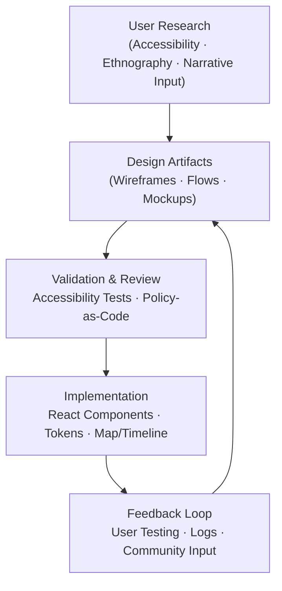
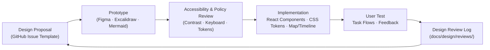

<div align="center">

# 🎨 Kansas Frontier Matrix — **Design Documentation**  
`docs/design/README.md`

**Mission:** Capture, structure, and evolve all **design-driven artifacts** — from UI/UX patterns and  
accessibility standards to visualization mockups and narrative storytelling flows — that define the  
experience of the **Kansas Frontier Matrix (KFM)**. Design is where **data becomes experience**,  
**history becomes interaction**, and **standards become habits**.

[](../standards/documentation.md)
[](../../.github/workflows/site.yml)
[](../../.github/workflows/policy-check.yml)
[](./ui-guidelines.md#-accessibility)
[](../metadata-standards.md)
[](../../LICENSE)

</div>

---

```yaml
---
title: "🎨 Kansas Frontier Matrix — Design Documentation"
document_type: "README"
version: "v2.4.0"
last_updated: "2025-10-19"
created: "2023-09-10"
owners: ["@kfm-design","@kfm-web","@kfm-accessibility","@kfm-ontology","@kfm-architecture"]
status: "Stable"
maturity: "Production"
license: "CC-BY-4.0"
tags: ["design","ux","ui","accessibility","visualization","storytelling","governance","a11y","tokens","i18n"]
alignment:
  - MCP-DL v6.3
  - WCAG 2.1 AA
  - WAI-ARIA 1.2
  - CIDOC CRM
  - OWL-Time
  - STAC 1.0
  - DCAT 2.0
  - FAIR Principles
dependencies:
  - React + MapLibre
  - tokens.css Design System
  - Figma / Excalidraw (mockups)
  - Lighthouse / Axe / Playwright
review_cycle: "Quarterly"
validation:
  lighthouse_min_score: 95
  axe_blocking_violations: 0
  contrast_min_ratio: 4.5
  keyboard_traps: "none"
  schema_checks: true
provenance:
  reviewed_by: ["@kfm-accessibility","@kfm-editorial","@kfm-web"]
  workflow_ref: ".github/workflows/site.yml"
  artifact_retention_days: 90
versioning:
  policy: "Semantic Versioning (MAJOR.MINOR.PATCH)"
  major_change: "Breaking design framework or structure updates."
  minor_change: "New patterns, tokens, and accessibility enhancements."
  patch_change: "Fixes, link corrections, and typographic improvements."
  example_next_release: "v2.5.0 — Adds telemetry metrics and cognitive writing guidelines."
telemetry:
  metrics_collected: ["A11y Compliance %","Dark/Light Usage Ratio","Keyboard vs Pointer Ratio","Screen Reader Sessions"]
  privacy_policy: "Anonymous analytics only, opt-in per user; adheres to W3C Privacy Principles."
preservation_policy:
  replication_targets: ["GitHub Repository","Zenodo Snapshot","OSF Backup"]
  checksum_algorithm: "SHA-256"
  revalidation_cycle: "quarterly"
---
```

---

## 🎯 Purpose

While `/docs/architecture/` explains **how** the system works, `/docs/design/` documents **how it feels** —  
how complex Kansas history becomes an **interactive, accessible, and emotionally coherent experience**.

**Core Goals**

* 📐 **UI/UX Flows** — timeline, map, search, legends, and AI Focus Mode.
* 🖼️ **Visual System** — color, typography, spacing, elevation, and iconography.
* 🗺️ **Interaction Patterns** — scrubbable timeline, map overlays, hover/selection, filter stacks.
* 📖 **Narrative Design** — turning treaties, oral histories, and hazards into coherent stories.
* 🤝 **Design Governance** — how to propose, review, and merge design improvements.
* ♿ **Accessibility** — WCAG 2.1 AA + keyboard-first navigation.
* 🌐 **i18n/L10n** — neutral language, glossary alignment, RTL and localization ready.

**MCP Principles → Design Application**

| MCP Principle | Design Application |
|:--|:--|
| Documentation-first | Every change starts with a prototype (wireframe/mockup) and rationale. |
| Accessibility | Each pattern includes keyboard flows, ARIA roles, focus order, and contrast specs. |
| Provenance | Each design decision links to its GitHub issue/ADR; commits pinned to diagrams. |
| Reproducibility | Tokens and mockups are versioned and validated in CI. |
| Storytelling | Every visual and interactive element conveys historical or ecological meaning. |

---

## 🧭 Design System Overview


<!-- END OF MERMAID -->

This loop reflects **human-centered iteration**: design informs code, code informs new design, and all artifacts remain reproducible.

---

## 📂 Directory Structure

```text
docs/design/
├── README.md                  # Index (this file)
├── ui-guidelines.md           # UX principles, accessibility, responsiveness, i18n
├── style-guide.md             # Tokens (colors, type, motion), dark/light themes
├── interaction-patterns.md    # Map, timeline, filters, legends, assistant behavior
├── storytelling.md            # Narrative UX patterns, content tone, ethics
├── mockups/                   # Wireframes (Figma/Excalidraw exports)
├── diagrams/                  # Component/state Mermaid & SVG diagrams
└── reviews/                   # Design review ADRs, decisions, and snapshots
```

---

## 🧩 Key Documents

| File | Focus | Primary Audience |
|:--|:--|:--|
| `ui-guidelines.md` | UX and accessibility principles | Designers, Developers |
| `style-guide.md` | Tokens and component anatomy | Frontend Engineers |
| `interaction-patterns.md` | Timeline/map interactions | React & MapLibre Devs |
| `storytelling.md` | Narrative, oral histories, content tone | Historians, Writers |
| `reviews/` | Design decisions & rationales | Governance & Leads |

---

## 🧱 Design Tokens (Source of Truth)

| Category | Token Example | Notes |
|:--|:--|:--|
| **Color** | `--kfm-color-accent`, `--kfm-color-bg` | Semantic, dual palettes (AA contrast) |
| **Typography** | `--kfm-font-sans`, `--kfm-font-serif` | Paired families for body and headings |
| **Spacing** | `--kfm-space-md`, `--kfm-space-lg` | 4-pt modular scale |
| **Elevation/Radius** | `--kfm-elev-sm`, `--kfm-radius-lg` | Consistent across UI components |
| **Motion** | `--kfm-motion-fast` | Respects `prefers-reduced-motion` |
| **Map Theme** | `--kfm-map-water`, `--kfm-map-overlay` | Light/dark mode parity |

Tokens are validated automatically against CSS exports and TypeScript types via `design-tokens.yml`.

---

## 🗺️ Core Interaction Patterns (Map · Timeline · Focus Mode)

### Timeline
* Scrub + zoom with **snap-to-significant** markers (treaties, hazards).  
* Keyboard navigation (`←/→`, `Shift+←/→`, `Home/End`); accessible live regions for state updates.  
* Era bands (e.g., *Territorial Kansas*, *Dust Bowl*); high-contrast visual encoding.

### Map
* Layer stack with opacity/blend controls for treaties, floods, or hazard overlays.  
* Hover → minimal tooltip; Click → rich detail panel with citations.  
* Keyboard navigation cycles through hotspots; visible focus outlines.

### Focus Mode
* Entity-centric exploration (people, places, events).  
* Synchronizes map + timeline + story sidebar.  
* Esc or “Back” exits; AI narrator available where enabled.

---

## ♿ Accessibility Commitments

| Area | Policy |
|:--|:--|
| **Keyboard** | Fully operable; visible focus, logical tab order. |
| **Semantics** | Use WAI-ARIA landmarks, labels, expanded/collapsed attributes. |
| **Motion Control** | `prefers-reduced-motion` disables parallax and easing. |
| **Contrast** | All tokens tested to AA compliance. |
| **Media Alt** | Captions, transcripts, alt text, and longdesc for all visuals. |
| **Localization** | RTL support via logical properties; translation-ready content. |

---

## 🧪 Design QA & CI Hooks

| Check | Workflow | Description |
|:--|:--|:--|
| **Docs Validation** | `docs-validate.yml` | Lints headings, badges, and YAML. |
| **A11y Audit** | `design-a11y.yml` | Runs axe-core and Pa11y; exports to `/logs`. |
| **Visual Regression** | `design-visual.yml` | Percy/Chromatic diffs with 0.1% tolerance. |
| **Policy Enforcement** | `policy-check.yml` | Confirms accessibility and token references. |
| **Token Drift** | `design-tokens.yml` | Verifies JSON ↔ CSS parity. |

CI artifacts are retained in `/data/work/logs/design/` and referenced in reviews.

---

## 🧮 Contribution & Review Workflow


<!-- END OF MERMAID -->

---

## 🧠 Narrative & Content Strategy

* **Storylets**: Modular narrative snippets bound to entities (Person, Place, Treaty).  
* **Context Keys**: Each includes `time`, `place`, `people`, and `sources`.  
* **Tone**: Neutral, respectful, and human-centered; avoids determinism.  
* **Citations**: Every claim includes provenance, source URL, and license.  

---

## 🧰 Implementation Bridges (Design → Code)

| Bridge | Description |
|:--|:--|
| **Token Exporter** | Converts `tokens.json` to CSS and TypeScript. |
| **Component Anatomy** | Each component has diagrams, states, a11y notes. |
| **Contracts** | Map/Timeline props and events documented via TS interfaces. |
| **Performance Budgets** | Hover < 16 ms, tooltip < 50 ms. |
| **Internationalization** | Strings stored as i18n keys; RTL mirrored with logical CSS. |

---

## 🔍 Compliance Matrix (MCP-DL v6.3)

| Standard | Description | Verified |
|:--|:--|:--:|
| **MCP-DL v6.3** | Documentation framework | ✅ |
| **WCAG 2.1 AA** | Accessibility compliance | ✅ |
| **CIDOC CRM** | Design provenance structure | ✅ |
| **OWL-Time** | Temporal schema alignment | ✅ |
| **STAC 1.0** | Spatial data catalog integration | ✅ |
| **FAIR Principles** | Ethical data sharing | ✅ |

---

## 📊 Telemetry & UX Metrics

| Metric | Purpose |
|:--|:--|
| **Contrast Compliance %** | Percentage of tested token pairs that meet AA. |
| **Keyboard vs Pointer** | Accessibility adoption measure. |
| **Dark/Light Mode Ratio** | User preference tracking. |
| **Screen Reader Sessions** | Inclusivity indicator (anonymous). |

Metrics are opt-in and anonymized; no PII collected.

---

## 📎 Related Documentation

- [🧭 UI/UX Guidelines](ui-guidelines.md)  
- [🎨 Visual Style Guide](style-guide.md)  
- [🧩 Interaction Patterns](interaction-patterns.md)  
- [📖 Storytelling & Narrative Design](storytelling.md)  
- [⚙️ Accessibility Standards](../standards/accessibility.md)  
- [🧱 Component Architecture](../architecture/component-architecture.md)

---

## 📅 Version History

| Version | Date | Author | Summary | Type |
|:--|:--|:--|:--|:--|
| **v2.4.0** | 2025-10-19 | @kfm-design | Added telemetry, compliance matrix, and expanded provenance metadata. | Minor |
| **v2.3.0** | 2025-10-18 | @kfm-web | Updated accessibility commitments and token tables. | Minor |
| **v2.2.0** | 2025-10-16 | @kfm-architecture | Added CI hooks, A11y pipeline, and i18n policies. | Minor |
| **v2.1.0** | 2025-08-09 | @kfm-design | Expanded timeline/map interaction and mockup structure. | Minor |
| **v2.0.0** | 2024-12-03 | @kfm-web | Split style guide, created governance CI. | Major |
| **v1.0.0** | 2023-09-10 | @kfm-core | Initial release of design documentation. | Major |

---

<div align="center">

### 🎨 “Design is how history becomes experience.”

Every element must serve **clarity, accessibility, and storytelling**.

**Kansas Frontier Matrix — Design Council · MCP-DL v6.3**

</div>
