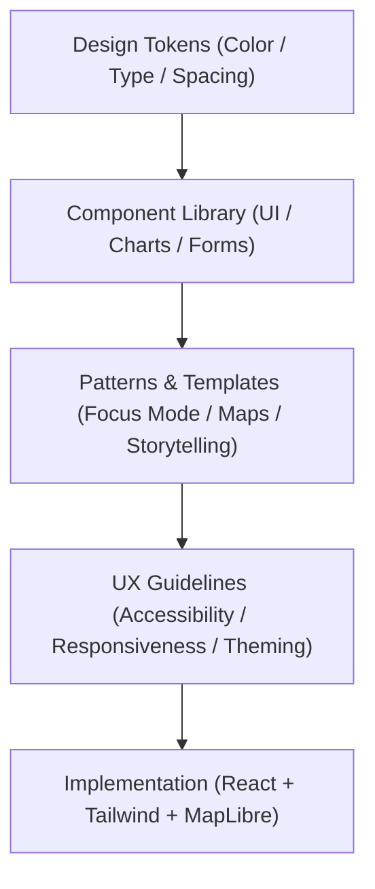
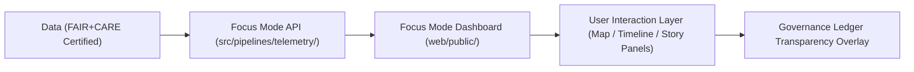

<div align="center">

# 🎨 Kansas Frontier Matrix — **Design System & User Experience Framework**
`docs/design/README.md`

**Purpose:**  
This directory defines the **visual, interaction, and accessibility standards** that power the Kansas Frontier Matrix (KFM) web application, Focus Mode interface, and storytelling environments.  
It ensures that all visual components, layouts, and interactive experiences are **FAIR+CARE-aligned, inclusive, and scientifically grounded**.

[](../../docs/standards/faircare-validation.md)
[]()
[]()
[](../../LICENSE)

</div>

---

## 📚 Overview

The **Design System Framework** ensures the Kansas Frontier Matrix maintains a unified and accessible interface across all digital surfaces — including its Focus Mode web dashboard, map viewer, and storytelling experiences.  
It integrates **accessibility (WCAG 2.2 AA), human-centered design (ISO 9241-210), and FAIR+CARE ethics**, providing users with clarity, inclusivity, and context awareness.

### Core Design Principles
- **Clarity:** Data visualizations and interactions must communicate meaning without ambiguity.  
- **Transparency:** UI components display data provenance and FAIR+CARE certifications openly.  
- **Equity:** Interfaces and interactions must be accessible to all users, regardless of background.  
- **Consistency:** Visual tokens and UI patterns remain standardized across all products.  
- **Sustainability:** Digital design aligned with low-energy, green UI principles.  

---

## 🗂️ Directory Layout

```plaintext
docs/design/
├── README.md                              # This file — overview of design and UX standards
│
├── tokens/                                # Design tokens for color, typography, and layout
│   ├── color-palette.md
│   ├── typography-system.md
│   ├── spacing-grid.md
│   └── accessibility-tokens.md
│
├── components/                            # UI component library documentation
│   ├── navigation.md
│   ├── buttons.md
│   ├── charts.md
│   └── forms.md
│
├── patterns/                              # Interaction and storytelling patterns
│   ├── map-visualization.md
│   ├── focus-mode-interface.md
│   ├── storytelling-flows.md
│   └── accessibility-patterns.md
│
└── figma/                                 # Links and exports from the primary design system
    ├── Figma-Tokens.md
    └── Figma-System-Link.md
```

---

## ⚙️ Design System Architecture



### System Layers
1. **Tokens:** Foundational layer defining color, type, grid, and spacing scales.  
2. **Components:** Reusable UI elements — modular and responsive.  
3. **Patterns:** Complex structures combining multiple components and data types.  
4. **UX Guidelines:** Defines accessibility, inclusivity, and interaction best practices.  
5. **Implementation:** Frontend frameworks integrate design tokens into `web/`.  

---

## 🧠 FAIR+CARE & Accessibility Integration

| Principle | Implementation |
|------------|----------------|
| **Findable** | Consistent labeling, alt text, and metadata embedded in components. |
| **Accessible** | WCAG 2.2 AA-compliant color contrast and keyboard navigation. |
| **Interoperable** | Figma → React/Tailwind design parity for open integration. |
| **Reusable** | Modular components maintained under FAIR+CARE open license. |
| **Collective Benefit** | Design promotes accessibility and ethical storytelling. |
| **Authority to Control** | FAIR+CARE Council validates accessibility audits. |
| **Responsibility** | Designers log usability testing and accessibility conformance. |
| **Ethics** | All visuals reviewed for inclusivity, non-bias, and accessibility. |

Accessibility results validated via `focus-ui-audit.yml` CI workflow.

---

## 🧩 Focus Mode Interface Flow



### Interface Highlights
- **Map Visualization:** MapLibre integration for spatial-temporal data overlays.  
- **Timeline:** React/D3 hybrid component for scrubbing historical data.  
- **Story Panels:** AI-driven summaries based on FAIR+CARE narratives.  
- **Ledger Overlay:** Provenance visualization linked to governance ledger entries.  

---

## 🎨 Design Tokens & Theming

| Token Group | Description | Standard |
|--------------|-------------|-----------|
| **Color** | Semantic color system with high contrast ratios. | WCAG 2.2 AA |
| **Typography** | Scalable typographic hierarchy (rem-based). | ISO 9241-210 |
| **Spacing / Layout** | 8pt modular grid for consistency. | MCP-DL v6.3 |
| **Elevation / Shadows** | Minimal depth for energy-efficient rendering. | ISO 50001 |
| **Motion** | Reduced motion preferences respected by default. | WCAG 2.2 |

Figma tokens exported and synced via `figma_sync.yml`.

---

## 📊 UX Validation & Audit Process

| Validation Type | Description | Tool / Workflow | Frequency |
|------------------|-------------|------------------|------------|
| **Accessibility Audit** | WCAG 2.2 AA compliance scan. | `axe-core`, `focus-ui-audit.yml` | Continuous |
| **Usability Review** | Fairness and inclusivity testing. | FAIR+CARE UX Team | Quarterly |
| **Governance Integration** | Ledger-linked transparency layer validation. | `focus-validate.yml` | Continuous |
| **Sustainability Review** | Carbon cost of rendering and UI performance. | ISO 50001 / Telemetry | Quarterly |

Audit results logged in:  
`releases/v9.6.0/focus-telemetry.json`

---

## 🧾 Internal Use Citation

```text
Kansas Frontier Matrix (2025). Design System & User Experience Framework (v9.6.0).
Unified FAIR+CARE and ISO-compliant design ecosystem ensuring accessibility, sustainability, and equity across all KFM user interfaces.
Defines the design tokens, patterns, and UX standards governing the Focus Mode platform and map storytelling experience.
```

---

## 🧾 Version Notes

| Version | Date | Notes |
|----------|------|--------|
| v9.6.0 | 2025-11-03 | Added WCAG 2.2 AA compliance and sustainability theming. |
| v9.5.0 | 2025-11-02 | Integrated Figma tokens with React + Tailwind parity. |
| v9.3.2 | 2025-10-28 | Established FAIR+CARE-aligned design system baseline. |

---

<div align="center">

**Kansas Frontier Matrix** · *Accessible Design × FAIR+CARE Ethics × Sustainable UX*  
[🔗 Repository](https://github.com/bartytime4life/Kansas-Frontier-Matrix) • [🧭 Design Hub](./) • [⚖️ Governance Ledger](../../docs/standards/governance/DATA-GOVERNANCE.md)

</div>
