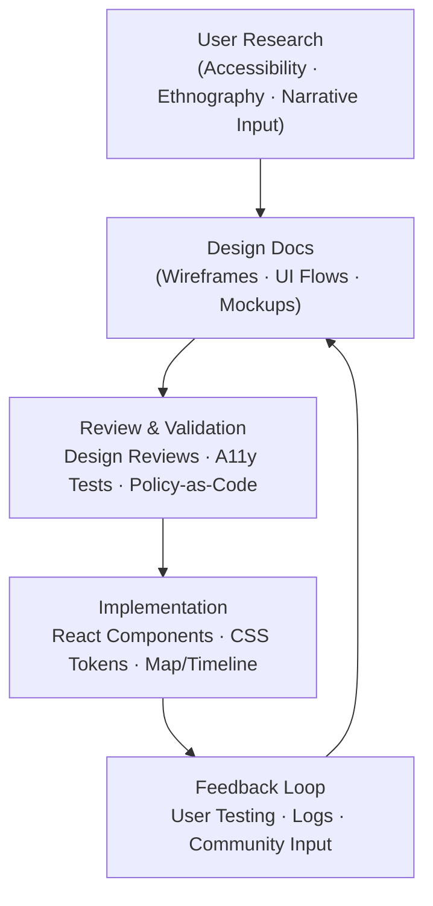
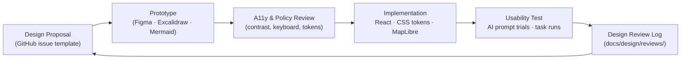

<div align="center">

# 🎨 Kansas Frontier Matrix — **Design Documentation**  
`docs/design/README.md`

**Mission:** Capture, structure, and evolve all **design-driven artifacts** — from UI/UX patterns and  
accessibility standards to visualization mockups and narrative storytelling flows — that define the  
experience of the **Kansas Frontier Matrix (KFM)**. Design is where **data becomes experience**,  
**history becomes interaction**, and **standards become habits**.

[](../../.github/workflows/docs-validate.yml)
[](../../.github/workflows/site.yml)
[](../../.github/workflows/policy-check.yml)
[](./ui-guidelines.md#-accessibility)
[](../metadata-standards.md)
[](../../LICENSE)

</div>

```yaml
---
title: "Kansas Frontier Matrix — Design Documentation"
document_type: "Design Index"
version: "v2.2.0"
last_updated: "2025-10-18"
created: "2023-09-10"
owners: ["@kfm-design","@kfm-web","@kfm-accessibility","@kfm-ontology"]
status: "Stable"
maturity: "Production"
license: "CC-BY 4.0"
tags: ["design","ux","ui","accessibility","visualization","storytelling","governance"]
audit_framework: "MCP-DL v6.3"
semantic_alignment:
  - CIDOC CRM
  - OWL-Time
  - STAC 1.0
  - DCAT 2.0
  - SKOS
preservation_policy:
  replication_targets: ["GitHub Repository","Zenodo Snapshot","OSF Backup"]
  checksum_algorithm: "SHA-256"
  revalidation_cycle: "quarterly"
---
````

---

## 🎯 Purpose

Where `/docs/architecture/` explains **how** the system works, `/docs/design/` documents **how it feels** —
how complex Kansas history becomes an **interactive, accessible, and emotionally coherent experience**.

**Core goals**

* 📐 **UI/UX Flows** — timeline, map, search, layer legend, and AI assistant (Focus Mode).
* 🖼️ **Visual System** — color tokens, typography, elevation, spacing, grids, iconography.
* 🗺️ **Interaction Patterns** — scrubbable timeline, map overlays, hover/selection states, filter stacks.
* 📖 **Narrative Design** — transforming treaties, oral histories, hazards, and climate into coherent stories.
* 🤝 **Design Governance** — how to propose, review, and merge design improvements.
* ♿ **Accessibility** — WCAG 2.1 AA + keyboard-first navigation + reduced-motion by default.
* 🌐 **i18n/L10n & Content Strategy** — neutral wording, glossary harmonization, translation hooks.

**MCP Principles → Design Application**

| MCP Principle       | Design Application                                                                    |
| :------------------ | :------------------------------------------------------------------------------------ |
| Documentation-first | Every UI/UX change starts with a prototype (diagram/mockup) and a short rationale.    |
| Accessibility       | All patterns include keyboard flows, aria roles, focus order, and contrast specs.     |
| Provenance          | Each design decision links to a review issue/ADR; commit IDs pinned in diagrams.      |
| Reproducibility     | Tokens, diagrams, and mockups are versioned; exports are deterministic.               |
| Storytelling        | Every interaction conveys historical or ecological meaning with context and citation. |

---

## 🧭 Design System Overview



<!-- END OF MERMAID -->

This loop reflects **human-centered iteration**: design informs code, code informs new design, and every step feeds documentation.

---

## 📚 Directory Structure

```text
docs/design/
├── README.md                  # Index (this file)
├── ui-guidelines.md           # UX principles, accessibility, responsive layouts, i18n
├── style-guide.md             # Design tokens (colors, typography, radius, shadows), dark/light themes
├── interaction-patterns.md    # Map, timeline, filters, legends, AI assistant behavior
├── storytelling.md            # Narrative & oral-history UX patterns, content strategy
├── mockups/                   # Wireframes & images (Figma/Excalidraw exports, PNG/SVG)
├── diagrams/                  # Mermaid & SVG diagrams (component/state flows)
└── reviews/                   # Design review logs & ADR-style decisions
```

> All new artifacts should follow **file naming** `YYYY-MM-DD_title.ext` and include a YAML front-matter block.

---

## 🧩 Key Documents

| File                      | Focus                                                                | Primary Audience      |
| :------------------------ | :------------------------------------------------------------------- | :-------------------- |
| `ui-guidelines.md`        | UX principles, accessibility, responsive grids, keyboard specs, i18n | Designers, Devs       |
| `style-guide.md`          | Tokens (colors, type, elevation, motion), theming, component anatomy | Frontend Engineers    |
| `interaction-patterns.md` | Timeline/map behaviors, filters, legends, focus states               | React + MapLibre Devs |
| `storytelling.md`         | Narrative visualization patterns, oral histories, content tone       | Historians, Writers   |
| `reviews/`                | Decisions, trade-offs, snapshots of major changes                    | Governance Team       |

---

## 🧱 Design Tokens (Source of Truth)

**Token namespaces** (exported as CSS variables and JSON):

* Color: `--kfm-color-*` (semantic) → `--kfm-color-bg`, `--kfm-color-fg`, `--kfm-color-accent`, `--kfm-color-alert`, `--kfm-color-success`
* Typography: `--kfm-font-*` (families, sizes, weights, line-height)
* Spacing & Grid: `--kfm-space-*` (4-pt scale), grid columns (12/24), container widths
* Elevation: `--kfm-elev-*` (shadow tokens); Radius: `--kfm-radius-*`
* Motion: `--kfm-motion-*` (durations/easings); respects `prefers-reduced-motion`
* Map Theme: `--kfm-map-*` for land/water/roads/overlays, highlight/selection

**Light/Dark**: Provide dual palettes with AA contrast; minimum 4.5:1 for body text and 3:1 for large text/icons.
**Localization**: RTL-aware spacing/mirroring via logical properties (`inline-start`, `inline-end`).

---

## 🗺️ Core Interaction Patterns (Map · Timeline · Focus Mode)

### Timeline

* **Scrub + Zoom** (wheel/drag) with **snap-to-significant** years (treaties/hazards).
* Keyboard: `←/→` year step, `Shift+←/→` decade step, `Home/End` bounds, `Enter` to open focused event.
* Visual: active window shading; bands for eras (e.g., “Territorial Kansas”, “Dust Bowl”), **ARIA live** for status.

### Map

* **Layer Stack** with **opacity sliders** and **blend modes** (multiply/screen) for overlays (treaty polygons, flood extents).
* **Hover card** → minimal; **Click panel** → detail with micro-summary, citations, related links.
* **Cluster + declutter rules** for dense markers; keyboard navigation (`Tab` moves through hotspots).
* Loading: skeleton shimmer + “low-confidence” dotted outlines from AI.

### Focus Mode (AI-assisted)

* Single-entity pivot (e.g., “Kaw Nation”, “Fort Larned”, “Treaty 1825”).
* Zooms timeline to relevant interval; centers map; filters layers to **only related**.
* Sidebar: **Summary → People → Places → Documents → Events → Insights** with AI explanations & citations.
* Exits via `Esc` or “Back to overview”.

---

## ♿ Accessibility Commitments (WCAG 2.1 AA)

* **Keyboard first:** Full operability without a mouse; visible focus rings; logical tab order.
* **Semantics:** Use landmark roles (`header`, `nav`, `main`, `contentinfo`), aria-labels, `aria-expanded` on disclosures.
* **Motion control:** Respect `prefers-reduced-motion`; disable parallax/animations when set.
* **Contrast & State:** Tokenized colors with AA contrast; state colors must encode meaning **and** shape/pattern (not color only).
* **Media alternatives:** Captions/transcripts for videos; descriptive alt text; longdesc for complex charts.

---

## 🧪 Design QA & CI Hooks

| Check                  | Workflow            | What it does                                                           |
| :--------------------- | :------------------ | :--------------------------------------------------------------------- |
| **Docs-Validate**      | `docs-validate.yml` | Lints headings, badges, YAML front-matter; checks links.               |
| **Policy-as-Code**     | `policy-check.yml`  | Enforces required sections (A11y statement, tokens link, review refs). |
| **A11y Snapshot**      | `design-a11y.yml`   | Runs axe-core/pa11y on key pages; exports report to `logs/`.           |
| **Visual Regressions** | `design-visual.yml` | Percy/Chromatic diffs; fail on >0.1% pixel shift.                      |
| **Token Drift**        | `design-tokens.yml` | Fails if tokens JSON mismatches CSS export.                            |

> CI artifacts are stored under `data/work/logs/design/` and referenced from design reviews.

---

## 🧮 Contribution & Review Workflow



<!-- END OF MERMAID -->

**Design Review Steps**

1. 🧠 **Propose** — Open an issue (`Design Proposal` template).
2. 🎨 **Prototype** — Attach mockups/diagrams; include token references.
3. ♿ **Review** — Run a11y checks (contrast, keyboard map), policy validation.
4. 💻 **Implement** — Use tokens; add tests (component + interaction).
5. 🧾 **Document** — Log in `docs/design/reviews/` (rationale, screenshots, commit SHAs).
6. 🔁 **Iterate** — Incorporate feedback; confirm with users & community.

---

## 🧠 Narrative & Content Strategy

* **Storylets**: Small, composable narrative units that bind to entities (Treaty, Place, Person) and appear contextually.
* **Context Keys**: Each storylet declares `time`, `place`, `people`, and `sources` to render in Focus Mode and tooltips.
* **Tone**: Clear, neutral, and respectful — especially for **Indigenous histories**; avoid deterministic language.
* **Citations**: Every claim includes a citation or link (KHS, LOC, Kappler, USFS, NOAA) and a confidence tag.

---

## 🧰 Implementation Bridges (Design → Code)

* **Token Exporters**: A small script exports `tokens.json` → CSS variables & TypeScript types.
* **Component Anatomy**: Each component doc includes anatomy diagram, states, and a11y notes.
* **Map/Timeline Contracts**: Types specify props/events for layers, legends, and time windows.
* **Performance Budgets**: Targets per component (e.g., map hover < 16 ms, tooltip < 50 ms).
* **Internationalization**: All strings via i18n keys; RTL mirrored by logical props.

---

## 📎 Related Documentation

| File                               | Description                             |
| :--------------------------------- | :-------------------------------------- |
| `../architecture/`                 | System & component structure            |
| `../web-ui/`                       | React + MapLibre implementation details |
| `../standards/`                    | Data/metadata/code standards            |
| `../glossary.md`                   | Common design & data terminology        |
| `../integration/workflows.md`      | End-to-end ETL/AI workflows             |
| `../integration/reviews/README.md` | Governance and validation logs          |

---

## 📅 Version History

| Version    | Date       | Author             | Summary                                                                                             |
| :--------- | :--------- | :----------------- | :-------------------------------------------------------------------------------------------------- |
| **v2.2.0** | 2025-10-18 | KFM Design Council | Added governance CI, token drift checks, Focus Mode flows, i18n guidelines, A11y snapshot pipeline. |
| v2.1.0     | 2025-08-09 | KFM Design Team    | Interaction patterns expanded; dark/light tokenization; keyboard maps.                              |
| v2.0.0     | 2024-12-03 | KFM Web Team       | Initial split of UI guidelines and style guide; added review loop.                                  |
| v1.0.0     | 2023-09-10 | Founding Team      | First version — design index and initial principles.                                                |

---

<div align="center">

### 🎨 “Design is how history becomes experience.”

Every element must serve **clarity, accessibility, and storytelling**.

</div>
