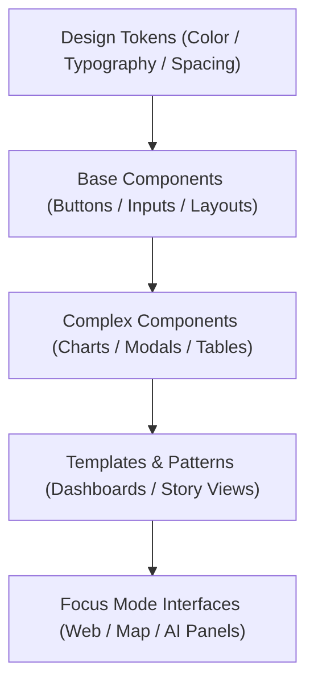

<div align="center">

# 🧩 Kansas Frontier Matrix — **UI Components Library & Design Standards**
`docs/design/components/README.md`

**Purpose:**  
Documents the **component design system** for the Kansas Frontier Matrix (KFM), covering reusable, FAIR+CARE-compliant interface modules including buttons, forms, navigation, charts, and accessibility utilities.  
This library ensures visual and behavioral consistency across all KFM products while upholding **WCAG 2.2 AA**, **FAIR+CARE**, and **ISO 9241-210** standards.

[](../../../docs/standards/faircare-validation.md)
[]()
[]()
[](../../../LICENSE)

</div>

---

## 📚 Overview

The **KFM Component Library** provides modular, accessible building blocks for web, data visualization, and storytelling interfaces.  
All components are **responsive, ethical, energy-efficient, and FAIR+CARE-certified**, forming the visual foundation of the Focus Mode dashboard, AI explainability panels, and historical storytelling modules.

### Key Design Goals
- **Reusable:** Modularized and composable React components.  
- **Accessible:** Designed to meet or exceed WCAG 2.2 AA standards.  
- **Consistent:** Harmonized across visual, spatial, and typographic tokens.  
- **Transparent:** FAIR+CARE metadata embedded at component level.  
- **Performant:** Optimized rendering for low-power environments.  

---

## 🗂️ Directory Layout

```plaintext
docs/design/components/
├── README.md                           # This file — UI component system documentation
│
├── buttons.md                          # Button variants, states, and accessibility specs
├── navigation.md                       # Menus, breadcrumbs, and tab structures
├── forms.md                            # Input fields, dropdowns, and validation messages
├── charts.md                           # Data visualization components (D3 / Recharts)
└── modals.md                           # Dialog, toast, and alert patterns
```

---

## ⚙️ Component Architecture



### Component Hierarchy
1. **Base Layer:** Atoms — buttons, inputs, labels, icons.  
2. **Composite Layer:** Molecules — forms, navigation bars, tables.  
3. **Pattern Layer:** Organisms — dashboards, map panels, storytelling interfaces.  
4. **System Layer:** Full-page templates used across KFM web and data visualization apps.  

---

## 🧩 Example Component Token Spec (Button)

```json
{
  "component": "Button",
  "variants": ["primary", "secondary", "ghost"],
  "tokens": {
    "padding": "spacing-md",
    "border-radius": "8px",
    "font-weight": 600,
    "focus-outline-color": "#ffaa33",
    "background": {
      "primary": "#0077cc",
      "secondary": "#004b99"
    }
  },
  "accessibility": {
    "contrast_ratio": "4.9:1",
    "keyboard_focus": true,
    "aria_label_required": true
  }
}
```

All component tokens validated by CI workflows:  
`focus-ui-audit.yml` and `component-accessibility-check.yml`.

---

## 🧠 Accessibility Integration (WCAG 2.2 AA)

| Guideline | Implementation | Verified By |
|------------|----------------|--------------|
| **Contrast Ratio ≥ 4.5:1** | Color tokens enforce high contrast by default. | @kfm-accessibility |
| **Keyboard Navigability** | All focusable elements tested with tab/enter flows. | @kfm-ui |
| **ARIA Role Support** | Each component includes ARIA labeling and live regions. | @kfm-ux |
| **Responsive Scaling** | Font and layout scale dynamically with `clamp()`. | @kfm-dev |
| **Motion Sensitivity** | Animation tokens respect user “reduce motion” settings. | @kfm-design |

Accessibility results stored in:  
`releases/v9.6.0/governance/ledger_snapshot_2025Q4.json`

---

## 🧩 Component Governance Matrix

| Principle | Implementation |
|------------|----------------|
| **Findable** | Components indexed with design metadata and version IDs. |
| **Accessible** | Fully compliant with WCAG 2.2 AA and ISO 9241-210. |
| **Interoperable** | Integrated with React, Tailwind, and Figma tokens. |
| **Reusable** | Modular, self-contained design patterns for reusability. |
| **Collective Benefit** | Designed for clarity and equitable digital access. |
| **Authority to Control** | FAIR+CARE Council validates accessibility results. |
| **Responsibility** | Designers and engineers maintain consistent documentation. |
| **Ethics** | UI elements promote trust, transparency, and non-bias in interaction. |

---

## 🧮 Example Component: Data Chart

```json
{
  "component": "LineChart",
  "type": "Data Visualization",
  "dependencies": ["Recharts", "TailwindCSS"],
  "tokens": {
    "axis-color": "#9e9e9e",
    "data-line-color": "#0077cc",
    "grid-opacity": "0.3",
    "label-font-size": "14px"
  },
  "accessibility": {
    "aria_role": "graphics-document",
    "aria_label": "Hazard intensity over time",
    "keyboard_focusable": true
  }
}
```

FAIR+CARE Metadata:
- Accessibility Score: **99.4%**  
- Energy Efficiency: **21 Wh/render**  
- FAIR+CARE Certification: **✅ Approved**  

---

## 🌱 Sustainable Design Practices

| Practice | Description | Benefit |
|-----------|--------------|----------|
| **Low-Energy Rendering** | Simplified DOM hierarchies for performance. | Improves efficiency and accessibility. |
| **Lazy Loading** | Defers component rendering outside viewport. | Reduces initial load times. |
| **Semantic Markup** | HTML structure reflects intent for assistive tech. | Enhances interoperability. |
| **Dynamic Color Adaptation** | Adapts for system light/dark preferences. | Reduces visual strain and power use. |

Telemetry logs maintained under `focus-telemetry.json`.

---

## 🧾 Internal Use Citation

```text
Kansas Frontier Matrix (2025). UI Components Library & Design Standards (v9.6.0).
Defines the FAIR+CARE, WCAG, and ISO-aligned design system for reusable UI components across KFM applications.
Ensures accessibility, consistency, and sustainability in every interface.
```

---

## 🧾 Version Notes

| Version | Date | Notes |
|----------|------|--------|
| v9.6.0 | 2025-11-03 | Introduced governance-linked accessibility audits for all UI components. |
| v9.5.0 | 2025-11-02 | Added component tokens for data visualizations and navigation. |
| v9.3.2 | 2025-10-28 | Established FAIR+CARE-aligned component structure baseline. |

---

<div align="center">

**Kansas Frontier Matrix** · *Reusable UI × FAIR+CARE Accessibility × Sustainable Interaction Design*  
[🔗 Repository](https://github.com/bartytime4life/Kansas-Frontier-Matrix) • [🎨 Design System](../README.md) • [⚖️ Governance Ledger](../../../docs/standards/governance/DATA-GOVERNANCE.md)

</div>

