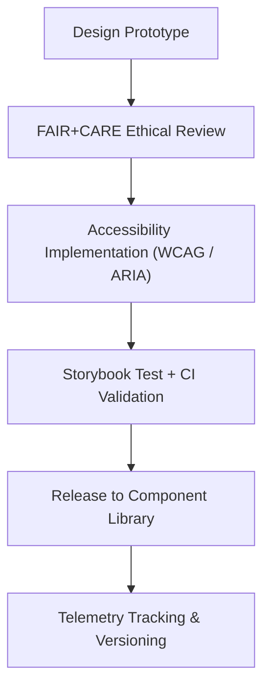

<div align="center">

# 🧩 **Kansas Frontier Matrix — UI Components Library**
`docs/design/components/README.md`

**Purpose:**  
Provide documentation and ethical design guidance for all **user interface (UI) components** used throughout the **Kansas Frontier Matrix (KFM)** web platform and applications.  
This library ensures each element follows **WCAG 2.1 AA**, **FAIR+CARE visual ethics**, and **MCP-DL v6.3** reproducibility standards.

[](../../README.md)
[](../../standards/faircare.md)
[](../../../LICENSE)
[](../../../releases/v10.0.0/manifest.zip)

</div>

---

## 📘 Overview

The **KFM Components Library** is a centralized repository of reusable, tested, and ethically verified user interface elements.  
Every component is:
- **Accessibility-first** (WCAG 2.1 AA compliant).  
- **FAIR+CARE-aligned**, ensuring inclusive design and cultural respect.  
- **Version-controlled** and validated through CI/CD workflows.  
- **Interoperable** across KFM’s web app, governance dashboards, and Focus Mode interface.

Components are coded in **React + TypeScript**, styled with **Tailwind CSS**, and documented for reproducibility under **Master Coder Protocol (MCP)**.

---

## 🗂️ Directory Layout

```
docs/design/components/
├── README.md                        # This file
├── buttons.md                       # Accessible buttons and toggles
├── forms.md                         # Input fields, checkboxes, and validation UI
├── modals.md                        # Dialogs, alerts, drawers
└── cards.md                         # Data and story card layouts
```

---

## 🧩 Core Component Principles

| Principle | Description | Compliance Standard |
|---|---|---|
| **Accessibility First** | All interactive components must meet WCAG 2.1 AA and ARIA requirements. | WCAG / ARIA 1.2 |
| **Consistency** | Shared tokens for color, spacing, and typography. | Design Tokens v10.0 |
| **Ethical Representation** | Visuals, icons, and text avoid cultural bias or misrepresentation. | FAIR+CARE |
| **Reproducibility** | Components are versioned, tested, and validated for deterministic builds. | MCP v6.3 |
| **Transparency** | Provenance and accessibility metadata are machine-readable. | FAIR Metadata Schema |

---

## 🎨 Component Categories

| Category | Purpose | Example Components |
|---|---|---|
| **Controls** | User interaction elements. | Buttons, toggles, checkboxes. |
| **Inputs** | Data entry and validation fields. | Text inputs, dropdowns, search bars. |
| **Feedback** | System and user notifications. | Alerts, modals, tooltips. |
| **Containers** | Structural layout elements. | Cards, panels, tabs. |
| **Navigation** | UI navigation aids. | Menus, breadcrumbs, pagination. |

---

## ♿ Accessibility Requirements (per Component)

| Requirement | Implementation Example |
|---|---|
| **Keyboard Operability** | `Tab`, `Enter`, `Space`, and `Esc` supported for all components. |
| **Focus Visibility** | ≥ 3:1 contrast ratio on focus outline (`focus.outline.color`). |
| **ARIA Roles** | Every component explicitly declares ARIA attributes and relationships. |
| **Screen Reader Support** | Dynamic updates announced via `aria-live`. |
| **Motion Sensitivity** | Animated elements respond to `prefers-reduced-motion`. |

> All accessibility audits are executed via `storybook-a11y.yml` and `accessibility_scan.yml` workflows.

---

## 🧠 FAIR+CARE Integration in Design

Each component is reviewed for **cultural neutrality** and **ethical representation**:

| Ethical Check | Description |
|---|---|
| **Inclusive Language** | Avoid ableist, gendered, or colonial phrasing. |
| **Iconography Ethics** | Avoid use of culturally sensitive symbols without context. |
| **Color Associations** | Validate symbolism with community-informed color palettes. |
| **Consent Metadata** | AI or archival data-driven components include consent notice. |

---

## ⚙️ Governance Workflows for Components

| Workflow | Purpose | Output |
|---|---|---|
| `storybook-a11y.yml` | Executes automated accessibility tests for all Storybook components. | `reports/ui/a11y_component_audits.json` |
| `design-tokens-validate.yml` | Verifies token inheritance in component CSS. | `reports/ui/design-token-lint.json` |
| `faircare-visual-audit.yml` | Checks ethical imagery and cultural representation. | `reports/faircare-visual-validation.json` |
| `component-version-track.yml` | Ensures all components are linked to version manifest. | `releases/v10.0.0/manifest.zip` |

---

## 🧾 Example: Accessible Primary Button Component

```tsx
<button
  type="button"
  className="bg-primary text-white font-semibold py-2 px-4 rounded 
             focus:outline-none focus:ring-4 focus:ring-offset-2 focus:ring-[#FFB300]
             disabled:opacity-60"
  aria-label="Save changes"
>
  Save Changes
</button>
```

**Accessibility Notes**
- `aria-label` for non-text context support.  
- Focus ring meets ≥ 3:1 contrast ratio.  
- Color tokens from `docs/design/tokens/color-palette.md`.  
- Verified through `storybook-a11y.yml` and manual audits.

---

## 🧩 Example: FAIR+CARE Story Card Component

```tsx
<article className="bg-surface p-4 rounded-xl shadow-md border border-neutral-200">
  <header>
    <h2 className="text-xl font-semibold text-primary">Fort Larned (1860–1878)</h2>
  </header>
  <p className="text-base text-body">
    This historic military site played a key role in treaty negotiations along the Santa Fe Trail.
    <span className="sr-only">Content ethically reviewed and FAIR+CARE certified.</span>
  </p>
  <footer className="mt-3 text-sm text-muted">Source: Kansas Historical Society, CC-BY 4.0</footer>
</article>
```

**Ethical Validation**
- Historical content contextualized with verified source.  
- Machine-readable FAIR+CARE label embedded for provenance.  
- Inclusive description language (avoids colonial framing).  

---

## 📊 Component Compliance Metrics

| Metric | Target | Verified By |
|---|---|---|
| **WCAG 2.1 AA Compliance** | 100% | `accessibility_scan.yml` |
| **ARIA Coverage** | 100% | `storybook-a11y.yml` |
| **Contrast Validation** | ≥ 4.5:1 | `design-tokens-validate.yml` |
| **FAIR+CARE Representation** | ≥ 90% | Council Review |
| **Versioned Components** | 100% in manifest | `component-version-track.yml` |

---

## 🧮 Component Lifecycle



All approved components are versioned and stored in `web/src/components/` with telemetry entries linked in `releases/v10.0.0/manifest.zip`.

---

## 🕰️ Version History

| Version | Date | Author | Summary |
|---|---|---|---|
| v10.0.0 | 2025-11-10 | FAIR+CARE Design & Accessibility Council | Created full component library documentation including accessibility, ethical design, and CI validation workflows. |

---

<div align="center">

**© 2025 Kansas Frontier Matrix — CC-BY 4.0**  
Developed under **Master Coder Protocol v6.3** · FAIR+CARE Certified · Diamond⁹ Ω / Crown∞Ω Ultimate Certified  
[⬅ Back to Design Index](../README.md) · [Patterns →](../patterns/README.md)

</div>