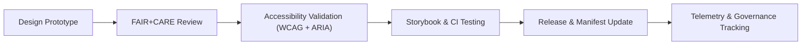

<div align="center">

# 🔘 **Kansas Frontier Matrix — Accessible Buttons & Toggles**
`docs/design/components/buttons.md`

**Purpose:**  
Define the design, accessibility, and ethical behavior patterns for **buttons, toggles, and interactive controls** across the **Kansas Frontier Matrix (KFM)** platform.  
All button components are aligned with **WCAG 2.1 AA**, **ISO 9241-210**, and **FAIR+CARE** design ethics.

[](../../README.md)
[](../../standards/faircare.md)
[](../../../LICENSE)
[](../../../releases/v10.0.0/manifest.zip)

</div>

---

## 📘 Overview

Buttons are foundational components of the **KFM UI system**, enabling users to perform actions while maintaining accessibility and ethical interaction standards.  
This documentation defines:
- **Visual hierarchy & design tokens**  
- **Keyboard & screen reader behavior**  
- **FAIR+CARE ethical guidelines for tone and representation**  
- **Testing and validation rules (CI/CD)**  

---

## 🗂️ Button Types

| Type | Description | Example Use |
|---|---|---|
| **Primary Button** | Highest-visibility action, such as “Save,” “Submit,” or “Start.” | Core form actions, dashboard commits. |
| **Secondary Button** | Secondary or contextual actions. | “Cancel,” “Learn More.” |
| **Ghost Button** | Low-emphasis action; transparent style for minimal disruption. | Filter resets, secondary navigation. |
| **Icon Button** | Symbol-only interaction, always requires an `aria-label`. | “Close,” “Expand Panel.” |
| **Toggle Button** | Two-state action button reflecting a system or user preference. | “Enable Focus Mode,” “Show Map Layers.” |

---

## 🎨 Visual Design Specifications

| Element | Token Reference | Value | Compliance |
|---|---|---|---|
| **Primary Background** | `color.button.primary.bg` | `#0053A0` | WCAG 1.4.3 |
| **Primary Text** | `color.button.primary.text` | `#FFFFFF` | WCAG 1.4.3 |
| **Hover State** | `color.button.primary.hover` | `#003D7A` | 4.5:1 contrast |
| **Focus Outline** | `focus.outline.color` | `#FFB300` | ISO 9241-210 |
| **Border Radius** | `spacing.radius.sm` | `6px` | Design Tokens v10 |
| **Disabled Opacity** | `opacity.disabled` | 0.6 | Visual Clarity Standard |

---

## ♿ Accessibility Requirements

| Requirement | Description | Implementation |
|---|---|---|
| **Keyboard Operability** | Buttons activate with `Enter` or `Space`. | Native `<button>` element preferred. |
| **Visible Focus** | Outline must meet ≥3:1 contrast with background. | Use `focus.outline.color`. |
| **Descriptive Labels** | Buttons must include readable text or `aria-label`. | `aria-label="Close dialog"` |
| **ARIA State** | Toggle buttons include `aria-pressed="true/false"`. | Accessibility Token v10.0 |
| **Reduced Motion** | Respect `prefers-reduced-motion` for hover/active transitions. | `motion.prefersReduced=true` |

---

## 🧠 FAIR+CARE Ethical Design Standards

Buttons are not only functional but **ethical entry points** in the UI. Their text, icons, and placement must support cultural respect and accessibility for all users.

| Ethical Principle | Design Requirement |
|---|---|
| **Collective Benefit** | Button labels communicate clearly and inclusively (“Start Exploration” vs. “Go”). |
| **Authority to Control** | Users maintain clear control; avoid auto-submission or hidden triggers. |
| **Responsibility** | Button actions are transparent, reversible where possible. |
| **Ethics** | No coercive or manipulative interactions (“dark patterns” prohibited). |

---

## 🧾 Example: Accessible Primary Button

```tsx
<button
  type="button"
  className="bg-primary text-white font-semibold py-2 px-4 rounded 
             focus:outline-none focus:ring-4 focus:ring-offset-2 focus:ring-[#FFB300]
             disabled:opacity-60 transition-all"
  aria-label="Save changes"
>
  Save Changes
</button>
```

**Compliance:**
- Meets WCAG 2.1 AA for contrast and focus visibility.  
- Uses design tokens from `docs/design/tokens/color-palette.md`.  
- Includes accessible label and keyboard focus feedback.  

---

## 🧩 Example: Toggle Button (Focus Mode Switch)

```tsx
<button
  type="button"
  className="bg-surface text-primary border border-neutral-200 rounded-md px-3 py-2 
             focus:outline-none focus:ring-4 focus:ring-[#FFB300] aria-pressed:bg-primary"
  aria-pressed="false"
  aria-label="Toggle Focus Mode"
>
  <span className="icon">🧠</span> Focus Mode
</button>
```

**Accessibility & Ethics:**
- Includes `aria-pressed` for toggle state awareness.  
- Combines text + icon for dual modality.  
- Motion reduction and focus states validated by accessibility tokens.  

---

## ⚙️ Validation Workflows

| Workflow | Function | Artifact |
|---|---|---|
| `storybook-a11y.yml` | Validates all button accessibility states. | `reports/ui/a11y_component_audits.json` |
| `design-tokens-validate.yml` | Ensures button tokens meet WCAG 2.1 AA contrast. | `reports/ui/design-token-lint.json` |
| `faircare-visual-audit.yml` | Verifies ethical text and visual representation. | `reports/faircare-visual-validation.json` |
| `component-version-track.yml` | Links button component to version manifest. | `releases/v10.0.0/manifest.zip` |

---

## 📊 Quality Metrics

| Metric | Target | Validation |
|---|---|---|
| **Contrast Ratio (Primary)** | ≥ 4.5:1 | WCAG 1.4.3 |
| **Keyboard Operability** | 100% | `accessibility_scan.yml` |
| **ARIA State Validation** | 100% | `storybook-a11y.yml` |
| **Ethical Text Verification** | 100% | `faircare-visual-audit.yml` |
| **Token Inheritance Compliance** | 100% | `design-tokens-validate.yml` |

---

## 🧮 Component Lifecycle



All button updates are version-tracked and logged in the governance ledger (`manifest.zip`).

---

## 🕰️ Version History

| Version | Date | Author | Summary |
|---|---|---|---|
| v10.0.0 | 2025-11-10 | FAIR+CARE Design & Accessibility Council | Created complete accessible button component documentation with WCAG 2.1 AA, FAIR+CARE ethics, and CI/CD validation workflows. |

---

<div align="center">

**© 2025 Kansas Frontier Matrix — CC-BY 4.0**  
Developed under **Master Coder Protocol v6.3** · FAIR+CARE Certified · Diamond⁹ Ω / Crown∞Ω Ultimate Certified  
[⬅ Back to Components Index](README.md) · [Forms →](forms.md)

</div>