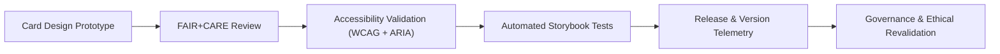

<div align="center">

# 🗂️ **Kansas Frontier Matrix — Data & Story Cards**
`docs/design/components/cards.md`

**Purpose:**  
Define the design, structure, accessibility, and ethical representation of **data cards** and **story narrative cards** used in the **Kansas Frontier Matrix (KFM)** for presenting datasets, historical events, and Focus Mode narratives under **FAIR+CARE** and **WCAG 2.1 AA** standards.

[](../../README.md)
[](../../standards/faircare.md)
[](../../../LICENSE)
[](../../../releases/v10.0.0/manifest.zip)

</div>

---

## 📘 Overview

Cards are modular UI components designed to summarize **datasets**, **stories**, or **events** in a visually compact and accessible form.  
They provide ethical, inclusive entry points into Kansas history, environment, and research — merging **FAIR metadata**, **AI narrative summaries**, and **provenance indicators**.

There are two major card types:

| Card Type | Purpose |
|---|---|
| **Data Cards** | Display dataset metadata, license, and FAIR+CARE certification. |
| **Story Cards** | Present Focus Mode narratives or historical summaries with AI explainability and provenance context. |

---

## 🗂️ Card Directory Layout

```
docs/design/components/
├── cards.md                     # This file
├── buttons.md                   # Button components
├── forms.md                     # Input elements
└── modals.md                    # Dialogs and overlays
```

---

## 🎨 Design Specifications

| Property | Token Reference | Value | Description |
|---|---|---|---|
| **Card Background** | `color.bg.surface` | `#FFFFFF` | Neutral white background for readability. |
| **Border Color** | `color.border.neutral` | `#E5E5E5` | Subtle 1px border separation. |
| **Title Font** | `font.size.h5` | `1.25rem` | Dataset or event title size. |
| **Text Color** | `color.text.primary` | `#1A1A1A` | Ensures 15:1 contrast ratio. |
| **Shadow** | `shadow.sm` | `0 1px 2px rgba(0,0,0,0.1)` | Minimal elevation. |
| **Radius** | `spacing.radius.md` | `8px` | Rounded corners. |

---

## 🧩 FAIR+CARE Integration Fields

All cards must visually indicate ethical and provenance metadata:

| Indicator | Description | Example |
|---|---|---|
| **FAIR+CARE Seal** | Badge showing dataset or narrative certification. | `✅ FAIR+CARE Certified` |
| **License** | SPDX or Creative Commons license display. | `CC-BY 4.0` |
| **Provenance Chip** | Displays original data source. | “Source: NOAA NCEI” |
| **Consent Tag** | Indicates Indigenous or cultural data consent status. | “Cultural Data – Controlled Access” |
| **Ethics Tooltip** | Describes cultural sensitivity of dataset or story. | `title="Content ethically reviewed"` |

---

## ♿ Accessibility Standards

| Requirement | Implementation | Validation |
|---|---|---|
| **Keyboard Operability** | Entire card clickable via `Enter` and `Space`. | `accessibility_scan.yml` |
| **Heading Structure** | Use semantic `h2–h5` for titles. | Manual audit |
| **ARIA Roles** | `role="article"` or `role="region"` depending on context. | `storybook-a11y.yml` |
| **Readable Contrast** | 4.5:1 minimum for all text and iconography. | WCAG 1.4.3 |
| **Screen Reader Context** | Include hidden labels describing content purpose. | `aria-describedby` |

---

## 🧾 Example: Data Card (Dataset Metadata)

```tsx
<article
  role="region"
  aria-labelledby="dataset-title"
  className="bg-surface border border-neutral-200 rounded-lg p-4 shadow-sm focus-within:ring-4 focus-within:ring-[#FFB300]"
>
  <h2 id="dataset-title" className="text-lg font-semibold text-primary">
    NOAA Kansas Climate Dataset (1880–2025)
  </h2>
  <p className="text-sm text-body mt-1">
    Daily precipitation and temperature data for Kansas, aggregated by county.
  </p>
  <div className="flex justify-between items-center mt-3 text-sm">
    <span className="text-muted">License: CC-BY 4.0</span>
    <span aria-label="FAIR+CARE Certified" title="Ethically verified dataset">✅</span>
  </div>
</article>
```

**Compliance Notes**
- Meets WCAG 2.1 AA and FAIR+CARE ethical standards.  
- Uses semantic headings and clear provenance indicators.  
- Keyboard focus includes visible ring and clear active feedback.

---

## 🧠 Example: Story Card (Focus Mode Narrative)

```tsx
<article
  className="bg-surface rounded-xl shadow-md border border-neutral-200 p-4"
  role="article"
  aria-labelledby="story-title"
  aria-describedby="story-summary"
>
  <header>
    <h3 id="story-title" className="text-xl font-semibold text-primary">
      Treaty of Medicine Lodge (1867)
    </h3>
  </header>
  <p id="story-summary" className="text-body mt-2">
    A series of peace agreements between the U.S. government and Plains tribes,
    conducted near Barber County, Kansas. 
    Narratives verified for inclusive tone under FAIR+CARE review.
  </p>
  <footer className="mt-3 flex justify-between items-center text-sm">
    <span>Source: Kansas Historical Society</span>
    <span title="FAIR+CARE Verified">✅</span>
  </footer>
</article>
```

**FAIR+CARE Ethical Checks**
- Includes provenance and consent verification.  
- Tone reviewed for neutrality (avoids colonial framing).  
- Uses semantic labels for screen readers.  

---

## 🧠 AI Narrative Card Metadata (Focus Mode v2)

| Field | Description | Example |
|---|---|---|
| `narrative_id` | Unique identifier of AI narrative item. | `"focus_2025_00047"` |
| `readability_index` | Flesch-Kincaid readability level. | `7.8` |
| `bias_score` | NLP-based neutrality score (0–100). | `96.5` |
| `faircare_status` | FAIR+CARE certification flag. | `"verified"` |
| `provenance_id` | Linked dataset or document. | `"usgs_historic_topo_1894"` |

---

## ⚙️ Validation & Governance Workflows

| Workflow | Function | Artifact |
|---|---|---|
| `storybook-a11y.yml` | Automated accessibility testing for card components. | `reports/ui/a11y_component_audits.json` |
| `design-tokens-validate.yml` | Ensures cards use color and spacing tokens. | `reports/ui/design-token-lint.json` |
| `faircare-visual-audit.yml` | Checks cultural sensitivity and ethical text tone. | `reports/faircare-visual-validation.json` |
| `component-version-track.yml` | Links card versions to governance manifest. | `releases/v10.0.0/manifest.zip` |

---

## 📊 FAIR+CARE Data Visualization Integration

Cards used in dashboards or maps must:
- Display provenance and license inline.  
- Include consent indicators for tribal or restricted data.  
- Support multilingual and alt-text rendering.  
- Be responsive (mobile-first grid alignment).  

```tsx
<section role="region" aria-label="Dataset card grid" className="grid grid-cols-1 md:grid-cols-3 gap-4">
  {/* Card components dynamically rendered here */}
</section>
```

---

## 📈 Quality Metrics

| Metric | Target | Verified By |
|---|---|---|
| **Accessibility Compliance (WCAG)** | 100% | `accessibility_scan.yml` |
| **Ethical Tone Validation** | ≥ 95% | `faircare-visual-audit.yml` |
| **Provenance Completeness** | 100% | `data-provenance.yml` |
| **Consent Metadata Coverage** | 100% for cultural datasets | FAIR+CARE Council |
| **Responsive Performance** | ≤ 200ms render time | CI Performance Logs |

---

## 🧮 Lifecycle Diagram



---

## 🕰️ Version History

| Version | Date | Author | Summary |
|---|---|---|---|
| v10.0.0 | 2025-11-10 | FAIR+CARE Design & Accessibility Council | Created comprehensive documentation for data and story card components, including accessibility, ethical metadata, and governance workflows. |

---

<div align="center">

**© 2025 Kansas Frontier Matrix — CC-BY 4.0**  
Developed under **Master Coder Protocol v6.3** · FAIR+CARE Certified · Diamond⁹ Ω / Crown∞Ω Ultimate Certified  
[⬅ Back to Components Index](README.md) · [Modals →](modals.md)

</div>