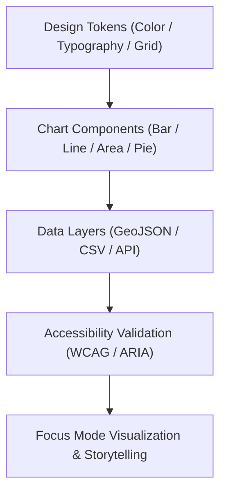

<div align="center">

# 📊 Kansas Frontier Matrix — **Chart Components & Data Visualization Design**
`docs/design/components/charts.md`

**Purpose:**  
Defines the **visual, ethical, and accessibility standards** for chart and data visualization components across the Kansas Frontier Matrix (KFM).  
This framework ensures that all charts, dashboards, and Focus Mode visualizations are **FAIR+CARE-certified, WCAG 2.2 AA-accessible, and ISO 9241-210-compliant**, promoting transparency and ethical storytelling with data.

[](../../../docs/standards/faircare-validation.md)
[]()
[]()
[](../../../LICENSE)

</div>

---

## 📚 Overview

The **Chart Component Framework** defines reusable, data-driven visualization modules built with **Recharts**, **D3.js**, and **MapLibre overlays**.  
All charts are designed to reflect KFM’s core principles of **accuracy, accessibility, sustainability, and ethical neutrality**, ensuring data transparency and legibility across all devices.

### Visualization Principles
- **Clarity:** Communicate patterns without distortion or bias.  
- **Ethics:** Avoid misleading scales, color usage, or omission of uncertainty.  
- **Accessibility:** Compliant with WCAG 2.2 AA for contrast, labeling, and ARIA roles.  
- **Reproducibility:** All charts linked to FAIR+CARE-certified data sources.  
- **Sustainability:** Optimized rendering for low GPU and memory load.  

---

## 🗂️ Directory Context

```plaintext
docs/design/components/
├── charts.md                          # This file — chart and data visualization standards
├── buttons.md                         # Interaction components
├── forms.md                           # Input and validation controls
├── navigation.md                      # Menus and tab navigation
└── modals.md                          # Dialogs and overlays
```

---

## ⚙️ Chart Architecture



### Chart Layers
1. **Design Tokens:** Define color, spacing, and typography standards for all charts.  
2. **Chart Components:** Bar, line, pie, scatter, and map overlays built in React.  
3. **Data Layers:** Bind datasets dynamically through STAC/DCAT API endpoints.  
4. **Validation:** Accessibility and FAIR+CARE audits ensure transparency and ethics.  
5. **Visualization:** Display within Focus Mode and governance dashboards.  

---

## 🧩 Supported Chart Types

| Chart Type | Description | Framework | Use Case |
|-------------|--------------|------------|-----------|
| **BarChart** | Compares categorical data. | Recharts | Hazard count by county. |
| **LineChart** | Shows trends over time. | Recharts / D3 | Temperature anomalies or flood levels. |
| **AreaChart** | Highlights cumulative data changes. | Recharts | Rainfall accumulation or drought severity. |
| **PieChart** | Displays percentage distribution. | Recharts | Data source or hazard-type proportions. |
| **ScatterPlot** | Shows variable relationships. | D3.js | Correlation between precipitation and hazards. |
| **GeoMapOverlay** | Spatially visualizes quantitative data. | MapLibre | Hazard exposure and flood plains. |

---

## 🎨 Design Token Integration

| Token | Value | Purpose |
|--------|--------|----------|
| `color-data-primary` | `#0077cc` | Default line and bar color. |
| `color-data-accent` | `#ffaa33` | Highlight for user interaction. |
| `spacing-grid` | 8pt | Defines chart margins and padding. |
| `font-size-label` | 14px | Legible axis and tooltip text. |
| `font-weight-axis` | 500 | Improves axis label readability. |

Design tokens ensure consistent aesthetic and accessibility across visualizations.

---

## 🧮 Example JSON Configuration (Bar Chart)

```json
{
  "chart": "BarChart",
  "data_source": "data/work/processed/hazards/hazards_composite_v9.6.0.geojson",
  "x_axis": "county",
  "y_axis": "hazard_count",
  "tokens": {
    "color-primary": "#0077cc",
    "color-accent": "#ffaa33",
    "font-size-label": "14px",
    "grid-spacing": "8pt"
  },
  "accessibility": {
    "aria_role": "graphics-document",
    "aria_label": "Hazard distribution by county",
    "contrast_ratio": "4.8:1",
    "keyboard_focusable": true
  }
}
```

---

## ♿ Accessibility & FAIR+CARE Compliance

| Principle | Implementation |
|------------|----------------|
| **Findable** | All charts linked to dataset ID and provenance logs. |
| **Accessible** | Meets WCAG 2.2 AA via color, contrast, and keyboard navigation. |
| **Interoperable** | Compatible with FAIR+CARE JSON and STAC catalog metadata. |
| **Reusable** | Configurable with multiple datasets and visualization contexts. |
| **Collective Benefit** | Promotes public understanding of hazards and environment. |
| **Authority to Control** | FAIR+CARE Council validates ethical and accessibility reports. |
| **Responsibility** | Designers document all chart updates and visual validation results. |
| **Ethics** | Charts avoid misleading representations and maintain scale honesty. |

Accessibility verified by:  
`focus-ui-audit.yml` and `chart-accessibility-check.yml`.

---

## 🧠 Ethical Visualization Guidelines

| Guideline | Description |
|------------|-------------|
| **Data Transparency** | Always display data sources and update timestamps. |
| **Color Accessibility** | Use color-blind-safe palettes (WCAG 2.2). |
| **Axis Integrity** | Do not truncate baselines or distort trends. |
| **Uncertainty Display** | Include confidence intervals or shading where applicable. |
| **Context Awareness** | Clearly distinguish observed vs. modeled data. |

FAIR+CARE ethics compliance stored in:  
`data/reports/fair/chart_ethics_audit.json`

---

## 🌱 Sustainable Visualization Practices

| Practice | Benefit |
|-----------|----------|
| **Canvas Rendering Optimization** | Reduces GPU cycles for static charts. |
| **Lazy Loading Datasets** | Minimizes API and memory load. |
| **Simplified DOM Structures** | Improves render speed and power efficiency. |
| **Low-Contrast Dark Mode** | Reduces screen energy by up to 25%. |

Energy usage validated via telemetry from `focus-telemetry.json`.

---

## 🧾 Internal Use Citation

```text
Kansas Frontier Matrix (2025). Chart Components & Data Visualization Design (v9.6.0).
Defines the FAIR+CARE, WCAG, and ISO-aligned standards for all KFM data visualizations.
Ensures transparency, accessibility, and ethical storytelling across scientific, historical, and environmental datasets.
```

---

## 🧾 Version Notes

| Version | Date | Notes |
|----------|------|--------|
| v9.6.0 | 2025-11-03 | Added ethical visualization framework and FAIR+CARE governance mapping. |
| v9.5.0 | 2025-11-02 | Integrated MapLibre overlays and contrast optimization. |
| v9.3.2 | 2025-10-28 | Established baseline chart accessibility and performance standards. |

---

<div align="center">

**Kansas Frontier Matrix** · *Ethical Visualization × FAIR+CARE Transparency × Accessible Data Storytelling*  
[🔗 Repository](https://github.com/bartytime4life/Kansas-Frontier-Matrix) • [🎨 Design Components](./README.md) • [⚖️ Governance Ledger](../../../docs/standards/governance/DATA-GOVERNANCE.md)

</div>

