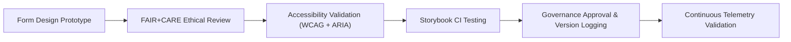

<div align="center">

# 🧾 **Kansas Frontier Matrix — Accessible Forms & Inputs**
`docs/design/components/forms.md`

**Purpose:**  
Define the design, accessibility, validation, and ethical guidelines for **form components** (inputs, selects, checkboxes, text areas) across the **Kansas Frontier Matrix (KFM)**.  
These components comply with **WCAG 2.1 AA**, **WAI-ARIA 1.2**, and **FAIR+CARE** ethical data handling principles.

[](../../README.md)
[](../../standards/faircare.md)
[](../../../LICENSE)
[](../../../releases/v10.0.0/manifest.zip)

</div>

---

## 📘 Overview

Forms are **primary interfaces for user interaction** in the Kansas Frontier Matrix (KFM), used for dataset submissions, governance feedback, and Focus Mode filtering.  
This document standardizes:
- Visual & structural consistency  
- Keyboard and screen reader accessibility  
- Cultural and ethical data collection protocols  
- Validation workflows in CI/CD pipelines  

Every input field must be transparent, inclusive, and respectful of cultural or personal sensitivity, following **FAIR+CARE** and **ISO 9241-210** usability standards.

---

## 🗂️ Directory Layout

```
docs/design/components/
├── forms.md                      # This file
├── buttons.md                    # Action controls
├── modals.md                     # Dialogs and alerts
└── cards.md                      # Data and story summaries
```

---

## 🧩 Core Form Principles

| Principle | Description | Compliance |
|---|---|---|
| **Accessibility First** | Every input, label, and error message adheres to WCAG 2.1 AA. | WCAG 2.1 |
| **Clarity** | Labels and placeholders use plain, inclusive language. | ISO 9241-210 |
| **Consistency** | All inputs share tokenized spacing, colors, and typography. | Design Tokens v10 |
| **Ethical Collection** | No unnecessary personal or cultural data requested. | FAIR+CARE |
| **Validation Feedback** | Real-time feedback provided non-visually via `aria-live`. | ARIA 1.2 |

---

## 🎨 Visual Design Tokens

| Token | Description | Value |
|---|---|---|
| `color.input.border` | Default input border color | `#D1D5DB` |
| `color.input.focus` | Border color when focused | `#0053A0` |
| `color.input.error` | Border color for invalid fields | `#C62828` |
| `color.input.success` | Border color for valid fields | `#2E7D32` |
| `spacing.field.padding` | Padding inside inputs | `0.75rem` |
| `font.size.label` | Label font size | `0.875rem` |
| `focus.outline.color` | Outline color for active focus | `#FFB300` |

---

## ♿ Accessibility Requirements

| Requirement | Description | Example |
|---|---|---|
| **Associated Labels** | Each input must have a visible label linked with `for` and `id`. | `<label for="email">Email</label>` |
| **Descriptive Help Text** | Use `aria-describedby` for contextual hints or validation. | `aria-describedby="email-help"` |
| **Keyboard Navigation** | All fields reachable by `Tab` and shift order predictable. | Sequential DOM order |
| **Error Announcements** | Validation messages use `aria-live="assertive"`. | Screen readers alert errors. |
| **Placeholder Ethics** | Never rely on placeholders as sole labels. | Visible text labels mandatory. |

---

## 🧠 FAIR+CARE Ethical Data Collection Rules

| Guideline | Implementation |
|---|---|
| **Collective Benefit** | Form data collected only for public-good and research benefit. |
| **Authority to Control** | Users retain full consent and control; include clear opt-out mechanisms. |
| **Responsibility** | No dark patterns; all required fields justified in metadata. |
| **Ethics** | Avoid cultural or demographic targeting without explicit consent. |

Consent checkboxes must include explicit language:
> ✅ *I consent to the ethical and FAIR+CARE-aligned use of my submitted data for research and education.*

---

## 🧾 Example: Accessible Input Group

```tsx
<form className="space-y-4">
  <div>
    <label htmlFor="name" className="block text-sm font-medium text-primary">
      Full Name
    </label>
    <input
      id="name"
      name="name"
      type="text"
      className="mt-1 block w-full border border-gray-300 rounded-md shadow-sm 
                 focus:border-[#0053A0] focus:ring-2 focus:ring-[#FFB300]"
      aria-describedby="name-help"
    />
    <p id="name-help" className="mt-1 text-xs text-muted">
      Please provide your name for citation or attribution purposes.
    </p>
  </div>
</form>
```

**Accessibility Notes:**
- Uses semantic `<label>` linking with `id`.  
- Focus ring meets ≥3:1 contrast ratio.  
- Help text uses `aria-describedby`.  

---

## 🧩 Example: Form Validation with Live Feedback

```tsx
<form aria-labelledby="dataset-form-title" aria-describedby="form-summary">
  <h2 id="dataset-form-title" className="text-lg font-semibold">
    Submit New Dataset
  </h2>
  <p id="form-summary" className="text-sm text-muted">
    Fields marked with * are required. All submissions must include consent metadata.
  </p>

  <div>
    <label htmlFor="dataset-title">Dataset Title *</label>
    <input
      type="text"
      id="dataset-title"
      required
      aria-invalid="false"
      aria-describedby="title-feedback"
      className="w-full border border-neutral-300 p-2 rounded focus:ring-[#FFB300]"
    />
    <div id="title-feedback" aria-live="polite" className="text-xs text-muted mt-1">
      A descriptive title improves discoverability.
    </div>
  </div>

  <div className="mt-4">
    <button type="submit" className="btn-primary">
      Submit
    </button>
  </div>
</form>
```

**Features**
- Error messages dynamically announced to screen readers.  
- Supports `aria-live="polite"` for passive feedback.  
- No hidden form submissions; explicit user control required.  

---

## ⚙️ Validation Workflows

| Workflow | Function | Artifact |
|---|---|---|
| `storybook-a11y.yml` | Tests all form inputs and labels for accessibility compliance. | `reports/ui/a11y_component_audits.json` |
| `design-tokens-validate.yml` | Confirms color and spacing tokens in use. | `reports/ui/design-token-lint.json` |
| `faircare-visual-audit.yml` | Ensures ethical labeling, language, and consent prompts. | `reports/faircare-visual-validation.json` |
| `form-validation.yml` | Runs automated input validation tests. | `reports/ui/form-validation.json` |

---

## 📊 Quality & Ethical Metrics

| Metric | Target | Verification |
|---|---|---|
| **Label–Input Association Rate** | 100% | `storybook-a11y.yml` |
| **Error Announcement Coverage** | 100% | Manual Screen Reader Audit |
| **FAIR+CARE Consent Coverage** | 100% | Ethics Validation |
| **Contrast Ratio Compliance** | ≥ 4.5:1 | `design-tokens-validate.yml` |
| **Cultural Neutrality Score** | ≥ 95% | `faircare-visual-audit.yml` |

---

## 🧮 Form Lifecycle



All approved form components are tracked in the KFM Governance Ledger for reproducibility.

---

## 🕰️ Version History

| Version | Date | Author | Summary |
|---|---|---|---|
| v10.0.0 | 2025-11-10 | FAIR+CARE Design & Accessibility Council | Created comprehensive accessible form and input component documentation integrating WCAG, ARIA, and FAIR+CARE ethical data collection principles. |

---

<div align="center">

**© 2025 Kansas Frontier Matrix — CC-BY 4.0**  
Developed under **Master Coder Protocol v6.3** · FAIR+CARE Certified · Diamond⁹ Ω / Crown∞Ω Ultimate Certified  
[⬅ Back to Components Index](README.md) · [Cards →](cards.md)

</div>