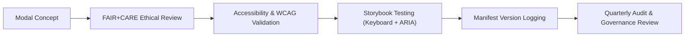

<div align="center">

# 💬 **Kansas Frontier Matrix — Accessible Modals & Dialogs**
`docs/design/components/modals.md`

**Purpose:**  
Define the design, accessibility, and ethical guidelines for **modals**, **dialogs**, and **alert overlays** used across the **Kansas Frontier Matrix (KFM)** platform.  
All modal components comply with **WCAG 2.1 AA**, **WAI-ARIA 1.2**, and **FAIR+CARE** user experience standards for inclusive, non-intrusive design.

[](../../README.md)
[](../../standards/faircare.md)
[](../../../LICENSE)
[](../../../releases/v10.0.0/manifest.zip)

</div>

---

## 📘 Overview

Modals (or dialogs) are used to communicate **important information** or request user input in focused, contained interfaces.  
In KFM, modals are governed by accessibility-first and ethical UX principles to avoid intrusive or manipulative behavior (“dark patterns”).  
This document standardizes:
- Modal appearance and behavior  
- Keyboard and screen reader accessibility  
- FAIR+CARE ethical interaction rules  
- Validation in CI/CD accessibility workflows  

---

## 🗂️ Directory Layout

```
docs/design/components/
├── modals.md                    # This file
├── buttons.md                   # Button and toggle patterns
├── cards.md                     # Data and story cards
└── forms.md                     # Form inputs and validations
```

---

## 🧩 Modal Classification

| Type | Description | Example Use |
|---|---|---|
| **Dialog Modal** | General information or confirmation window. | Confirming deletion, consent, or action feedback. |
| **Alert Modal** | High-priority warning requiring user acknowledgment. | Warnings about restricted or cultural data. |
| **Form Modal** | Embedded form requiring explicit user consent or data entry. | Submitting a dataset or governance request. |
| **Narrative Modal** | Focus Mode extended narrative or data provenance details. | Expanding historical or AI-generated context. |

---

## 🎨 Visual Design Specifications

| Element | Token Reference | Value | Compliance |
|---|---|---|---|
| **Modal Background** | `color.bg.surface` | `#FFFFFF` | WCAG 1.4.3 |
| **Overlay Backdrop** | `color.overlay.bg` | `rgba(0,0,0,0.6)` | ISO 9241-210 |
| **Focus Outline** | `focus.outline.color` | `#FFB300` | WCAG 2.4.7 |
| **Border Radius** | `spacing.radius.md` | `8px` | KFM Design Tokens |
| **Typography** | `font.size.body` | `1rem` | Readability Index ≤ Grade 8 |
| **Animation** | `motion.duration.short` | `150ms` | Respects `prefers-reduced-motion` |

---

## ♿ Accessibility Requirements

| Requirement | Implementation | Validation |
|---|---|---|
| **Focus Trap** | Keyboard focus locked within modal until closed. | Manual and CI test |
| **Escape Key Handling** | `Esc` closes modal and returns focus to invoker. | `storybook-a11y.yml` |
| **ARIA Roles** | Use `role="dialog"` or `role="alertdialog"`. | `accessibility_scan.yml` |
| **Labeling** | Each modal has an `aria-labelledby` and `aria-describedby`. | Automated |
| **Screen Reader Announcements** | `aria-live="assertive"` for urgent alerts. | Manual NVDA / VoiceOver |
| **No Motion Violation** | Honor `prefers-reduced-motion`. | Visual QA workflow |

---

## 🧠 FAIR+CARE Ethical Interaction Standards

| Principle | Implementation |
|---|---|
| **Collective Benefit** | Modal interactions exist solely to improve understanding or transparency (no coercion). |
| **Authority to Control** | User can always dismiss or opt out; no auto-triggered modals. |
| **Responsibility** | Clearly indicates purpose before requiring input or consent. |
| **Ethics** | Avoid manipulative phrasing (“Are you sure you don’t want to help?”). |

> **All modals must enhance clarity — never obstruct autonomy.**

---

## 🧾 Example: Basic Accessible Modal

```tsx
<div
  role="dialog"
  aria-modal="true"
  aria-labelledby="modal-title"
  aria-describedby="modal-desc"
  className="fixed inset-0 flex items-center justify-center bg-black/60"
>
  <div className="bg-white rounded-lg p-6 max-w-md w-full shadow-lg focus:outline-none focus-visible:ring-4 focus-visible:ring-[#FFB300]">
    <h2 id="modal-title" className="text-lg font-semibold text-primary">
      FAIR+CARE Data Use Notice
    </h2>
    <p id="modal-desc" className="text-sm mt-2 text-body">
      By continuing, you confirm that you will use KFM datasets responsibly and
      in accordance with FAIR+CARE ethical principles.
    </p>
    <div className="mt-4 flex justify-end gap-2">
      <button className="btn-secondary" aria-label="Cancel action">Cancel</button>
      <button className="btn-primary" aria-label="Agree to ethical terms">Agree</button>
    </div>
  </div>
</div>
```

**Accessibility Features:**
- `role="dialog"` and proper ARIA labeling.  
- Focus trap and visible focus outline.  
- Ethical transparency — user autonomy preserved.  

---

## 🧩 Example: Alert Modal (Cultural Sensitivity Warning)

```tsx
<div
  role="alertdialog"
  aria-modal="true"
  aria-labelledby="alert-title"
  aria-describedby="alert-message"
  className="fixed inset-0 flex items-center justify-center bg-black/70"
>
  <div className="bg-surface border-l-4 border-[#C62828] rounded-lg shadow-lg p-6 max-w-lg focus-visible:ring-4 focus-visible:ring-[#FFB300]">
    <h2 id="alert-title" className="text-lg font-bold text-[#C62828]">
      Cultural Sensitivity Advisory
    </h2>
    <p id="alert-message" className="text-sm mt-2 text-body">
      This dataset contains materials of cultural significance. Access requires
      community consent as defined by the Indigenous Data Governance Protocol.
    </p>
    <div className="mt-4 flex justify-end gap-3">
      <button className="btn-secondary" aria-label="Cancel request">Cancel</button>
      <button className="btn-primary" aria-label="Request access under CARE consent">
        Request Access
      </button>
    </div>
  </div>
</div>
```

**FAIR+CARE Ethics Checks**
- Transparent disclosure of data sensitivity.  
- Requires explicit consent before access.  
- Aligned with Indigenous Data Governance protocols.  

---

## ⚙️ CI/CD Validation Workflows

| Workflow | Function | Output |
|---|---|---|
| `storybook-a11y.yml` | Runs modal accessibility tests (focus, ARIA, ESC). | `reports/ui/a11y_component_audits.json` |
| `accessibility_scan.yml` | Validates keyboard navigation and screen reader labeling. | `reports/self-validation/web/a11y_summary.json` |
| `faircare-visual-audit.yml` | Verifies ethical phrasing and CARE compliance. | `reports/faircare-visual-validation.json` |
| `component-version-track.yml` | Logs modal version metadata into manifest. | `releases/v10.0.0/manifest.zip` |

---

## 📊 Compliance Metrics

| Metric | Target | Verified By |
|---|---|---|
| **WCAG 2.1 AA Compliance** | 100% | `storybook-a11y.yml` |
| **Focus Trap Functionality** | 100% | Manual QA |
| **Escape Key Responsiveness** | 100% | Automated Test |
| **FAIR+CARE Ethical Review Score** | ≥ 95% | Council Audit |
| **Contrast Ratio Compliance** | ≥ 4.5:1 | `design-tokens-validate.yml` |

---

## 🧮 Component Lifecycle



---

## 🕰️ Version History

| Version | Date | Author | Summary |
|---|---|---|---|
| v10.0.0 | 2025-11-10 | FAIR+CARE Design & Accessibility Council | Established comprehensive modal component standards covering accessibility, ethical UX behavior, and automated validation workflows. |

---

<div align="center">

**© 2025 Kansas Frontier Matrix — CC-BY 4.0**  
Developed under **Master Coder Protocol v6.3** · FAIR+CARE Certified · Diamond⁹ Ω / Crown∞Ω Ultimate Certified  
[⬅ Back to Components Index](README.md) · [Buttons →](buttons.md)

</div>