<div align="center">

# 🖼️ Kansas Frontier Matrix — Diagram Exports  
`docs/design/diagrams/exports/`

**Purpose:** Store **rendered diagram assets** (PNG/SVG) generated from source `.mmd` / `.puml` files,  
with integrity checks, alt-text metadata, and provenance for documentation-first workflows.

[](../../../.github/workflows/site.yml)  
[](https://mermaid-js.github.io/mermaid/#/)  
[](../../../.github/workflows/codeql.yml)  
[](../../../LICENSE)

</div>

---

## 🧭 Overview

This folder contains **compiled exports** of design/architecture diagrams used across documentation:
- Source of truth remains in `docs/design/diagrams/*.mmd` (and optional `*.puml`).
- Exports here are **derived artifacts** for embedding in READMEs, PDFs, and releases.
- Each export ships with **checksum** and **metadata sidecars** for reproducibility.

---

## 🗂️ Directory Layout

```text
docs/design/diagrams/exports/
├── README.md                          # This file
├── system_architecture.png            # Rendered from ../system_architecture.mmd
├── system_architecture.svg
├── system_architecture.sha256
├── system_architecture.alt.json       # Alt-text & accessibility metadata
├── ui_component_flow.png
├── ui_component_flow.svg
├── ui_component_flow.sha256
├── ui_component_flow.alt.json
├── knowledge_graph_schema.png
├── knowledge_graph_schema.svg
├── knowledge_graph_schema.sha256
└── knowledge_graph_schema.alt.json
````

> **Rule of thumb:** Every image should have a **matching** `.sha256` and `.alt.json`.

---

## 🧱 Export Standards

| Aspect         | Rule                                                                     |
| -------------- | ------------------------------------------------------------------------ |
| **Source**     | `.mmd` (Mermaid) and optional `.puml` (PlantUML) are authoritative.      |
| **Formats**    | Export both **.png** (docs, compatibility) and **.svg** (scalable docs). |
| **Filenames**  | Base filename must match source stem (e.g., `system_architecture.*`).    |
| **Checksums**  | Generate `*.sha256` with SHA-256 hash of the exported file.              |
| **Alt Text**   | Provide `*.alt.json` with short/long descriptions + tags.                |
| **License**    | Inherit repo license (CC-BY-4.0). Cite authors/sources when applicable.  |
| **Provenance** | Include commit SHA and generator details in sidecar JSON.                |

---

## 🧩 Visual Reference

Below are **reference previews** of exported diagrams
(rendered directly from the authoritative `.mmd` files).

### System Architecture (ETL → Graph → Web)

```mermaid
flowchart TD
  A["Data Sources\nUSGS · NOAA · FEMA · KGS"] --> B["ETL Pipeline\nPython + Makefile"]
  B --> C["Processed Layers\nGeoJSON · COG · CSV"]
  C --> D["STAC Catalog\nSpatial + Temporal Index"]
  D --> E["Knowledge Graph\nNeo4j · CIDOC CRM · OWL-Time"]
  E --> F["API Layer\nFastAPI · GraphQL"]
  F --> G["Web Frontend\nReact + MapLibreGL"]
  G --> H["Users\nResearchers · Educators · Public"]

  style A fill:#E6EFFF,stroke:#0074D9,stroke-width:2px
  style G fill:#E0FFE0,stroke:#2ECC40,stroke-width:2px
  style H fill:#FFF3C4,stroke:#FFB700,stroke-width:2px

  %% END OF MERMAID
```



### UI Component Flow (React + FastAPI)


### Knowledge Graph Schema (CIDOC CRM Core)


---

## 🛠️ Local Export (CLI)

Use Mermaid CLI for `.mmd` sources:

```bash
# From repo root
cd docs/design/diagrams

# PNG
npx @mermaid-js/mermaid-cli -i system_architecture.mmd -o exports/system_architecture.png

# SVG
npx @mermaid-js/mermaid-cli -i system_architecture.mmd -o exports/system_architecture.svg
```

Optional: PlantUML for complex ER/sequence diagrams:

```bash
# Requires java + plantuml
plantuml -tsvg -o exports knowledge_graph_schema.puml
plantuml -tpng -o exports knowledge_graph_schema.puml
```

---

## 🔐 Integrity (Checksums)

Create a `.sha256` for each exported image:

```bash
# macOS / Linux (coreutils shasum)
shasum -a 256 exports/system_architecture.png | awk '{print $1}' > exports/system_architecture.sha256
shasum -a 256 exports/system_architecture.svg | awk '{print $1}' > exports/system_architecture.svg.sha256
```

> **CI will verify** these checksums on PRs to detect drift vs. source diagrams.

---

## ♿ Accessibility (`*.alt.json`)

Each image includes an accessibility sidecar with **alt text**, **long description**, and **provenance**.

```json
{
  "file": "system_architecture.png",
  "alt": "High-level data flow: sources → ETL → STAC → Knowledge Graph → API → Web UI.",
  "longDescription": "Diagram shows USGS/NOAA/KGS data entering an ETL pipeline that produces COG/GeoJSON layers... results surfaced via React+MapLibre UI for end users.",
  "tags": ["architecture", "etl", "stac", "knowledge-graph", "webui"],
  "provenance": {
    "source": "../system_architecture.mmd",
    "generated_by": "mermaid-cli",
    "commit": "<GIT_SHA>",
    "date_utc": "<YYYY-MM-DDTHH:MM:SSZ>"
  },
  "license": "CC-BY-4.0"
}
```

---

## 🤖 CI / GitHub Actions

**Behavior:**

* Validate Mermaid syntax.
* Re-export PNG/SVG if source `.mmd` changed.
* Generate/verify `.sha256`.
* Ensure `*.alt.json` exists for every image.

**Example workflow snippet:**

```yaml
name: Diagram Validate & Export
on:
  push:
    paths:
      - "docs/design/diagrams/**/*.mmd"
      - "docs/design/diagrams/**/*.puml"
  pull_request:
    paths:
      - "docs/design/diagrams/**/*.mmd"
      - "docs/design/diagrams/**/*.puml"

jobs:
  export:
    runs-on: ubuntu-latest
    steps:
      - uses: actions/checkout@v4
      - uses: actions/setup-node@v4
        with: { node-version: "20" }
      - run: npm i -g @mermaid-js/mermaid-cli@latest
      - name: Export Mermaid → PNG/SVG
        run: |
          cd docs/design/diagrams
          for f in *.mmd; do
            base="${f%.mmd}"
            mmdc -i "$f" -o "exports/${base}.png"
            mmdc -i "$f" -o "exports/${base}.svg"
          done
      - name: Generate checksums
        run: |
          cd docs/design/diagrams/exports
          for img in *.png *.svg; do
            shasum -a 256 "$img" | awk '{print $1}' > "${img}.sha256"
          done
      - name: Ensure alt sidecars exist
        run: |
          cd docs/design/diagrams/exports
          for img in *.png *.svg; do
            base="${img%.*}"
            alt="${base}.alt.json"
            if [ ! -f "$alt" ]; then
              echo "::error file=$img::Missing ${alt} sidecar"; exit 1
            fi
          done
```

---

## 🧪 Embedding Guidance

Prefer **`.svg`** in repo docs for sharp scaling; fall back to **`.png`** for PDF or sites that restrict SVG.
When embedding in Markdown, include a short alt text and (optionally) link to the source `.mmd`.

```markdown

<sub>Source: <code>../system_architecture.mmd</code></sub>
```

---

## ✅ Review Checklist (PR Gate)

* [ ] Export filenames match source stems
* [ ] Both **PNG** and **SVG** present
* [ ] **Checksum** files exist and validate
* [ ] **Alt JSON** present with accurate descriptions/provenance
* [ ] No orphan exports (images without a source)
* [ ] Visual spot-check against latest source commit

---

## 🧾 Provenance & Licensing

* **Source of Truth:** `docs/design/diagrams/*.mmd` (Mermaid) / `*.puml` (optional)
* **Generated With:** Mermaid CLI / PlantUML
* **Integrity:** SHA-256 checksums; CI verifies drift
* **License:** CC-BY-4.0 — include attribution when reused externally

---

<div align="center">

### 🧭 Kansas Frontier Matrix — Reproducible Visuals

*Spatial · Temporal · Narrative · Verified*

</div>
