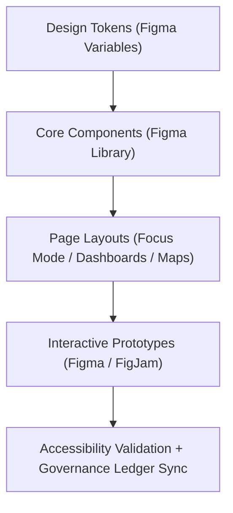

<div align="center">

# 🎨 Kansas Frontier Matrix — **Figma Design System & UI Prototyping**
`docs/design/figma/README.md`

**Purpose:**  
Documents the **Figma-based user interface design workflows, component libraries, and prototyping pipelines** for the Kansas Frontier Matrix (KFM).  
Ensures visual consistency, accessibility, and FAIR+CARE-aligned interaction ethics across all digital interfaces — including Focus Mode, Governance Dashboards, and Data Explorer.

[](../../../docs/standards/faircare-validation.md)
[]()
[]()
[](../../../LICENSE)

</div>

---

## 📚 Overview

The **Figma Design System** governs KFM’s UI prototyping, interaction design, and accessibility validation processes.  
It connects **visual design**, **UX architecture**, and **governance compliance**, ensuring that all web and interactive assets adhere to FAIR+CARE principles and ISO 9241-210 usability standards.

This directory provides:
- Centralized design tokens and visual libraries.  
- Prototyping standards for UI/UX workflows.  
- Governance-linked accessibility and telemetry validation guidelines.  
- Figma project structure for cross-domain collaboration.  

---

## 🗂️ Directory Layout

```plaintext
docs/design/figma/
├── README.md                               # This file — overview of the Figma Design System
│
├── tokens/                                 # Design token mapping (colors, typography, spacing)
├── components/                             # Component specifications and Figma sync metadata
├── prototypes/                             # Interactive Figma prototypes and frame guidelines
├── accessibility/                          # Accessibility audit notes and contrast testing data
└── governance/                             # FAIR+CARE ethical design review metadata
```

---

## 🧠 Figma Design System Architecture



### Layers of the System
| Layer | Description | Source |
|--------|--------------|--------|
| **Design Tokens** | Foundational values for color, type, grid, spacing, and accessibility. | `docs/design/tokens/` |
| **Core Components** | Modular UI elements built from tokenized variables. | `Figma Library: KFM Design Kit` |
| **Layouts & Pages** | Interactive pages (Map View, Story Panel, Governance Dashboard). | `Figma Project: KFM Main Prototype` |
| **Governance Layer** | Ethical and accessibility review embedded via FAIR+CARE metadata. | Governance Audit Board |

---

## 🎨 Core Figma Libraries

| Library | Function | Governance Alignment |
|----------|-----------|-----------------------|
| **KFM Design Tokens** | Central repository for color, typography, spacing, and motion standards. | WCAG 2.2 / FAIR+CARE |
| **Focus Mode Components** | Panels, charts, and AI explainability visual assets. | ISO 9241-210 / FAIR R1 |
| **Governance Dashboard Kit** | Ethical compliance and provenance viewer interface. | CARE Principles / ISO 37000 |
| **Accessibility Audit Library** | Color contrast, focus states, and readability verification tools. | WCAG 2.2 / MCP-DL v6.3 |

Figma links stored in:  
`docs/design/figma/governance/figma_project_links.json`

---

## ⚙️ Design Token Mapping

| Token Type | Source | Reference |
|-------------|---------|-----------|
| **Colors** | `docs/design/tokens/color-palette.md` | WCAG 2.2 AA contrast-compliant |
| **Typography** | `docs/design/tokens/typography-system.md` | ISO 9241 legibility |
| **Spacing** | `docs/design/tokens/spacing-grid.md` | MCP-DL v6.3 layout consistency |
| **Accessibility** | `docs/design/tokens/accessibility-tokens.md` | FAIR+CARE inclusivity guidelines |

Tokens synchronized automatically via Figma API and YAML transformer in `tools/design_sync.yml`.

---

## 🧩 Prototyping Guidelines

| Stage | Description | Tools Used |
|--------|--------------|-------------|
| **Wireframing** | Early conceptual structure for UI flow and spatial storytelling. | Figma Frames / FigJam |
| **Component Assembly** | Integration of reusable components into live pages. | Figma Auto Layout |
| **Interactive Prototyping** | Simulated transitions, overlays, and Focus Mode states. | Figma Smart Animate |
| **Governance Validation** | Accessibility and FAIR+CARE compliance check prior to release. | Figma Accessibility Plugin + Ledger Sync |

All prototypes reference telemetry data defined in `releases/v9.6.0/focus-telemetry.json`.

---

## ⚖️ FAIR+CARE UI Governance Matrix

| Principle | Implementation | Oversight |
|------------|----------------|------------|
| **Findable** | All Figma components indexed via metadata JSON and manifest registry. | @kfm-data |
| **Accessible** | Designed for keyboard and screen-reader compatibility in code handoff. | @kfm-accessibility |
| **Interoperable** | Figma structures map directly to React component schemas. | @kfm-architecture |
| **Reusable** | Design tokens support export across UI, CLI, and GIS interfaces. | @kfm-design |
| **Collective Benefit** | Prioritizes user equity, educational transparency, and open collaboration. | @faircare-council |
| **Authority to Control** | FAIR+CARE Council approves design ethics and accessibility audits. | @kfm-governance |
| **Responsibility** | Designers document decisions within Figma’s version history and ledger. | @kfm-fair |
| **Ethics** | Inclusive iconography, language, and cultural context reviews. | @kfm-ethics |

Audit trail located in:  
`releases/governance/ledger_snapshot_2025Q4.json`

---

## ♿ Accessibility & ISO Compliance

| Standard | Description | Validation |
|-----------|--------------|-------------|
| **WCAG 2.2 AA** | Color contrast ≥ 4.5:1, alt text required, keyboard focus visible. | @kfm-accessibility |
| **ISO 9241-210** | Inclusive design process ensuring comfort and clarity. | @kfm-design |
| **ISO 19115** | Metadata alignment for geospatial visualization design. | @kfm-data |
| **FAIR+CARE** | Ethical inclusivity in iconography and content tone. | @faircare-council |

Accessibility scores validated via automated tests and human review in `focus-telemetry.json`.

---

## 🌱 Sustainable Design Practices

KFM’s Figma workflows follow **low-carbon digital design** principles:
- Minimal use of raster-heavy mockups; vector-based assets preferred.  
- Reuse of scalable design tokens across prototypes.  
- Version control integration to reduce duplicate iterations.  
- Renewable energy-hosted Figma workspace (RE100 compliance).  

---

## 🧾 Internal Use Citation

```text
Kansas Frontier Matrix (2025). Figma Design System & UI Prototyping (v9.6.0).
Defines the FAIR+CARE, ISO, and WCAG-aligned UI prototyping framework using Figma for the Kansas Frontier Matrix web and governance interfaces.
Ensures accessibility, cultural inclusivity, and sustainability across all design processes.
```

---

## 🧾 Version Notes

| Version | Date | Notes |
|----------|------|--------|
| v9.6.0 | 2025-11-03 | Added FAIR+CARE ethics metadata sync and automated Figma accessibility validation. |
| v9.5.0 | 2025-11-02 | Integrated design tokens with governance telemetry tracking. |
| v9.3.2 | 2025-10-28 | Established baseline Figma system architecture under ISO and FAIR+CARE standards. |

---

<div align="center">

**Kansas Frontier Matrix** · *Ethical Design × FAIR+CARE Accessibility × Sustainable Prototyping*  
[🔗 Repository](https://github.com/bartytime4life/Kansas-Frontier-Matrix) • [🎨 Design System](../README.md) • [⚖️ Governance Ledger](../../../docs/standards/governance/DATA-GOVERNANCE.md)

</div>