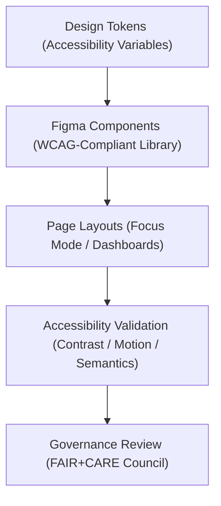

<div align="center">

# ♿ Kansas Frontier Matrix — **Figma Accessibility & Inclusive Design Guidelines**
`docs/design/figma/accessibility/README.md`

**Purpose:**  
Establishes the **accessibility framework, inclusive design principles, and FAIR+CARE validation process** for all Figma-based user interface prototypes within the Kansas Frontier Matrix (KFM).  
These guidelines ensure that every interface, from Focus Mode to Governance Dashboards, upholds ethical usability and accessibility standards aligned with **WCAG 2.2**, **ISO 9241-210**, and **FAIR+CARE** governance protocols.

[](../../../../docs/standards/faircare-validation.md)
[]()
[]()
[](../../../../LICENSE)

</div>

---

## 📚 Overview

The **Figma Accessibility Guidelines** define consistent design methods for building inclusive and ethical visual prototypes across KFM’s digital ecosystem.  
These principles ensure that accessibility is embedded **from concept to delivery**, not applied as an afterthought.

Accessibility in KFM’s Figma Design System enables:
- FAIR+CARE-driven ethical review and governance certification.  
- Compliance with **WCAG 2.2 AA** and **ISO 9241-210**.  
- Readability, navigability, and cognitive inclusivity.  
- Seamless integration with the `focus-telemetry.json` accessibility tracking schema.

---

## 🧠 Accessibility Design Architecture



### System Layers

| Layer | Description | Source |
|--------|--------------|--------|
| **Tokens** | Core color, typography, and spacing variables ensuring accessibility compliance. | `docs/design/tokens/accessibility-tokens.md` |
| **Components** | Figma library elements built for WCAG 2.2 AA compatibility. | `KFM Design System (Figma)` |
| **Layouts** | Page-level compositions ensuring spatial and narrative equity. | `docs/design/patterns/layout-patterns.md` |
| **Governance** | FAIR+CARE ethical audit integration and telemetry linkage. | `releases/v9.6.0/focus-telemetry.json` |

---

## ♿ Core Accessibility Guidelines

| Category | Rule | Standard |
|-----------|------|----------|
| **Color & Contrast** | Maintain ≥ 4.5:1 text/background contrast ratio. | WCAG 1.4.3 |
| **Typography** | Minimum 16px base font, scalable up to 200%. | WCAG 1.4.4 |
| **Focus States** | Visible focus indicators for all interactive elements. | WCAG 2.4.7 |
| **Motion Reduction** | Optional reduced motion for users with vestibular sensitivities. | WCAG 2.3.3 |
| **Keyboard Navigation** | Ensure all elements are fully operable via keyboard. | WCAG 2.1.1 |
| **ARIA & Semantics** | Use correct ARIA roles in exported prototypes. | ISO 9241-171 |
| **Alt Text & Labels** | Every image or icon must include a meaningful label. | WCAG 1.1.1 |
| **Error Prevention** | Validate form inputs with clear, friendly language. | WCAG 3.3.3 |
| **Cognitive Load Reduction** | Simplify information hierarchy and chunk content. | FAIR+CARE Inclusivity |

---

## 🧩 Figma Accessibility Components

| Component | Description | Validation |
|------------|--------------|-------------|
| **Accessible Buttons** | Minimum 44px height; contrast and focus tokens applied. | WCAG 2.5.5 |
| **Modal Windows** | Keyboard trap prevention; clear close actions. | WCAG 2.1.2 |
| **Form Inputs** | Visible labels and help text for every input field. | WCAG 3.3.2 |
| **Tooltips** | Delay minimum 1.5s with readable text. | WCAG 1.4.13 |
| **Charts & Visuals** | Include data table alternative text views. | FAIR+CARE Reusability |
| **Governance Badges** | Display dataset compliance status via FAIR+CARE color tokens. | FAIR Responsibility |

---

## 🧩 Accessibility Token Examples

| Token | Value | Purpose |
|--------|--------|----------|
| `--a11y-focus-ring` | `2px solid #0066CC` | Defines consistent focus indicator. |
| `--a11y-contrast-dark` | `#111111` | Ensures high contrast readability. |
| `--a11y-font-scale` | `1.25rem (min)` | Enforces readable text baseline. |
| `--a11y-motion-reduce` | `prefers-reduced-motion: reduce` | Disables transitions for accessibility. |
| `--a11y-link-hover` | `underline + 0.2s fade` | Enhances link visibility on hover. |

Tokens managed in the Figma library and mirrored in KFM’s Tailwind + React implementation.

---

## ⚙️ Accessibility Validation Workflow

1. **Prototype Design** — All new Figma frames incorporate accessible tokens by default.  
2. **Automated Checks** — Use the **Able**, **Contrast**, and **Stark** plugins for Figma.  
3. **Manual Review** — FAIR+CARE Council audits new pages for cognitive and cultural inclusivity.  
4. **Telemetry Sync** — Accessibility results logged to `focus-telemetry.json`.  
5. **Governance Certification** — Ledger entry created upon validation success.

---

## 🧠 Accessibility Telemetry Example

```json
{
  "id": "figma_accessibility_validation_v9.6.0",
  "project": "Focus Mode Dashboard",
  "frames_validated": 84,
  "wcag_score": 98.6,
  "contrast_issues": 0,
  "keyboard_navigation_pass": true,
  "motion_preference_detected": true,
  "fairstatus": "certified",
  "validator": "@kfm-accessibility",
  "timestamp": "2025-11-03T19:20:00Z"
}
```

Telemetry file:  
`releases/v9.6.0/focus-telemetry.json`

---

## ⚖️ FAIR+CARE Accessibility Matrix

| Principle | Implementation | Oversight |
|------------|----------------|------------|
| **Findable** | All accessible components indexed in Figma asset library. | @kfm-design |
| **Accessible** | WCAG and ISO compliance built into tokens and components. | @kfm-accessibility |
| **Interoperable** | Accessibility tokens synchronized between Figma and codebase. | @kfm-architecture |
| **Reusable** | Components follow scalable accessibility design patterns. | @kfm-ui |
| **Collective Benefit** | Promotes inclusivity and cultural equity through UI design. | @faircare-council |
| **Authority to Control** | FAIR+CARE Council validates accessibility audits quarterly. | @kfm-governance |
| **Responsibility** | Accessibility improvements logged to governance ledger. | @kfm-security |
| **Ethics** | Inclusive iconography and language reviewed for cultural sensitivity. | @kfm-ethics |

---

## 🌱 Sustainable Accessibility Practices

| Practice | Description | Compliance |
|-----------|--------------|-------------|
| **Token-Driven Design** | Reduces redundancy and ensures global accessibility updates. | MCP-DL v6.3 |
| **Dark Mode Testing** | Ensures all layouts remain readable under high-contrast modes. | WCAG 2.2 |
| **Renewable Design Workflow** | Cloud assets hosted on RE100-certified Figma infrastructure. | ISO 14064 |
| **FAIR+CARE Audit Retention** | Accessibility validation stored permanently for reproducibility. | ISO 37000 |

---

## 🧾 Internal Use Citation

```text
Kansas Frontier Matrix (2025). Figma Accessibility & Inclusive Design Guidelines (v9.6.0).
Defines FAIR+CARE, WCAG 2.2, and ISO-aligned accessibility principles for all Figma prototypes.
Ensures inclusive, ethical, and reproducible user experiences across KFM's digital design system.
```

---

## 🧾 Version Notes

| Version | Date | Notes |
|----------|------|--------|
| v9.6.0 | 2025-11-03 | Added FAIR+CARE telemetry integration and automated Figma accessibility audit flow. |
| v9.5.0 | 2025-11-02 | Introduced inclusive iconography and focus token library updates. |
| v9.3.2 | 2025-10-28 | Established baseline Figma accessibility architecture under WCAG and ISO 9241. |

---

<div align="center">

**Kansas Frontier Matrix** · *Inclusive Design × FAIR+CARE Governance × Sustainable Accessibility*  
[🔗 Repository](https://github.com/bartytime4life/Kansas-Frontier-Matrix) • [🎨 Design System](../README.md) • [⚖️ Governance Ledger](../../../../docs/standards/governance/DATA-GOVERNANCE.md)

</div>