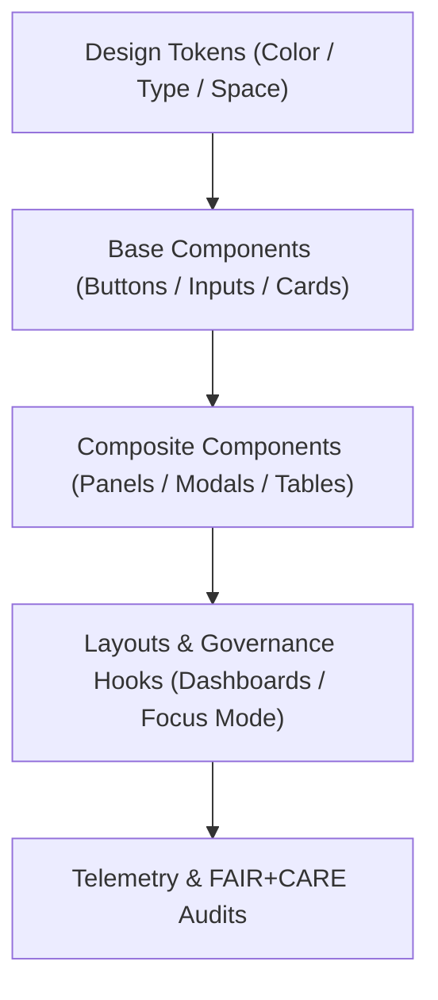

<div align="center">

# 🧩 Kansas Frontier Matrix — **Figma Components Library**
`docs/design/figma/components/README.md`

**Purpose:**  
Defines the **Figma Components Library architecture** for Kansas Frontier Matrix (KFM), unifying all reusable design assets across Focus Mode, Governance Dashboards, and Data Explorer interfaces.  
Every component in this library adheres to **FAIR+CARE**, **WCAG 2.2 AA**, and **ISO 9241-210** design ethics to ensure transparent, accessible, and reproducible design workflows.

[](../../../../docs/standards/faircare-validation.md)
[]()
[]()
[](../../../../LICENSE)

</div>

---

## 📚 Overview

The **KFM Figma Components Library** provides a unified, token-driven system of accessible, ethical, and reusable design elements.  
It ensures that every component in KFM’s design ecosystem is interoperable between Figma prototypes, code implementation, and FAIR+CARE governance workflows.

All components are:
- **FAIR+CARE-audited** for accessibility, reusability, and inclusivity.  
- **Tokenized** for consistent colors, typography, and spacing.  
- **Linked** to governance telemetry for continuous compliance tracking.  
- **Version-controlled** under MCP-DL v6.3 documentation-first principles.  

---

## 🧭 Component Architecture



### Hierarchical Layers

| Layer | Description | Source |
|--------|--------------|--------|
| **Design Tokens** | Visual constants controlling color, spacing, and motion. | `docs/design/tokens/` |
| **Base Components** | Simple reusable primitives such as buttons and forms. | Figma `@KFM-Base-Library` |
| **Composite Components** | Complex reusable patterns (cards, panels, dashboards). | Figma `@KFM-Composite-Library` |
| **Layouts & Governance Hooks** | Page-level templates tied to provenance and accessibility telemetry. | `web/src/layouts/` |
| **Telemetry Layer** | Real-time monitoring of usage, accessibility, and energy efficiency. | `releases/v9.6.0/focus-telemetry.json` |

---

## 🧩 Core Component Categories

| Category | Description | Ethical Function |
|-----------|--------------|------------------|
| **Buttons** | Action triggers with accessible color contrast and focus states. | FAIR Accessibility |
| **Inputs & Forms** | Data entry fields with semantic labels and error guidance. | Responsibility & Equity |
| **Cards** | Container patterns for content grouping and FAIR+CARE display badges. | Transparency & Context |
| **Modals & Drawers** | Overlays that request confirmation or provide detailed insight. | CARE Authority to Control |
| **Tables & Grids** | Structured data display supporting keyboard navigation. | WCAG 2.2 AA Compliance |
| **Charts & Data Visuals** | Reusable chart templates with screen reader support. | FAIR Reusability |
| **AI Panels** | Explainability UI modules visualizing model reasoning. | Ethical AI Transparency |
| **Governance Components** | Ledger and provenance display modules for user validation. | FAIR+CARE Accountability |

---

## 🧱 Base Component Guidelines

| Component | Rule | Standard |
|------------|------|----------|
| **Primary Button** | Height ≥ 44px, contrast ratio ≥ 4.5:1. | WCAG 2.2.5 |
| **Secondary Button** | Clear visual hierarchy using token color shades. | ISO 9241-171 |
| **Form Inputs** | Required fields clearly indicated with semantic labeling. | WCAG 3.3.2 |
| **Modal Dialogs** | Must trap focus and include accessible close actions. | WCAG 2.1.2 |
| **Tooltips** | Minimum visible duration of 1.5 seconds; no hover-only content. | WCAG 1.4.13 |
| **Cards** | Include governance metadata region (badge + checksum). | FAIR+CARE Ledger Hook |
| **Charts** | Pair with alternative text or data table below chart. | FAIR+CARE Accessibility |
| **Tabs & Accordions** | Keyboard-navigable and focus-visible. | WCAG 2.1.1 |

---

## ⚙️ Composite Components & Ethical Context

| Composite | Function | FAIR+CARE Alignment |
|------------|-----------|---------------------|
| **Governance Drawer** | Displays audit trail and FAIR+CARE compliance score. | FAIR Transparency |
| **FAIR+CARE Badge** | Shows live certification status linked to governance ledger. | CARE Responsibility |
| **Focus Mode Card** | Combines timeline data, spatial map reference, and AI insight summary. | FAIR Findability |
| **Dashboard Metric Card** | Displays validation or energy telemetry results. | Sustainability Reporting |
| **Explainability Overlay** | Visualizes AI feature importance via SHAP summary plot. | Ethical AI |
| **Data Provenance Card** | Contains lineage record and ledger link hash. | Governance Provenance |

---

## 🧠 Accessibility & Interaction Standards

| Interaction Type | Behavior | Accessibility Rule |
|-------------------|-----------|---------------------|
| **Hover / Focus States** | All interactive elements display high-contrast focus rings. | WCAG 2.4.7 |
| **Keyboard Navigation** | Sequential focus with `Tab` and `Shift+Tab` enabled for all elements. | WCAG 2.1.1 |
| **Color Contrast** | Maintain ≥ 4.5:1 across text and visual layers. | WCAG 1.4.3 |
| **Motion Control** | Animations respect user `prefers-reduced-motion`. | WCAG 2.3.3 |
| **Touch Targets** | Minimum 44x44px target for mobile/touch users. | WCAG 2.5.5 |

Accessibility validated through:  
`data/reports/validation/ui_accessibility_summary.json`

---

## 📊 Example Component Telemetry Record

```json
{
  "component_id": "governance_drawer_v3",
  "category": "Composite",
  "a11y_score": 98.2,
  "fairstatus": "certified",
  "average_interaction_time_ms": 720,
  "contrast_ratio": 4.8,
  "keyboard_navigable": true,
  "governance_hook": true,
  "energy_use_wh": 12.4,
  "timestamp": "2025-11-03T19:35:00Z"
}
```

Telemetry data stored in:  
`releases/v9.6.0/focus-telemetry.json`

---

## ⚖️ FAIR+CARE Governance Matrix

| Principle | Implementation | Verified By |
|------------|----------------|--------------|
| **Findable** | Components indexed in manifest and telemetry logs. | @kfm-data |
| **Accessible** | WCAG 2.2 AA compliance enforced through tokens and CI. | @kfm-accessibility |
| **Interoperable** | Component variables synchronized between Figma and React. | @kfm-architecture |
| **Reusable** | Modular structures follow FAIR+CARE reusability rules. | @kfm-design |
| **Collective Benefit** | Promotes equitable user access and ethical usability. | @faircare-council |
| **Authority to Control** | Governance Council validates all UI updates pre-release. | @kfm-governance |
| **Responsibility** | Usage telemetry linked to open FAIR+CARE audits. | @kfm-security |
| **Ethics** | Inclusive iconography and neutral color tokens applied globally. | @kfm-ethics |

---

## 🌱 Sustainable Design Metrics

| Metric | Target | Verified By |
|---------|---------|--------------|
| Component Reusability | ≥ 90% | @kfm-design |
| Accessibility Coverage | ≥ 95% | @kfm-accessibility |
| Energy Efficiency per Render | ≤ 20 Wh | @kfm-sustainability |
| FAIR+CARE Certification Rate | 100% | @kfm-governance |

Metrics tracked via:  
`focus-telemetry.json`

---

## 🧾 Internal Use Citation

```text
Kansas Frontier Matrix (2025). Figma Components Library (v9.6.0).
Defines the FAIR+CARE-certified component system uniting accessibility, governance, and sustainability across the KFM ecosystem.
Ensures design interoperability, inclusivity, and provenance traceability from prototype to production.
```

---

## 🧾 Version Notes

| Version | Date | Notes |
|----------|------|--------|
| v9.6.0 | 2025-11-03 | Added composite governance components and telemetry logging integration. |
| v9.5.0 | 2025-11-02 | Updated base library tokens for WCAG 2.2 and FAIR+CARE alignment. |
| v9.3.2 | 2025-10-28 | Established foundational component architecture under MCP-DL standards. |

---

<div align="center">

**Kansas Frontier Matrix** · *Ethical Design × FAIR+CARE Accessibility × Sustainable Component Systems*  
[🔗 Repository](https://github.com/bartytime4life/Kansas-Frontier-Matrix) • [🎨 Design Library](../README.md) • [⚖️ Governance Ledger](../../../../docs/standards/governance/DATA-GOVERNANCE.md)

</div>